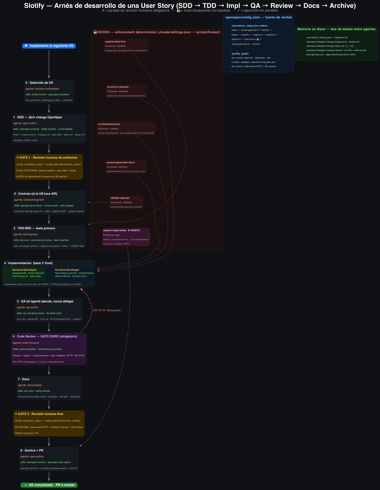
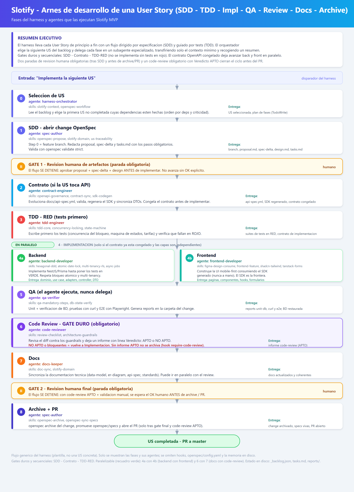

# Slotify — Entrega 2: Código funcional (primer MVP ejecutable)

> **Trabajo Final de Máster** · Autor: Roger Vilà Mateo · Fecha de entrega: **10/07/2026**
> Documento de referencia de la segunda fase del desarrollo. Complementa al
> [README](readme.md) (estado actual del producto) y a la [bitácora](bitacora.md)
> (diario del proceso).

---

## Resumen ejecutivo

Esta segunda fase abarca **desde la definición del arnés de ingeniería hasta la ejecución de todas las historias de usuario archivadas** del alcance del MVP. En lugar de programar de forma ad hoc, se invirtió primero en construir un **arnés de desarrollo asistido por IA** (Claude Code) con metodología **SDD + TDD**, y con él se desarrolló el producto historia a historia, de forma consistente, trazable y automáticamente validada.

| Métrica | Valor |
|---|---|
| Changes de OpenSpec **archivados** (US implementadas) | **39** |
| Historias de usuario en el **backlog** del MVP | **50** |
| **Specs vivas** (capabilities) en `openspec/specs/` | **15** |
| **Pull Requests mergeados** (#1–#59) | **57** |
| **Commits** en `master` | **235** |
| **Tests** (Jest + Vitest + Playwright) | **~219** |
| **Hooks** de enforcement | **6** |
| **Gates** de revisión humana | **2** |
| **Agentes** especializados | **9** |
| **Skills** (tarjetas de conocimiento) | **27** |

**Índice**

1. [La segunda fase de un vistazo](#1-la-segunda-fase-de-un-vistazo)
2. [Definición del arnés](#2-definición-del-arnés)
3. [Arquitectura del arnés](#3-arquitectura-del-arnés)
4. [Uso del arnés (2 ejemplos)](#4-uso-del-arnés-2-ejemplos)
5. [Estado de las historias de usuario del MVP](#5-estado-de-las-historias-de-usuario-del-mvp)
6. [Pull Requests](#6-pull-requests)
7. [Specs vivas](#7-specs-vivas)
8. [Tests y cuándo se ejecutan](#8-tests-y-cuándo-se-ejecutan)
9. [Alineación de la documentación de la Fase 1](#9-alineación-de-la-documentación-de-la-fase-1)

---

## 1. La segunda fase de un vistazo

La primera entrega dejó la **documentación técnica** (especificación funcional, casos de uso, modelo de datos, arquitectura, diagramas C4, backlog de historias). La segunda entrega convierte esa documentación en **código ejecutable**. El camino recorrido:

```
Diseño del arnés → Scaffolding (US-000) → Ejecución del backlog historia a historia → MVP ejecutable
   (harness_engineering_plan.md)                (harness-orchestrator + OpenSpec)        (39 changes archivados)
```

La clave de esta fase no es solo *qué* se construyó, sino *cómo*: un sistema de agentes, skills y hooks que hace que **el propio entorno valide el código que produce la IA** y detenga el flujo en los puntos donde debe decidir un humano.

---

## 2. Definición del arnés

Referencia: **[harness_engineering_plan.md](harness_engineering_plan.md)** (plan de ingeniería del arnés).

**Por qué.** Sin arnés, cada feature se implementa distinta: se olvidan los tests, se cuelan violaciones de arquitectura (un `import` de Prisma en el dominio, un lock con Redis), el contrato OpenAPI se desincroniza del frontend y la documentación queda obsoleta. El arnés hace que **el camino correcto sea el camino por defecto** y, donde importa, el **único posible**.

**Qué se diseñó.** El plan cubrió cinco dimensiones críticas:

1. **Mapa de agentes** — qué agentes conservar, fusionar o crear. Se fusionaron el antiguo `Openapi-advisor` (pasivo) en un **`contract-engineer`** que gobierna el contrato, y `product-strategy-analyst` en un **`spec-author`** de SDD; se crearon el `harness-orchestrator`, `tdd-engineer`, `qa-verifier` y `docs-keeper`; se reforzó el `frontend-developer` con el MCP de Figma.
2. **Flujo completo** — de la especificación (SDD) a la entrega documentada, con el contrato OpenAPI como fuente de verdad inamovible.
3. **Hooks de guardia** — mecanismos automáticos que rechazan código fuera de estándar (TDD, contrato, arquitectura hexagonal, bloqueo atómico).
4. **Estrategia de contexto** — minimizar tokens: `CLAUDE.md` como router, skills *on-demand*, subagentes que devuelven conclusiones (no transcripts), estado en disco.
5. **Estructura operativa** — organización final de `.claude/agents`, `.claude/skills`, `CLAUDE.md` y los workflows diarios.

El diseño se realizó en **Claude Projects (Claude Opus 4.5)** partiendo de cero conceptualmente, con toda la documentación de `docs/` como contexto.

---

## 3. Arquitectura del arnés

El arnés se organiza en **capas**: `CLAUDE.md` (router de contexto) + OpenSpec (motor SDD) + 9 agentes + 27 skills + 6 hooks + MCPs. El agente principal **orquesta**; los subagentes **ejecutan** en contexto aislado y devuelven un resumen, manteniendo ligero el hilo principal.

### Diagrama del flujo completo



*`harness_workflow.png` — el flujo canónico con los agentes, las skills que carga cada uno, los hooks que se disparan y los buses de estado en disco.*

### Diagrama por fases



*`harness_workflow_phases.png` — las fases del workflow y las paradas (gates).*

> Las fuentes editables de los diagramas están en `harness_workflow.dot` (Graphviz) y `harness_workflow_phases.svg`.

### Los 9 agentes

| Agente | Rol | Model |
|--------|-----|-------|
| `harness-orchestrator` | Punto de entrada; lee el backlog, elige la US y coordina. No escribe código. | opus |
| `spec-author` | Abre/archiva changes de OpenSpec (proposal, spec-delta, tasks). | opus |
| `contract-engineer` | Dueño del contrato OpenAPI: audita, evoluciona, valida, genera SDK, sincroniza. | opus |
| `tdd-engineer` | Escribe los tests **primero** (RED). No escribe código de producción. | opus |
| `backend-developer` | Implementa NestJS/Prisma hexagonal hasta poner los tests en verde. | opus |
| `frontend-developer` | Implementa React/Tailwind/shadcn consumiendo Figma (MCP) y el cliente generado. | opus |
| `qa-verifier` | Ejecuta él mismo unit + curl + Playwright + reports. | sonnet |
| `code-reviewer` | Revisa el diff contra los guardrails; produce un informe (no auto-fix). | opus |
| `docs-keeper` | Sincroniza `docs/` tras el cambio. | sonnet |

### Las 27 skills

Tarjetas de conocimiento cargadas *on-demand* (no en el system prompt), agrupadas en: **dominio/contexto** (`slotify-context`, `slotify-domain`), **OpenSpec** (`openspec-workflow`, `openspec-propose`, `openspec-apply`, `openspec-archive`, `openspec-sync-specs`, `us-traceability`), **arquitectura backend** (`hexagonal-ddd`, `atomic-date-lock`, `state-machine`, `multi-tenancy-rls`, `async-jobs`), **contrato** (`openapi-governance`, `contract-sync`, `sdk-codegen`), **testing/QA** (`tdd-core`, `concurrency-locking`, `qa-mandatory-steps`, `db-state-verify`), **frontend** (`frontend-feature`, `figma-design-consume`, `shadcn-tailwind`, `tanstack-forms`) y **transversal** (`review-checklist`, `architecture-guardrails`, `doc-sync`).

### Los 6 hooks de enforcement

Configurados en `.claude/settings.json` (scripts en `scripts/hooks/`). Que un hook bloquee **no es un error**: es el guardrail funcionando.

| Hook | Evento | Qué bloquea |
|------|--------|-------------|
| `require-tests-first` | PreToolUse (Edit/Write) | Implementar lógica crítica sin test hermano (TDD). |
| `no-infra-in-domain` | PreToolUse (Edit/Write) | Imports de `@nestjs/*`, `@prisma/client` o `infrastructure/` en `domain/`. |
| `no-distributed-lock` | PreToolUse (Edit/Write) | Redis/Redlock/locks distribuidos (el bloqueo es atómico vía SQL). |
| `protect-generated-client` | PreToolUse (Edit/Write) | Editar a mano el cliente OpenAPI generado. |
| `validate-openapi` | PostToolUse (Edit/Write) | Contrato `api-spec.yml` inválido (spectral/redocly). |
| `require-code-review` | PreToolUse (Bash) | `openspec archive` / crear/mergear PR sin `Veredicto: APTO`. |

### MCPs

**Figma** (`frontend-developer`, diseño→código), **Playwright** (`qa-verifier`, E2E), **GitHub** (PRs/issues) y **Context7** (documentación al día de NestJS/Prisma/TanStack).

---

## 4. Uso del arnés (2 ejemplos)

Manual completo con más ejemplos en **[harness_guide.md](harness_guide.md)**. Estos dos ejercitan las dos caras del sistema: el ciclo feliz completo y los guardrails bloqueando.

### Ejemplo 1 — Implementar una US spine de principio a fin

**Lo que se teclea:**

```
Implementa la siguiente US del backlog con el harness-orchestrator.
```

**Qué ocurre:**

1. **Orquestación** — el `harness-orchestrator` lee `user-stories/_backlog.json`, elige la primera US no completada con dependencias resueltas (p. ej. confirmar reserva) y abre un plan de fases. No escribe código: delega.
2. **SDD** — `spec-author` crea la rama `feature/...`, el change en `openspec/changes/...` (`proposal.md` trazable a la US/UC, spec-delta y `tasks.md` con los pasos obligatorios) y valida con `openspec validate --strict`. **⏸ Gate humano 1.**
3. **Contrato** — `contract-engineer` evoluciona `docs/api-spec.yml` (nuevo endpoint/acción, respuestas 200/409/422), pasa `spectral lint` (hook `validate-openapi`) y **regenera y congela** el SDK del frontend.
4. **TDD-RED** — `tdd-engineer` escribe **primero** los tests de concurrencia del bloqueo y de la transición de estado; `pnpm test` los da en rojo. El hook `require-tests-first` garantiza que existan antes de implementar.
5. **Implementación en paralelo** (contrato congelado) — `backend-developer` implementa `bloquearFecha()` (UNIQUE + `SELECT FOR UPDATE`), la transición y el caso de uso hasta poner los tests en verde; `frontend-developer` construye la pantalla con shadcn + TanStack Query sobre el cliente generado y mapea el 409 a un mensaje en español.
6. **QA** — `qa-verifier` ejecuta unit + verificación del estado de la BD + curl (200 y 409 al repetir fecha) + E2E Playwright, dejando *reports* en `reports/`.
7. **Code-review** — `code-reviewer` emite informe contra los guardrails (`Veredicto: APTO` obligatorio).
8. **Docs** — `docs-keeper` sincroniza `data-model.md`/`api-spec.yml`/standards.
9. **⏸ Gate humano 2** → **Archive + PR** — `spec-author` archiva el change y abre el PR.

### Ejemplo 2 — Arrancar de cero y ver los hooks bloqueando

**Lo que se teclea:**

```
/analizar-backlog
/ordenar-backlog
Con el spec-author, abre el change para US-000 (scaffolding del monorepo).
```

`/analizar-backlog` ejecuta un script Python determinista (`scripts/extract_backlog.py`) que produce el grafo de dependencias (`_analisis.json`); `/ordenar-backlog` produce `_backlog.json` ordenado (Fundacional → Spine → Soporte). **US-000 sale primero** por su alto *fan-out*. `spec-author` abre el change del scaffolding (monorepo pnpm, NestJS, Vite, Prisma, jest, generación del cliente).

Durante la implementación, los hooks **impiden atajar** (mensajes reales):

- **Framework en el dominio** → `GUARDRAIL HEXAGONAL bloqueado: @nestjs/* (framework) en domain.`
- **Redis para el lock** → `GUARDRAIL BLOQUEO ATÓMICO bloqueado: detectado Redlock. …UNIQUE(tenant_id, fecha) + SELECT ... FOR UPDATE.`
- **Editar el cliente generado** → `BLOQUEADO: edición manual del cliente generado.`
- **Caso de uso del núcleo sin test** → `TDD bloqueado: vas a implementar lógica crítica sin test.`

Desde la primera línea de código, la arquitectura hexagonal, el bloqueo atómico, el contrato y el TDD **no se pueden violar por accidente**.

### Cheat-sheet «quiero X → teclea Y»

| Quiero… | Teclea / invoca |
|---------|-----------------|
| Implementar la siguiente historia completa | "Implementa la siguiente US con el harness-orchestrator" |
| Ordenar / refrescar el backlog | `/analizar-backlog` y luego `/ordenar-backlog` |
| Auditar el contrato OpenAPI | `/audit-open-api` |
| Cambiar/añadir un endpoint | "con el contract-engineer, evoluciona el contrato para…" |
| Escribir tests antes de implementar | "con el tdd-engineer, escribe los tests de…" |
| Construir una pantalla desde Figma | "con el frontend-developer, implementa <pantalla> desde <link Figma>" |
| Ejecutar QA de un change | "con el qa-verifier, ejecuta los pasos obligatorios de QA" |
| Revisar antes de mergear | "con el code-reviewer, revisa el diff" |

---

## 5. Estado de las historias de usuario del MVP

De las **50 historias del backlog**, hay **39 changes archivados** (implementados, testeados y mergeados). El desarrollo priorizó el **eje (spine) del dominio de reservas** y su capa fundacional.

### Flujo E2E del dominio de reservas (lo más relevante de la entrega)

El resultado tangible del MVP es el **pipeline completo de la reserva funcionando de punta a punta**:

```
consulta (2a exploratoria / 2b con fecha / 2c pendiente invitados / 2v visita / 2d cola)
     → pre_reserva → reserva_confirmada → evento_en_curso → post_evento → reserva_completada
```

Sobre ese eje se construyeron, entre otros:

- **Alta de consulta** exploratoria (US-003) y con fecha (US-004), con **bloqueo atómico** de la fecha.
- **Transiciones** de estado con guardas (US-005, US-007), **visita** al espacio y su resultado (US-008, US-009, US-010).
- **Cola de espera** con promoción **automática** (US-018) y **manual** (US-019) y vaciado atómico.
- **Motor de tarifas** (US-016) → **presupuesto** (US-014) → **factura de señal** (US-022) → **liquidación** (US-027/028/029) → **fianza** (cobro US-030, IBAN US-035, devolución US-036).
- **Ficha operativa** del evento (US-025) y su cierre automático (US-026).
- **Inicio automático** del evento (US-031), **finalización** (US-034) y **archivado** automático a T+7d (US-037) y manual (US-038).
- **Auth JWT** (US-001/002), **calendario** (US-039), **dashboard operativo** (US-044) y **pipeline Kanban** (US-049/050).

### Otro aspecto interesante: el núcleo crítico y los barridos idempotentes

- **Bloqueo atómico de fecha sin locks distribuidos.** No se usa Redis ni Redlock: una entidad `FECHA_BLOQUEADA` con `UNIQUE(tenant_id, fecha)` y transacciones `SELECT … FOR UPDATE` garantizan que, ante dos reservas simultáneas de la misma fecha, exactamente una gane y la otra reciba `409`. Es la regla arquitectónica innegociable, respaldada por 23 tests de concurrencia.
- **Jobs asíncronos como *estado en fila + barrido periódico*.** Expiración de TTLs, promoción de cola, cierre de ficha y archivado no usan timers exactos ni colas distribuidas: se modelan como un campo de estado (p. ej. `ttl_expiracion`, `fecha_post_evento`) y un **cron idempotente** que invoca un endpoint protegido. Cada barrido es una ruta dedicada.

### Historias pendientes (~11)

Quedan fuera de esta entrega, para la entrega final: US-011, US-013, US-015, US-020, US-023, US-024, US-032, US-033, US-042, US-043, US-046 (comunicaciones E1–E8 completas, PDFs, dashboard financiero/histórico y utilidades de soporte).

### Correspondencia US → change → PR (selección)

| US | Change archivado | PR |
|----|------------------|----|
| US-000 | `2026-06-19-us-000-setup-scaffolding` | #1–#2 |
| US-040 / US-041 | `…-us-040-bloquear-fecha-atomicamente` / `…-us-041-liberar-fecha` | #7 / #6 |
| US-001 / US-002 | `…-us-001-iniciar-sesion` / `…-us-002-cerrar-sesion` | #11 / #14 |
| US-003 / US-004 | `…-us-003-alta-consulta-exploratoria` / `…-us-004-alta-consulta-con-fecha` | #15 / #17 |
| US-017 / US-019 | `…-us-017-visualizar-cola-espera` / `…-us-019-promocion-manual-cola` | #30 / #31 |
| US-014 / US-021 | `…-us-014-generar-presupuesto…` / `…-us-021-confirmar-pago-senal…` | #32 / #41 |
| US-044 / US-049-050 | `…-us-044-visualizar-dashboard-operativo` / `…-pipeline-reservas` | #49 / #52 |
| US-037 / US-038 | `…-us-037-archivado-automatico…` / `…-us-038-archivado-manual…` | #58 / #59 |

*(Los 39 changes están en `openspec/changes/archive/`.)*

---

## 6. Pull Requests

El repositorio acumula **57 Pull Requests mergeados** sobre `master` (numeración #1–#59; #3 y #5 no llegaron a mergearse) y **235 commits**. El modelo es **1 historia de usuario ≈ 1 change de OpenSpec ≈ 1 PR**: cada PR cierra un change completo, testeado, con code-review `APTO` y OK humano. Además de las US, hay PRs de infraestructura del arnés y correcciones (p. ej. `docs/diagramas-harness` #35, `fix/aislar-bd-tests-slotify-test` #27, `refactor/frontend-feature-structure` #21, `feature/login-v2-redesign` #37).

---

## 7. Specs vivas

OpenSpec distingue **changes** (propuestas de cambio, que se archivan al completarse) de **specs vivas** (la verdad de lo construido, que perduran). Tras archivar cada change, sus deltas consolidan la spec de la capability correspondiente. Actualmente hay **15 specs vivas** en `openspec/specs/`:

| Capability | Cubre |
|------------|-------|
| `foundation` | Infraestructura técnica y primitivas transversales (BD, tipos, multi-tenancy). |
| `auth` | Autenticación JWT y gestión de sesiones. |
| `app-shell` | Shell de navegación y routing compartido de la SPA. |
| `bloqueo-fecha` | Primitiva atómica de bloqueo/liberación de fechas. |
| `calendario` | Disponibilidad y visualización del calendario. |
| `consultas` | Ciclo de vida de leads y estados de consulta. |
| `calculo-tarifa` | Motor de cálculo de tarifas por temporada/duración/invitados. |
| `presupuestos` | Generación y gestión de presupuestos en pre-reserva. |
| `confirmacion` | Confirmación de reservas y generación de documentos. |
| `facturacion` | Facturas, liquidaciones, fianza y PDFs. |
| `ficha-operativa` | Cumplimentación y cierre de la ficha operativa del evento. |
| `comunicaciones` | Motor de email automático y plantillas transaccionales. |
| `dashboard` | Panel operativo con agregados y métricas. |
| `pipeline` | API de lectura del pipeline de reservas (endpoint `GET /reservas`). |
| `pipeline-ui` | UI del pipeline (Kanban + tabla responsive). |

---

## 8. Tests y cuándo se ejecutan

El arnés **valida automáticamente el código que produce la IA** en cada fase del workflow. Hay **~219 tests**:

| Runner / capa | Ubicación | Ficheros | Tipos |
|---|---|---|---|
| **Jest** (backend) | `apps/api/src/**` | **184** `.spec.ts` | concurrencia del bloqueo atómico (23), máquina de estados (20), integración con PostgreSQL real (23), casos de uso (37), controladores/HTTP (18), dominio y servicios |
| **Vitest** (frontend) | `apps/web/src/**` | **17** `.test.tsx` | componentes, guards de auth, hooks, páginas |
| **Playwright** (E2E) | `e2e/` | **18** specs | flujos usuario → SPA → API → BD |

### En qué fase del workflow se ejecuta cada validación

| Fase del workflow | Qué se valida | Cómo lo garantiza el arnés |
|---|---|---|
| **[3] TDD-RED** | Los tests existen y **fallan** antes de implementar | Hook `require-tests-first` bloquea implementar lógica crítica sin test hermano; `tdd-engineer` escribe concurrencia + máquina de estados primero |
| **[4] Implementación** | Los tests pasan (GREEN) | `backend-developer`/`frontend-developer` iteran hasta verde; hooks `no-infra-in-domain` y `no-distributed-lock` vigilan la arquitectura |
| **[5] QA** | Comportamiento real (unit + BD + curl + E2E) | `qa-verifier` ejecuta **él mismo** unit + verificación del estado de la BD + curl + Playwright y deja *reports* en `reports/` |
| **[6] Code-review** | El diff cumple los guardrails | Hook `require-code-review` **impide** archivar o abrir/mergear PR sin `Veredicto: APTO` |
| **Pre-commit** | Lint + tipos + unit + arquitectura | `pnpm lint && pnpm typecheck && pnpm test` (incluye dependency-cruiser para la regla hexagonal) |

### Los 2 gates de revisión humana

El flujo se **detiene** en dos puntos donde debe decidir una persona, y se respetan **aunque se diga "continúa"** (salvo renuncia explícita):

- **⏸ Gate 1 — tras SDD:** se detiene para que el humano apruebe `proposal` + spec-delta + `design` **antes de implementar**. Evita construir sobre una especificación equivocada.
- **⏸ Gate 2 — antes de archive/PR:** se detiene para el OK final humano antes de cerrar el change y abrir el Pull Request.

Estos gates son el punto de control del desarrollo asistido por IA: el arnés automatiza el trabajo, pero las decisiones de "esto es lo que queremos" y "esto está listo para entregar" siguen siendo humanas.

---

## 9. Alineación de la documentación de la Fase 1

La documentación entregada en la primera fase **no se ha quedado obsoleta**: es fuente de verdad viva y se ha actualizado en paralelo al desarrollo. El último paso de cada change es el `docs-keeper`, que sincroniza `docs/` con el código y el contrato. Evidencias concretas:

- **`docs/data-model.md`** — versión **1.2 (10/07/2026)**. Incorpora campos surgidos del desarrollo: `iban_devolucion` (US-035), `fecha_post_evento` como timestamp inmutable de entrada a `post_evento` usado por el archivado T+7d (US-037), `motivo_retencion` de la fianza (US-036) y la nota de *upsert* atómico de `FechaBloqueada` en pre-reserva (US-014).
- **`docs/er-diagram.md`** — las 10 decisiones de modelado están trazadas explícitamente a las US que las ejercitan (p. ej. `UNIQUE(tenant_id, fecha)` ↔ US-040/041; cola como campos ↔ US-017/018/019; gestión de fianza ↔ US-022/030/034/035/036/037).
- **`docs/architecture.md`** — subsecciones específicas sobre el núcleo crítico (bloqueo atómico) y las extensiones US-006, US-007 y US-018.
- **`docs/use-cases.md`** — los 38 casos de uso mapeados 1:1 con las fichas de US implementadas.
- **`docs/c4-diagrams.md`** — diagramas C4 (Context/Container/Component) con la variante MVP construida.
- **`docs/DESIGN.md`** — un *design doc* por US (US-003…US-050) con decisiones, guardas, edge cases y las migraciones aplicadas (p. ej. `20260710130000_us037_reserva_fecha_post_evento`).
- **`docs/api-spec.yml`** — el contrato OpenAPI, gobernado por el `contract-engineer`, del que se genera el cliente del frontend.

Además, se sumaron documentos de estándares y proceso creados/mantenidos durante el desarrollo: `backend-standards.md`, `frontend-standards.md`, `base-standards.md`, `getting-started.md`, `development_guide.md`, `documentation-standards.md` y `openspec-tasks-mandatory-steps.md`.

---

*Documento de la Entrega 2. Referencias vivas: [readme.md](readme.md) · [bitacora.md](bitacora.md) · [harness_engineering_plan.md](harness_engineering_plan.md) · [harness_guide.md](harness_guide.md) · [CLAUDE.md](CLAUDE.md) · `docs/` · `openspec/`.*
