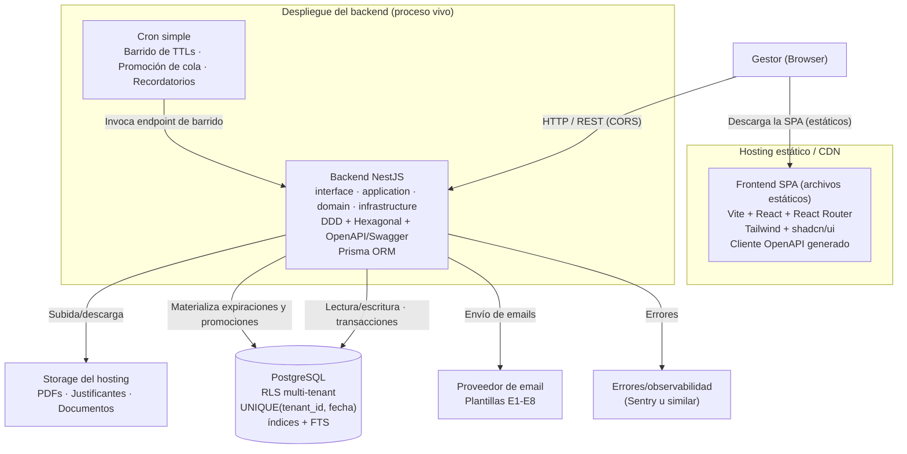
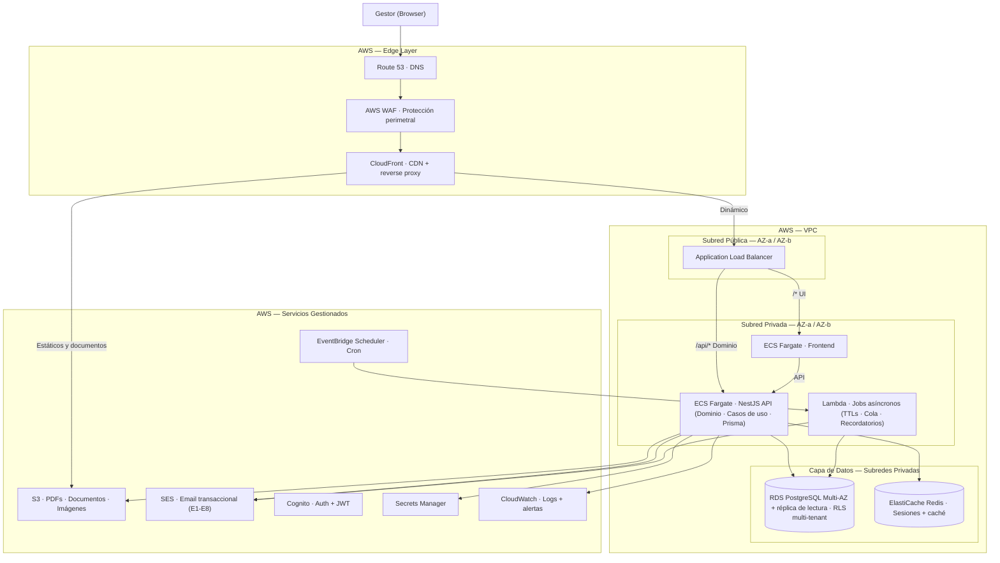

# Arquitectura del Sistema — Slotify

> **Documento**: Diseño de Arquitectura
> **Proyecto**: Slotify — Plataforma SaaS de Gestión Integral para Espacios Boutique de Eventos Privados
> **Fuente**: EspecificacionFuncional.md · er-diagram.md · use-cases.md

---

## 0. Cómo leer este documento

Este documento describe la arquitectura de Slotify en **dos niveles deliberadamente separados**, presentados en orden de prioridad de construcción:

1. **Arquitectura de implementación del MVP (§2)** — el subconjunto pragmático que se construye realmente para el TFM, dado el alcance, el plazo y el modelo de desarrollo. **Es lo que se construye.**
2. **Arquitectura objetivo de producción (§3)** — la arquitectura a la que el producto evolucionaría cuando opere a escala, con múltiples tenants, tráfico real y necesidades de alta disponibilidad. **Es la visión de destino, no se implementa en el MVP.**

Separar ambos niveles es una decisión de arquitectura consciente. Implementar un subconjunto justificado demuestra criterio de priorización; diseñar para la escala futura demuestra visión. Las dos cosas se evalúan, y confundirlas —construir la arquitectura de producción para un piloto de un tenant— sería un error de sobreingeniería que comprometería el plazo sin aportar valor en esta fase.

La §4 contiene los prompts para generar ambos diagramas con DiagramsGPT. La §5 analiza el coste de hosting del MVP. La §6 documenta la trazabilidad de cada decisión de divergencia entre ambos niveles.

---

## 1. Principios arquitectónicos transversales

Estos principios rigen ambos niveles (MVP y objetivo):

1. **La reserva es el agregado raíz (DDD).** Toda la lógica de transición de estado, bloqueo de fecha y cola se modela alrededor de la entidad reserva. *Fuente: EspecificacionFuncional §10.2 #3.*
2. **Multi-tenancy desde el día 1.** `tenant_id` en toda tabla de negocio + aislamiento por Row-Level Security en PostgreSQL. Un tenant = un espacio. *Fuente: §10.2 #1, #2.*
3. **Atomicidad del bloqueo de fecha garantizada por la base de datos.** Restricción `UNIQUE(tenant_id, fecha)` sobre la entidad de bloqueo + transacciones con `SELECT ... FOR UPDATE`. Es el mecanismo central contra la doble reserva (riesgo crítico #1). *Fuente: §10.2 #11, §14.*
4. **Máquina de estados como configuración, no como código disperso.** Las transiciones permitidas y sus guardas se modelan como una estructura de datos consultada por una única función de transición. *Fuente: §10.2 #4.*
5. **Arquitectura hexagonal (puertos y adaptadores) en el backend.** El dominio define puertos (interfaces); la infraestructura provee adaptadores. El dominio nunca depende de frameworks, ORM ni servicios externos directamente.
6. **Eventos de dominio como base de las automatizaciones.** `ReservaConfirmada`, `FechaBloqueada`, `ColaPromovida`, etc. *Fuente: §10.2 #10.*
7. **Configurabilidad por tenant desde el día 1, opinión única en UX.** TTLs, porcentajes, plantillas y políticas viven en configuración por tenant aunque el MVP exponga un solo flujo. *Fuente: §10.3 "opinado por fuera, configurable por dentro".*

---

## 2. Arquitectura de implementación del MVP

> **Estado: ESTO es lo que se construye para el TFM.**

### 2.1 Resumen

El MVP se implementa como un **monolito modular**: el código vive en un **único monorepo** con dos aplicaciones (`apps/web` y `apps/api`), pero se despliega en **dos destinos según la naturaleza de cada pieza**. El frontend SPA (Vite + React) se publica como **archivos estáticos en un hosting de CDN** (la SPA no es un proceso vivo: se descarga y corre en el navegador). El backend de dominio (NestJS) corre como **proceso vivo** en su plataforma, contra una **única base de datos PostgreSQL**. Que el despliegue tenga dos destinos no rompe el carácter "monolítico" de la arquitectura: sigue habiendo un solo backend de dominio y una sola base de datos, que es lo que preserva las transacciones ACID nativas que protegen el bloqueo atómico de fecha. El backend NestJS aplica arquitectura por capas, DDD y hexagonal, y expone su contrato vía **OpenAPI**; la SPA consume ese contrato (pudiendo generar su cliente HTTP type-safe a partir del OpenAPI) mediante llamadas HTTP cross-origin (CORS configurado en el backend). Los procesos asíncronos se implementan con un **cron simple** que invoca un endpoint protegido de barrido. PDFs y justificantes se almacenan en el storage del hosting; el email transaccional usa un proveedor ágil; los secretos viven en variables de entorno cifradas.

### 2.2 Diagrama de implementación del MVP



> **Nota:** ambas cajas de despliegue salen del mismo monorepo (`apps/web` → CDN; `apps/api` → plataforma de backend). El navegador descarga la SPA del CDN y, ya en el cliente, llama a la API de NestJS por HTTP cross-origin.

### 2.3 Stack del MVP

| Capa | Tecnología | Razón |
|---|---|---|
| **Frontend** | Vite + React + React Router + TypeScript | SPA pura servida como estáticos desde un CDN: el producto es interno tras login (sin SEO/SSR necesario) y el backend ya es NestJS, así que no hace falta un framework full-stack. Frontera front/back limpia |
| **CORS** | `enableCors` en NestJS con origen permitido | La SPA (dominio del CDN) y la API (dominio del backend) son orígenes distintos; el backend declara qué origen puede llamarlo |
| **UI** | Tailwind + shadcn/ui | Velocidad de desarrollo, componentes accesibles |
| **Calendario** | react-big-calendar o FullCalendar | Maduros para vistas mensual/semanal con bloqueos |
| **Cliente API** | Generado desde OpenAPI de NestJS | Recupera type-safety y demuestra que el contrato OpenAPI se consume realmente |
| **Backend** | NestJS + TypeScript | Aplica capas + DDD + hexagonal + OpenAPI (objetivos formativos del máster); estructura que exhibe la arquitectura de forma explícita |
| **ORM** | Prisma | Migraciones controladas, DX para IA; `SELECT ... FOR UPDATE` vía `$queryRaw` dentro de transacción para el bloqueo |
| **BBDD** | PostgreSQL (gestionada) | Sostiene bloqueo atómico, RLS multi-tenant y búsqueda full-text del histórico |
| **Auth** | JWT (access en memoria + refresh en cookie httpOnly), NestJS + Passport | Access token de vida corta en memoria; refresh token en cookie httpOnly a salvo de XSS. Tenant y rol en el payload firmado. Ver §2.8 |
| **Jobs** | Cron simple → endpoint de barrido | TTLs como campo `ttl_expiracion` + barrido periódico; robusto e idempotente |
| **Email** | Resend SDK (`ResendEmailAdapter`) + `FakeEmailAdapter` en test/CI/dev; motor `DespacharEmailService` (`comunicaciones/application/`) + puerto `EnviarEmailPort` (`comunicaciones/domain/`); catálogo de plantillas en `comunicaciones/infrastructure/plantillas/` | Motor hexagonal reutilizable (US-045): selecciona plantilla → sustituye variables → resuelve adjuntos → envía por el puerto → registra en `COMUNICACION` + `AUDIT_LOG`. `FakeEmailAdapter` forzado en test/CI/dev (cero envíos reales); `ResendEmailAdapter` en producción. Configuración validada con zod: `EMAIL_TRANSPORT` (`resend`\|`fake`), `RESEND_API_KEY`, `EMAIL_FROM`, `EMAIL_SANDBOX`; en producción se exige `EMAIL_TRANSPORT=resend`. E1 activa; E2–E8 diseñadas/inactivas (cableado diferido a cada US). |
| **PDF** | Plantillas HTML + Puppeteer (o react-pdf) | Generación server-side; plantillas editables (presupuestos/facturas borrador) |
| **Storage** | El del hosting (p. ej. Supabase Storage) | Menos integración que un proveedor de objetos aparte |
| **Hosting** | Railway (recomendado) o Render free + Postgres gestionada | Ver análisis de coste en §5 |
| **Observabilidad** | Sentry (errores) | Útil y barato; PostHog y analytics quedan post-TFM |

### 2.4 El núcleo crítico: bloqueo atómico sin coordinación distribuida

Es la decisión técnica más importante del MVP y la que más diverge de la arquitectura objetivo.

**Decisión:** el bloqueo de fecha NO usa locks distribuidos (Redis/Redlock). Usa la garantía nativa de PostgreSQL: una entidad `FECHA_BLOQUEADA` con restricción `UNIQUE(tenant_id, fecha)`, manipulada dentro de transacciones.

**Por qué:** los locks distribuidos sólo son necesarios cuando varios procesos sin transacción común compiten por un recurso. El MVP tiene una única base de datos transaccional, por lo que la atomicidad ya está garantizada por el motor: dos transacciones concurrentes que intenten insertar la misma `(tenant_id, fecha)` resultan en una inserción exitosa y una violación de unicidad determinista, sin ventana de carrera. Introducir Redis añadiría un punto de fallo (incoherencia si el lock se concede pero la transacción falla) para resolver un problema inexistente. *Fuente: EspecificacionFuncional §10.2 #11, riesgo crítico #1; decisión de modelado ERD §FECHA_BLOQUEADA.*

**Encapsulación:** toda mutación de bloqueo pasa por dos funciones transaccionales del dominio — `bloquearFecha()` (UC-30 / US-040) y `liberarFecha()` (UC-31 / US-041) — que sincronizan la fila de `FECHA_BLOQUEADA` y el estado de la reserva en la misma transacción. Toda la mecánica de cola (promoción, reordenación, encadenamiento) se construye sobre ellas. Esto centraliza el riesgo crítico en un punto único y testeable.

**`liberarFecha()` (UC-31 / US-041) — DELETE serializado, idempotente, exactamente-una-vez:** elimina la fila `(tenant_id, fecha)` de `FECHA_BLOQUEADA` vía `$executeRaw` dentro de `$transaction` + `SET LOCAL app.tenant_id` (RLS). Las filas afectadas son la señal canónica: `1` = liberación efectiva → registrar en `AUDIT_LOG` con causa (TTL/descarte/cancelacion) + invocar `PromocionColaPort` si existe cola activa; `0` = éxito silencioso idempotente (fecha ya libre), sin excepción, para que los retries del cron no generen errores. La guarda del bloqueo firme valida en dominio, antes del DELETE, que la `RESERVA` esté en `reserva_cancelada`; si no, rechaza con error tipado y audita el intento. Ante dos liberaciones concurrentes, exactamente una obtiene `rows = 1` y dispara la promoción; la otra obtiene `rows = 0` sin dispararla (exactamente-una-vez). Liberación en lote: N fechas expiradas se procesan en transacciones independientes con fallo aislado. Sin endpoint HTTP propio (D-7 / US-041): el actor de UC-31 es el Sistema; la liberación es efecto de transiciones de estado y del cron de barrido. `PromocionColaPort` es un seam cuya implementación real (reordenación FIFO + email) se difiere a **US-018** (pendiente); hasta entonces stub no-op auditado; la cola permanece en `2.d`.

**Mapa canónico fase → (tipo, TTL, modo):** `bloquearFecha()` deriva el tipo de bloqueo y el TTL a partir de la fase de la reserva usando una **tabla de datos declarativa** (no lógica dispersa), leyendo siempre los días de TTL de `TENANT_SETTINGS`. Las fases contempladas son `2.b`, `2.c` (extensión de TTL sin cambiar tipo), `2.v` (hasta día post-visita), `pre_reserva` y `reserva_confirmada` (upgrade a firme, sin TTL). El upgrade de blando a firme es un `UPDATE` del registro existente, nunca `DELETE+INSERT`.

**Defensa en profundidad — check constraints en la BD (US-040, D-3):** además de las validaciones de dominio, el motor impone dos invariantes de coherencia sobre la tabla `fecha_bloqueada`: `chk_firme_sin_ttl` (`tipo_bloqueo = 'firme' ⟹ ttl_expiracion IS NULL`) y `chk_blando_con_ttl` (`tipo_bloqueo = 'blando' ⟹ ttl_expiracion IS NOT NULL`). Añadidos en una migración no destructiva (la `UNIQUE(tenant_id, fecha)` y la RLS ya existían desde US-000).

**Errores de dominio tipados (en español):** `FECHA_YA_BLOQUEADA` (traducción del `P2002` de Prisma por índice de fecha), `FECHA_EN_PASADO` (validación previa a la transacción), `TENANT_MISMATCH`, `EXTENSION_SOBRE_BLOQUEO_FIRME` y `RESERVA_YA_TIENE_BLOQUEO` (por `reserva_id @unique`). El flujo invocante decide qué hacer ante cada error (p. ej. ofrecer cola ante `FECHA_YA_BLOQUEADA`).

**Sin endpoint HTTP propio (D-7):** `bloquearFecha()` es infraestructura de dominio invocada por las transiciones de estado de la reserva (A1/A2/A6/A18). No se expone como endpoint directo porque el bloqueo debe ocurrir en la misma transacción que la transición de estado; un endpoint aislado rompería la atomicidad reserva↔bloqueo.

**US-006 — extensión manual del TTL (prórroga pura sin transición de estado):**

US-006 no es una transición de máquina de estados (no cambia `estado`, `sub_estado`, `tipo_bloqueo` ni `fecha`): es una **prórroga directa del TTL del bloqueo blando** ya existente, aplicable cuando `sub_estado ∈ {2b, 2c, 2v}` O `estado = 'pre_reserva'`.

- **Guarda de precondición declarativa**: `esEstadoConBloqueoBlandoExtensible(estado, subEstado)` — tabla de datos en `maquina-estados.ts` (mismo estilo que `ORIGENES_TRANSICION_*`), no condicionales dispersos. Rechaza `2a`, terminales y `reserva_confirmada` antes de tocar la BD. La condición real en runtime es la presencia de fila blanda vigente en `FECHA_BLOQUEADA` con `ttl_expiracion > ahora`; el predicado de estado es defensa rápida previa.

- **Atomicidad de las tres operaciones**: UPDATE `RESERVA.ttl_expiracion = ttl_actual + N días` + UPDATE `FECHA_BLOQUEADA.ttl_expiracion` al mismo valor + INSERT `AUDIT_LOG accion='actualizar'`, en una única transacción con `SELECT … FOR UPDATE` sobre la fila bloqueante (mismo punto de serialización que US-005/007/008). Un fallo parcial hace rollback completo.

- **Concurrencia frente al barrido de expiración (US-012)**: si la extensión llega antes de que el barrido expire el bloqueo, el barrido ve el TTL ya extendido; si el barrido ya procesó la expiración, la extensión observa `ttl_expiracion < ahora` y se rechaza con `409`. La serialización por `SELECT … FOR UPDATE` garantiza que no hay estados intermedios ni "resurrección" de un bloqueo ya expirado.

- **Reprogramación implícita de recordatorios A3/A4/A5**: al cambiar `ttl_expiracion`, el barrido periódico (§2.5; US-012, pendiente) reevalúa los recordatorios contra el nuevo valor en su siguiente pasada. No se introduce ningún scheduler ni tabla de jobs adicional.

- **Sin migración**: `ttl_expiracion` (RESERVA y FechaBloqueada), `tipo_bloqueo` y `accion = 'actualizar'` en `AUDIT_LOG` existen desde US-000/US-040/US-004.

- **Nuevo endpoint**: `POST /reservas/{id}/extender-bloqueo` body `{ dias: integer ≥ 1 }` — respuestas `200` (TTL extendido), `409` (TTL expirado / sin fila bloqueante activa / bloqueo firme), `422` (estado sin bloqueo extensible o `dias` inválido), `404`/`401`/`403`.

**US-007 — extensiones del núcleo crítico (transición 2.b → 2.c + vaciado de cola A16):**

- **Guarda de origen `{consulta, 2b} → {consulta, 2c}`**: añadida a la tabla declarativa de `maquina-estados.ts` (mismo patrón que `ORIGENES_TRANSICION_ANADIR_FECHA` de US-005). Cualquier origen distinto de `2.b` —incluidos terminales `2.x`/`2.y`/`2.z` (inmutables)— se rechaza antes de entrar en la transacción.

- **Extensión atómica del TTL vía `resolverPlanBloqueo({ fase: '2.c' })`**: reutiliza la primitiva ya modelada (`er-diagram.md §3.16`, fase `2.c` → `accion: 'extend'`, `ttl = ttl_actual + ttl_consulta_dias`). Dentro de la misma transacción, hace `SELECT … FOR UPDATE` sobre la fila bloqueante de `FECHA_BLOQUEADA` y la **actualiza** (no inserta) al nuevo `ttl_expiracion`. La base es el `ttl_expiracion` actual de la RESERVA, no `now()`.

- **Vaciado atómico de la cola (mecánica A16)**: en la misma transacción, UPDATE masivo de todas las RESERVA con `consulta_bloqueante_id = id de esta RESERVA` y `sub_estado = '2d'` → `sub_estado = '2y'` (terminal), `posicion_cola = NULL`, `consulta_bloqueante_id = NULL`. Si la cola está vacía, el UPDATE afecta a 0 filas sin error. El vaciado es irreversible (`2.y` es terminal). El `SELECT … FOR UPDATE` sobre la fila bloqueante serializa el vaciado frente a operaciones concurrentes de cola (UC-12/UC-13) sobre la misma fecha.

- **Atomicidad de las cuatro operaciones**: `sub_estado` RESERVA + `ttl_expiracion` RESERVA + `ttl_expiracion` `FECHA_BLOQUEADA` + vaciado de cola son all-or-nothing en una única transacción de BD bajo el contexto RLS del tenant. Un fallo parcial hace rollback completo.

- **Auditoría dual**: `AUDIT_LOG` con `accion = 'transicion'` para la RESERVA principal (`2b → 2c`) y para cada RESERVA descartada (`2d → 2y`), en la misma transacción.

- **Sin migración**: sub-estados `2c`/`2y` y campos de cola/TTL (`posicion_cola`, `consulta_bloqueante_id`, `ttl_expiracion`) existen desde US-000/US-040/US-004.

- **Gap de spec D-7**: el email al cliente de UC-06 paso 7 no tiene E-code asignado en §9.3; no se implementa en MVP. Ver UC-06 en `use-cases.md` y `design.md §D-7` del change us-007.

- **Nuevo endpoint**: `POST /reservas/{id}/pendiente-invitados` — respuestas `200` (transición aplicada), `409` (sin fecha bloqueada activa o TTL expirado), `422` (guarda de origen), `404`/`401`/`403`.

**US-004 — extensiones del núcleo crítico (alta de consulta con fecha):**

- **`bloquearEnTx(tx, …)`**: `FechaBloqueadaPrismaAdapter` se refactorizó extrayendo el INSERT transaccional (`SELECT FOR UPDATE` + P2002) a un método que acepta el `tx` de la UoW del alta. El método público `bloquear()` (US-040) queda como wrapper sin cambio de contrato externo. Esto permite que `RESERVA 2b + FECHA_BLOQUEADA` se creen en una única transacción all-or-nothing. Fuente: `design.md §D-2`.

- **`determinarAltaConFecha(estadoFecha)`**: función declarativa en `maquina-estados.ts` — tabla de datos, no condicionales dispersos — que mapea el estado de disponibilidad de la fecha a `{ subEstado, accion }`: `libre → 2b/bloquear`, `bloqueada-por-2b → 2d/encolar`, `bloqueada-por-2c|2v|pre|conf+ → 2a/exploratoria`. Las entradas iniciales `2b` y `2d` se añadieron a `ENTRADAS_INICIALES`. Se evalúa **dentro del cuerpo transaccional reintentado** para garantizar que ante una colisión D4 el reintento re-derive el sub-estado con el estado ya actualizado. Fuente: `design.md §D-3`, `design.md §D-6`.

- **`TarifaEstimadaPort`**: nuevo puerto de dominio en `reservas/domain/` que envuelve `CalculadoraTarifaService.calcular()` (US-016). Tolerante a errores: si el cálculo no es posible (`TEMPORADA_NO_CONFIGURADA`, `TARIFA_NO_CONFIGURADA`, `tarifa_a_consultar = true`), E1 sale con el dossier general sin precio sin bloquear el alta. La tarifa no se persiste en `RESERVA`. Fuente: `design.md §D-4`.

- **Concurrencia D4 y serialización de cola**: ante colisión `UNIQUE(tenant_id, fecha)` (`P2002`), la UoW reabre la transacción y re-deriva el sub-estado con `determinarAltaConFecha`. La `posicion_cola` se serializa con `SELECT … FOR UPDATE` sobre la fila bloqueante (D-5). Defensa adicional: índice UNIQUE parcial `reserva_cola_posicion_key` (migración aditiva D-8, aprobada en Gate 1). Fuente: `design.md §D-5`, `design.md §D-6`.

- **Divergencia intencional — regla de fecha (Gate 1, decisión A):** `fecha_evento > hoy` (estrictamente futura) para toda creación con fecha, unificando con `validarFechaFutura` (US-040) y el motor de tarifa. La ficha US-004 admitía `≥ hoy`; la divergencia fue aprobada por el humano. El servidor rechaza `fecha_evento = hoy` y fechas pasadas con **400** sin crear registros. Fuente: `design.md §D-1`.

### 2.5 Procesos asíncronos sin infraestructura serverless

Los TTLs no se implementan con timers que disparan en el instante exacto, sino con el patrón **estado en la fila + barrido periódico**: cada reserva con bloqueo lleva `ttl_expiracion`; un cron invoca cada N minutos un endpoint protegido que barre las filas vencidas, las libera y dispara las promociones de cola. Si el cron se retrasa o cae, no hay pérdida de consistencia: al volver a ejecutarse barre lo pendiente. Es idempotente y trivial de testear (se llama a la función de barrido con una fecha simulada). Sustituye a Lambda + EventBridge sin perder corrección.

> **Nota de hosting:** en plataformas con proceso always-on (p. ej. Railway), el cron es trivial. En tiers gratuitos que duermen el servicio tras inactividad (p. ej. Render free), el barrido necesita un disparador externo que despierte el endpoint. Ver §5.

### 2.6 Organización interna del backend (capas + hexagonal + DDD)

```
apps/
  web/                      Frontend SPA (Vite + React)
  api/                      Backend NestJS
    src/
      <modulo>/             p. ej. reservas/, tarifas/, facturacion/, comunicaciones/
        domain/             Entidades, objetos de valor, eventos de dominio, PUERTOS (interfaces)
        application/        Casos de uso (orquestan el dominio)
        infrastructure/     ADAPTADORES: Prisma, email, PDF, storage
        interface/          Controladores HTTP + documentación OpenAPI
```

- **Regla de dependencia hexagonal:** `domain` no importa nada de `infrastructure` ni de frameworks; depende sólo de sus propios puertos. Los adaptadores de `infrastructure` implementan esos puertos. Esto hace el dominio testeable de forma aislada (TDD).
- **Organización por módulos de dominio** (no por capas técnicas globales), alineada con M1–M12 de la especificación. Un módulo llama a otro sólo a través de su interfaz pública.

### 2.7 Cómo la arquitectura sirve a SDD + TDD asistido por IA

- **Type-safety end-to-end** (TS en front y back + OpenAPI + Prisma): la IA no puede generar código que viole el contrato sin que el compilador lo detecte.
- **Orden TDD impuesto por la arquitectura:** lo primero que se escribe son los tests de concurrencia del núcleo crítico (bloqueo atómico bajo transacciones simultáneas, promoción de cola, encadenamiento, salida de cola concurrente — edge cases #19, #20 de la especificación), antes que UI o CRUD.
- **Máquina de estados declarativa:** las specs SDD se traducen casi 1:1 a la tabla de transiciones y a sus tests.
- **Módulos acotados:** la IA recibe el contexto de un módulo sin necesitar todo el sistema.

### 2.8 Autenticación y modelo de usuarios

**Mecanismo: JWT con patrón access token + refresh token.** Se elige JWT (frente a sesión de servidor con cookie) tanto por encajar con la SPA cross-origin sin depender de cookies de sesión cross-site para las peticiones de API, como por su valor formativo. La seguridad no depende de "ocultar" el token —el payload de un JWT es legible por diseño; lo que lo protege es la firma del servidor— sino de **dónde se guarda cada token y cuánto vive**:

- **Access token** (JWT firmado): vida corta (~15 min). Se guarda **en memoria de la SPA** (estado de la aplicación), nunca en `localStorage` ni `sessionStorage`. Viaja en la cabecera `Authorization: Bearer`. Si un ataque XSS lo robara, solo serviría unos minutos.
- **Refresh token**: vida larga (~7 días). Se guarda en una **cookie httpOnly + Secure + SameSite**, que el JavaScript de la página **no puede leer**, lo que lo protege de XSS. Solo sirve para llamar a `/auth/refresh` y obtener un nuevo access token cuando el anterior caduca.
- **Prohibido:** guardar cualquier token en `localStorage`. Es la causa más común de robo de token por XSS, y no existe ningún "enmascaramiento" que lo mitigue.

**Tenant y rol en el token:** el `tenant_id` y el `rol` del usuario se incluyen en el payload firmado del access token. El backend los lee en cada petición para alimentar el aislamiento multi-tenant (RLS) y la autorización. Al ir firmados, el cliente no puede manipularlos.

**Implementación (US-001 y US-002, completadas):** El módulo `auth` aplica arquitectura hexagonal bajo `apps/api/src/auth/`:

- **domain/**: entidad `Usuario` (sin contraseña en claro), invariante `activo`.
- **application/**: `login.use-case.ts`, `refresh.use-case.ts`, `logout.use-case.ts`, `obtener-usuario-actual.use-case.ts`. Los **puertos** (`UsuarioRepositoryPort`, `PasswordHasherPort`, `TokenEmitterPort`) viven consolidados en esta capa junto a los casos de uso; no importan `@nestjs/*` ni Prisma. La inversión de dependencias se mantiene: la infraestructura implementa los puertos y `auth.module.ts` los enlaza por Symbol vía factory.
- **infrastructure/**: `usuario.prisma.adapter.ts` (Prisma), `argon2-password-hasher.adapter.ts` (argon2, coherente con el seed), `jwt-token-emitter.adapter.ts` (`@nestjs/jwt`).
- **interface/**: `auth.controller.ts` — `POST /auth/login` (ruta pública, `@Public`), `POST /auth/refresh`, `POST /auth/logout` (ver abajo), `GET /auth/me` (resuelve el usuario real desde BD, ya no devuelve solo el payload del JWT). La cookie de refresh se setea y limpia íntegramente en esta capa (framework); el dominio no la toca.

  **`POST /auth/logout` (US-002):** marcado `@Public()` (cookie opcional). Comportamiento idempotente: si el refresh token identifica a un usuario, registra `AUDIT_LOG` con `accion = logout`, `entidad = 'Usuario'`, `entidad_id = usuario_id`; si el token es ausente/expirado/inválido, responde igualmente 200/204 sin auditar. El endpoint es **no anónimo** (actúa solo sobre la cookie propia; no acepta `usuario_id` de destino) y **nunca devuelve 401**. El access token no se revoca activamente; caduca por TTL (~15 min). La invalidación stateful del refresh queda como deuda post-MVP (DT-AUTH-01).

El guard `JwtAuthGuard` y la estrategia `jwt` de Passport se reutilizan del scaffolding de US-000A (`shared/auth/`). Contraseñas verificadas con **argon2** (nunca bcrypt). `buscarPorEmail` es una consulta pre-autenticación: el email es único globalmente; el `tenant_id` se fija en contexto RLS **tras** autenticar.

**Anti-enumeration (OWASP A01):** el dominio lanza un único `CredencialesInvalidasError` para los tres casos de fallo — email inexistente, contraseña incorrecta, `activo=false` —; el controlador lo traduce siempre a **401 genérico uniforme** (`"Credenciales incorrectas"`) con el mismo body y status. Los intentos fallidos de login **no se registran en `AUDIT_LOG`**; solo los logins exitosos generan un registro `login`.

**Protección brute-force — throttler self-contained:** `LoginThrottleGuard` implementado con `Map` en memoria del proceso, clave `IP+email` normalizada, ventana **5 intentos / 60 s** → responde **429** genérico (no revela si el email existe). No usa `@nestjs/throttler` ni Redis. Adecuado para el MVP de instancia única; ver §2.9 DT-AUTH-03 para la deuda de migración.

**Cookie del refresh token:** `httpOnly: true`; `secure: true` + `sameSite: 'none'` en producción; `sameSite: 'lax'` en desarrollo. `path: '/api/auth'`, `maxAge` ~7 días. El frontend no puede leerla desde JavaScript.

**Puerto compartido de auditoría (`AuditLogPort`):** extraído a `shared/audit/audit-log.port.ts` (interfaz pura, sin NestJS ni Prisma). Los módulos `auth` y `reservas` la comparten: `auth` usa el adaptador genérico `shared/audit/audit-log.prisma.adapter.ts`; `reservas` conserva su adaptador especializado con tipos estrechados (`RegistroAuditoriaLiberacion extends RegistroAuditoria`). Sin duplicación de interfaz ni ruptura de comportamiento en US-040/US-041.

**Modelo de usuarios y los dos niveles de administración.** Conceptualmente, un SaaS multi-tenant tiene dos figuras de administración distintas:

| Nivel | Quién es | Qué hace | Alcance |
|---|---|---|---|
| **Admin de plataforma** | El operador del producto (Slotify como empresa) | Da de alta tenants, gestiona la facturación del SaaS | Cruza todos los tenants |
| **Admin de tenant** | El propietario de un espacio (p. ej. propietario de Masia l'Encís) | Crea y gestiona los usuarios de SU tenant (gestores, operarios), configura su tarifario | Un solo tenant |
| **Gestor / operario** | Personal del espacio | Opera reservas, presupuestos, facturas | Un solo tenant |

**En el MVP estos roles se colapsan:** como solo hay **un usuario por tenant (el gestor)**, no existe la necesidad de que un admin de tenant cree otros usuarios. El gestor único se aprovisiona por **seed/script** al crear el tenant; no se construye UI de gestión de usuarios, invitaciones ni roles múltiples. El campo `rol` permanece en la tabla `USUARIO` (el modelo es multi-tenant desde el día 1), pero en el MVP todos los usuarios reales tienen `rol = gestor`. La creación de usuarios por un admin de tenant y la administración de plataforma quedan **fuera del alcance del MVP** (post-TFM).

**Convención de layouts de la SPA (implementada en US-000A):** la SPA divide el árbol de rutas en dos ramas independientes. La rama protegida envuelve todas las pantallas autenticadas en el `AppShell` (sidebar 288px + header + `<Outlet/>`), precedida por el guard `RequireAuth` que redirige a `/login` preservando la ruta solicitada y vuelve a ella tras autenticar. La rama de autenticación (`/login`) tiene su propio layout y no hereda el chrome del shell. Esta separación garantiza que ninguna pantalla autenticada futura necesite redefinir navegación; se monta directamente como ruta hija dentro del árbol protegido.

**Cierre de sesión en el shell (US-002):** el `AppShell` incluye el botón "Cerrar sesión" en el pie del sidebar (escritorio, `lg:`) y dentro del drawer de navegación (móvil, `<lg`), conforme a la regla dura responsive mobile-first. Al activarlo: llama a `POST /auth/logout` (SDK generado), limpia el access token y la sesión de memoria (`session.tsx`) y redirige a `/login`. Ante error de red, limpia igualmente la sesión y muestra un aviso persistente en `/login` (modo degradado aceptable en MVP: el refresh token en cookie caduca por TTL ~7 días).

### 2.9 Deuda técnica y decisiones diferidas

Esta sección registra las decisiones tomadas conscientemente como deuda en US-001. Cada entrada lleva el fundamento y el punto de cierre previsto. El responsable de cada deuda técnica es el agente/US que la cierra.

| ID | Deuda / Decisión diferida | Contexto | Cuándo se cierra |
|---|---|---|---|
| DT-AUTH-01 | **Refresh stateless — sin revocación real (deuda post-MVP).** El `POST /auth/logout` limpia la cookie y audita la sesión del dispositivo actual, pero no invalida criptográficamente el refresh token en el servidor: un token ya emitido sigue siendo válido hasta su TTL (~7 días). El riesgo se acota por la cookie `httpOnly` (no robable por XSS) + vida corta del access (~15 min). US-002 ratificó este enfoque best-effort: añadió auditoría e idempotencia sin adoptar refresh stateful. La invalidación real (modelo `SesionRefresh` / denylist de `jti` en Prisma + verificación en `/auth/refresh`) queda diseñada y diferida. | Decisiones §1-A de US-001 y US-002 (`proposal.md` de ambos changes) | Post-MVP / sprint auth-completo cuando se necesite global logout o revocación real del refresh |
| DT-AUTH-02 | **Multi-device FA-03 diferido.** Las sesiones en múltiples dispositivos coexisten en silencio; no existe flujo interactivo ("continuar / cerrar sesión anterior"). El flujo completo requiere registro de sesiones activas, que depende de DT-AUTH-01 (refresh stateful). | Decisión §4 del change US-001 (`proposal.md`) | Cuando se adopte el refresh stateful |
| DT-AUTH-03 | **Throttler en memoria por proceso.** `LoginThrottleGuard` usa un `Map` en memoria del proceso: los contadores no se comparten entre instancias y se reinician al rearrancar el proceso. Aceptado para el MVP de instancia única (Railway). Antes de cualquier despliegue multi-instancia debe migrarse a una solución compartida (Redis, BD o `@nestjs/throttler` con store distribuido). | Decisión §3 del change US-001; nota de escalabilidad del code-review | Antes de despliegue multi-instancia |
| DT-AUTH-04 | **SDK del frontend genera `.d.ts` en lugar de `.ts`.** La configuración actual de `resolve.extensions` incluye `.d.ts`, lo que hace que el cliente generado sea un archivo de tipos, no un módulo importable directamente. Requiere workaround en el build del frontend. La corrección pasa por ajustar la config de codegen del `contract-engineer`. | Nota de codegen del code-review | Próxima iteración de codegen del `contract-engineer` |
| DT-EMAIL-01 | **Adaptador de email stub (no-op) — RESUELTA.** El `EnviarEmailStubAdapter` se sustituye en US-045 por `ResendEmailAdapter` (producción) y `FakeEmailAdapter` (test/CI/dev, forzado). El motor `DespacharEmailService` centraliza render + envío + actualización de estado. `AltaConsultaUseCase` delega el envío post-commit en `DespacharEmailService.finalizarEnvio`: la `COMUNICACION` E1 nace en `borrador` dentro de la `$transaction` del alta y el motor la promueve a `enviado`+`fecha_envio` (éxito) o a `fallido`+AUDIT_LOG (fallo del proveedor), sin reintento y sin tumbar el HTTP 201. Regresión cero sobre US-003/004 (contrato del puerto `EnviarEmailPort` intacto, campos nuevos solo opcionales). | US-045 (28/06/2026). Cierre: motor hexagonal + Resend + FakeEmailAdapter en test/CI + cableado real de E1. | RESUELTA — US-045 (28/06/2026) |
| DT-EMAIL-02 | **Cableado de triggers E2–E8 diferido a sus US.** El catálogo de plantillas declara E2–E8 como entradas diseñadas/inactivas (variables, adjuntos y metadatos declarados, sin render activo) pero sin trigger cableado. Mapa de deuda: E2→US-014 (`pre_reserva` + PDF presupuesto), E3→US-021/022/023 (`reserva_confirmada` + factura señal), E4→US-027/028 (liquidación facturada), E5→US-034 (`post_evento` con `fianza_eur > 0`), E6→US-008 (sub-estado `2.v` visita), E7→US-009 (resultado visita "interesado" → `2.b`), E8→US-035 (`iban_devolucion` registrado). Adjuntos PDF reales (presupuesto/factura/documento) y cron de recordatorios también diferidos. Envío manual de borradores: US-046. | Decisión de alcance del Gate SDD de US-045: el cableado de E2–E8 requiere triggers, PDFs y estados de US aún no implementadas; construirlos ahora sería spec especulativa. El motor ya está listo para recibirlos sin rediseño. | Cada US de trigger listada en la columna anterior + US-046 |
| Bj3 | **Default inseguro de `EMAIL_SANDBOX` — RESUELTA.** Antes, si `EMAIL_SANDBOX` no estaba seteada, el sistema podía enviar emails reales (unset → `false`). Ahora el default es SEGURO con doble barrera: (1) validación zod en `env.validation.ts` — unset → `undefined !== 'false'` → `true` (sandbox activo); (2) cableado en `comunicaciones.module.ts` — trata como envío real solo el `false`/`'false'` explícito. Con `sandbox=true`, `resend.email.adapter.ts` reescribe el destinatario a `delivered@resend.dev`. El opt-in al envío real exige `EMAIL_SANDBOX=false` explícito en el entorno; cualquier otro valor, incluido unset, mantiene el sandbox activo. Cobertura: 3 tests nuevos en `env.validation.spec.ts` (unset→true, 'true'→true, 'false'→false). | Code-review de US-045, segunda pasada (29/06/2026). Detectada como deuda operativa de seguridad (baja→operativa). | RESUELTA — US-045 fix Bj3 (29/06/2026) |
| DT-CODIGO-01 | **Generación de `codigo` no atómica (count+1) — RESUELTA.** La implementación inicial generaba el correlativo `YY-NNNN` con `count(*)+1` dentro de la transacción: dos altas concurrentes podían leer el mismo recuento y colisionar en el índice `reserva_codigo_key`. Resuelto con **retry-on-conflict** en `UnidadDeTrabajoPrismaAdapter.ejecutar()` (hasta 3 reintentos): ante `P2002` sobre `reserva_codigo_key`, el adaptador reabre la `$transaction` y reintenta; el siguiente intento re-lee el `count` con el ganador ya confirmado. El índice UNIQUE permanece como red de seguridad final. Conexo: el controlador ya no enmascara errores como 500; cualquier `P2002` no capturado por el caso de uso se propaga al `HttpExceptionFilter` global → 409. | Code-review de US-003 (señalado como tolerable para MVP; corregido en los fixes finales de US-003) | RESUELTA — US-003 fixes finales (28/06/2026) |

### 2.10 Módulo M10 Comunicaciones: motor de email automático (US-045)

El módulo `comunicaciones` implementa un **motor de email hexagonal reutilizable** que sirve a todos los triggers del ciclo de vida de la reserva (E1–E8). Solo **E1** está cableado en US-045; E2–E8 se activarán en sus US respectivas (ver DT-EMAIL-02 en §2.9).

#### Arquitectura interna del módulo

```
apps/api/src/comunicaciones/
  domain/
    enviar-email.port.ts            Puerto de envío (interfaz pura — sin NestJS ni Resend)
    catalogo-plantillas.port.ts     Puerto del catálogo de plantillas
    comunicacion-duplicada.error.ts Error tipado de idempotencia
  application/
    despachar-email.service.ts      Motor principal: render → envío → actualización estado
  infrastructure/
    resend.email.adapter.ts         Adaptador real (Resend SDK, solo producción)
    fake.email.adapter.ts           Adaptador en memoria (test/CI/dev — sin red)
    comunicacion.prisma.repository.ts  Repositorio con RLS (buscarPorReservaYCodigo, actualizarEstado)
    plantillas/                     Catálogo tipado en código: E1 activa, E2–E8 diseñadas/inactivas
  comunicaciones.module.ts          Re-binding ENVIAR_EMAIL_PORT por useFactory según EMAIL_TRANSPORT
```

**Regla de dependencia:** `domain` no importa `infrastructure` ni SDK de Resend. Cambiar de Resend a Postmark = nuevo adaptador sin tocar dominio ni aplicación.

#### Flujo del motor (`DespacharEmailService`)

El método `finalizarEnvio(comunicacionId)` / `enviarYFinalizar(trigger)` orquesta:

1. Seleccionar plantilla por `codigo_email` + idioma (`TENANT_SETTINGS.idioma`, default `es`; fallback a `es` con AUDIT_LOG si falta la plantilla en el idioma del tenant).
2. Sustituir variables con datos de `RESERVA` y `CLIENTE`. Si un campo requerido es nulo: no envía, no crea `COMUNICACION` con `estado='enviado'`, registra en AUDIT_LOG.
3. Resolver adjuntos por referencia (`pdf_url` de `FACTURA`/`DOCUMENTO`/`PRESUPUESTO`); si el adjunto declarado no está disponible: no envía, registra error.
4. Invocar el puerto `EnviarEmailPort.enviar(...)`.
5. Actualizar `COMUNICACION`:
   - Éxito del proveedor → `estado='enviado'` + `fecha_envio = now()`.
   - Fallo del proveedor → `estado='fallido'` sin `fecha_envio` + AUDIT_LOG. Sin reintento en MVP.
6. El camino de éxito y fallo queda **centralizado** en el motor; el use-case invocante (p. ej. `AltaConsultaUseCase`) no contiene lógica de manejo de fallo de proveedor.

#### Integración con el alta de consulta (E1 real, cierre DT-EMAIL-01)

`AltaConsultaUseCase` (US-003/004) funciona así tras US-045:

- **Dentro de la `$transaction`:** crea `RESERVA`, `CLIENTE` y `COMUNICACION` E1 con `estado='borrador'` (estado no final, sin `fecha_envio`). La transacción garantiza que la `COMUNICACION` nace siempre, incluso si el envío falla después.
- **Post-commit (sin comentarios):** delega en `DespacharEmailService.finalizarEnvio` → promueve a `enviado` + `fecha_envio`.
- **Post-commit (con comentarios):** no llama al motor; la `COMUNICACION` permanece en `borrador` hasta revisión manual (UC-36 / US-046).
- **Si el proveedor falla:** motor actualiza a `fallido` + AUDIT_LOG; la respuesta HTTP es **201** igualmente (fallo de email no revierte la reserva).

#### Catálogo de plantillas e i18n

- **Ubicación:** `comunicaciones/infrastructure/plantillas/` — registro de infraestructura tipado en código (arrow functions; sin motor de plantillas externo).
- **Contrato del puerto `CatalogoPlantillasPort`:** `seleccionar(codigoEmail, idioma) → { asunto, render(variables): { cuerpoHtml, cuerpoTexto } }`.
- **E1:** activa con render real en `es` (MVP). Variables: `CLIENTE.nombre`, `RESERVA.codigo`, `TENANT.nombre`, `RESERVA.fecha_evento`.
- **E2–E8:** declaradas como diseñadas/inactivas (metadatos + variables requeridas + adjuntos documentados; sin render activo; sin trigger cableado).
- **i18n:** fallback a `es` si el tenant usa otro idioma no disponible; se registra en AUDIT_LOG.

#### Variables de entorno (validadas con zod en `config/env.validation.ts`)

| Variable | Tipo | Reglas |
|---|---|---|
| `EMAIL_TRANSPORT` | `resend` \| `fake` | Default `fake`; **en producción se exige `resend`** |
| `RESEND_API_KEY` | string | Requerida solo si `EMAIL_TRANSPORT=resend` (validación condicional con `superRefine`) |
| `EMAIL_FROM` | string | Remitente verificado (`no-reply@<dominio>`); requerido si `EMAIL_TRANSPORT=resend` |
| `EMAIL_SANDBOX` | boolean | **Default SEGURO: unset → sandbox activo** (no se envían correos reales). Solo `EMAIL_SANDBOX=false` explícito habilita el envío real. Si `true` o ausente, el adaptador real reescribe el destinatario a `delivered@resend.dev` (Resend test address) |

#### Idempotencia y migración de BD

El motor garantiza **una `COMUNICACION` por `(reserva_id, codigo_email)`** con dos mecanismos complementarios:

1. **Consulta previa en transacción:** `buscarPorReservaYCodigo(reservaId, codigoEmail)` antes de insertar; si existe, no duplica.
2. **Red de seguridad en BD:** índice UNIQUE parcial `comunicacion (reserva_id, codigo_email) WHERE reserva_id IS NOT NULL` (migración `20260628120000_us045_comunicacion_idempotencia_indice`). Parcial porque `reserva_id` es nullable (emails `manual` sin reserva no aplican el constraint). Ante violación del UNIQUE, el motor traduce el error a `ComunicacionDuplicadaError` (no a 500).

### 2.11 Módulo M2 Calendario: vista de disponibilidad de lectura agregada (US-039)

El módulo `calendario` entrega la **primera vista funcional del App Shell** como página de inicio tras el login (UC-29 / US-039). Es una **vista de lectura pura**: no muta `RESERVA` ni `FECHA_BLOQUEADA`; agrega el estado de ocupación del tenant sobre el rango de fechas solicitado.

#### Endpoint

`GET /calendario` — query params `desde` (date), `hasta` (date), `vista` (`mes`|`semana`|`dia`|`lista`). El rango lo calcula el frontend según la vista y el período activo; el backend solo agrega sobre `[desde, hasta]`. La vista es informativa; el conjunto de datos es el mismo para todas las vistas del mismo rango, lo que garantiza el código de colores idéntico entre vistas.

Respuestas: `200` (`CalendarioResponse`), `401` (sin sesión), `422` (rango inválido).

#### Forma de la respuesta

```jsonc
{
  "rango": { "desde": "2026-06-01", "hasta": "2026-06-30" },
  "fechas": [
    {
      "fecha": "2026-06-12",
      "color": "gris",           // gris|ambar|verde|azul|rojo
      "estado": "consulta",
      "subEstado": "2b",
      "reservaId": "uuid",
      "cliente": "Ana García",
      "ttlRestante": "2 días",   // null si no aplica (bloqueo firme / histórica)
      "enCola": 2                // conteo reservas en 2d; 0 si no hay cola
    }
  ]
}
```

Las fechas **libres no aparecen** en `fechas` (la celda neutra es la ausencia de entrada).

#### Arquitectura interna (hexagonal)

```
apps/api/src/calendario/
  domain/
    consultar-calendario.port.ts     Puerto de consulta (interfaz pura — sin NestJS ni Prisma)
    derivar-color.ts                 Función pura de derivación de color (tabla de datos)
  application/
    obtener-calendario.use-case.ts   Agrega fechas ocupadas del rango; calcula enCola
  infrastructure/
    calendario.prisma.adapter.ts     Adaptador Prisma con filtro por tenant_id + RLS
  interface/
    calendario.controller.ts         GET /calendario (DTO de query, mapeo 200/401/422)
  calendario.module.ts
```

**Regla de dependencia:** `domain/` no importa Prisma ni NestJS. La función `derivarColor(estado, subEstado)` es una **tabla de datos declarativa** — el mismo patrón que `determinarAltaConFecha` en `maquina-estados.ts` — que mapea el par `(estado, sub_estado)` al color semántico. Cambiar las reglas de color requiere solo editar la tabla, no lógica dispersa.

#### Derivación del color (SlotifyGeneralSpecs §11.3)

| Estado / sub_estado | Color |
|---|---|
| Consulta activa (`2a`, `2b`, `2c`, `2v`) | `gris` |
| `pre_reserva` | `ambar` |
| `reserva_confirmada`, `evento_en_curso`, `post_evento` | `verde` |
| `reserva_completada` | `azul` |
| `reserva_cancelada` | `rojo` |
| Fecha libre (sin bloqueo activo) | sin color — no aparece en `fechas` |

Sub-estados terminales (`2x`/`2y`/`2z`) no aparecen: su bloqueo en `FECHA_BLOQUEADA` ya fue liberado; `evento_en_curso` y `post_evento` heredan el verde de `reserva_confirmada`.

El color es un **token semántico** cableado por US-000A; el backend emite el nombre lógico (`gris`, `ambar`, `verde`, `azul`, `rojo`) y el frontend mapea al token Tailwind correspondiente — nunca hex inline.

#### Indicador de cola

`enCola = COUNT(RESERVA WHERE sub_estado = '2d' AND consulta_bloqueante_id = <id de la reserva bloqueante>)` calculado en el backend dentro de la misma agregación. El frontend muestra `🔁 N en cola` solo si `enCola ≥ 1`, sobre la celda gris (sin cambiar el color base). El clic en `🔁` navega a la vista de cola (UC-11 / US-017), fuera del alcance de esta US.

#### Multi-tenancy y RLS

La query filtra siempre por `tenant_id` del JWT, reforzado por RLS activo en PostgreSQL (defensa en profundidad). Ninguna fila de otro tenant es alcanzable aunque el filtro de aplicación fallara.

#### Frontend

Feature `apps/web/src/features/calendario/` (Bulletproof React: `api/ components/ lib/ model/ pages/` + barrel `index.ts`). Librería de calendario: **react-big-calendar** (MIT, ligera, soporte de vistas mes/semana/día/lista/agenda). El calendario es la **página de inicio** del slot Calendario del App Shell (sidebar → primera opción). Mobile-first responsive (390/768/1280); la navegación lateral colapsa a drawer en `<lg`. El popover de detalle al clic en una celda con bloqueo activo usa los campos ya presentes en la respuesta agregada — sin segunda llamada a la API.

#### Sin migración de esquema

US-039 no añade ninguna entidad nueva ni modifica columnas: lee `RESERVA` y `FECHA_BLOQUEADA` (ya existentes desde US-000/US-040).

---

## 3. Arquitectura objetivo de producción (visión a escala)

> **Estado: visión de destino. NO se implementa en el MVP TFM.** Esta sección documenta a dónde evolucionaría Slotify como producto comercial multi-tenant. Cada componente se justifica por una necesidad que aparece *a escala*, y se anota por qué está sobredimensionado en la fase actual.

### 3.1 Resumen

La arquitectura de producción separa la presentación de la lógica de dominio y se despliega sobre AWS. El frontend y el backend de dominio (NestJS) corren como servicios independientes detrás de un Application Load Balancer; el conjunto se sirve por CloudFront y se protege con AWS WAF. La capa de datos combina RDS PostgreSQL Multi-AZ (con RLS multi-tenant y réplica de lectura para el dashboard) y ElastiCache Redis (sesiones y caché). Los ficheros generados se almacenan en S3; el email transaccional se delega en SES; los procesos asíncronos (TTLs, promoción de cola, recordatorios) se ejecutan con Lambda invocado por EventBridge Scheduler. La autenticación la gestiona Cognito, los secretos viven en Secrets Manager y la observabilidad se centraliza en CloudWatch.

### 3.2 Diagrama objetivo de producción



### 3.3 Justificación de cada componente y nota de sobredimensionamiento en MVP

| Componente | Para qué sirve (a escala) | Por qué sobra en el MVP |
|---|---|---|
| **Route 53** | DNS gestionado, health checks, enrutado geográfico | Cualquier DNS (registrador o plataforma de hosting) basta para un dominio |
| **AWS WAF** | Cortafuegos contra OWASP/DDoS en app pública con tráfico hostil | Un piloto con un usuario interno tras login no tiene esa superficie de ataque |
| **CloudFront** | CDN global para audiencia internacional | La audiencia es un gestor local; el hosting ya trae CDN integrado |
| **Application Load Balancer** | Reparte tráfico entre múltiples servicios e instancias | Sólo necesario porque producción separa frontend y backend en servicios distintos; el MVP no los separa físicamente |
| **2× ECS Fargate** | Escalado horizontal independiente de front y back | Dos despliegues, dos imágenes Docker y comunicación por red que no aportan a un piloto y sí consumen tiempo de operación |
| **ElastiCache Redis** | Caché y sesiones distribuidas entre muchas instancias | Con una sola instancia de backend y una sola BD, no hay estado distribuido que coordinar. **Importante: el bloqueo de fecha NO usa Redis ni locks distribuidos; usa UNIQUE + transacción en PostgreSQL** (ver §2.4) |
| **RDS Multi-AZ + réplica lectura** | Alta disponibilidad con SLA y descarga de lecturas pesadas | Un tenant no genera carga de lectura que justifique réplica; HA con SLA no es requisito de un piloto |
| **Lambda + EventBridge** | Jobs serverless que escalan a cero coste | Configurar Lambda + EventBridge + IAM es más costoso que un cron simple para 4-5 jobs sencillos |
| **Cognito** | Gestión de usuarios y federación para muchos tenants | 2-3 usuarios internos no justifican un servicio de identidad completo |
| **S3** | Almacenamiento de objetos escalable | El concepto (almacenar PDFs/justificantes) sí aplica; la pieza concreta se sustituye por el storage del hosting en MVP |
| **SES** | Email transaccional a gran volumen | El concepto aplica; un proveedor de email más ágil de poner en marcha sirve igual en MVP |
| **Secrets Manager** | Rotación y auditoría de secretos | El principio (no hardcodear) aplica; en MVP se cubre con variables de entorno cifradas del hosting |
| **CloudWatch** | Observabilidad integrada en AWS | El concepto aplica; una herramienta de errores más simple cubre el MVP |

**Conclusión de la sección:** la arquitectura de producción es correcta como destino, pero implementarla para un piloto de un tenant es sobreingeniería. El coste real no es el dinero de AWS, sino el **tiempo de operación de infraestructura** (VPC, subredes, security groups, health checks, IAM, orquestación de contenedores), que el desarrollo asistido por IA **no reduce** — la IA acelera el código de aplicación, no la operación de infraestructura distribuida.

---

## 4. Prompts para DiagramsGPT

Dos prompts independientes, uno por cada arquitectura.

### 4.1 Prompt — Arquitectura objetivo de producción (AWS)

```
Draw an AWS cloud architecture diagram for Slotify, a SaaS B2B web application
for managing private event space reservations (wedding venues, farmhouses, villas).
This is the TARGET PRODUCTION architecture for a multi-tenant product at scale.
Do not add components not listed below.

--- COMPONENTS ---

USER:
- Browser (Gestor / Manager)

EDGE LAYER (AWS):
- Route 53: DNS resolution
- AWS WAF: web application firewall, DDoS and OWASP protection
- CloudFront: CDN and reverse proxy; two origins: ALB for dynamic traffic
  and S3 for static assets and documents

APPLICATION LAYER (inside a VPC):
- Application Load Balancer: in public subnets, spans AZ-a and AZ-b;
  path-based routing: /* to the frontend, /api/* to NestJS
- ECS Fargate running the frontend (SPA / SSR), in private subnets
- ECS Fargate running NestJS API: domain logic, use cases, Prisma ORM,
  in private subnets; not directly accessible from the internet
- AWS Lambda: background async jobs (TTL expiration, waiting queue promotion,
  automated reminders), in private subnets, triggered by EventBridge

DATA LAYER (inside VPC, private subnets):
- Amazon RDS PostgreSQL Multi-AZ with read replica: primary database,
  multi-tenant Row-Level Security
- Amazon ElastiCache Redis: user sessions and cache (NOT used for date locking;
  date locking is handled by a UNIQUE constraint in PostgreSQL)

MANAGED SERVICES (outside VPC):
- Amazon S3: storage for PDFs, signed documents, images
- Amazon SES: transactional email (templates E1-E8 and manual emails)
- Amazon EventBridge Scheduler: cron triggers for Lambda jobs
- Amazon Cognito: user authentication and JWT issuance
- AWS Secrets Manager: database credentials and API keys
- Amazon CloudWatch: centralized logging and alerting

--- CONNECTIONS ---
Browser -> Route 53 -> WAF -> CloudFront
CloudFront -> ALB (dynamic requests)
CloudFront -> S3 (static assets and documents)
ALB -> ECS Fargate frontend (path: /*)
ALB -> ECS Fargate NestJS API (path: /api/*)
Frontend -> NestJS API (internal API calls)
NestJS API -> RDS PostgreSQL (read/write)
NestJS API -> ElastiCache Redis (sessions and cache)
NestJS API -> S3 (file uploads)
NestJS API -> SES (send emails)
NestJS API -> Secrets Manager
NestJS API -> CloudWatch (logging)
EventBridge Scheduler -> Lambda (cron trigger)
Lambda -> RDS PostgreSQL (TTL updates, queue promotion)
Lambda -> SES (automated emails)

--- STYLE ---
Use AWS architecture icons and official AWS color palette.
Group services into clearly labeled layers: Edge Layer, VPC (with public and private
subnets), Data Layer, and Managed Services.
Show the VPC boundary and subnet boundaries clearly.
Top-to-bottom flow direction. Label each connection with a short purpose.
Keep the diagram clean — do not add services not listed above.
```

### 4.2 Prompt — Arquitectura de implementación del MVP (monolito)

```
Draw a simple deployment architecture diagram for the MVP of Slotify, a SaaS B2B
web app for managing private event space reservations. This is a cost-optimized
MVP for a single tenant, developed as a final master's project. It is a MODULAR
MONOLITH whose code lives in ONE monorepo but deploys to TWO targets: the frontend
SPA is served as static files from a CDN, and the backend runs as a single live
process against ONE PostgreSQL database.
Do not add cloud-provider-specific services (no AWS/VPC/load balancers).
Do not add components not listed below.

--- COMPONENTS ---

USER:
- Browser (Gestor / Manager)

STATIC HOSTING / CDN:
- Frontend SPA (static files, NOT a live process): Vite + React + React Router +
  TypeScript, Tailwind + shadcn/ui; consumes an OpenAPI-generated client.
  Built from the apps/web folder of the monorepo

BACKEND DEPLOYMENT (live process, e.g. Railway; built from apps/api of the monorepo):
- Backend process: NestJS API with hexagonal architecture and DDD
  (layers: interface, application, domain, infrastructure), Prisma ORM,
  exposes an OpenAPI/Swagger contract
- Simple cron: periodically calls a protected sweep endpoint on the backend
  (TTL expiration, waiting-queue promotion, reminders)

EXTERNAL MANAGED SERVICES:
- PostgreSQL (managed): single database, multi-tenant Row-Level Security,
  UNIQUE(tenant_id, date) constraint for atomic date locking, full-text search
- Object storage (hosting-provided): PDFs, payment receipts, documents
- Email provider (e.g. Resend): transactional emails (templates E1-E8)
- Error monitoring (e.g. Sentry)

--- CONNECTIONS ---
Browser -> Static hosting/CDN (downloads the SPA static files)
Browser -> Backend (HTTP/REST API calls, cross-origin / CORS)
Backend -> PostgreSQL (read/write, transactions, SELECT FOR UPDATE)
Backend -> Object storage (upload/download files)
Backend -> Email provider (send emails)
Backend -> Error monitoring (report errors)
Cron -> Backend (invokes the protected sweep endpoint)
Backend -> PostgreSQL (materializes TTL expirations and queue promotions)

--- STYLE ---
Clean, minimal, provider-agnostic style (boxes and labeled arrows, no cloud icons).
Put the frontend SPA in its own box labeled "Static hosting / CDN" (it is served as
static files, not a live process). Put the backend process and the cron inside a
separate box labeled "Backend deployment (live process)".
Show external managed services (PostgreSQL, object storage, email, error monitoring)
as separate boxes.
Top-to-bottom flow. Label each connection with a short purpose. Mark the browser->API
call as cross-origin (CORS).
Emphasize that there is a SINGLE PostgreSQL database (the core of atomic date locking),
and that both the SPA and the backend come from the same monorepo but deploy to
different targets.
Keep it simple — this is intentionally a lightweight MVP, not a distributed system.
```

---

## 5. Análisis de coste del hosting del MVP

El MVP tiene tres piezas, pero solo dos cuestan: el **frontend SPA** se sirve como archivos estáticos desde un CDN gratuito (Cloudflare Pages, Netlify o similar) y no es un proceso vivo, así que su coste tiende a cero; lo que se paga son los dos procesos permanentes, el **backend NestJS** y **PostgreSQL gestionada**. Cifras verificadas en mayo de 2026; conviene confirmarlas en las páginas oficiales antes de contratar.

| Escenario | Composición | Coste | Pega / nota |
|---|---|---|---|
| **A — Coste cero** | Frontend estático gratis (Netlify/Cloudflare Pages/Render static) + backend NestJS en Render free + PostgreSQL en Neon o Supabase free | **0 €/mes** | El backend free de Render se duerme tras inactividad (arranque en frío de segundos en la primera petición). El cron necesita un disparador externo que despierte el endpoint |
| **B — Railway integrado (recomendado)** | Todo en Railway plan Hobby: backend + Postgres + cron always-on | **~5 €/mes** (cuota fija de 5 $ con 5 $ de crédito de uso incluidos) | Sin arranques en frío. La base de datos consume parte del crédito; vigilar el dashboard de uso |
| **C — Railway + BD externa** | Railway Hobby para backend + cron; PostgreSQL gratis en Neon o Supabase | **~5 €/mes** | Aparta la BD del crédito de Railway, dejando más cómputo libre para el backend |

**Recomendación:**
- Si el objetivo es **coste literalmente cero** y se tolera el arranque en frío (aceptable para un piloto y una defensa): **Escenario A (0 €/mes)**.
- Si se quiere experiencia **always-on sin arranques en frío** por ~5 €/mes, con el cron de TTLs funcionando de forma trivial (relevante porque los TTLs son parte del núcleo crítico): **Escenario B o C**.

**Consideración sobre el cron y el núcleo crítico:** en el Escenario A, como el servicio gratuito de Render se duerme, el barrido de TTLs depende de un disparador externo. En Railway el proceso está siempre vivo y el cron es trivial. Dado que los TTLs y la promoción de cola son parte del riesgo crítico, Railway simplifica esta pieza.

**Nota sobre Vercel:** Vercel se descartó como hosting porque está optimizado para Next.js y funciones serverless; el stack actual (Vite+React como SPA + NestJS como backend) requiere un proceso persistente para el backend (cron de TTLs), que encaja mal con su modelo. La SPA estática sí podría servirse desde Vercel/Netlify/Cloudflare Pages gratis, pero el backend persistente es lo que dicta la elección de plataforma.

---

## 6. Trazabilidad de decisiones (MVP frente a objetivo)

| # | Decisión MVP | Diverge de objetivo en | Fundamento |
|---|---|---|---|
| 1 | Monolito modular (un despliegue) | 2× Fargate + ALB | Invariantes transaccionales; microservicios romperían la atomicidad del bloqueo |
| 2 | Frontend SPA (Vite + React) | Frontend con SSR/full-stack | Producto interno sin SEO; backend ya es NestJS; frontera limpia |
| 3 | NestJS como backend (se conserva) | — (igual que objetivo) | Aplica capas + DDD + hexagonal + OpenAPI (temario del máster) |
| 4 | PostgreSQL único, sin Redis | RDS Multi-AZ + ElastiCache | Una BD transaccional da la atomicidad; Redis sería punto de fallo innecesario |
| 5 | Cron simple | Lambda + EventBridge | TTLs = fila + barrido periódico; idempotente y testeable |
| 6 | JWT access+refresh con NestJS+Passport; gestor por seed | Cognito + JWT gestionado | 2-3 usuarios internos; en MVP un único gestor por tenant, sin UI de gestión de usuarios |
| 7 | Storage/email/secretos del hosting | S3 / SES / Secrets Manager | Mismos conceptos, menos integración; principios (no hardcodear) se respetan |
| 8 | Sentry | CloudWatch + WAF | Observabilidad de errores suficiente; sin superficie de ataque pública |

**Principio rector de la divergencia:** se conserva del objetivo todo lo que aporta valor formativo o protege un riesgo crítico (NestJS, hexagonal, DDD, OpenAPI, RLS multi-tenant, atomicidad en BD); se aplaza todo lo que sólo aporta a escala (orquestación de contenedores, coordinación distribuida, alta disponibilidad, infraestructura serverless, protección perimetral).

---

## 7. Resumen ejecutivo

- **Dos niveles, en orden de prioridad:** arquitectura de implementación del MVP (monolito monorepo, §2) primero, arquitectura objetivo de producción (AWS, §3) como visión de destino. Separarlas es la decisión arquitectónica de fondo.
- **MVP:** SPA Vite+React (estáticos en CDN) + backend NestJS (hexagonal/DDD/OpenAPI) como proceso vivo + PostgreSQL única. Un monorepo, dos destinos de despliegue.
- **Núcleo crítico:** bloqueo atómico por `UNIQUE(tenant_id, fecha)` + transacción, sin locks distribuidos. Encapsulado en dos funciones; primera prioridad de TDD.
- **Jobs:** cron simple + barrido idempotente, no serverless.
- **Auth:** JWT access (en memoria) + refresh (cookie httpOnly), NestJS+Passport; nunca localStorage. Tenant y rol en el payload firmado. En MVP, un único gestor por tenant aprovisionado por seed; sin UI de gestión de usuarios. Ver §2.8.
- **Hosting:** 0 €/mes (Render free + Neon/Supabase) o ~5 €/mes (Railway always-on). Ver §5.
- **Razón de la divergencia:** la IA acelera el código de aplicación, no la operación de infraestructura. Para el plazo, el monolito libera tiempo hacia las zonas que defienden la nota; AWS lo consumiría en operación.

---

*Documento de arquitectura v4.1, 30/06/2026. Cambios respecto a v4.0: añade §2.11 (módulo M2 Calendario — US-039, UC-29): endpoint `GET /calendario` (query `desde`/`hasta`/`vista`; respuesta `CalendarioResponse` con `rango` + `fechas[]` agregadas por fecha ocupada; 401/422); arquitectura interna hexagonal (`domain/` función pura `derivarColor` como tabla de datos + puerto de consulta; `application/` use-case `obtener-calendario`; `infrastructure/` adaptador Prisma con RLS; `interface/` controller); derivación del color canónico (SlotifyGeneralSpecs §11.3) como tabla declarativa; indicador `🔁 N en cola` calculado en backend; multi-tenancy + RLS; frontend `apps/web/src/features/calendario/` con react-big-calendar como página de inicio del App Shell, responsive 390/768/1280; sin migración de esquema (lectura pura de `RESERVA` y `FECHA_BLOQUEADA`).*
*Documento de arquitectura v4.0, 30/06/2026. Cambios respecto a v3.9: refleja US-007 — transición `2.b → 2.c` (UC-06): documenta en §2.4 las extensiones del núcleo crítico: guarda de origen declarativa `{consulta, 2b} → {consulta, 2c}` en `maquina-estados.ts`; extensión atómica del TTL con `resolverPlanBloqueo({ fase: '2.c' })` (UPDATE de `FECHA_BLOQUEADA`, no INSERT); vaciado atómico de la cola A16 (`2.d → 2.y`) en la misma transacción serializada por `SELECT … FOR UPDATE` sobre la fila bloqueante; atomicidad all-or-nothing de las cuatro operaciones; auditoría dual (RESERVA principal + cada descartada); sin migración; gap de spec D-7 (email UC-06 paso 7 sin E-code, fuera de alcance MVP, abierto a decisión del PO); nuevo endpoint `POST /reservas/{id}/pendiente-invitados` (200/409/422/404).*
*Documento de arquitectura v3.9, 29/06/2026. Cambios respecto a v3.8: (1) refleja US-045 — motor de email automático M10 Comunicaciones (UC-35): actualiza §2.3 (fila Email) con motor hexagonal `DespacharEmailService`, adaptadores `ResendEmailAdapter`/`FakeEmailAdapter`, catálogo de plantillas y variables de entorno (`EMAIL_TRANSPORT`, `RESEND_API_KEY`, `EMAIL_FROM`, `EMAIL_SANDBOX`); marca DT-EMAIL-01 como RESUELTA en §2.9 (cableado E1 real, regresión cero US-003/004); añade DT-EMAIL-02 en §2.9 (deuda de cableado E2–E8 con mapa E→US: E2→US-014, E3→US-021/022/023, E4→US-027/028, E5→US-034, E6→US-008, E7→US-009, E8→US-035; adjuntos PDF, recordatorios y envío manual US-046 diferidos); añade §2.10 (módulo M10 Comunicaciones: arquitectura interna, flujo del motor, integración E1, catálogo+i18n, variables de entorno, idempotencia + migración índice UNIQUE parcial `20260628120000_us045_comunicacion_idempotencia_indice`). (2) Endurecimiento del default de `EMAIL_SANDBOX` (Bj3 resuelta): unset → sandbox activo; solo `EMAIL_SANDBOX=false` explícito habilita el envío real; actualiza fila `EMAIL_SANDBOX` en §2.10 con el default seguro y la dirección de prueba `delivered@resend.dev`; añade Bj3 como RESUELTA en §2.9 (doble barrera: zod env-validation + wiring de módulo; 3 tests nuevos). Integración del motor con el alta US-003/US-004: la fila COMUNICACION E1 nace en `borrador` dentro de la transacción del alta y se promueve post-commit vía `DespacharEmailService.finalizarEnvio`, incorporando la tarifa estimada de US-004 en el cuerpo.*
*Documento de arquitectura v3.8, 28/06/2026. Cambios respecto a v3.7: refleja US-004 — alta de consulta con fecha (UC-03): documenta en §2.4 las extensiones del núcleo crítico: `bloquearEnTx` (atomicidad RESERVA+FECHA_BLOQUEADA), `determinarAltaConFecha` (tabla declarativa en máquina de estados, entradas `2b`/`2d`), `TarifaEstimadaPort` (tolerante a errores, no persistida), concurrencia D4 (retry + SELECT FOR UPDATE + índice UNIQUE parcial D-8), y divergencia intencional `fecha_evento > hoy` (Gate 1, decisión A) con trazabilidad a `design.md §D-1`.*
*Documento de arquitectura v3.7, 28/06/2026. Cambios respecto a v3.6: añade DT-CODIGO-01 en §2.9 (deuda resuelta: generación atómica del `codigo` correlativo con retry-on-conflict en `UnidadDeTrabajoPrismaAdapter`; 409 propagado vía `HttpExceptionFilter` global para toda colisión UNIQUE, incluido `reserva_codigo_key`; controlador ya no enmascara errores como 500). v3.6: refleja US-003 — alta de consulta exploratoria (UC-03): actualiza §2.3 (fila Email) para documentar `EnviarEmailPort` en `comunicaciones/domain/` con adaptador stub activo desde US-003 y transporte real diferido a US-045; añade DT-EMAIL-01 en §2.9 (adaptador stub no-op, diferido a US-045). v3.5: actualiza §2.8 con la implementación real de US-001 (módulo auth hexagonal — domain/application/infrastructure/interface; puertos consolidados en application/; argon2; anti-enumeration 401 genérico uniforme sin auditar fallos; throttler self-contained en memoria 5/60s sin `@nestjs/throttler`; `AuditLogPort` compartido en `shared/audit/`; cookie refresh con atributos condicionales prod/dev); añade §2.9 con la tabla de deuda técnica registrada (DT-AUTH-01 refresh stateless, DT-AUTH-02 multi-device diferido, DT-AUTH-03 throttler por proceso, DT-AUTH-04 codegen .d.ts). v3.4 documentó US-041 en §2.4 (`liberarFecha()`). v3.3 documentó US-040 en §2.4: mapa canónico fase→(tipo,TTL,modo) declarativo, check constraints `chk_firme_sin_ttl`/`chk_blando_con_ttl`, errores de dominio tipados en español y decisión D-7. v3.2 cerró el diseño de autenticación (JWT access+refresh, §2.8) y los dos niveles de administración. v3.1 separó monorepo de despliegue. v3.0 invirtió el orden y añadió prompts y análisis de coste. v2.0 reclasificó la arquitectura AWS como objetivo de producción.*
*Documento de arquitectura v3.6, 28/06/2026. Cambios respecto a v3.5: refleja US-002 en §2.8 — marca la implementación como "US-001 y US-002 completadas"; documenta `POST /auth/logout` con comportamiento final (`@Public()`, cookie opcional, idempotente, auditoría condicional con `AUDIT_LOG accion=logout`, no-anonimato, acceso 200/204 siempre sin 401); añade bloque "Cierre de sesión en el shell" (US-002: botón en pie del sidebar/drawer `<lg`, modo degradado ante error de red); actualiza DT-AUTH-01 en §2.9 reflejando que US-002 ratificó el enfoque stateless/best-effort y la invalidación real queda diferida post-MVP. v3.5 actualizó §2.8 con la implementación real de US-001 y añadió §2.9 con la tabla de deuda técnica. v3.4 documentó US-041 en §2.4 (`liberarFecha()`). v3.3 documentó US-040 en §2.4. v3.2 cerró el diseño de autenticación (JWT access+refresh, §2.8) y los dos niveles de administración. v3.1 separó monorepo de despliegue. v3.0 invirtió el orden y añadió prompts y análisis de coste. v2.0 reclasificó la arquitectura AWS como objetivo de producción.*
