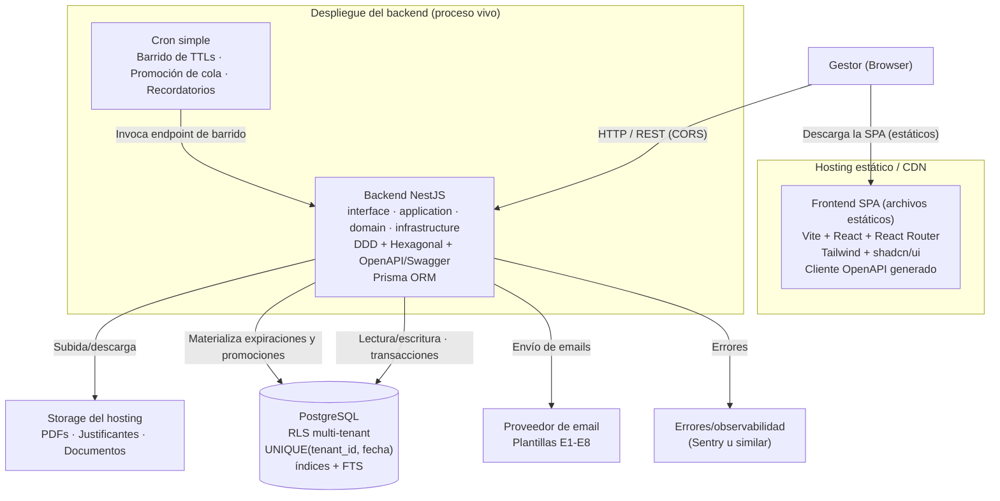
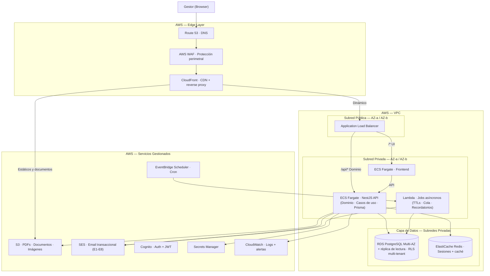

# Arquitectura del Sistema — Slotify

> **Documento**: Diseño de Arquitectura
> **Proyecto**: Slotify — Plataforma SaaS de Gestión Integral para Espacios Boutique de Eventos Privados
> **Fuente**: EspecificacionFuncional.md · er-diagram.md · use-cases.md

---

## 0. Cómo leer este documento

Este documento describe la arquitectura de Slotify en **dos niveles deliberadamente separados**, presentados en orden de prioridad de construcción:

1. **Arquitectura de implementación del MVP (§2)** — el subconjunto pragmático que se construye realmente para el TFM, dado el alcance, el plazo y el modelo de desarrollo. **Es lo que se construye.**
2. **Arquitectura objetivo de producción (§3)** — la arquitectura a la que el producto evolucionaría cuando opere a escala, con múltiples tenants, tráfico real y necesidades de alta disponibilidad. **Es la visión de destino, no se implementa en el MVP.**

Separar ambos niveles es una decisión de arquitectura consciente. Implementar un subconjunto justificado demuestra criterio de priorización; diseñar para la escala futura demuestra visión. Las dos cosas se evalúan, y confundirlas —construir la arquitectura de producción para un piloto de un tenant— sería un error de sobreingeniería que comprometería el plazo sin aportar valor en esta fase.

La §4 contiene los prompts para generar ambos diagramas con DiagramsGPT. La §5 analiza el coste de hosting del MVP. La §6 documenta la trazabilidad de cada decisión de divergencia entre ambos niveles.

---

## 1. Principios arquitectónicos transversales

Estos principios rigen ambos niveles (MVP y objetivo):

1. **La reserva es el agregado raíz (DDD).** Toda la lógica de transición de estado, bloqueo de fecha y cola se modela alrededor de la entidad reserva. *Fuente: EspecificacionFuncional §10.2 #3.*
2. **Multi-tenancy desde el día 1.** `tenant_id` en toda tabla de negocio + aislamiento por Row-Level Security en PostgreSQL. Un tenant = un espacio. *Fuente: §10.2 #1, #2.*
3. **Atomicidad del bloqueo de fecha garantizada por la base de datos.** Restricción `UNIQUE(tenant_id, fecha)` sobre la entidad de bloqueo + transacciones con `SELECT ... FOR UPDATE`. Es el mecanismo central contra la doble reserva (riesgo crítico #1). *Fuente: §10.2 #11, §14.*
4. **Máquina de estados como configuración, no como código disperso.** Las transiciones permitidas y sus guardas se modelan como una estructura de datos consultada por una única función de transición. *Fuente: §10.2 #4.*
5. **Arquitectura hexagonal (puertos y adaptadores) en el backend.** El dominio define puertos (interfaces); la infraestructura provee adaptadores. El dominio nunca depende de frameworks, ORM ni servicios externos directamente.
6. **Eventos de dominio como base de las automatizaciones.** `ReservaConfirmada`, `FechaBloqueada`, `ColaPromovida`, etc. *Fuente: §10.2 #10.*
7. **Configurabilidad por tenant desde el día 1, opinión única en UX.** TTLs, porcentajes, plantillas y políticas viven en configuración por tenant aunque el MVP exponga un solo flujo. *Fuente: §10.3 "opinado por fuera, configurable por dentro".*

---

## 2. Arquitectura de implementación del MVP

> **Estado: ESTO es lo que se construye para el TFM.**

### 2.1 Resumen

El MVP se implementa como un **monolito modular**: el código vive en un **único monorepo** con dos aplicaciones (`apps/web` y `apps/api`), pero se despliega en **dos destinos según la naturaleza de cada pieza**. El frontend SPA (Vite + React) se publica como **archivos estáticos en un hosting de CDN** (la SPA no es un proceso vivo: se descarga y corre en el navegador). El backend de dominio (NestJS) corre como **proceso vivo** en su plataforma, contra una **única base de datos PostgreSQL**. Que el despliegue tenga dos destinos no rompe el carácter "monolítico" de la arquitectura: sigue habiendo un solo backend de dominio y una sola base de datos, que es lo que preserva las transacciones ACID nativas que protegen el bloqueo atómico de fecha. El backend NestJS aplica arquitectura por capas, DDD y hexagonal, y expone su contrato vía **OpenAPI**; la SPA consume ese contrato (pudiendo generar su cliente HTTP type-safe a partir del OpenAPI) mediante llamadas HTTP cross-origin (CORS configurado en el backend). Los procesos asíncronos se implementan con un **cron simple** que invoca un endpoint protegido de barrido. PDFs y justificantes se almacenan en el storage del hosting; el email transaccional usa un proveedor ágil; los secretos viven en variables de entorno cifradas.

### 2.2 Diagrama de implementación del MVP



> **Nota:** ambas cajas de despliegue salen del mismo monorepo (`apps/web` → CDN; `apps/api` → plataforma de backend). El navegador descarga la SPA del CDN y, ya en el cliente, llama a la API de NestJS por HTTP cross-origin.

### 2.3 Stack del MVP

| Capa | Tecnología | Razón |
|---|---|---|
| **Frontend** | Vite + React + React Router + TypeScript | SPA pura servida como estáticos desde un CDN: el producto es interno tras login (sin SEO/SSR necesario) y el backend ya es NestJS, así que no hace falta un framework full-stack. Frontera front/back limpia |
| **CORS** | `enableCors` en NestJS con origen permitido | La SPA (dominio del CDN) y la API (dominio del backend) son orígenes distintos; el backend declara qué origen puede llamarlo |
| **UI** | Tailwind + shadcn/ui | Velocidad de desarrollo, componentes accesibles |
| **Calendario** | react-big-calendar o FullCalendar | Maduros para vistas mensual/semanal con bloqueos |
| **Cliente API** | Generado desde OpenAPI de NestJS | Recupera type-safety y demuestra que el contrato OpenAPI se consume realmente |
| **Backend** | NestJS + TypeScript | Aplica capas + DDD + hexagonal + OpenAPI (objetivos formativos del máster); estructura que exhibe la arquitectura de forma explícita |
| **ORM** | Prisma | Migraciones controladas, DX para IA; `SELECT ... FOR UPDATE` vía `$queryRaw` dentro de transacción para el bloqueo |
| **BBDD** | PostgreSQL (gestionada) | Sostiene bloqueo atómico, RLS multi-tenant y búsqueda full-text del histórico |
| **Auth** | JWT (access en memoria + refresh en cookie httpOnly), NestJS + Passport | Access token de vida corta en memoria; refresh token en cookie httpOnly a salvo de XSS. Tenant y rol en el payload firmado. Ver §2.8 |
| **Jobs** | Cron simple → endpoint de barrido | TTLs como campo `ttl_expiracion` + barrido periódico; robusto e idempotente |
| **Email** | Proveedor ágil (Resend/Postmark) | 8 emails del flujo principal; SPF/DKIM/DMARC desde el día 1 |
| **PDF** | Plantillas HTML + Puppeteer (o react-pdf) | Generación server-side; plantillas editables (presupuestos/facturas borrador) |
| **Storage** | El del hosting (p. ej. Supabase Storage) | Menos integración que un proveedor de objetos aparte |
| **Hosting** | Railway (recomendado) o Render free + Postgres gestionada | Ver análisis de coste en §5 |
| **Observabilidad** | Sentry (errores) | Útil y barato; PostHog y analytics quedan post-TFM |

### 2.4 El núcleo crítico: bloqueo atómico sin coordinación distribuida

Es la decisión técnica más importante del MVP y la que más diverge de la arquitectura objetivo.

**Decisión:** el bloqueo de fecha NO usa locks distribuidos (Redis/Redlock). Usa la garantía nativa de PostgreSQL: una entidad `FECHA_BLOQUEADA` con restricción `UNIQUE(tenant_id, fecha)`, manipulada dentro de transacciones.

**Por qué:** los locks distribuidos sólo son necesarios cuando varios procesos sin transacción común compiten por un recurso. El MVP tiene una única base de datos transaccional, por lo que la atomicidad ya está garantizada por el motor: dos transacciones concurrentes que intenten insertar la misma `(tenant_id, fecha)` resultan en una inserción exitosa y una violación de unicidad determinista, sin ventana de carrera. Introducir Redis añadiría un punto de fallo (incoherencia si el lock se concede pero la transacción falla) para resolver un problema inexistente. *Fuente: EspecificacionFuncional §10.2 #11, riesgo crítico #1; decisión de modelado ERD §FECHA_BLOQUEADA.*

**Encapsulación:** toda mutación de bloqueo pasa por dos funciones transaccionales del dominio — `bloquearFecha()` y `liberarFecha()` — que sincronizan la fila de `FECHA_BLOQUEADA` y el estado de la reserva en la misma transacción. Toda la mecánica de cola (promoción, reordenación, encadenamiento) se construye sobre ellas. Esto centraliza el riesgo crítico en un punto único y testeable.

### 2.5 Procesos asíncronos sin infraestructura serverless

Los TTLs no se implementan con timers que disparan en el instante exacto, sino con el patrón **estado en la fila + barrido periódico**: cada reserva con bloqueo lleva `ttl_expiracion`; un cron invoca cada N minutos un endpoint protegido que barre las filas vencidas, las libera y dispara las promociones de cola. Si el cron se retrasa o cae, no hay pérdida de consistencia: al volver a ejecutarse barre lo pendiente. Es idempotente y trivial de testear (se llama a la función de barrido con una fecha simulada). Sustituye a Lambda + EventBridge sin perder corrección.

> **Nota de hosting:** en plataformas con proceso always-on (p. ej. Railway), el cron es trivial. En tiers gratuitos que duermen el servicio tras inactividad (p. ej. Render free), el barrido necesita un disparador externo que despierte el endpoint. Ver §5.

### 2.6 Organización interna del backend (capas + hexagonal + DDD)

```
apps/
  web/                      Frontend SPA (Vite + React)
  api/                      Backend NestJS
    src/
      <modulo>/             p. ej. reservas/, tarifas/, facturacion/, comunicaciones/
        domain/             Entidades, objetos de valor, eventos de dominio, PUERTOS (interfaces)
        application/        Casos de uso (orquestan el dominio)
        infrastructure/     ADAPTADORES: Prisma, email, PDF, storage
        interface/          Controladores HTTP + documentación OpenAPI
```

- **Regla de dependencia hexagonal:** `domain` no importa nada de `infrastructure` ni de frameworks; depende sólo de sus propios puertos. Los adaptadores de `infrastructure` implementan esos puertos. Esto hace el dominio testeable de forma aislada (TDD).
- **Organización por módulos de dominio** (no por capas técnicas globales), alineada con M1–M12 de la especificación. Un módulo llama a otro sólo a través de su interfaz pública.

### 2.7 Cómo la arquitectura sirve a SDD + TDD asistido por IA

- **Type-safety end-to-end** (TS en front y back + OpenAPI + Prisma): la IA no puede generar código que viole el contrato sin que el compilador lo detecte.
- **Orden TDD impuesto por la arquitectura:** lo primero que se escribe son los tests de concurrencia del núcleo crítico (bloqueo atómico bajo transacciones simultáneas, promoción de cola, encadenamiento, salida de cola concurrente — edge cases #19, #20 de la especificación), antes que UI o CRUD.
- **Máquina de estados declarativa:** las specs SDD se traducen casi 1:1 a la tabla de transiciones y a sus tests.
- **Módulos acotados:** la IA recibe el contexto de un módulo sin necesitar todo el sistema.

### 2.8 Autenticación y modelo de usuarios

**Mecanismo: JWT con patrón access token + refresh token.** Se elige JWT (frente a sesión de servidor con cookie) tanto por encajar con la SPA cross-origin sin depender de cookies de sesión cross-site para las peticiones de API, como por su valor formativo. La seguridad no depende de "ocultar" el token —el payload de un JWT es legible por diseño; lo que lo protege es la firma del servidor— sino de **dónde se guarda cada token y cuánto vive**:

- **Access token** (JWT firmado): vida corta (~15 min). Se guarda **en memoria de la SPA** (estado de la aplicación), nunca en `localStorage` ni `sessionStorage`. Viaja en la cabecera `Authorization: Bearer`. Si un ataque XSS lo robara, solo serviría unos minutos.
- **Refresh token**: vida larga (~7 días). Se guarda en una **cookie httpOnly + Secure + SameSite**, que el JavaScript de la página **no puede leer**, lo que lo protege de XSS. Solo sirve para llamar a `/auth/refresh` y obtener un nuevo access token cuando el anterior caduca.
- **Prohibido:** guardar cualquier token en `localStorage`. Es la causa más común de robo de token por XSS, y no existe ningún "enmascaramiento" que lo mitigue.

**Tenant y rol en el token:** el `tenant_id` y el `rol` del usuario se incluyen en el payload firmado del access token. El backend los lee en cada petición para alimentar el aislamiento multi-tenant (RLS) y la autorización. Al ir firmados, el cliente no puede manipularlos.

**Implementación:** NestJS + Passport con estrategia `local` (login usuario/contraseña) y estrategia `jwt` (validación del access token) + `@nestjs/jwt`. Contraseñas con hash (bcrypt o argon2). Para la primera iteración de TDD puede empezarse solo con el access token y añadir el refresh token cuando el flujo básico pase los tests.

**Modelo de usuarios y los dos niveles de administración.** Conceptualmente, un SaaS multi-tenant tiene dos figuras de administración distintas:

| Nivel | Quién es | Qué hace | Alcance |
|---|---|---|---|
| **Admin de plataforma** | El operador del producto (Slotify como empresa) | Da de alta tenants, gestiona la facturación del SaaS | Cruza todos los tenants |
| **Admin de tenant** | El propietario de un espacio (p. ej. propietario de Masia l'Encís) | Crea y gestiona los usuarios de SU tenant (gestores, operarios), configura su tarifario | Un solo tenant |
| **Gestor / operario** | Personal del espacio | Opera reservas, presupuestos, facturas | Un solo tenant |

**En el MVP estos roles se colapsan:** como solo hay **un usuario por tenant (el gestor)**, no existe la necesidad de que un admin de tenant cree otros usuarios. El gestor único se aprovisiona por **seed/script** al crear el tenant; no se construye UI de gestión de usuarios, invitaciones ni roles múltiples. El campo `rol` permanece en la tabla `USUARIO` (el modelo es multi-tenant desde el día 1), pero en el MVP todos los usuarios reales tienen `rol = gestor`. La creación de usuarios por un admin de tenant y la administración de plataforma quedan **fuera del alcance del MVP** (post-TFM).

---

## 3. Arquitectura objetivo de producción (visión a escala)

> **Estado: visión de destino. NO se implementa en el MVP TFM.** Esta sección documenta a dónde evolucionaría Slotify como producto comercial multi-tenant. Cada componente se justifica por una necesidad que aparece *a escala*, y se anota por qué está sobredimensionado en la fase actual.

### 3.1 Resumen

La arquitectura de producción separa la presentación de la lógica de dominio y se despliega sobre AWS. El frontend y el backend de dominio (NestJS) corren como servicios independientes detrás de un Application Load Balancer; el conjunto se sirve por CloudFront y se protege con AWS WAF. La capa de datos combina RDS PostgreSQL Multi-AZ (con RLS multi-tenant y réplica de lectura para el dashboard) y ElastiCache Redis (sesiones y caché). Los ficheros generados se almacenan en S3; el email transaccional se delega en SES; los procesos asíncronos (TTLs, promoción de cola, recordatorios) se ejecutan con Lambda invocado por EventBridge Scheduler. La autenticación la gestiona Cognito, los secretos viven en Secrets Manager y la observabilidad se centraliza en CloudWatch.

### 3.2 Diagrama objetivo de producción



### 3.3 Justificación de cada componente y nota de sobredimensionamiento en MVP

| Componente | Para qué sirve (a escala) | Por qué sobra en el MVP |
|---|---|---|
| **Route 53** | DNS gestionado, health checks, enrutado geográfico | Cualquier DNS (registrador o plataforma de hosting) basta para un dominio |
| **AWS WAF** | Cortafuegos contra OWASP/DDoS en app pública con tráfico hostil | Un piloto con un usuario interno tras login no tiene esa superficie de ataque |
| **CloudFront** | CDN global para audiencia internacional | La audiencia es un gestor local; el hosting ya trae CDN integrado |
| **Application Load Balancer** | Reparte tráfico entre múltiples servicios e instancias | Sólo necesario porque producción separa frontend y backend en servicios distintos; el MVP no los separa físicamente |
| **2× ECS Fargate** | Escalado horizontal independiente de front y back | Dos despliegues, dos imágenes Docker y comunicación por red que no aportan a un piloto y sí consumen tiempo de operación |
| **ElastiCache Redis** | Caché y sesiones distribuidas entre muchas instancias | Con una sola instancia de backend y una sola BD, no hay estado distribuido que coordinar. **Importante: el bloqueo de fecha NO usa Redis ni locks distribuidos; usa UNIQUE + transacción en PostgreSQL** (ver §2.4) |
| **RDS Multi-AZ + réplica lectura** | Alta disponibilidad con SLA y descarga de lecturas pesadas | Un tenant no genera carga de lectura que justifique réplica; HA con SLA no es requisito de un piloto |
| **Lambda + EventBridge** | Jobs serverless que escalan a cero coste | Configurar Lambda + EventBridge + IAM es más costoso que un cron simple para 4-5 jobs sencillos |
| **Cognito** | Gestión de usuarios y federación para muchos tenants | 2-3 usuarios internos no justifican un servicio de identidad completo |
| **S3** | Almacenamiento de objetos escalable | El concepto (almacenar PDFs/justificantes) sí aplica; la pieza concreta se sustituye por el storage del hosting en MVP |
| **SES** | Email transaccional a gran volumen | El concepto aplica; un proveedor de email más ágil de poner en marcha sirve igual en MVP |
| **Secrets Manager** | Rotación y auditoría de secretos | El principio (no hardcodear) aplica; en MVP se cubre con variables de entorno cifradas del hosting |
| **CloudWatch** | Observabilidad integrada en AWS | El concepto aplica; una herramienta de errores más simple cubre el MVP |

**Conclusión de la sección:** la arquitectura de producción es correcta como destino, pero implementarla para un piloto de un tenant es sobreingeniería. El coste real no es el dinero de AWS, sino el **tiempo de operación de infraestructura** (VPC, subredes, security groups, health checks, IAM, orquestación de contenedores), que el desarrollo asistido por IA **no reduce** — la IA acelera el código de aplicación, no la operación de infraestructura distribuida.

---

## 4. Prompts para DiagramsGPT

Dos prompts independientes, uno por cada arquitectura.

### 4.1 Prompt — Arquitectura objetivo de producción (AWS)

```
Draw an AWS cloud architecture diagram for Slotify, a SaaS B2B web application
for managing private event space reservations (wedding venues, farmhouses, villas).
This is the TARGET PRODUCTION architecture for a multi-tenant product at scale.
Do not add components not listed below.

--- COMPONENTS ---

USER:
- Browser (Gestor / Manager)

EDGE LAYER (AWS):
- Route 53: DNS resolution
- AWS WAF: web application firewall, DDoS and OWASP protection
- CloudFront: CDN and reverse proxy; two origins: ALB for dynamic traffic
  and S3 for static assets and documents

APPLICATION LAYER (inside a VPC):
- Application Load Balancer: in public subnets, spans AZ-a and AZ-b;
  path-based routing: /* to the frontend, /api/* to NestJS
- ECS Fargate running the frontend (SPA / SSR), in private subnets
- ECS Fargate running NestJS API: domain logic, use cases, Prisma ORM,
  in private subnets; not directly accessible from the internet
- AWS Lambda: background async jobs (TTL expiration, waiting queue promotion,
  automated reminders), in private subnets, triggered by EventBridge

DATA LAYER (inside VPC, private subnets):
- Amazon RDS PostgreSQL Multi-AZ with read replica: primary database,
  multi-tenant Row-Level Security
- Amazon ElastiCache Redis: user sessions and cache (NOT used for date locking;
  date locking is handled by a UNIQUE constraint in PostgreSQL)

MANAGED SERVICES (outside VPC):
- Amazon S3: storage for PDFs, signed documents, images
- Amazon SES: transactional email (templates E1-E8 and manual emails)
- Amazon EventBridge Scheduler: cron triggers for Lambda jobs
- Amazon Cognito: user authentication and JWT issuance
- AWS Secrets Manager: database credentials and API keys
- Amazon CloudWatch: centralized logging and alerting

--- CONNECTIONS ---
Browser -> Route 53 -> WAF -> CloudFront
CloudFront -> ALB (dynamic requests)
CloudFront -> S3 (static assets and documents)
ALB -> ECS Fargate frontend (path: /*)
ALB -> ECS Fargate NestJS API (path: /api/*)
Frontend -> NestJS API (internal API calls)
NestJS API -> RDS PostgreSQL (read/write)
NestJS API -> ElastiCache Redis (sessions and cache)
NestJS API -> S3 (file uploads)
NestJS API -> SES (send emails)
NestJS API -> Secrets Manager
NestJS API -> CloudWatch (logging)
EventBridge Scheduler -> Lambda (cron trigger)
Lambda -> RDS PostgreSQL (TTL updates, queue promotion)
Lambda -> SES (automated emails)

--- STYLE ---
Use AWS architecture icons and official AWS color palette.
Group services into clearly labeled layers: Edge Layer, VPC (with public and private
subnets), Data Layer, and Managed Services.
Show the VPC boundary and subnet boundaries clearly.
Top-to-bottom flow direction. Label each connection with a short purpose.
Keep the diagram clean — do not add services not listed above.
```

### 4.2 Prompt — Arquitectura de implementación del MVP (monolito)

```
Draw a simple deployment architecture diagram for the MVP of Slotify, a SaaS B2B
web app for managing private event space reservations. This is a cost-optimized
MVP for a single tenant, developed as a final master's project. It is a MODULAR
MONOLITH whose code lives in ONE monorepo but deploys to TWO targets: the frontend
SPA is served as static files from a CDN, and the backend runs as a single live
process against ONE PostgreSQL database.
Do not add cloud-provider-specific services (no AWS/VPC/load balancers).
Do not add components not listed below.

--- COMPONENTS ---

USER:
- Browser (Gestor / Manager)

STATIC HOSTING / CDN:
- Frontend SPA (static files, NOT a live process): Vite + React + React Router +
  TypeScript, Tailwind + shadcn/ui; consumes an OpenAPI-generated client.
  Built from the apps/web folder of the monorepo

BACKEND DEPLOYMENT (live process, e.g. Railway; built from apps/api of the monorepo):
- Backend process: NestJS API with hexagonal architecture and DDD
  (layers: interface, application, domain, infrastructure), Prisma ORM,
  exposes an OpenAPI/Swagger contract
- Simple cron: periodically calls a protected sweep endpoint on the backend
  (TTL expiration, waiting-queue promotion, reminders)

EXTERNAL MANAGED SERVICES:
- PostgreSQL (managed): single database, multi-tenant Row-Level Security,
  UNIQUE(tenant_id, date) constraint for atomic date locking, full-text search
- Object storage (hosting-provided): PDFs, payment receipts, documents
- Email provider (e.g. Resend): transactional emails (templates E1-E8)
- Error monitoring (e.g. Sentry)

--- CONNECTIONS ---
Browser -> Static hosting/CDN (downloads the SPA static files)
Browser -> Backend (HTTP/REST API calls, cross-origin / CORS)
Backend -> PostgreSQL (read/write, transactions, SELECT FOR UPDATE)
Backend -> Object storage (upload/download files)
Backend -> Email provider (send emails)
Backend -> Error monitoring (report errors)
Cron -> Backend (invokes the protected sweep endpoint)
Backend -> PostgreSQL (materializes TTL expirations and queue promotions)

--- STYLE ---
Clean, minimal, provider-agnostic style (boxes and labeled arrows, no cloud icons).
Put the frontend SPA in its own box labeled "Static hosting / CDN" (it is served as
static files, not a live process). Put the backend process and the cron inside a
separate box labeled "Backend deployment (live process)".
Show external managed services (PostgreSQL, object storage, email, error monitoring)
as separate boxes.
Top-to-bottom flow. Label each connection with a short purpose. Mark the browser->API
call as cross-origin (CORS).
Emphasize that there is a SINGLE PostgreSQL database (the core of atomic date locking),
and that both the SPA and the backend come from the same monorepo but deploy to
different targets.
Keep it simple — this is intentionally a lightweight MVP, not a distributed system.
```

---

## 5. Análisis de coste del hosting del MVP

El MVP tiene tres piezas, pero solo dos cuestan: el **frontend SPA** se sirve como archivos estáticos desde un CDN gratuito (Cloudflare Pages, Netlify o similar) y no es un proceso vivo, así que su coste tiende a cero; lo que se paga son los dos procesos permanentes, el **backend NestJS** y **PostgreSQL gestionada**. Cifras verificadas en mayo de 2026; conviene confirmarlas en las páginas oficiales antes de contratar.

| Escenario | Composición | Coste | Pega / nota |
|---|---|---|---|
| **A — Coste cero** | Frontend estático gratis (Netlify/Cloudflare Pages/Render static) + backend NestJS en Render free + PostgreSQL en Neon o Supabase free | **0 €/mes** | El backend free de Render se duerme tras inactividad (arranque en frío de segundos en la primera petición). El cron necesita un disparador externo que despierte el endpoint |
| **B — Railway integrado (recomendado)** | Todo en Railway plan Hobby: backend + Postgres + cron always-on | **~5 €/mes** (cuota fija de 5 $ con 5 $ de crédito de uso incluidos) | Sin arranques en frío. La base de datos consume parte del crédito; vigilar el dashboard de uso |
| **C — Railway + BD externa** | Railway Hobby para backend + cron; PostgreSQL gratis en Neon o Supabase | **~5 €/mes** | Aparta la BD del crédito de Railway, dejando más cómputo libre para el backend |

**Recomendación:**
- Si el objetivo es **coste literalmente cero** y se tolera el arranque en frío (aceptable para un piloto y una defensa): **Escenario A (0 €/mes)**.
- Si se quiere experiencia **always-on sin arranques en frío** por ~5 €/mes, con el cron de TTLs funcionando de forma trivial (relevante porque los TTLs son parte del núcleo crítico): **Escenario B o C**.

**Consideración sobre el cron y el núcleo crítico:** en el Escenario A, como el servicio gratuito de Render se duerme, el barrido de TTLs depende de un disparador externo. En Railway el proceso está siempre vivo y el cron es trivial. Dado que los TTLs y la promoción de cola son parte del riesgo crítico, Railway simplifica esta pieza.

**Nota sobre Vercel:** Vercel se descartó como hosting porque está optimizado para Next.js y funciones serverless; el stack actual (Vite+React como SPA + NestJS como backend) requiere un proceso persistente para el backend (cron de TTLs), que encaja mal con su modelo. La SPA estática sí podría servirse desde Vercel/Netlify/Cloudflare Pages gratis, pero el backend persistente es lo que dicta la elección de plataforma.

---

## 6. Trazabilidad de decisiones (MVP frente a objetivo)

| # | Decisión MVP | Diverge de objetivo en | Fundamento |
|---|---|---|---|
| 1 | Monolito modular (un despliegue) | 2× Fargate + ALB | Invariantes transaccionales; microservicios romperían la atomicidad del bloqueo |
| 2 | Frontend SPA (Vite + React) | Frontend con SSR/full-stack | Producto interno sin SEO; backend ya es NestJS; frontera limpia |
| 3 | NestJS como backend (se conserva) | — (igual que objetivo) | Aplica capas + DDD + hexagonal + OpenAPI (temario del máster) |
| 4 | PostgreSQL único, sin Redis | RDS Multi-AZ + ElastiCache | Una BD transaccional da la atomicidad; Redis sería punto de fallo innecesario |
| 5 | Cron simple | Lambda + EventBridge | TTLs = fila + barrido periódico; idempotente y testeable |
| 6 | JWT access+refresh con NestJS+Passport; gestor por seed | Cognito + JWT gestionado | 2-3 usuarios internos; en MVP un único gestor por tenant, sin UI de gestión de usuarios |
| 7 | Storage/email/secretos del hosting | S3 / SES / Secrets Manager | Mismos conceptos, menos integración; principios (no hardcodear) se respetan |
| 8 | Sentry | CloudWatch + WAF | Observabilidad de errores suficiente; sin superficie de ataque pública |

**Principio rector de la divergencia:** se conserva del objetivo todo lo que aporta valor formativo o protege un riesgo crítico (NestJS, hexagonal, DDD, OpenAPI, RLS multi-tenant, atomicidad en BD); se aplaza todo lo que sólo aporta a escala (orquestación de contenedores, coordinación distribuida, alta disponibilidad, infraestructura serverless, protección perimetral).

---

## 7. Resumen ejecutivo

- **Dos niveles, en orden de prioridad:** arquitectura de implementación del MVP (monolito monorepo, §2) primero, arquitectura objetivo de producción (AWS, §3) como visión de destino. Separarlas es la decisión arquitectónica de fondo.
- **MVP:** SPA Vite+React (estáticos en CDN) + backend NestJS (hexagonal/DDD/OpenAPI) como proceso vivo + PostgreSQL única. Un monorepo, dos destinos de despliegue.
- **Núcleo crítico:** bloqueo atómico por `UNIQUE(tenant_id, fecha)` + transacción, sin locks distribuidos. Encapsulado en dos funciones; primera prioridad de TDD.
- **Jobs:** cron simple + barrido idempotente, no serverless.
- **Auth:** JWT access (en memoria) + refresh (cookie httpOnly), NestJS+Passport; nunca localStorage. Tenant y rol en el payload firmado. En MVP, un único gestor por tenant aprovisionado por seed; sin UI de gestión de usuarios. Ver §2.8.
- **Hosting:** 0 €/mes (Render free + Neon/Supabase) o ~5 €/mes (Railway always-on). Ver §5.
- **Razón de la divergencia:** la IA acelera el código de aplicación, no la operación de infraestructura. Para el plazo, el monolito libera tiempo hacia las zonas que defienden la nota; AWS lo consumiría en operación.

---

*Documento de arquitectura v3.2, 25/05/2026. Cambios respecto a v3.1: se cierra la autenticación (JWT access+refresh, §2.8) y se documentan los dos niveles de administración (plataforma vs tenant) y su colapso en el MVP a un único gestor. v3.1 separó monorepo de despliegue y adoptó la SPA en CDN aparte (opción 2). v3.0 invirtió el orden y añadió prompts y análisis de coste. v2.0 reclasificó la arquitectura AWS como objetivo de producción.*