# Diagrama Entidad-Relación — Slotify MVP

> **Documento**: Modelo de Datos
> **Proyecto**: Slotify — Plataforma SaaS de Gestión Integral para Espacios Boutique de Eventos Privados
> **Fuente**: Especificación Funcional (EspecificacionFuncional.md) + Casos de Uso (use-cases.md)

---

## 1. Resumen del Dominio

**Slotify** es un sistema de gestión de reservas centrado en la **reserva como entidad única central**. El modelo soporta:

- **Multi-tenancy**: Aislamiento de datos por espacio (un tenant = un espacio).
- **Máquina de estados jerárquica**: La reserva recorre todo el ciclo de vida, desde los sub-estados de consulta (2.a–2.z) hasta los estados de reserva confirmada y sus sub-procesos paralelos.
- **Bloqueo atómico de fechas**: Prevención de dobles reservas mediante una entidad de bloqueo con restricción de unicidad a nivel de base de datos.
- **Cola de espera**: Gestión FIFO de leads para fechas bloqueadas, modelada como campos en la propia reserva.
- **Facturación estructurada**: 40% señal + 60% liquidación + fianza.

### Entidades Principales

| Entidad | Descripción | Casos de Uso Relacionados |
|---------|-------------|---------------------------|
| Tenant | Espacio boutique (masía, finca, villa) | UC-01, UC-02 |
| TenantSettings | Configuración por tenant (TTLs, %, fianza) | Transversal |
| Usuario | Gestor/admin del sistema | UC-01, UC-02 |
| Cliente | Datos fiscales y de contacto del cliente | UC-03, UC-14 |
| Reserva | Entidad central. Recorre consulta (2.a–2.z) → pre_reserva → confirmada → completada | UC-03 a UC-28 |
| FechaBloqueada | Bloqueo atómico de fecha con TTL | UC-30, UC-31 |
| Tarifa | Configuración de precios precalculados | UC-16 |
| TemporadaCalendario | Mapeo mes → temporada | UC-16 |
| Extra | Catálogo de extras del tenant (barbacoa, paellero) | UC-14, UC-16 |
| ReservaExtra | Línea de extra de una reserva, con precio congelado, origen y factura asociada. Primera persistencia real en UC-15 | UC-14, UC-15, UC-21 |
| Presupuesto | Versiones del presupuesto PDF | UC-14, UC-15 |
| Factura | Factura de señal, liquidación, fianza o complementaria | UC-18, UC-21 |
| Pago | Cobro conciliado contra una factura | UC-17, UC-21, UC-22 |
| FichaOperativa | Datos operativos del evento | UC-20, UC-24 |
| Documento | Archivos adjuntos polimórficos | UC-19, UC-24 |
| Comunicacion | Log de emails enviados (E1–E8 + manuales) | UC-35, UC-36 |
| PlantillaDocumentoTenant | Configuración de documento por tenant: branding, identidad fiscal, banca y textos. Base del épico #6 (PDFs) | Épico #6 |
| AuditLog | Registro de auditoría | Transversal |

### Decisiones de Diseño

Estas decisiones cierran las divergencias detectadas entre la especificación funcional, los casos de uso y la primera versión del ERD. Cada una indica su fundamento.

1. **Reserva como entidad única central (no separación consulta/reserva).** La consulta no es una entidad independiente: es una fase de la reserva. La reserva recorre toda la máquina de estados, desde los sub-estados de consulta (2.a–2.z) hasta `reserva_completada`. *Fundamento*: EspecificacionFuncional §13 decisión #1, §3.4, §10.2 decisión #3; el diagrama de estados de use-cases §6 modela una única máquina de estados continua, y UC-14 describe un *cambio de estado* a `pre_reserva`, no la creación de una entidad nueva. Las métricas de conversión (2.a→2.b→3→4) se obtienen del campo `estado`/`sub_estado` sin necesidad de dos tablas.

2. **FechaBloqueada como entidad independiente con `UNIQUE(tenant_id, fecha)`.** El bloqueo de fecha es una entidad propia para garantizar la atomicidad en el motor de base de datos (no en lógica aplicativa) y soportar TTLs y tipos de bloqueo (blando/firme). *Fundamento*: EspecificacionFuncional riesgo crítico #1 (doble reserva) y decisión arquitectónica #11 (`SELECT ... FOR UPDATE`); use-cases UC-30/UC-31 tratan el bloqueo y la liberación como operaciones críticas de primera clase. La restricción de unicidad hace que el test de concurrencia sea determinista: dos transacciones simultáneas sobre la misma fecha resultan en una inserción exitosa y una violación de unicidad.

3. **Cola modelada como campos en la reserva (no como tabla auxiliar).** La cola FIFO se representa con los campos `posicion_cola` y `consulta_bloqueante_id` (auto-referencia) en la propia reserva. *Fundamento*: EspecificacionFuncional §3.4 ("sin tabla auxiliar") y §10.2 decisión #16; use-cases UC-12 opera directamente sobre `posicion_cola` y `consulta_bloqueante_id` como campos.

4. **Sub-procesos paralelos como atributos de Reserva.** Los estados de `pre_evento`, `liquidacion` y `fianza` son atributos ENUM de la reserva, no entidades separadas. *Fundamento*: EspecificacionFuncional §10.2 decisión #12.

5. **Documentos polimórficos.** Una única tabla `DOCUMENTO` con discriminador `tipo` para DNI, cláusulas, condiciones particulares, justificantes de pago y PDFs. Los justificantes de pago se referencian desde `PAGO`. *Fundamento*: use-cases UC-24 y UC-19.

6. **Claves primarias UUID en todas las entidades.** Se sustituye el INT autoincremental por UUID para evitar la enumeración de IDs y la fuga de información de volumen entre tenants. *Fundamento*: EspecificacionFuncional decisiones arquitectónicas #1 y #2 (aislamiento multi-tenant desde el día 1).

7. **Condiciones particulares.** Se modela su estado de firma como campos en la reserva (`cond_part_firmadas`, fechas) y el documento firmado como un registro en `DOCUMENTO` con `tipo = condiciones_particulares`. *Fundamento*: use-cases UC-19 (caso de uso dedicado) y precondición de UC-14.

8. **Gestión de fianza completa.** Incluye cobro, recibo independiente, solicitud de IBAN y devolución (total o parcial). El enum `fianza_status` contempla `devuelta` y `retenida_parcial`. *Fundamento*: EspecificacionFuncional §4.8 (sub-proceso 6b) y edge case #28 (devolución parcial por desperfectos).

9. **Extras desacoplados del presupuesto: catálogo vs línea, con extras tardíos.** `EXTRA` es el catálogo del tenant (precio actual). `RESERVA_EXTRA` es la línea concreta de una reserva, con `precio_unitario` congelado **en el momento de añadir el extra** (no solo al aceptar el presupuesto). Un extra puede añadirse en cualquier punto del ciclo: en el presupuesto inicial (`origen = presupuesto`) o durante la fase pre-evento tras la confirmación (`origen = anadido_post_confirmacion`). El campo `factura_id` (nullable) indica en qué factura se cobró: los extras sin facturar se recogen en la factura de liquidación a T-1d; los pedidos después de emitida la liquidación o durante el evento se barren en una factura `complementaria`. Para extras no presentes en el catálogo (p. ej. un catering negociado), `extra_id` es nullable y se usa `concepto_libre` con precio manual. *Fundamento*: EspecificacionFuncional §4.8 (liquidación "60% + extras"), edge case #9 (factura complementaria por ajustes posteriores) y §7.4 (KPI de upsell). Cubre la casuística de extras solicitados durante la comunicación pre-evento, no contemplada explícitamente en la primera versión del ERD.

10. **Datos fiscales del cliente completos.** El cliente almacena DNI/NIF, dirección, código postal, población y provincia, necesarios para la facturación. *Fundamento*: use-cases UC-14 (precondición de generación de presupuesto).

11. **Configuración de documento por tenant independiente de `Tenant` (decisión A1, épico #6 rebanada 6.1a).** La entidad `PlantillaDocumentoTenant` (tabla `plantilla_documento_tenant`) duplica los datos que los PDFs del tenant necesitan (razón social fiscal, NIF, IBAN, colores, textos legales) en lugar de leer `Tenant.nombre`/`Tenant.nif`/`Tenant.direccion`. Esto permite que los documentos usen datos distintos de los operativos del tenant (p. ej. razón social fiscal "Canoliart, SL" frente al nombre comercial "Masia l'Encís") y evita acoplar el módulo de documentos al modelo operativo. `Tenant` no se modifica. *Fundamento*: decisión A1 aprobada en Gate SDD del change `documentos-config-tenant-storage` (13/07/2026). Matiz central: `razon_social_fiscal` y `nombre_comercial` son campos DISTINTOS en esta tabla.

---

## 2. Diagrama Entidad-Relación

```mermaid
erDiagram
    %% ============================================
    %% NÚCLEO: TENANT, CONFIGURACIÓN Y USUARIOS
    %% ============================================

    TENANT {
        uuid id_tenant PK
        string nombre
        string email_contacto
        string telefono
        string direccion
        string iban
        string nif
        int capacidad_maxima
        boolean activo
        timestamp fecha_creacion
        timestamp fecha_actualizacion
    }

    PLANTILLA_DOCUMENTO_TENANT {
        uuid id_plantilla PK
        uuid tenant_id FK "UNIQUE — relación 1-1 con Tenant"
        string logo_url "nullable; clave/URL del logo en object storage"
        string color_primario "hexadecimal, p. ej. #RRGGBB"
        string color_texto "hexadecimal"
        string razon_social_fiscal "p. ej. Canoliart SL — DISTINTA del nombre_comercial"
        string nombre_comercial "p. ej. Masia l'Encís"
        string nif
        string direccion_fiscal
        string web
        string email
        string iban
        string beneficiario_transferencia
        string concepto_transferencia
        string plantilla_concepto_fiscal "con placeholder {nombreComercial}; nunca contiene lloguer"
        string validesa_texto "p. ej. 10 DIES"
        string pie_legal
        json condiciones "DEFAULT '{}'; estructura: {titulo, secciones:[{titulo,cuerpo}]} — 6.4a"
        timestamp fecha_creacion
        timestamp fecha_actualizacion
    }

    TENANT_SETTINGS {
        uuid id_settings PK
        uuid tenant_id FK
        decimal pct_senal
        decimal fianza_default_eur
        int ttl_consulta_dias
        int ttl_prereserva_dias
        int max_dias_programar_visita
        string idioma
        timestamp fecha_actualizacion
    }

    USUARIO {
        uuid id_usuario PK
        uuid tenant_id FK
        string email UK
        string password_hash
        string nombre
        string apellidos
        enum rol "gestor | admin | operario"
        boolean activo
        timestamp ultimo_acceso
        timestamp fecha_creacion
        timestamp fecha_actualizacion
    }

    %% ============================================
    %% CLIENTES
    %% ============================================

    CLIENTE {
        uuid id_cliente PK
        uuid tenant_id FK
        string nombre
        string apellidos
        string email
        string telefono
        string dni_nif
        string direccion
        string codigo_postal
        string poblacion
        string provincia
        string iban_devolucion
        boolean activo
        timestamp fecha_creacion
        timestamp fecha_actualizacion
    }

    %% ============================================
    %% RESERVA (ENTIDAD CENTRAL ÚNICA)
    %% Recorre consulta (2.a-2.z) -> pre_reserva ->
    %% confirmada -> completada. Incluye campos de
    %% cola, visita, sub-procesos y fianza.
    %% ============================================

    RESERVA {
        uuid id_reserva PK
        uuid tenant_id FK
        uuid cliente_id FK
        string codigo UK "SLO-2026-0001"
        enum estado "consulta | pre_reserva | reserva_confirmada | evento_en_curso | post_evento | reserva_completada | reserva_cancelada"
        enum sub_estado "2a | 2b | 2c | 2d | 2v | 2x | 2y | 2z"
        enum canal_entrada "web | email | whatsapp | instagram | telefono"
        date fecha_evento
        enum duracion_horas "4 | 8 | 12"
        enum tipo_evento "boda | corporativo | privado | otro"
        int num_adultos_ninos_mayores4
        int num_ninos_menores4
        int num_invitados_final
        decimal importe_total
        decimal importe_senal
        decimal importe_liquidacion
        timestamp ttl_expiracion
        enum pre_evento_status "pendiente | en_curso | cerrado"
        enum liquidacion_status "pendiente | facturada | cobrada"
        enum fianza_status "pendiente | recibo_enviado | cobrada | devuelta | retenida_parcial"
        int posicion_cola "nullable, solo en 2.d"
        uuid consulta_bloqueante_id FK "nullable, auto-ref"
        date visita_programada_fecha
        time visita_programada_hora
        boolean visita_realizada
        decimal fianza_eur
        timestamp fianza_cobrada_fecha
        timestamp fianza_devuelta_fecha
        decimal fianza_devuelta_eur
        text motivo_retencion "nullable — motivo retención parcial/total (US-036)"
        timestamp fecha_post_evento "nullable — momento de entrada a post_evento; usado por barrido T+7d (US-037)"
        boolean cond_part_firmadas
        timestamp cond_part_enviadas_fecha
        timestamp cond_part_firmadas_fecha
        string idioma "DEFAULT 'es'; 'es' | 'ca' — idioma de comunicación con el cliente (US-047)"
        string horario "nullable — hora de inicio HH:MM (US-047)"
        text notas
        text comentarios "nullable — comentario libre del cliente al crear la consulta; decide el flujo E1; persiste en la reserva y se expone en ReservaDetalle"
        boolean activo
        timestamp fecha_creacion
        timestamp fecha_actualizacion
    }

    %% ============================================
    %% BLOQUEO ATÓMICO DE FECHAS
    %% UNIQUE(tenant_id, fecha) garantiza no-doble-reserva
    %% ============================================

    FECHA_BLOQUEADA {
        uuid id_bloqueo PK
        uuid tenant_id FK
        date fecha "UNIQUE(tenant_id, fecha)"
        uuid reserva_id FK "UNIQUE — 1:1 reserva-bloqueo"
        enum tipo_bloqueo "blando | firme"
        timestamp ttl_expiracion "NULL si firme; NOT NULL si blando (chk constraints)"
        timestamp fecha_creacion
    }

    %% ============================================
    %% TARIFAS Y EXTRAS
    %% ============================================

    TARIFA {
        uuid id_tarifa PK
        uuid tenant_id FK
        enum temporada "alta | media | baja"
        int duracion_horas
        int invitados_min
        int invitados_max
        decimal precio_total_eur
        date vigente_desde
        date vigente_hasta
        boolean activo
        timestamp fecha_creacion
        timestamp fecha_actualizacion
    }

    TEMPORADA_CALENDARIO {
        uuid id_temporada_cal PK
        uuid tenant_id FK
        enum temporada "alta | media | baja"
        int mes "1-12"
    }

    EXTRA {
        uuid id_extra PK
        uuid tenant_id FK
        string nombre
        string descripcion
        decimal precio_eur
        boolean activo
        timestamp fecha_creacion
        timestamp fecha_actualizacion
    }

    RESERVA_EXTRA {
        uuid id_reserva_extra PK
        uuid reserva_id FK
        uuid extra_id FK "nullable, null si extra fuera de catálogo"
        uuid factura_id FK "nullable, factura donde se cobra"
        string concepto_libre "para extras fuera de catálogo"
        enum origen "presupuesto | anadido_post_confirmacion"
        int cantidad
        decimal precio_unitario "congelado al añadir"
        decimal subtotal
        timestamp fecha_creacion
    }

    %% ============================================
    %% PRESUPUESTOS
    %% ============================================

    PRESUPUESTO {
        uuid id_presupuesto PK
        uuid reserva_id FK
        uuid tenant_id FK "añadido en 6.1b; backfill desde RESERVA; RLS-por-join sigue siendo el aislamiento"
        string numero_presupuesto "nullable — formato AAAANNN (p. ej. 2026001); unicidad por tenant+régimen+número (6.2)"
        enum metodo_pago "transferencia | efectivo — nullable; backfill transferencia en 6.2"
        enum regimen_iva "con_iva | sin_iva — nullable; backfill con_iva en 6.2; derivado de metodo_pago"
        int version "UNIQUE(reserva_id, version)"
        decimal base_imponible
        decimal iva_porcentaje
        decimal iva_importe
        decimal total
        decimal descuento_eur "nullable"
        string descuento_motivo "nullable"
        boolean tarifa_congelada "DEFAULT true"
        string pdf_url "nullable, URL del PDF generado post-commit por react-pdf (6.1b) o pendiente"
        enum estado "borrador | enviado | aceptado | rechazado"
        timestamp fecha_envio "nullable, solo cuando estado=enviado"
        timestamp fecha_creacion
        timestamp fecha_actualizacion
    }

    %% ============================================
    %% FACTURAS Y PAGOS
    %% ============================================

    FACTURA {
        uuid id_factura PK
        uuid tenant_id FK
        uuid reserva_id FK
        string numero_factura "nullable — UNIQUE(tenantId,numeroFactura) donde NOT NULL — F-YYYY-NNNN; NULL en borradores (US-027)"
        enum tipo "senal | liquidacion | fianza | complementaria"
        decimal base_imponible "round(total/1.21,2)"
        decimal iva_porcentaje "21.00 en MVP"
        decimal iva_importe "total − base_imponible"
        decimal total
        string concepto "nullable"
        string pdf_url "nullable — generado post-commit"
        enum estado "borrador | enviada | cobrada"
        timestamp fecha_emision "nullable — fijada al aprobar borrador"
        timestamp fecha_creacion
        timestamp fecha_actualizacion
        string uk_reserva_tipo "@@unique([reservaId, tipo]) — máx. 1 por tipo y reserva"
    }

    PAGO {
        uuid id_pago PK
        uuid tenant_id FK "US-029 D-1: multi-tenancy/RLS directo"
        uuid factura_id FK "FACTURA 1-N PAGO — sin UNIQUE(factura_id)"
        decimal importe "DECIMAL(10,2) — importe real cobrado"
        date fecha_cobro "liquidación: ≤ hoy; fianza (US-030): ≤ fecha_evento"
        uuid justificante_doc_id FK "nullable → DOCUMENTO(tipo=justificante_pago)"
        timestamp fecha_creacion
    }

    %% ============================================
    %% FICHA OPERATIVA
    %% ============================================

    FICHA_OPERATIVA {
        uuid id_ficha PK
        uuid reserva_id FK "UK - relacion 1:1"
        int num_invitados_confirmado
        text menu_seleccionado
        text timing_detallado
        string contacto_evento_nombre
        string contacto_evento_telefono
        text notas_operativas
        text briefing_equipo
        boolean ficha_cerrada
        timestamp fecha_cierre
        timestamp fecha_creacion
        timestamp fecha_actualizacion
    }

    %% ============================================
    %% DOCUMENTOS POLIMÓRFICOS
    %% ============================================

    DOCUMENTO {
        uuid id_documento PK
        uuid tenant_id FK
        uuid reserva_id FK "nullable"
        enum tipo "dni_anverso | dni_reverso | clausula_responsabilidad | condiciones_particulares | justificante_pago | presupuesto | factura | otro"
        string nombre_archivo
        string url
        string mime_type
        int tamano_bytes
        timestamp fecha_creacion
    }

    %% ============================================
    %% COMUNICACIONES
    %% ============================================

    COMUNICACION {
        uuid id_comunicacion PK
        uuid tenant_id FK
        uuid reserva_id FK "nullable — solo NULL en emails manual creados fuera del contexto de una RESERVA; en US-046 los manual desde la ficha llevan reserva_id NOT NULL"
        uuid cliente_id FK
        enum codigo_email "E1 | E2 | E3 | E4 | E5 | E6 | E7 | E8 | manual"
        enum subtipo "consulta_exploratoria | fecha_disponible | fecha_confirmada | cola_espera | cambio_fecha | NULL — nullable; NULL para E2-E8, manual y filas legadas"
        string asunto
        text cuerpo
        string destinatario_email
        enum estado "borrador | enviado | fallido"
        timestamp fecha_envio
        boolean es_reenvio "DEFAULT false — US-028 D-4: reenvíos explícitos del Gestor quedan fuera del índice de idempotencia parcial. Los emails manual creados desde la ficha (US-046) llevan es_reenvio = false (semántica honesta: no son reenvíos)"
        timestamp fecha_creacion
    }

    %% ============================================
    %% AUDIT LOG
    %% ============================================

    AUDIT_LOG {
        uuid id_audit PK
        uuid tenant_id FK
        uuid usuario_id FK
        string entidad
        uuid entidad_id
        enum accion "crear | actualizar | eliminar | transicion | login | logout"
        json datos_anteriores
        json datos_nuevos
        string ip_address
        string user_agent
        timestamp fecha_creacion
    }

    %% ============================================
    %% RELACIONES
    %% ============================================

    TENANT ||--|| PLANTILLA_DOCUMENTO_TENANT : "configura documentos"
    TENANT ||--|| TENANT_SETTINGS : "configura"
    TENANT ||--o{ USUARIO : "tiene"
    TENANT ||--o{ CLIENTE : "posee"
    TENANT ||--o{ RESERVA : "posee"
    TENANT ||--o{ FECHA_BLOQUEADA : "gestiona"
    TENANT ||--o{ TARIFA : "configura"
    TENANT ||--o{ TEMPORADA_CALENDARIO : "configura"
    TENANT ||--o{ EXTRA : "ofrece"
    TENANT ||--o{ FACTURA : "emite"
    TENANT ||--o{ PAGO : "registra"
    TENANT ||--o{ DOCUMENTO : "almacena"
    TENANT ||--o{ COMUNICACION : "registra"
    TENANT ||--o{ AUDIT_LOG : "registra"

    CLIENTE ||--o{ RESERVA : "asociado a"
    CLIENTE ||--o{ COMUNICACION : "recibe"

    RESERVA ||--o{ RESERVA : "bloquea en cola"
    RESERVA ||--o| FECHA_BLOQUEADA : "ocupa"
    RESERVA ||--o{ PRESUPUESTO : "genera"
    RESERVA ||--o{ RESERVA_EXTRA : "incluye"
    RESERVA ||--o{ FACTURA : "emite"
    RESERVA ||--o| FICHA_OPERATIVA : "detalla"
    RESERVA ||--o{ DOCUMENTO : "adjunta"
    RESERVA ||--o{ COMUNICACION : "genera"

    EXTRA ||--o{ RESERVA_EXTRA : "se añade a"
    FACTURA ||--o{ RESERVA_EXTRA : "factura"
    FACTURA ||--o{ PAGO : "concilia"
    DOCUMENTO ||--o| PAGO : "justifica"
    USUARIO ||--o{ AUDIT_LOG : "ejecuta"
```

---

## 3. Diccionario de Datos

### 3.1 TENANT
Espacio boutique de eventos (masía, finca, villa). Entidad raíz del multi-tenancy. Un tenant = un espacio.

| Atributo | Tipo | Descripción |
|----------|------|-------------|
| id_tenant | UUID PK | Identificador único |
| nombre | VARCHAR(100) | Nombre del espacio (ej: "Masia l'Encís") |
| email_contacto | VARCHAR(255) | Email de contacto principal |
| telefono | VARCHAR(20) | Teléfono de contacto |
| direccion | VARCHAR(255) | Dirección física |
| iban | VARCHAR(34) | IBAN para cobros |
| nif | VARCHAR(15) | NIF/CIF del tenant |
| capacidad_maxima | INT | Aforo máximo del espacio |

### 3.2 TENANT_SETTINGS
Configuración por tenant. Aísla los valores ajustables ("opinado por fuera, configurable por dentro").

| Atributo | Tipo | Descripción |
|----------|------|-------------|
| id_settings | UUID PK | Identificador único |
| tenant_id | UUID FK | Tenant propietario (1:1) |
| pct_senal | DECIMAL(4,2) | Porcentaje de señal (40,00 en MVP) |
| fianza_default_eur | DECIMAL(10,2) | Importe por defecto de fianza |
| ttl_consulta_dias | INT | TTL de bloqueo blando de consulta (3) |
| ttl_prereserva_dias | INT | TTL de bloqueo de pre-reserva (7) |
| max_dias_programar_visita | INT | Máximo días desde solicitud para visita (7) |

### 3.3 PLANTILLA_DOCUMENTO_TENANT
Configuración de documento por tenant. Relación 1-1 con `Tenant` (`tenant_id UNIQUE` + FK). Fuente de verdad de los datos que los PDFs del tenant necesitan (épico #6, rebanada 6.1a). RLS habilitada con la misma policy `tenant_isolation` del resto de tablas de negocio.

**Matiz central:** `razon_social_fiscal` (p. ej. "Canoliart, SL") y `nombre_comercial` (p. ej. "Masia l'Encís") son campos DISTINTOS. El nombre comercial es la marca visible; la razón social fiscal es la que aparece en los documentos legales/facturas.

**Decisión A1 (duplicación):** esta tabla es la fuente de verdad para los documentos del tenant. No referencia `Tenant.nombre`, `Tenant.nif` ni `Tenant.direccion`; los datos fiscales se duplican aquí para desacoplar el módulo de documentos del modelo operativo y permitir que difieran cuando sea necesario. `Tenant` no se modifica.

Los campos se agrupan en cuatro bloques:

**Bloque branding:**

| Atributo | Tipo | Descripción |
|----------|------|-------------|
| id_plantilla | UUID PK | Identificador único |
| tenant_id | UUID FK UNIQUE | Tenant propietario (garantía 1-1 en BD) |
| logo_url | TEXT nullable | URL pública del logo en el almacén. Poblado por el seed desde la rebanada 6.5 (`logos/{tenantId}.jpg`); null si no se ha subido |
| color_primario | TEXT | Color primario del tenant en hexadecimal (`#RRGGBB`). Valor del piloto: `#5edada` (turquesa, actualizado en 6.5) |
| color_texto | TEXT | Color de texto en hexadecimal |

**Bloque identidad fiscal:**

| Atributo | Tipo | Descripción |
|----------|------|-------------|
| razon_social_fiscal | TEXT | Razón social fiscal del emisor (p. ej. "Canoliart, SL"). DISTINTA del nombre comercial |
| nombre_comercial | TEXT | Nombre de marca del espacio (p. ej. "Masia l'Encís") |
| nif | TEXT | NIF/CIF del emisor (p. ej. "B10874287") |
| direccion_fiscal | TEXT | Dirección fiscal completa (admite `\n` para múltiples líneas) |
| web | TEXT | URL del sitio web |
| email | TEXT | Email de contacto del espacio |

**Bloque banca:**

| Atributo | Tipo | Descripción |
|----------|------|-------------|
| iban | TEXT | IBAN de la cuenta para transferencias (p. ej. "ES30 0182…") |
| beneficiario_transferencia | TEXT | Nombre del beneficiario en la transferencia |
| concepto_transferencia | TEXT | Concepto fijo de la transferencia. Regla dura del épico: expresa "espai" y NUNCA contiene "lloguer" |

**Bloque textos:**

| Atributo | Tipo | Descripción |
|----------|------|-------------|
| plantilla_concepto_fiscal | TEXT | Plantilla del concepto fiscal con placeholder `{nombreComercial}`. Misma regla dura: "espai", nunca "lloguer" |
| validesa_texto | TEXT | Texto de validez del documento (p. ej. "10 DIES") |
| pie_legal | TEXT | Texto del pie legal del documento |

**Bloque condiciones particulars (6.4a):**

| Atributo | Tipo | Descripción |
|----------|------|-------------|
| condiciones | JSON `@default("{}")` | Contenido del documento de condicions particulars. Estructura: `{ titulo: string; secciones: Array<{ titulo: string; cuerpo: string }> }`. El campo vale `{}` mientras el tenant no tenga secciones configuradas; en ese caso el adaptador PDF degrada a `null` (no genera PDF). Migración aditiva: `20260714130000_documento_condiciones_particulares`. RLS: protegido por la misma policy `tenant_isolation`. |

### 3.4 USUARIO
Gestores, administradores y operarios del sistema.

| Atributo | Tipo | Descripción |
|----------|------|-------------|
| id_usuario | UUID PK | Identificador único |
| tenant_id | UUID FK | Tenant al que pertenece |
| email | VARCHAR(255) UK | Email de acceso (único) |
| password_hash | VARCHAR(255) | Hash de contraseña |
| rol | ENUM | gestor, admin, operario |

### 3.5 CLIENTE
Datos de contacto y fiscales del cliente. Es un atributo de la reserva, no un punto de entrada de navegación.

| Atributo | Tipo | Descripción |
|----------|------|-------------|
| id_cliente | UUID PK | Identificador único |
| tenant_id | UUID FK | Tenant al que pertenece |
| nombre, apellidos | VARCHAR | Datos personales |
| email | VARCHAR(255) | Email de contacto |
| telefono | VARCHAR(20) | Teléfono de contacto |
| dni_nif | VARCHAR(15) | Documento de identidad (facturación) |
| direccion, codigo_postal, poblacion, provincia | VARCHAR | Datos fiscales |
| iban_devolucion | VARCHAR(34) | IBAN de devolución de fianza registrado por el gestor (US-035). Validado con checksum módulo 97 antes de toda escritura. Nullable hasta que el gestor lo registre en `post_evento` con `fianza_eur > 0`. |

**Registro del IBAN de devolución (US-035 / UC-26 FA-01 / UC-27 pasos 1–3 — sin migración):** el campo ya existía en el schema Prisma (`ibanDevolucion String? @map("iban_devolucion")`). Su escritura se realiza vía `PATCH /reservas/{id}/iban-devolucion` (body `{ iban }`, respuesta `200 { iban, avisoEmail }` / `409 estado_no_post_evento|sin_fianza` / `422`), disponible solo cuando `RESERVA.estado = post_evento` AND `RESERVA.fianza_eur > 0`. Ver `data-model.md §3.4` para el flujo completo (validación, transacción, patrón guardar-luego-enviar, excepción auditada D-3A a la idempotencia de E8).

**Lectura en el pipeline (US-049 / UC-37-38 — sin migración):** el endpoint `GET /reservas` (`operationId: listarReservas`) hace join a `CLIENTE` para derivar `nombreEvento = {nombre} {apellidos}`. Si el `cliente_id` de la RESERVA no resuelve a un CLIENTE (nulo o inexistente), `nombreEvento` usa el `codigo` de la RESERVA como fallback. La lectura es de solo dos campos (`nombre`, `apellidos`); no se leen datos fiscales ni de contacto en esta operación.

**Lectura en el histórico (US-042 / UC-32 — migración aditiva `20260717140000_us042_historico_fts_gin`):** el endpoint `GET /historico` hace join a `CLIENTE` para proyectar `clienteNombre` y `clienteApellidos` en el schema `ReservaHistorico`. Además, el índice GIN funcional `idx_cliente_fts_historico` (ver §4.1) permite búsqueda full-text por `nombre`, `apellidos` y `email` cuando el gestor usa el parámetro `q`. Los datos fiscales y de contacto completos solo se leen en operaciones de detalle (`GET /reservas/{id}`), nunca en el listado del histórico.

### 3.6 RESERVA
Entidad central única. Recorre toda la máquina de estados, desde los sub-estados de consulta hasta el archivo. Incluye los campos de cola, visita, sub-procesos paralelos y fianza.

| Atributo | Tipo | Descripción |
|----------|------|-------------|
| id_reserva | UUID PK | Identificador único |
| codigo | VARCHAR(20) UK | Código único (`YY-NNNN`, p. ej. `26-0001`). Generado con retry-on-conflict (P2002 → 409 si se agotan los reintentos). Ver `data-model.md §3.5`. |
| cliente_id | UUID FK | Cliente asociado |
| estado | ENUM | consulta, pre_reserva, reserva_confirmada, evento_en_curso, post_evento, reserva_completada, reserva_cancelada |
| sub_estado | ENUM | 2a, 2b, 2c, 2d, 2v, 2x, 2y, 2z (válido cuando estado = consulta) |
| canal_entrada | ENUM | web, email, whatsapp, instagram, telefono |
| fecha_evento | DATE | Fecha del evento. **> hoy** (estrictamente futura) cuando se proporciona; opcional en `2.a` (sin fecha = sin bloqueo). **Divergencia intencional US-004 (Gate 1, decisión A):** la ficha US-004 admitía `≥ hoy`; implementado `> hoy` para unificar la regla con `validarFechaFutura` (US-040) y el motor UC-16. Ver §5.3. |
| duracion_horas | ENUM | 4, 8 o 12 |
| tipo_evento | ENUM | boda, corporativo, privado, otro |
| num_adultos_ninos_mayores4 | INT | Cuenta para tarifa |
| num_ninos_menores4 | INT | Informativo, no afecta tarifa |
| num_invitados_final | INT | Nº final confirmado |
| importe_total | DECIMAL(10,2) | Total del presupuesto aceptado |
| importe_senal | DECIMAL(10,2) | 40% de señal |
| importe_liquidacion | DECIMAL(10,2) | 60% de liquidación |
| ttl_expiracion | TIMESTAMP | Expiración del bloqueo blando vigente |
| pre_evento_status | ENUM | pendiente, en_curso, cerrado |
| liquidacion_status | ENUM | pendiente, facturada, cobrada |
| fianza_status | ENUM | pendiente, recibo_enviado, cobrada, devuelta, retenida_parcial |
| posicion_cola | INT | Posición FIFO. No nulo solo en sub-estado 2.d |
| consulta_bloqueante_id | UUID FK | Auto-referencia a la reserva que bloquea la fecha |
| visita_programada_fecha | DATE | Fecha de visita (sub-estado 2.v). Nulo hasta programar visita |
| visita_programada_hora | TIME | Hora de visita en formato `HH:mm` (sub-estado 2.v). Nulo hasta programar visita |
| visita_realizada | BOOLEAN | `false` hasta que el gestor registre el resultado (US-009/010/011); nunca cambia en la transición a `2.v` |
| fianza_eur | DECIMAL(10,2) | Importe de fianza cobrada |
| fianza_cobrada_fecha | TIMESTAMP | Fecha de cobro de fianza |
| fianza_devuelta_fecha | TIMESTAMP | Fecha de devolución de fianza. Persiste la fecha registrada por el gestor en US-036 |
| fianza_devuelta_eur | DECIMAL(10,2) | Importe devuelto (parcial por desperfectos). En devolución completa coincide con `fianza_eur`; en parcial o retención total puede ser menor (incluyendo 0) |
| motivo_retencion | TEXT | Motivo de la retención parcial o total de la fianza. Obligatorio cuando `fianza_devuelta_eur < fianza_eur` o cuando es 0. `NULL` en devolución completa. Añadido en US-036 (migración `20260710120000_us036_reserva_motivo_retencion`). |
| fecha_post_evento | TIMESTAMPTZ | Timestamp del momento exacto de entrada al estado `post_evento`. Poblado por US-034 en la transición `evento_en_curso → post_evento`. Inmutable. Usado por el barrido US-037 para calcular T+7d de forma fiable (inmune a `@updatedAt`). Nullable en RESERVA previas a la migración `20260710130000_us037_reserva_fecha_post_evento`. |
| cond_part_firmadas | BOOLEAN | Si las condiciones particulares están firmadas. `false` al enviar E3 (US-023); `true` al registrar la copia firmada (US-024). Expuesto en el wire como `condPartFirmadas`. |
| cond_part_enviadas_fecha | TIMESTAMP | Fecha en que se envió E3 al cliente (US-023). Nulo hasta ese momento. Precondición requerida por US-024: si es nulo, el registro de firma se rechaza con 409. |
| cond_part_firmadas_fecha | TIMESTAMP | Fecha de registro de la copia firmada (US-024). Nulo hasta que el Gestor sube la copia firmada. Se actualiza en cada re-firma. Expuesto en el wire como `condPartFechaFirma` (el nombre de columna Prisma es `cond_part_firmadas_fecha`). |
| idioma | VARCHAR | Idioma de comunicación con el cliente. Valores permitidos: `es` (castellano) y `ca` (catalán). `DEFAULT 'es'`. Determina la plantilla de email E1 y el dossier PDF adjunto (`Dossier-Masia-Encis-{idioma}.pdf`). Añadido en US-047 (migración `20260717150000_add_idioma_horario_to_reserva`). |
| horario | VARCHAR | Hora de inicio prevista del evento en formato `HH:MM` (p. ej. `"10:00"`). Nullable. Solo válido junto a `duracion_horas`. Añadido en US-047 (migración `20260717150000_add_idioma_horario_to_reserva`). **Expuesto en el wire en US-051**: aparece en el schema de respuesta `Reserva` (nullable) y es editable vía `PATCH /reservas/{id}` (`UpdateReservaRequest.horario`). Condición de validación de la API: `horario` solo es aceptado si `duracionHoras` está presente en la RESERVA o en el mismo PATCH; en caso contrario la API responde 422. Es campo de completitud obligatorio para habilitar "Generar presupuesto" desde la ficha (junto a `fechaEvento`, `numAdultosNinosMayores4` y `duracionHoras`) — see UC-14. |
| comentarios | TEXT | Comentario libre del cliente o gestor introducido en el alta de la consulta. Nullable. Distinto de `notas` (anotaciones internas editables del gestor): `comentarios` es inmutable tras el alta y se persiste en la reserva. Su **presencia** decide el flujo de E1 (sin comentarios → auto-envío; con comentarios → borrador para revisión manual). **Expuesto en el wire** vía `GET /reservas/{id}` (`ReservaDetalle.comentarios`). Añadido en el change `mejoras-detalle-consulta` (migración aditiva). Al crearse la `FICHA_OPERATIVA` en la confirmación de señal (US-021), si `comentarios` tiene contenido se **siembra** en `FICHA_OPERATIVA.notas_operativas` dentro de la misma transacción, de forma idempotente. |

**Lectura en el pipeline (US-049 / UC-37-38 — sin migración; US-047 aditivo):** el endpoint `GET /reservas` (`operationId: listarReservas`) lee `RESERVA` con join a `CLIENTE` y proyecta campos derivados opcionales (cambios aditivos al schema `Reserva` del contrato; no rompen `ReservaDetalle`, `FichaConsulta` ni otros consumidores):
- `nombreEvento` — derivado de `CLIENTE.nombre + apellidos`; fallback a `RESERVA.codigo`.
- `progressLogistica` — entero 0/50/100 derivado de `pre_evento_status`: `pendiente=0`, `en_curso=50`, `cerrado=100`. Vale `0` para estados de consulta y `pre_reserva`.
- `progressLiquidacion` — entero 0/50/100 derivado de `liquidacion_status`: `pendiente=0`, `facturada=50`, `cobrada=100`. Vale `0` para estados de consulta y `pre_reserva`.
- `tieneBorradorE1Pendiente` — booleano derivado (US-047): `true` cuando existe al menos una `COMUNICACION` de la reserva con `codigo_email = 'E1'` y `estado = 'borrador'`. Calculado en cada fetch; se vuelve `false` automáticamente al enviar o descartar el borrador. No se almacena en `RESERVA`; es una proyección calculada en el adaptador de pipeline sin columna adicional ni migración.

La derivación se implementa como función pura de dominio (mapa declarativo, no condicionales dispersos). El filtro de exclusión de terminales (`2x`, `2y`, `2z`, `reserva_completada`, `reserva_cancelada`) y el filtro por `tenant_id` (reforzado por RLS) se aplican siempre en el adaptador Prisma. Sin migración: `pre_evento_status` y `liquidacion_status` existen en el schema desde US-000/US-021.

**Lectura en el histórico (US-042 / UC-32 — migración aditiva `20260717140000_us042_historico_fts_gin`):** el endpoint `GET /historico` (`operationId: listarHistorico`) lee RESERVA con join a CLIENTE proyectando el subconjunto ligero `ReservaHistorico` (idReserva, codigo, clienteId, clienteNombre, clienteApellidos, estado, fechaEvento, tipoEvento, importeTotal). Filtra exclusivamente por `estado ∈ {reserva_completada, reserva_cancelada}`; nunca estados activos ni terminales de consulta (`2x`/`2y`/`2z`). La búsqueda full-text (`q`) se apoya en dos índices GIN funcionales (ver §5.x): `idx_reserva_fts_historico` sobre `codigo` y `notas` de RESERVA; `idx_cliente_fts_historico` sobre `nombre`, `apellidos` y `email` de CLIENTE con normalización de separadores. El schema `ReservaHistorico` es propio de este endpoint y no reutiliza el schema `Reserva` del pipeline; el detalle completo sigue exponiéndose vía `GET /reservas/{id}` (`ReservaDetalle`). Sin columnas nuevas en RESERVA ni en CLIENTE; la única mutación de esquema son los dos índices GIN.

**Estados y sub-estados de consulta:**
- `2a`: Consulta exploratoria (sin fecha, sin bloqueo)
- `2b`: Consulta con fecha (bloqueo blando 3 días)
- `2c`: Pendiente de invitados (bloqueo extendido +3 días)
- `2d`: En cola de espera (apunta a la reserva bloqueante)
- `2v`: Visita programada (bloqueo hasta día post-visita)
- `2x`: Expirada (terminal)
- `2y`: Descartada por cola (terminal)
- `2z`: Descartada por cliente (terminal)

**Nota de persistencia — mapeo Prisma (US-003):** el enum Prisma `SubEstadoConsulta` no declara `@map`; los literales almacenados en BD llevan el prefijo `s` (`s2a`… `s2z`) porque los identificadores TypeScript no pueden empezar por dígito. El valor de dominio es siempre `'2a'`; la traducción a `'s2a'` (y su inversa) la realiza el helper `sub-estado-consulta.mapper.ts` en la capa infrastructure. Es un detalle de persistencia, no un cambio de modelo ni una migración.

**Registro de la devolución de fianza (US-036 / UC-27 pasos 4–8 — migración `20260710120000_us036_reserva_motivo_retencion`):** disponible cuando `estado = post_evento` AND `fianza_status = cobrada`. Transiciona `fianza_status` a `devuelta` (devolución completa) o `retenida_parcial` (parcial o retención total). Persiste `fianza_devuelta_fecha`, `fianza_devuelta_eur` y `motivo_retencion` (obligatorio si `fianza_devuelta_eur < fianza_eur` o `= 0`). Guarda de concurrencia `SELECT … FOR UPDATE` sobre RESERVA; operación irreversible. Ver `data-model.md §3.5` para el flujo completo (codes de error, DOCUMENTO opcional, AUDIT_LOG).

**Transición {2a,2b,2c} → 2.v (US-008 / UC-07 — sin migración):** el Gestor programa una visita sobre una RESERVA existente en `sub_estado ∈ {'2a','2b','2c'}`. La guarda de origen declarativa (`ORIGENES_TRANSICION_PROGRAMAR_VISITA` en `maquina-estados.ts`) rechaza `2d` con mensaje UC-12 y los terminales con 422. Para `2a` exige `fecha_evento IS NOT NULL`. La validación previa exige `fecha_visita ∈ [hoy+1, hoy+TENANT_SETTINGS.max_dias_programar_visita]` (nunca hardcodeado). En una única transacción all-or-nothing serializada por `SELECT … FOR UPDATE` sobre la fila bloqueante: UPDATE de RESERVA (`sub_estado='2v'`, `visita_programada_fecha`, `visita_programada_hora`, `visita_realizada=false`) + INSERT-o-UPDATE de `FECHA_BLOQUEADA` (ver §3.6 nota US-008) + `AUDIT_LOG accion='transicion'`. Post-commit: E6 vía motor US-045 → `COMUNICACION`. Sin migración (campos de visita + enum `s2v` + `max_dias_programar_visita` ya existentes desde US-000). Fuente: `design.md §D-1..D-9`.

**Transición 2.v → 2.b "cliente interesado" (US-009 / UC-08 — sin migración):** el Gestor registra que la visita concluyó con interés confirmado del cliente. La guarda de origen declarativa (`esOrigenValidoParaResultadoVisitaInteresado` en `maquina-estados.ts`) exige `sub_estado = '2v'`; cualquier otro sub-estado o estado terminal produce 422 sin efectos. En una única transacción all-or-nothing serializada por `SELECT … FOR UPDATE` sobre la fila bloqueante de `FECHA_BLOQUEADA`: UPDATE de RESERVA (`sub_estado='2b'`, `visita_realizada=true`, `ttl_expiracion = now() + TENANT_SETTINGS.ttl_consulta_dias`) + UPDATE de `FECHA_BLOQUEADA.ttl_expiracion` al mismo valor nuevo (`tipo_bloqueo` permanece `blando`) + `AUDIT_LOG accion='transicion'`. Post-commit: E7 vía motor US-045 → `COMUNICACION` (`codigo_email='E7'`, `estado='enviado'`); fallo del proveedor → `estado='fallido'` sin revertir la transición. El TTL es **fresco**: se calcula desde `now()`, no desde `visita_programada_fecha` ni acumulado sobre el TTL anterior. `visita_programada_fecha > hoy` no es precondición de validación: el sistema acepta el registro antes de la fecha programada. Concurrencia con barrido A21/US-012: commit-first gana; si el barrido commite primero la RESERVA pasa a `2x` y el registro recibe 422 (guarda de origen); nunca estado intermedio. Sin migración (todos los campos ya existían desde US-000/US-008). Fuente: US-009.

**Transición 2.v → pre_reserva "reserva inmediata" (US-010 / UC-08 FA-08 / UC-14 — sin migración):** el Gestor registra que la visita concluyó con el cliente queriendo reservar en el acto, disponiendo de todos los datos necesarios. La guarda de origen declarativa (`esOrigenValidoParaResultadoVisitaReservaInmediata` en `maquina-estados.ts`) exige `sub_estado = '2v'`; cualquier otro sub-estado o estado terminal produce 422 sin efectos. Antes de la transacción, el use-case valida los **datos obligatorios UC-14**: en RESERVA (`fecha_evento`, `duracion_horas`, `tipo_evento`, `num_adultos_ninos_mayores4`) y datos fiscales del CLIENTE (`dni_nif`, `direccion`, `codigo_postal`, `poblacion`, `provincia`); si falta alguno → 422 con `camposFaltantes[]`, RESERVA intacta en `2v`. En una única transacción all-or-nothing serializada por `SELECT … FOR UPDATE` sobre la fila bloqueante de `FECHA_BLOQUEADA`: (1) UPDATE de RESERVA (`estado='pre_reserva'`, `sub_estado=NULL`, `visita_realizada=true`, `ttl_expiracion = now() + TENANT_SETTINGS.ttl_prereserva_dias`); (2) UPDATE de `FECHA_BLOQUEADA.ttl_expiracion` al mismo valor (`tipo_bloqueo` permanece `blando` — no se promociona a firme; la señal es posterior, UC-15); (3) vaciado de cola A16: UPDATE masivo de todas las RESERVA con `consulta_bloqueante_id = esta_reserva` y `sub_estado = '2d'` → `sub_estado='2y'`, `posicion_cola=NULL`, `consulta_bloqueante_id=NULL` (operación válida con 0 filas); (4) `AUDIT_LOG accion='transicion'` para la RESERVA principal (`datos_anteriores.sub_estado='2v'`, `datos_nuevos.estado='pre_reserva'`, `datos_nuevos.sub_estado=NULL`, `datos_nuevos.visita_realizada=true`) y para cada consulta vaciada de la cola. No se dispara ningún email propio (E2 se delega a UC-14 al generar el presupuesto). El TTL es **fresco**: `now() + ttl_prereserva_dias` (7 días), nunca acumulado sobre el TTL anterior ni derivado de `visita_programada_fecha`; se lee del setting, nunca hardcodeado. La fila de `FECHA_BLOQUEADA` **siempre existe** (fue creada en `2.v` por US-008): la operación es un **UPDATE puro**, sin rama de INSERT. Diferencias clave respecto de US-009: destino es `pre_reserva` (no `2b`), `sub_estado` pasa a NULL, TTL usa `ttl_prereserva_dias` (no `ttl_consulta_dias`), requiere validación de datos obligatorios UC-14 y vacía la cola A16 atómicamente. Sin migración (todos los campos ya existían desde US-000/US-008/US-014). Fuente: US-010; UC-08 FA-08; UC-14.

**Transición pre_reserva → reserva_confirmada (US-021 / UC-17 — sin migración):** el Gestor sube el justificante del pago de la señal y confirma. La guarda de origen declarativa exige `estado = 'pre_reserva'` y `importe_total > 0`; cualquier otro estado produce 422 sin efectos. El fichero justificante debe tener `mime_type ∈ {image/jpeg, image/png, application/pdf}` y tamaño ≤ 10 MB (validación autoritativa en servidor). En una única transacción all-or-nothing serializada por `SELECT … FOR UPDATE` sobre la fila de `FECHA_BLOQUEADA` (reutilizando `bloquearFecha(fase='reserva_confirmada')` de US-040): (1) INSERT de DOCUMENTO con `tipo = 'justificante_pago'`, `reserva_id`, `tenant_id`, `url` y `mime_type`; (2) UPDATE de RESERVA (`estado = 'reserva_confirmada'`, `ttl_expiracion = NULL`, `importe_senal = round(importe_total × pct_senal / 100, 2)`, `importe_liquidacion = importe_total − importe_senal`, `pre_evento_status = 'pendiente'`, `liquidacion_status = 'pendiente'`, `fianza_status = 'pendiente'`); (3) UPDATE de `FECHA_BLOQUEADA` a `tipo_bloqueo = 'firme'`, `ttl_expiracion = NULL` sin alterar `reserva_id` — upgrade de la fila existente, nunca DELETE+INSERT (ver §3.6); (4) INSERT idempotente de FICHA_OPERATIVA (todos los campos de contenido a NULL, `ficha_cerrada = false`; si ya existe con ese `reserva_id`, no se duplica y la transición continúa); (5) INSERT en AUDIT_LOG (`accion = 'transicion'`, `datos_anteriores.estado = 'pre_reserva'`, `datos_nuevos.estado = 'reserva_confirmada'`). Post-commit: se presenta la factura de señal en borrador al Gestor (disparo de UC-18 / US-022); no se genera condiciones particulares ni se envía E3 en US-021 (E3 se dispara solo tras la aprobación de la factura en US-022 y la generación de condiciones en US-023). El `pct_senal` se lee de `TENANT_SETTINGS` en el momento de confirmar, nunca hardcodeado. La liquidación se calcula como complemento (resta) para evitar desajuste de céntimos. Concurrencia: doble clic sobre la misma RESERVA → la segunda transacción observa `reserva_confirmada` bajo lock y devuelve "La reserva ya ha sido confirmada" (409); confirmar sobre fecha ya firme de otra RESERVA → `P2002` en `UNIQUE(tenant_id, fecha)` antes de mutar la segunda RESERVA → "Fecha no disponible" (409). Sin migración estructural: todos los campos (`reserva_confirmada` en el enum, `importe_senal`, `importe_liquidacion`, enums de sub-procesos, `FICHA_OPERATIVA`, `DOCUMENTO.tipo = 'justificante_pago'`) ya estaban en el modelo. Fuente: US-021, UC-17; `design.md §D-1..D-8`; `er-diagram.md §3.6 mapa canónico fase reserva_confirmada`.

**Transición 2.a → 2.b/2.d (US-005 / UC-04 — sin migración):** el Gestor asigna una `fecha_evento` a una RESERVA existente en `sub_estado = '2a'`. El use-case (`transicion-fecha.use-case.ts`) muta la RESERVA mediante UPDATE (no INSERT): escribe `sub_estado`, `fecha_evento` y `ttl_expiracion` (solo en `2b`), y opcionalmente `posicion_cola` y `consulta_bloqueante_id` (en `2d`). Todos estos campos ya existían en el modelo desde US-004/US-000. La guarda de origen `esOrigenValidoParaAnadirFecha` (tabla declarativa `ORIGENES_TRANSICION_ANADIR_FECHA` en `maquina-estados.ts`) rechaza cualquier origen que no sea `{consulta, 2a}` con 422 sin efectos. El destino se determina mediante `determinarAltaConFecha` reutilizada de US-004. La validación de fecha aplica la regla unificada `> hoy` (`esFechaEstrictamenteFutura`, Gate SDD 29/06/2026). El AUDIT_LOG registra `accion='transicion'` con `datos_anteriores.sub_estado='2a'` y `datos_nuevos.sub_estado='2b'/'2d'` en la misma transacción. El detalle de la RESERVA se consulta vía `GET /reservas/{id}` (implementado en US-005 FIX 3), que devuelve `ReservaDetalle` con `cliente` incrustado bajo RLS. Ver §5.3 para la garantía de no-doble-reserva D4 en la transición concurrente.

**Prórroga manual del TTL (US-006 / UC-05 — sin migración):** el Gestor extiende el TTL del bloqueo blando activo de una RESERVA en `sub_estado ∈ {2b, 2c, 2v}` O `estado = 'pre_reserva'`, con `ttl_expiracion > ahora`. La operación **no es una transición de máquina de estados**: no cambia `estado`, `sub_estado`, `tipo_bloqueo` ni `fecha`. Únicamente actualiza `ttl_expiracion` en dos tablas: `RESERVA.ttl_expiracion = ttl_expiracion_actual + N días` y `FECHA_BLOQUEADA.ttl_expiracion` al mismo nuevo valor, en una única transacción con `SELECT … FOR UPDATE` sobre la fila bloqueante. El AUDIT_LOG registra `accion = 'actualizar'` con `datos_anteriores.ttl_expiracion` y `datos_nuevos.ttl_expiracion`. La guarda de precondición declarativa (`esEstadoConBloqueoBlandoExtensible` en `maquina-estados.ts`) rechaza `2a`, terminales y `reserva_confirmada` con 422; el estado del bloqueo en BD (`ttl_expiracion < ahora`, sin fila activa, o `tipo_bloqueo = 'firme'`) produce 409. Sin migración: `ttl_expiracion`, `tipo_bloqueo` y `accion = 'actualizar'` existen desde US-040/US-000. Ver §3.6 para la semántica de la extensión del TTL blando. Fuente: `design.md §D-1..D-9`; UC-05.

### 3.7 FECHA_BLOQUEADA
Registro de bloqueo atómico de fecha. La restricción `UNIQUE(tenant_id, fecha)` garantiza la no-doble-reserva a nivel de motor de base de datos. Dos operaciones transaccionales del dominio mutuan esta entidad: `bloquearFecha()` (UC-30 / US-040), que introduce o actualiza la fila, y `liberarFecha()` (UC-31 / US-041), que la elimina de forma atómica e idempotente.

| Atributo | Tipo | Descripción |
|----------|------|-------------|
| id_bloqueo | UUID PK | Identificador único |
| tenant_id | UUID FK | Tenant propietario |
| fecha | DATE | Fecha bloqueada. Restricción compuesta `UNIQUE(tenant_id, fecha)` |
| reserva_id | UUID FK UK | Reserva que mantiene el bloqueo. `UNIQUE`: relación 1:1 reserva↔bloqueo; una reserva no puede bloquear dos fechas distintas |
| tipo_bloqueo | ENUM | `blando` (con TTL, bloqueo temporal) \| `firme` (sin TTL, reserva confirmada) |
| ttl_expiracion | TIMESTAMP | `NULL` si `firme`; `NOT NULL` si `blando`. Impuesto por check constraints `chk_firme_sin_ttl` y `chk_blando_con_ttl` |

**Check constraints añadidos en US-040 (migración no destructiva):**
- `chk_firme_sin_ttl`: `tipo_bloqueo <> 'firme' OR ttl_expiracion IS NULL`
- `chk_blando_con_ttl`: `tipo_bloqueo <> 'blando' OR ttl_expiracion IS NOT NULL`

**Mapa canónico fase → (tipo_bloqueo, ttl_expiracion, modo):**

| Fase | tipo_bloqueo | ttl_expiracion | modo |
|------|---|---|---|
| `2.b` | blando | `now() + ttl_consulta_dias` (3 d) | insert |
| `2.c` | blando | `ttl_actual + ttl_consulta_dias` (extensión) | extend |
| `2.v` | blando | `visita_programada_fecha + 1 día (23:59:59)` | insert-o-update |
| `pre_reserva` | blando | `now() + ttl_prereserva_dias` (7 d) | insert-o-update |
| `reserva_confirmada` | firme | NULL | upgrade |

Los días de TTL se leen de `TENANT_SETTINGS`; nunca se hardcodean.

**Nota US-008 — modo `insert-o-update` para `fase '2.v'`:** a diferencia de `2.b` (siempre INSERT desde cero), la transición a `2.v` puede provenir de tres orígenes: si la RESERVA venía de `2b`/`2c` (ya tenía fila activa en `FECHA_BLOQUEADA`), el sistema hace **UPDATE** del `ttl_expiracion` de la fila existente sin crear una segunda fila (la restricción `UNIQUE(tenant_id, fecha)` lo impediría); si venía de `2a` sin bloqueo previo, hace **INSERT** de una nueva fila `tipo_bloqueo='blando'`. En la práctica se implementa como upsert atómico (`INSERT … ON CONFLICT (tenant_id, fecha) DO UPDATE SET ttl_expiracion = …`) dentro de la misma transacción que la mutación de RESERVA. El TTL deriva de la **fecha de la visita** (no de `ttl_consulta_dias`): `ttl = visita_programada_fecha + 1 día (23:59:59)`. La ventana de entrada (`max_dias_programar_visita`) acota cuándo puede programarse la visita, no el TTL del bloqueo. Fuente: `design.md §D-2`; `specs/consultas/spec.md`; US-008.

**Nota US-010 — modo `update` puro para `fase 'pre_reserva'` desde `2.v` (sin INSERT):** la transición `2v → pre_reserva` por resultado de visita "reserva inmediata" (US-010 / UC-08 FA-08) es un caso especial dentro del modo general `insert-o-update` de la fase `pre_reserva`. A diferencia de UC-14 (que puede llegar desde `2a` sin bloqueo previo y hace INSERT), la RESERVA en US-010 proviene siempre de `2.v`, por lo que la fila de `FECHA_BLOQUEADA` **siempre existe** (fue creada/actualizada por US-008). La operación es por tanto un **UPDATE puro** del `ttl_expiracion` de esa fila al valor `now() + ttl_prereserva_dias` (7 días), sin rama de INSERT. El `tipo_bloqueo` permanece `'blando'`; no se promociona a firme (la señal es posterior, UC-15). El nuevo TTL es idéntico al escrito en `RESERVA.ttl_expiracion` — una única fuente de verdad calculada una sola vez dentro de la misma transacción. El vaciado de cola A16 (`2d → 2y`) también forma parte de la misma transacción. Fuente: `design.md §D-3`; US-010; UC-08 FA-08.

**Nota US-006 — extensión manual del TTL (prórroga pura, sin cambio de tipo ni fase):** la operación `POST /reservas/{id}/extender-bloqueo` (UC-05 / US-006) hace **UPDATE** de `FECHA_BLOQUEADA.ttl_expiracion` al nuevo valor `ttl_expiracion_actual + N días` sobre la fila bloqueante existente, sin crear ni eliminar filas y sin tocar `tipo_bloqueo` ni `fecha`. Esta operación **no es una transición de fase** del mapa canónico (no corresponde a ninguna fila de la tabla de fases); es una prórroga directa del TTL del blando ya vigente. La base del cálculo es el `ttl_expiracion` **actual** de la RESERVA (no `now()`). La serialización frente al barrido de expiración (US-012) se garantiza por el mismo `SELECT … FOR UPDATE` sobre la fila bloqueante utilizado por las transiciones. La invariante `chk_blando_con_ttl` sigue satisfecha (el TTL extendido sigue siendo no nulo). Los check constraints no cambian. Sin migración. Fuente: `design.md §D-4, §D-7, §D-8`; UC-05.

**Nota US-021 — upgrade a firme al confirmar la señal (fase `reserva_confirmada`):** la transición `pre_reserva → reserva_confirmada` (UC-17 / US-021) promueve la fila existente de `FECHA_BLOQUEADA` a `tipo_bloqueo = 'firme'` y `ttl_expiracion = NULL` mediante un **UPDATE** de la fila existente, sin alterar `reserva_id` — nunca `DELETE + INSERT`. Esta operación corresponde exactamente a la fase `reserva_confirmada → {firme, NULL, upgrade}` del mapa canónico declarado en US-040. Los check constraints `chk_firme_sin_ttl` y `chk_blando_con_ttl` son la red de seguridad en BD: impiden que un bloqueo firme tenga TTL o uno blando carezca de él. Tras el upgrade, el bloqueo es **firme y sin TTL**: la fecha queda definitivamente asegurada y ya no es candidata al barrido de expiración (US-012). La serialización usa `SELECT … FOR UPDATE` sobre la fila bloqueante para evitar la doble confirmación (D8): si dos transacciones concurrentes sobre la misma RESERVA compiten, la segunda observa `reserva_confirmada` bajo lock y aborta con "La reserva ya ha sido confirmada" (409). Si la colisión es con otra RESERVA distinta sobre la misma fecha, la restricción `UNIQUE(tenant_id, fecha)` lanza `P2002` antes de mutar la segunda RESERVA y se devuelve "Fecha no disponible" (409). La liberación de este bloqueo firme (solo posible si la RESERVA pasa a `reserva_cancelada`) sigue la mecánica de `liberarFecha()` (UC-31 / US-041) con la guarda de bloqueo firme existente. Sin migración. Fuente: US-021 `design.md §D-2, §D-8`; UC-17; capability `bloqueo-fecha`.

**Operación `liberarFecha()` (UC-31 / US-041) — DELETE atómico e idempotente:**

Ejecuta `DELETE FROM fecha_bloqueada WHERE tenant_id = T AND fecha = D` vía `$executeRaw` dentro de una transacción Prisma (`$transaction`) que fija el contexto RLS con `SET LOCAL app.tenant_id`. Las filas afectadas son la señal canónica:

| rows-affected | Semántica | Consecuencia |
|---|---|---|
| `1` | Liberación efectiva | Registrar en `AUDIT_LOG` (causa) + evaluar/disparar `PromocionColaPort` si existe cola activa |
| `0` | Idempotente (ya libre o nunca bloqueada) | Éxito silencioso sin excepción; registrar tentativa en `AUDIT_LOG`; no disparar promoción |

**Guarda del bloqueo firme:** un `tipo_bloqueo = 'firme'` solo puede liberarse si la `RESERVA` referenciada está en `estado = 'reserva_cancelada'`. Validación de dominio previa al DELETE expresada como dato declarativo (máquina de estados como estructura de datos). Si la reserva no está cancelada: rechazo con error de dominio tipado, el bloqueo firme permanece intacto y el intento queda registrado en `AUDIT_LOG`.

**Seam de promoción de cola (`PromocionColaPort`):** si el DELETE afectó 1 fila y existe cola activa (`RESERVA` con `sub_estado = '2d'` y `consulta_bloqueante_id` apuntando a la reserva liberada), se invoca el puerto `PromocionColaPort`. Exactamente-una-vez: de dos liberaciones concurrentes, exactamente un worker obtiene `rows = 1` y dispara la promoción; el otro obtiene `rows = 0` y no la dispara, eliminando la doble promoción. El adaptador real `PromocionColaPrismaAdapter` (US-018) ejecuta la mecánica A15 en una única transacción: promueve `2d → 2b`, re-crea la fila de `FECHA_BLOQUEADA` y reordena el resto FIFO. El cerrojo es `SELECT … FOR UPDATE` sobre RESERVA `2d` (la fila de `FECHA_BLOQUEADA` ya no existe en ese punto). Sin email al cliente en MVP; alerta interna al gestor dentro de la misma transacción.

**Liberación en lote:** `liberar-fechas-lote.service.ts` procesa N fechas expiradas, cada una en su propia transacción independiente; el fallo de una no bloquea ni revierte las demás; cada liberación exitosa dispara su `PromocionColaPort` si corresponde.

**Sin endpoint HTTP propio (decisión D-7 / US-041):** el actor de UC-31 es el Sistema. La liberación es efecto de transiciones de estado (descarte, cancelación de reserva) y del cron de barrido de TTL, no una acción de usuario. Exponer un `DELETE /fechas-bloqueadas` aislado rompería la atomicidad reserva↔bloqueo.

**Causas de liberación auditadas en `AUDIT_LOG`:** `TTL` (bloqueo blando expirado por el cron), `descarte` (cliente o gestor), `cancelacion` (reserva confirmada cancelada).

**Nota US-051 / change `cambiar-fecha-consulta-en-cola` — operación atómica "cambiar fecha ya bloqueada" (`POST /reservas/{id}/cambiar-fecha`):** el cambio de fecha no puede hacerse por el PATCH genérico (que no toca `fechaEvento`). Existe un endpoint dedicado que acepta dos orígenes con semántica distinta:

- **Rama `2b`/`2c`/`2v`** (la RESERVA posee un bloqueo propio sobre su fecha actual): guarda declarativa `esOrigenValidoParaCambiarFecha` (`ORIGENES_CAMBIAR_FECHA_BLOQUEADA`). La RESERVA **tiene** fila en `FECHA_BLOQUEADA`.
- **Rama `2d`** (la RESERVA está en cola, **no** posee bloqueo propio): guarda declarativa **separada** `esOrigenCambiarFechaEnCola` (`ORIGENES_CAMBIAR_FECHA_EN_COLA = [{ estado: 'consulta', subEstado: '2d' }]`). La RESERVA no tiene fila en `FECHA_BLOQUEADA`.
- **Cualquier otro origen**: 422 sin efectos.

Ambas guardas se re-evalúan **bajo el lock** antes de mutar. El endpoint realiza, en una **única transacción** con `SELECT … FOR UPDATE`, las siguientes operaciones atómicas:

**Rama `2b`/`2c`/`2v`:**
1. Adquiere `FOR UPDATE` sobre la RESERVA y sobre la fila `FECHA_BLOQUEADA(tenant_id, fecha_nueva)`.
2. Si `fecha_nueva` está libre: `bloquearFecha(tenant_id, fecha_nueva)` (INSERT nueva fila) + UPDATE `RESERVA.fecha_evento` + `liberarFecha(tenant_id, fecha_antigua)` (DELETE de la fila antigua) + si la fecha antigua tenía cola activa, disparo de `PromocionColaPort` (mecánica A15, FIFO). El `sub_estado` se conserva.
3. Si `fecha_nueva` ya está bloqueada por otra RESERVA: aborta con 409 terminal; rollback total.
4. `AUDIT_LOG` `accion='actualizar'`, `entidad='RESERVA'`, con la fecha anterior y la nueva.

**Rama `2d`:**
1. Adquiere `FOR UPDATE` sobre la RESERVA y sobre la fila `FECHA_BLOQUEADA(tenant_id, fecha_nueva)`.
2. Si `fecha_nueva` está **libre**: INSERTA un bloqueo nuevo de `fecha_nueva` (bloqueo **blando con TTL**, primitiva `bloquearEnTx` / `resolverPlanBloqueo` fase `2.b`); actualiza `RESERVA.fecha_evento = fecha_nueva`; cambia `sub_estado` de `2d` a `2b`; saca la RESERVA de la cola (`posicion_cola → NULL`, `consulta_bloqueante_id → NULL`); **reordena la cola vieja** decrementando en 1 la `posicion_cola` de todas las RESERVA en `2d` con el mismo `consulta_bloqueante_id` y `posicion_cola > P` (mecánica idéntica al requirement *"Salida de cola con reordenación al descartar desde 2.d"*, US-013), preservando `UNIQUE(tenant_id, consulta_bloqueante_id, posicion_cola) WHERE posicion_cola IS NOT NULL`; crea una `COMUNICACION` **E1** en `borrador` (`fecha_envio = NULL`, no autoenviada) reutilizando `plantilla-transicion-fecha.ts` rama `'disponible'`; registra `AUDIT_LOG` `accion='actualizar'`. **NO promueve** ninguna cola (la RESERVA en `2d` no libera bloqueo alguno) y **NO modifica** la RESERVA bloqueante de su fecha antigua.
3. Si `fecha_nueva` está **ocupada**: aborta con **409 terminal** (rollback total); la RESERVA conserva `sub_estado = '2d'`, su `posicion_cola` y su `consulta_bloqueante_id`; **no se ofrece re-encolar** (el error expone solo `motivo`, sin `colaDisponible`).

Esta operación reutiliza `bloquearFecha()` y `liberarFecha()` (UC-30/UC-31 / US-040/US-041) como primitivas en la rama `2b`/`2c`/`2v`; no introduce locks distribuidos. La garantía de no-doble-reserva sigue siendo `UNIQUE(tenant_id, fecha)` de PostgreSQL. Dos "cambiar fecha" concurrentes hacia la misma `fecha_nueva` resultan en uno exitoso y uno con 409 — nunca doble bloqueo. Fuente: `design.md §D-1..D-6`; `specs/consultas/spec.md`; `CLAUDE.md §Regla crítica: bloqueo atómico de fecha`; change `cambiar-fecha-consulta-en-cola`.

### 3.8 TARIFA
Configuración de precios precalculados por temporada, duración e invitados (45 entradas: 3×3×5). El motor de cálculo (UC-16 / US-016) busca la fila vigente en `fecha_evento` por `(temporada, duracion_horas, invitados_min ≤ num_adultos_ninos_mayores4 ≤ invitados_max)`. Los grupos de más de 50 invitados no tienen fila; el motor responde con `tarifa_a_consultar: true`. Los tramos del tenant piloto (Masia l'Encís) son: **1-20, 21-25, 26-30, 31-40, 41-50**.

| Atributo | Tipo | Descripción |
|----------|------|-------------|
| id_tarifa | UUID PK | Identificador único |
| tenant_id | UUID FK | Tenant propietario |
| temporada | ENUM | alta, media, baja |
| duracion_horas | INT | 4, 8 o 12 |
| invitados_min | INT | Mínimo de invitados del tramo |
| invitados_max | INT | Máximo de invitados del tramo (>50 no tiene fila = "a consultar") |
| precio_total_eur | DECIMAL(10,2) | Precio con IVA 21% incluido. El motor expone este valor como `precio_tarifa_eur` en el output (distinción de nombres: columna BD vs salida del motor, ver `design.md §D-1`) |
| vigente_desde, vigente_hasta | DATE | Período de vigencia (versionado) |

### 3.9 TEMPORADA_CALENDARIO
Mapeo de cada mes a su temporada para el cálculo de tarifas. El mapeo canónico de Masia l'Encís: Alta = {5,6,7,8,9}, Media = {3,4,10,11}, Baja = {12,1,2}. Si un mes no tiene fila, el motor lanza `TEMPORADA_NO_CONFIGURADA`.

| Atributo | Tipo | Descripción |
|----------|------|-------------|
| id_temporada_cal | UUID PK | Identificador único |
| tenant_id | UUID FK | Tenant propietario |
| temporada | ENUM | alta, media, baja |
| mes | INT | 1–12 |

### 3.10 EXTRA
Catálogo de extras del tenant (barbacoa, paellero). Define el precio actual de referencia; no se usa para facturar (el precio se congela en `RESERVA_EXTRA`).

| Atributo | Tipo | Descripción |
|----------|------|-------------|
| id_extra | UUID PK | Identificador único |
| tenant_id | UUID FK | Tenant propietario |
| nombre | VARCHAR(100) | Nombre del extra |
| precio_eur | DECIMAL(10,2) | Precio unitario actual de catálogo |
| activo | BOOLEAN | Si está disponible |

### 3.11 RESERVA_EXTRA
Línea de extra de una reserva. Es la unidad que se factura. El precio se congela al añadir la línea, no al aceptar el presupuesto: así un extra pedido durante la fase pre-evento conserva el precio del momento de la petición. Soporta extras fuera de catálogo (catering negociado) y traza en qué factura se cobra.

| Atributo | Tipo | Descripción |
|----------|------|-------------|
| id_reserva_extra | UUID PK | Identificador único |
| reserva_id | UUID FK | Reserva asociada |
| extra_id | UUID FK | Extra del catálogo. Nulo si es un extra fuera de catálogo |
| factura_id | UUID FK | Factura donde se cobra. Nulo mientras no esté facturado |
| concepto_libre | VARCHAR(255) | Descripción manual para extras fuera de catálogo (ej. "Catering boda 80 pax") |
| origen | ENUM | presupuesto (venía del presupuesto inicial) / anadido_post_confirmacion (pedido tras confirmar) |
| cantidad | INT | Unidades |
| precio_unitario | DECIMAL(10,2) | Precio congelado en el momento de añadir la línea |
| subtotal | DECIMAL(10,2) | cantidad × precio_unitario |

**Primera persistencia real de líneas `RESERVA_EXTRA` — US-015 (D3, aprobado gate 2026-07-15):** US-014 nunca persiste filas de `RESERVA_EXTRA` (los extras del preview/confirmar se pasan solo al motor de tarifa para el cálculo; el adaptador del PDF los leía desde `reserva.reservaExtras`, que quedaba vacío salvo seed). **US-015 es la primera historia que crea líneas `RESERVA_EXTRA` reales**. Al confirmar la edición del presupuesto, el use-case materializa las líneas (añadir/quitar/modificar) con `precio_unitario` congelado al precio actual del catálogo en ese momento (`factura_id = null`, `origen = 'anadido_post_confirmacion'` para las añadidas tras activar la pre_reserva). Las líneas se ligan a la **RESERVA** (conjunto vivo, sin FK a `PRESUPUESTO`); el dato fiscal firme por versión lo proporciona el desglose congelado (`base_imponible`/`total`) del PRESUPUESTO. Decisión MVP sin migración de schema (la columna `presupuesto_id` en `RESERVA_EXTRA` no se añade; queda como opción si el PO exige histórico de extras por versión).

**Flujo de facturación de extras según el momento de la petición:**
- Extra en el presupuesto inicial (`origen = presupuesto`): se incluye en la factura de liquidación (60% + extras) a T-1d.
- Extra pedido tras la confirmación, antes de T-1d (`origen = anadido_post_confirmacion`): se acumula y entra en la misma factura de liquidación.
- Extra pedido después de emitida la liquidación o durante el evento: se recoge en una factura de tipo `complementaria` en post-evento.
- En todos los casos, al generar la factura correspondiente se marcan los `RESERVA_EXTRA` con `factura_id` pendientes (`factura_id IS NULL`) de esa reserva.

### 3.12 PRESUPUESTO
Versiones del presupuesto generado para una reserva (UC-14 / US-014; edición en UC-15 / US-015). Cada versión congela el desglose fiscal derivado del motor de tarifa en el momento de la confirmación. La primera versión (`version = 1`) se crea en la misma transacción que la transición de la RESERVA a `pre_reserva`. Versiones posteriores corresponden a ediciones en `pre_reserva` (UC-15 / US-015).

La restricción `UNIQUE(reserva_id, version)` garantiza que no existan dos presupuestos con la misma versión para la misma reserva.

**Versionado inmutable — modelo aprobado gate US-015 (D2, 2026-07-15):**
- Cada edición confirmada crea una **nueva fila** `PRESUPUESTO` con `version = MAX(version de la reserva) + 1`; las versiones anteriores persisten intactas como historial (no se borran ni se sobrescriben).
- El **presupuesto vigente** es el de mayor `version` (`MAX(version)` para esa reserva); la vigencia se deriva, no se almacena en un campo `es_vigente`.
- Cada **envío de una versión nueva** consume un número `AAAANNN` de la secuencia del régimen (`siguienteNumeroPresupuesto` + reintento `P2002`). Un **borrador** (no enviado) queda con `numero_presupuesto = null` hasta que se envíe.
- El **reenvío sin cambios** (UC-15 flujo B) **no crea una versión nueva** ni consume número; solo registra `COMUNICACION E2 es_reenvio=true` + `AUDIT_LOG`.
- La concurrencia de doble edición simultánea se resuelve por el `UNIQUE(reserva_id, version)`: la transacción perdedora recibe `P2002` y reintenta calculando `MAX+1` (mismo patrón que la numeración; sin locks distribuidos).

**RLS — política por subconsulta a RESERVA (preexistente; sin cambio en 6.1b/6.2):** `PRESUPUESTO` tiene RLS habilitada con la policy `tenant_isolation` implementada mediante una subconsulta a `RESERVA` — `presupuesto.reserva_id IN (SELECT id_reserva FROM reserva WHERE tenant_id = current_setting('app.tenant_id', true))` — porque en su origen la tabla no tenía `tenant_id` propio. En la migración de 6.1b se añade `tenant_id` como nueva columna (con backfill desde la `RESERVA` asociada), pero la policy RLS existente por subconsulta **no se recrea ni se altera**: el aislamiento efectivo sigue siendo la policy preexistente por join. En 6.2 se añaden `metodo_pago` y `regimen_iva` (nullable + backfill), también protegidas por la policy preexistente: **no se crea una nueva policy RLS**.

**Doble numeración de presupuesto por régimen (6.2 — sustituye a la unicidad única de 6.1b):** a partir de 6.2 existen **dos secuencias independientes por tenant, año y régimen fiscal** (`con_iva` / `sin_iva`). El literal del número (`AAAANNN`, p. ej. `2026001`) es **compartido** entre ambas secuencias (CON IVA y SIN IVA pueden tener ambas `2026001`); la unicidad se garantiza por la restricción compuesta `@@unique([tenantId, regimenIva, numeroPresupuesto])` (sustituye al `@@unique([tenantId, numeroPresupuesto])` de 6.1b). La consulta `MAX` discrimina por régimen (`ultimoNumeroDelAnio(tenantId, anio, regimen)`); el reintento ante colisión `P2002` se ancla al índice `presupuesto_tenant_id_regimen_iva_numero_presupuesto_key`. Los presupuestos CON IVA existentes de 6.1b (con backfill `regimen_iva = 'con_iva'`) **son** la secuencia CON y continúan sin discontinuidad. Cada secuencia reinicia a `001` cada año natural. La función de dominio pura `siguienteNumeroPresupuesto` permanece sin cambios (recibe `ultimoNumero`; el filtro por régimen es responsabilidad de la capa infra).

**Enums nuevos en 6.2:**
- `MetodoPago { transferencia, efectivo }` — método elegido por el gestor al generar el presupuesto. Persiste el origen para auditoría.
- `RegimenIva { con_iva, sin_iva }` — régimen fiscal derivado del método de pago mediante la función de dominio pura `regimenDesdeMetodoPago`. Es el campo que determina la variante del PDF y la secuencia de numeración.

**Regla de dominio — método de pago → régimen:** `transferencia ⇒ con_iva`, `efectivo ⇒ sin_iva`. Implementada como mapa declarativo puro en `presupuestos/domain/regimen-desde-metodo-pago.ts` (sin condicionales dispersos).

**Cálculo fiscal por régimen (6.2):** la base imponible es la MISMA en ambos regímenes (derivada del motor de tarifa/precio manual menos descuento, dividida entre 1.21). Lo que cambia es si se le suma el IVA:
- **CON IVA** (`transferencia`): `total = base + IVA21`, `ivaPorcentaje = 21`, `ivaImporte = total − base`.
- **SIN IVA** (`efectivo`): `total = base` (importe MENOR, sin el 21%), `ivaPorcentaje = 0`, `ivaImporte = 0`. Ejemplo: base 1000 → CON IVA total 1210; SIN IVA total 1000.
El **reparto 40/60** se calcula sobre el `total` del régimen. La **fiança** (`fianzaEur`) es el importe fijo del setting del tenant, aparte del total, igual en ambos regímenes. Los importes congelados (base, iva, total, reparto) reflejan el régimen del presupuesto.

**Nota de implementación — `tarifa_id` ausente del schema (US-014):** el design D-5 preveía almacenar `tarifa_id` como referencia trazable a la `TARIFA` vigente usada. En la implementación se confirmó que el motor de tarifa (US-016) devuelve `tarifa_id` en su esquema canónico, pero la columna no se añadió al modelo de `PRESUPUESTO` en esta iteración; la referencia a la tarifa queda en el `AUDIT_LOG`. US-015 tampoco introduce este campo (deuda técnica pendiente de una historia de trazabilidad dedicada).

| Atributo | Tipo | Descripción |
|----------|------|-------------|
| id_presupuesto | UUID PK | Identificador único |
| reserva_id | UUID FK | Reserva asociada. FK → RESERVA |
| tenant_id | UUID FK | Tenant emisor. Añadido en 6.1b con backfill desde RESERVA. Usado para la restricción de unicidad de numeración; el aislamiento RLS lo sigue aplicando la policy preexistente por subconsulta a RESERVA |
| numero_presupuesto | VARCHAR(7) nullable | Número secuencial `AAAANNN` (p. ej. `2026001`). Nullable en borradores; se asigna en la transacción de confirmación con reintento ante `P2002`. Restricción `@@unique([tenantId, regimenIva, numeroPresupuesto])` (6.2; sustituye al `@@unique([tenantId, numeroPresupuesto])` de 6.1b). CON y SIN pueden tener el mismo literal sin colisionar. |
| metodo_pago | ENUM nullable | `transferencia` \| `efectivo`. Método de pago elegido por el gestor al generar el presupuesto. Nullable en BD (migración aditiva 6.2); backfill de filas 6.1b a `transferencia`. Nunca null en filas nuevas. |
| regimen_iva | ENUM nullable | `con_iva` \| `sin_iva`. Régimen fiscal derivado del `metodo_pago` mediante `regimenDesdeMetodoPago`. Determina la variante del PDF y la secuencia de numeración. Nullable en BD (migración aditiva 6.2); backfill de filas 6.1b a `con_iva`. Nunca null en filas nuevas. |
| version | INT | Número de versión (1, 2, 3…). Restricción `UNIQUE(reserva_id, version)` |
| base_imponible | DECIMAL(10,2) | Base imponible antes de IVA. Igual en ambos regímenes. Derivada: `(totalConIva − descuento) / 1.21` |
| iva_porcentaje | DECIMAL(4,2) | Porcentaje IVA. `21` en régimen CON IVA; `0` en régimen SIN IVA. |
| iva_importe | DECIMAL(10,2) | Importe de IVA. `total − base` en CON IVA; `0` en SIN IVA. |
| total | DECIMAL(10,2) | Total según régimen. CON IVA: `base + IVA21`. SIN IVA: `base` (importe menor). |
| descuento_eur | DECIMAL(10,2) | Descuento aplicado por el Gestor. Nullable |
| descuento_motivo | VARCHAR | Motivo del descuento. Nullable |
| tarifa_congelada | BOOLEAN | `DEFAULT true`. Una vez confirmado, un cambio del tarifario no recalcula este presupuesto |
| pdf_url | VARCHAR(500) | URL del PDF generado con `@react-pdf/renderer` (6.1b). Nullable hasta que el PDF se genera post-commit. El adaptador `local` construye la URL de forma determinista (`baseUrl/presupuestos/{tenantId}/{id}.pdf`) |
| estado | ENUM | `borrador` \| `enviado` \| `aceptado` \| `rechazado`. Al confirmar en UC-14 se crea directamente con `estado = 'enviado'` |
| fecha_envio | TIMESTAMP | No nulo solo cuando `estado = 'enviado'`. Nulo en `borrador`, `aceptado` y `rechazado` |
| fecha_creacion | TIMESTAMP | `DEFAULT now()` |
| fecha_actualizacion | TIMESTAMP | Actualizada automáticamente en cada mutación (`@updatedAt`) |

**Flujo de creación en UC-14 (US-014) — actualizado en 6.2:**
1. El Gestor elige el `metodoPago` (`transferencia` / `efectivo`) y revisa el borrador (calculado por `POST /reservas/{id}/presupuesto/preview` con `metodoPago` obligatorio — sin persistencia). El importe del borrador refleja el régimen (CON IVA o SIN IVA).
2. Al confirmar (`POST /reservas/{id}/presupuesto`) con `metodoPago` obligatorio, en **una única transacción**: se deriva el `regimenIva` (dominio puro), se calcula el desglose fiscal según el régimen, se inserta PRESUPUESTO con `version = 1`, `tarifa_congelada = true`, `estado = 'enviado'`, `metodoPago` y `regimenIva`; se transiciona la RESERVA a `pre_reserva`; se hace insert-o-update del bloqueo en `FECHA_BLOQUEADA` a `now() + ttl_prereserva_dias`; se vacía la cola A16 (`2d → 2y`); se escribe `AUDIT_LOG`.
3. Post-commit: se genera el PDF en la variante correspondiente al régimen y se actualiza `pdf_url` (segundo UPDATE idempotente); se dispara E2 (`es_reenvio=false`) vía motor US-045.

**Flujo de edición en UC-15 (US-015):**
1. Preview sin persistir (`POST /reservas/{id}/presupuesto/edicion/preview`): motor UC-16 si cambian invitados/duración; desglose fiscal por funciones puras del régimen del presupuesto vigente; sin efectos en BD.
2. Al confirmar (`POST /reservas/{id}/presupuesto/edicion`), en **una única transacción**: INSERT `PRESUPUESTO version=MAX+1`, `tarifa_congelada=true`, `estado='enviado'`/`'borrador'` según `enviar`; si `enviado`: `numero_presupuesto=AAAANNN` (secuencia del régimen, reintento `P2002`); si `borrador`: `numero_presupuesto=null`; INSERT/UPDATE `RESERVA_EXTRA` (precio congelado en líneas nuevas; existentes inalteradas); INSERT `AUDIT_LOG accion='actualizar'`. `RESERVA.estado` y `FECHA_BLOQUEADA.ttl_expiracion` no se mutan.
3. Post-commit (solo si `enviar=true`): regeneración PDF + UPDATE `pdf_url`; disparo E2 `es_reenvio=true` vía motor US-045.
4. Reenvío sin cambios (`POST /reservas/{id}/presupuesto/reenvio`): NO crea versión nueva; INSERT `COMUNICACION E2 es_reenvio=true` + `AUDIT_LOG`; responde `200`.

**Mapa de estados del PRESUPUESTO:**
- `borrador` → en US-014 el preview no persiste (es transitorio); en UC-15/US-015 el Gestor puede **guardar la edición como borrador** (`numero_presupuesto = null`, sin COMUNICACION), que persiste hasta enviarlo o ser sustituido por otra versión
- `enviado` → estado al confirmar la edición con `enviar: true` en UC-15/US-015, o al confirmar en UC-14; `numero_presupuesto` asignado; el PDF se adjunta en E2 (`es_reenvio = true` para las ediciones de UC-15)
- `aceptado` → cuando el cliente acepta; PRESUPUESTO en este estado no puede editarse (guarda de UC-15)
- `rechazado` → cuando el cliente rechaza

### 3.13 FACTURA
Facturas de señal (40%), liquidación (60% + extras), fianza y complementarias. El agregado raíz de la capability `facturacion` (US-022).

| Atributo | Tipo | Descripción |
|----------|------|-------------|
| id_factura | UUID PK | Identificador único |
| tenant_id | UUID FK | Tenant emisor de la factura |
| reserva_id | UUID FK | Reserva asociada |
| numero_factura | VARCHAR(20) nullable | Número secuencial `F-YYYY-NNNN`. **Nullable en borradores (US-027)**: los borradores de liquidación y fianza se crean con `numero_factura = NULL`; el número se asigna al emitir (US-028). Migración: `20260704130000_us027_numero_factura_nullable` (DROP NOT NULL). Unicidad: `@@unique([tenantId, numeroFactura])` solo aplica a valores no nulos — dos tenants distintos pueden tener el mismo número; un mismo tenant nunca repite el número dentro del mismo año. El año va embebido en el literal. |
| tipo | ENUM | `senal` \| `liquidacion` \| `fianza` \| `complementaria` |
| base_imponible | DECIMAL(10,2) | Base imponible. Derivada: `round(total / 1,21, 2)` |
| iva_porcentaje | DECIMAL(4,2) | Porcentaje IVA (21,00 en MVP) |
| iva_importe | DECIMAL(10,2) | Importe de IVA. Derivado por resta: `total − base_imponible` (sin segundo redondeo, garantiza `base + iva = total` exactamente) |
| total | DECIMAL(10,2) | Total con IVA incluido. Para `tipo = 'senal'`: igual a `RESERVA.importe_senal` congelado en US-021 |
| concepto | VARCHAR | Concepto de la factura (nullable) |
| pdf_url | VARCHAR(500) | URL del PDF generado post-commit (nullable hasta que el PDF se genera) |
| estado | ENUM | `borrador` \| `enviada` \| `cobrada` |
| fecha_emision | TIMESTAMP | Momento en que el Gestor aprueba el borrador (pasa a `enviada`). Nulo mientras `estado = 'borrador'` |
| fecha_creacion | TIMESTAMP | `DEFAULT now()` |
| fecha_actualizacion | TIMESTAMP | Actualizada automáticamente en cada mutación (`@updatedAt`) |

**Constraints únicos (US-022 §D-3, D-4, D-7):**
- `@@unique([tenantId, numeroFactura])` — numeración fiscal secuencial por tenant; el año va embebido en el literal `F-YYYY-NNNN`. Sustituye al `@unique` global previo sobre `numero_factura`. Permite que dos tenants distintos tengan `F-2026-0001`; garantiza que un mismo tenant nunca repite el número.
- `@@unique([reservaId, tipo])` — idempotencia: máximo una factura de cada tipo por reserva. Red de seguridad ante disparos concurrentes del trigger post-commit. Espejo del criterio de FICHA_OPERATIVA (US-021 D-4).

**Relación con RESERVA:** `RESERVA ||--o{ FACTURA` (1:N), pero el constraint `@@unique([reservaId, tipo])` garantiza en la práctica máximo una factura de señal, una de liquidación, una de fianza y una complementaria por reserva.

**Ciclo de vida de la factura de señal (US-022 / UC-18):**

1. **Creación en borrador (efecto post-commit de US-021):** al confirmar la señal (`pre_reserva → reserva_confirmada`), el use-case `GenerarFacturaSenalUseCase` (capability `facturacion`) crea la FACTURA con `tipo = 'senal'`, `estado = 'borrador'`, `total = RESERVA.importe_senal` (congelado, sin recalcular tarifa ni porcentaje). El desglose fiscal (`base_imponible`, `iva_porcentaje`, `iva_importe`) se calcula en dominio puro: `base = round(total / 1,21, 2)`, `iva = total − base`. La numeración `F-YYYY-NNNN` se asigna con `MAX(NNNN) + 1` dentro del `tenant_id` y el año en curso; ante colisión `P2002` en `UNIQUE(tenant_id, numero_factura)`, el sistema recalcula y reintenta (nunca locks distribuidos — decisión D-8). Se registra `AUDIT_LOG` con `accion = 'crear'`, `entidad = 'FACTURA'`.
2. **Generación del PDF (post-commit, idempotente):** reutiliza el puerto/adaptador de PDF de US-014 (`GenerarPdfFacturaPort`). Recibe datos fiscales del emisor (TENANT) y del receptor (CLIENTE). Si el CLIENTE tiene datos fiscales incompletos (`dni_nif` o campos de dirección nulos), la FACTURA queda en `borrador` con `pdf_url = null` (borrador inválido — no se puede aprobar). Si el servicio de PDF falla transitoriamente, ídem con reintento automático. Al completar, un UPDATE idempotente almacena `pdf_url`.
3. **Aprobación y envío por el Gestor (borrador → enviada) — acción unificada US-023:** el Gestor pulsa "Enviar factura 40%" (`POST /reservas/{id}/facturas/senal/enviar`). En una única operación atómica: valida guardas (factura en `borrador`, `pdf_url` no nulo, sin COMUNICACION E3 `enviado` previa); obtiene el PDF de condicions particulars — **requisito duro**: si `GenerarPdfCondicionesPort.generar` devuelve `null` (tenant sin condicions configuradas) → aborta con `CondicionesNoConfiguradasError` (409 `CONDICIONES_NO_CONFIGURADAS`), rollback total, factura permanece en `borrador`; envía E3 por `EnviarEmailPort` directo (si el proveedor falla → `EmisionEnvioFallidoError` → rollback total); solo tras confirmar E3: `estado = 'enviada'`, `fecha_emision = now()`, `RESERVA.cond_part_enviadas_fecha = now()`, `RESERVA.cond_part_firmadas = false`, crea o reutiliza `DOCUMENTO(tipo='condiciones_particulares')` (idempotente por reserva; AUDIT_LOG `crear` solo en la primera creación), INSERT COMUNICACION E3 `enviado`, AUDIT_LOG. **`condPartAdjuntada` es siempre `true` en un 200.** Implementado en **US-023** (changes `documentos-enviar-factura-senal-e3` 6.4b + `condiciones-particulares-e3-us023`).
4. **Rechazo del Gestor:** `estado` permanece en `'borrador'`; el motivo se registra en `AUDIT_LOG`; E3 bloqueado. El Gestor puede corregir y regenerar el PDF.

**Mapa de estados de la FACTURA:**
- `borrador` → estado inicial tras la creación automática; puede ser válido (PDF disponible) o inválido (PDF pendiente por datos fiscales incompletos o error transitorio).
- `enviada` → el Gestor ejecutó "Enviar factura 40%" (US-023); `fecha_emision` fijada; E3 confirmado al cliente; `RESERVA.cond_part_enviadas_fecha` fijada.
- `cobrada` → el pago fue registrado y conciliado contra la factura.

**Concurrencia de la numeración (D-8):** dos reservas del mismo tenant confirmadas simultáneamente calculan el mismo `NNNN`; el constraint `UNIQUE(tenant_id, numero_factura)` hace que una inserción falle (`P2002`); la aplicación recalcula el siguiente número y reintenta (bucle acotado). Resultado: números consecutivos, sin duplicados ni facturas sin número. Nunca Redis ni locks distribuidos.

**Ciclo de vida de los borradores de liquidación y fianza (US-027 / UC-21 pasos 1-2 / UC-22 pasos 1-2):**

Tras el commit de la transición `pre_reserva → reserva_confirmada` (US-021), el mismo punto de activación que dispara la factura de señal (US-022) invoca `GenerarBorradoresLiquidacionFianzaUseCase`. Este use-case crea **dos documentos en borrador** en una transacción propia de facturación (atómica entre ambos documentos y sus AUDIT_LOG); su fallo **no revierte** la confirmación ya realizada y la operación es reintentable por idempotencia.

- **Factura de liquidación**: `tipo = 'liquidacion'`, `estado = 'borrador'`, `numero_factura = NULL`, `total = RESERVA.importe_liquidacion + Σ(RESERVA_EXTRA.subtotal WHERE factura_id IS NULL)`. El `importe_liquidacion` viene **congelado** de US-021 (60 % MVP); este use-case no recalcula porcentaje ni tarifa. Los `RESERVA_EXTRA.subtotal` ya congelados por línea se suman sin recalcular. **No se marca** `factura_id` en `RESERVA_EXTRA` durante el borrador (ese marcado ocurre al emitir, US-028). Desglose fiscal reutilizando la función de dominio puro de US-022: `base_imponible = round(total / 1,21, 2)`, `iva_importe = total − base_imponible` (garantiza `base + iva = total` exactamente).
- **Recibo de fianza**: `tipo = 'fianza'`, `estado = 'borrador'`, `numero_factura = NULL`, `total = TENANT_SETTINGS.fianza_default_eur`. Si `fianza_default_eur = 0`, el recibo **no se genera**; `RESERVA.fianza_status` permanece `pendiente` y la alerta al Gestor menciona solo la liquidación.
- **Idempotencia**: guarda de existencia por `(reserva_id, tipo)` + constraint `UNIQUE(reserva_id, tipo)` (ya migrado en US-022). Una reinvocación concurrente del trigger que sortee la guarda aborta por `P2002` y recupera el existente, sin duplicar.
- **Alerta al Gestor**: señal de UI "Documentos de liquidación y fianza pendientes de revisión" (o solo la liquidación si la fianza se omitió por `fianza_default_eur = 0`). No es un email: E4 se dispara en US-028 tras la aprobación del Gestor.
- **Auditoría**: `AUDIT_LOG` con `accion = 'crear'`, `entidad = 'FACTURA'` por cada documento creado.
- **Endpoint de consulta**: `GET /reservas/{id}/facturas` — devuelve la colección de facturas de la reserva filtrable por tipo; implementado en US-027.

### 3.14 PAGO
Cobro conciliado contra una factura. El justificante es un `DOCUMENTO(tipo=justificante_pago)`. Materializado en US-029 (migración aditiva `20260704150000_us029_pago_tenant_id`). La entidad se reutiliza sin cambios de modelo para el cobro de la fianza (US-030).

| Atributo | Tipo | Descripción |
|----------|------|-------------|
| id_pago | UUID PK | Identificador único |
| tenant_id | UUID FK | Tenant propietario. **US-029 D-1**: campo explícito en PAGO por regla dura de multi-tenancy/RLS del proyecto. Policy RLS filtra por `tenant_id` directo (sin join a FACTURA). FK → TENANT. Índice `@@index([tenantId])`. |
| factura_id | UUID FK | Factura conciliada. Índice `@@index([facturaId])`. **Cardinalidad FACTURA 1-N PAGO** (`||--o{`): prevé cobros parciales futuros. **SIN `UNIQUE(factura_id)`**: la unicidad de cobro del MVP la garantiza la guarda de estado (`liquidacion_status` / `fianza_status` bajo `SELECT ... FOR UPDATE`), no un constraint de BD. |
| importe | DECIMAL(10,2) | Importe real cobrado por el Gestor (`> 0`). Puede diferir del `FACTURA.total`; para la liquidación la discrepancia alerta pero no bloquea; para la fianza `RESERVA.fianza_eur` registra el importe real sin alerta de discrepancia. El PAGO no recalcula el desglose fiscal de la factura (inmutable desde la emisión). |
| fecha_cobro | DATE | Fecha del cobro. La validación de dominio depende del tipo: para la **liquidación** (US-029), `fecha_cobro ≤ hoy` (no futura); para la **fianza** (US-030), `fecha_cobro ≤ RESERVA.fecha_evento` (relativo al evento, no a hoy; el cobro en T-0 es válido). |
| justificante_doc_id | UUID FK | FK nullable → `DOCUMENTO(tipo=justificante_pago)`. El justificante es **opcional**; si no se adjunta, `justificante_doc_id = NULL` y el cobro avanza igualmente a `cobrada`. |
| fecha_creacion | TIMESTAMP | `DEFAULT now()` |

**Guarda de doble cobro — liquidación (US-029 / UC-21 — atomicidad):** el use-case `RegistrarCobroLiquidacionUseCase` abre una `$transaction`, relee `RESERVA.liquidacion_status` con `SELECT ... FOR UPDATE` sobre la fila de RESERVA y aplica la guarda:
- `liquidacion_status = 'facturada'` → procede: crea el `DOCUMENTO` (si aplica) + el `PAGO` + transiciona `FACTURA(liquidacion).estado = 'cobrada'` + `RESERVA.liquidacion_status = 'cobrada'` + AUDIT_LOG, todo en el mismo commit.
- `liquidacion_status = 'cobrada'` → aborta con error 409 "La liquidación ya está marcada como cobrada". Dos peticiones concurrentes se serializan: la segunda ve `cobrada` bajo lock y aborta. **Sin locks distribuidos** (regla dura del proyecto): es un lock de fila PostgreSQL, coherente con el patrón `bloquearFecha()`.
- `liquidacion_status = 'pendiente'` → aborta con error 409 "La factura de liquidación debe estar enviada antes de registrar su cobro".

**Guarda de doble cobro — fianza (US-030 / UC-22 pasos 5-9 — atomicidad):** el use-case `RegistrarCobroFianzaUseCase` abre una `$transaction`, relee `RESERVA.fianza_status` con `SELECT ... FOR UPDATE` sobre la fila de RESERVA y aplica la guarda:
- `fianza_status = 'recibo_enviado'` → procede (happy path): crea el `DOCUMENTO` (si aplica) + el `PAGO` con `factura_id` del recibo de fianza, transiciona `FACTURA(fianza).estado = 'cobrada'` + `RESERVA.fianza_status = 'cobrada'`, actualiza `RESERVA.fianza_eur = importe` y `RESERVA.fianza_cobrada_fecha = fecha_cobro` + AUDIT_LOG, todo en el mismo commit.
- `fianza_status = 'cobrada'` → aborta con error 409 `FIANZA_YA_COBRADA` ("La fianza ya está marcada como cobrada"). Dos peticiones concurrentes se serializan: la segunda ve `cobrada` bajo lock y aborta. **Sin locks distribuidos** (misma regla dura del proyecto, misma mecánica que la liquidación).
- `fianza_status = 'pendiente'` → **política "Negociable"** (diverge del bloqueo duro de la liquidación): el sistema **no bloquea de forma dura**. Sin `confirmarSinRecibo = true` → respuesta 200 `confirmacion_requerida` (aviso, sin crear PAGO ni cambiar estados); con `confirmarSinRecibo = true` → el cobro se registra igualmente y el flujo excepcional queda trazado en AUDIT_LOG. Tratamiento de la FACTURA(fianza) en la confirmación (D-2b, gate SDD aprobado): si existe en `'borrador'` → salta directamente `borrador → cobrada` (salto documentado en AUDIT_LOG); si no existe → se crea al vuelo como `cobrada` (traza de `'crear'` en AUDIT_LOG).

**Discrepancia de importe (US-029 / D-3):** aplica únicamente al cobro de la liquidación. Para la fianza (US-030), `RESERVA.fianza_eur` registra el importe real cobrado; no se emite alerta de discrepancia.

**`liquidacion_status = cobrada` como precondición de `evento_en_curso` (US-031):** al dejar `RESERVA.liquidacion_status = 'cobrada'`, se habilita una de las tres precondiciones de la futura transición `reserva_confirmada → evento_en_curso`. Las otras dos son `pre_evento_status = cerrado` y `fianza_status = cobrada`. La transición a `evento_en_curso` no se evalúa en US-029; es responsabilidad de US-031.

**`fianza_status = cobrada` como tercera precondición de `evento_en_curso` (US-030 / US-031):** al registrar el cobro de la fianza, `RESERVA.fianza_status = 'cobrada'` habilita la **tercera** de las tres precondiciones de la transición `reserva_confirmada → evento_en_curso` (junto con `pre_evento_status = cerrado` y `liquidacion_status = cobrada`). `RESERVA.estado` permanece `reserva_confirmada` tras el cobro; la transición a `evento_en_curso` no se evalúa en US-030 y es responsabilidad de US-031. Alerta FA-01 no bloqueante: si en el día del evento `fianza_status ≠ 'cobrada'`, la política hardcoded "Negociable" genera una alerta crítica no bloqueante; el inicio del evento no se bloquea por fianza impagada.

### 3.15 FICHA_OPERATIVA
Datos operativos del evento, cumplimentados progresivamente. Relación 1:1 con la reserva. La entidad se crea vacía (todos los campos de contenido a `NULL`, `ficha_cerrada = false`) en la misma transacción de confirmación de señal (US-021). US-025 añade la lectura, el guardado parcial y el cierre.

| Atributo | Tipo | Descripción |
|----------|------|-------------|
| id_ficha | UUID PK | Identificador único |
| reserva_id | UUID FK UK | Reserva asociada (1:1) |
| num_invitados_confirmado | INT | Nº final de invitados (nullable) |
| menu_seleccionado | TEXT | Detalles del menú (nullable) |
| timing_detallado | TEXT | Horarios y secuencia (nullable) |
| contacto_evento_nombre | VARCHAR(100) | Contacto del día (nullable) |
| contacto_evento_telefono | VARCHAR(20) | Teléfono del contacto (nullable) |
| notas_operativas | TEXT | Notas para el equipo (nullable). Si `RESERVA.comentarios` tiene contenido al crear la ficha (US-021), se inicializa con ese valor dentro de la misma transacción de confirmación de señal, de forma idempotente. El gestor puede editarlo libremente a través de US-025. |
| briefing_equipo | TEXT | Briefing operativo (nullable) |
| ficha_cerrada | BOOLEAN | `false` hasta el cierre manual; `true` al cerrar (US-025) |
| fecha_cierre | TIMESTAMP | Instante del cierre (`now()` al cerrar; se actualiza en cada guardado post-cierre). Nulo hasta el primer cierre |
| fecha_creacion | TIMESTAMP | `DEFAULT now()` |
| fecha_actualizacion | TIMESTAMP | Actualizado en cada mutación |

**Comportamiento de cumplimentación y cierre (US-025 / UC-20):**
- **Guardado parcial** (`PATCH /reservas/{id}/ficha-operativa`): solo se persiste el subconjunto de campos enviados. El primer guardado que deje al menos un campo de contenido con dato transiciona `RESERVA.pre_evento_status` de `pendiente` a `en_curso` en la misma transacción (D-2). Guardados totalmente vacíos no modifican `pre_evento_status`.
- **Cierre** (`POST /reservas/{id}/ficha-operativa/cerrar`): fija `ficha_cerrada = true`, `fecha_cierre = now()` y transiciona `RESERVA.pre_evento_status: en_curso → cerrado`. El cierre **no se bloquea por campos vacíos**: los campos pendientes se notifican en `avisosCamposVacios` como aviso informativo (D-6), nunca como error 4xx.
- **Edición post-cierre**: con `ficha_cerrada = true` el Gestor puede seguir modificando campos vía el mismo `PATCH`; el backend persiste el cambio, actualiza `fecha_cierre = now()` y mantiene `pre_evento_status = cerrado` (el estado no se reabre, D-4).
- **Guarda de acceso**: la ficha solo es accesible cuando `RESERVA.estado ∈ {reserva_confirmada, evento_en_curso, post_evento}`. Estados anteriores reciben `409` con `code=ficha_no_disponible` (D-3).
- **AUDIT_LOG**: cada guardado, cierre y edición post-cierre registra la acción correspondiente.

### 3.16 DOCUMENTO
Archivos adjuntos polimórficos. Discriminador `tipo`. Referenciable desde reserva y desde pago (justificantes).

| Atributo | Tipo | Descripción |
|----------|------|-------------|
| id_documento | UUID PK | Identificador único |
| tenant_id | UUID FK | Tenant propietario |
| reserva_id | UUID FK | Reserva asociada (nullable) |
| tipo | ENUM | dni_anverso, dni_reverso, clausula_responsabilidad, condiciones_particulares, justificante_pago, presupuesto, factura, otro |
| url | VARCHAR(500) | URL del archivo |
| mime_type | VARCHAR(50) | Tipo MIME |

**Nota sobre múltiples filas `condiciones_particulares` por reserva (UC-19, segundo flujo — US-024):** la tabla **no impone unicidad por `(reserva_id, tipo)`**. Para el tipo `condiciones_particulares` pueden coexistir dos o más filas en la misma reserva sin conflicto: la fila original no firmada (creada/reutilizada de forma idempotente en US-023 al enviar E3) y las copias firmadas añadidas posteriormente (US-024, una por cada registro de firma o re-firma). Esto es intencional y no requiere migración. El DOCUMENTO original no firmado persiste siempre; la copia firmada más reciente es la de referencia. Ver §5.5 y §5.10.

**Uso para documentación del evento (UC-24 — US-033):** los tipos `dni_anverso`, `dni_reverso` y `clausula_responsabilidad` se usan exclusivamente en el flujo de captura de documentación obligatoria del evento (`POST /reservas/{id}/documentos-evento`). La subida es **no idempotente por diseño**: cada llamada crea una fila `DOCUMENTO` nueva sin buscar-antes-de-crear (contraste con US-023). Múltiples filas del mismo tipo para la misma reserva conviven sin conflicto; el documento de referencia del checklist es el **más reciente** por `fechaCreacion`. Guarda de escritura: solo `RESERVA.estado = evento_en_curso`. El checklist (`GET /reservas/{id}/documentos-evento/checklist`) es consultable también en `post_evento` (lectura, no escritura). `AUDIT_LOG accion='crear'`, `entidad='DOCUMENTO'`. Sin migración de esquema (enum `TipoDocumento` y tabla `DOCUMENTO` ya existían). Ver §5.11.

### 3.17 COMUNICACION
Log de emails del ciclo de vida de la reserva (E1–E8) y emails manuales. El motor hexagonal `DespacharEmailService` (US-045) es el único responsable de registrar y actualizar estas entradas para los emails automáticos. La primera superficie HTTP del módulo (US-046) expone las acciones manuales del Gestor (listar, enviar borrador, descartar, email manual) como sub-recurso de la RESERVA.

| Atributo | Tipo | Descripción |
|----------|------|-------------|
| id_comunicacion | UUID PK | Identificador único |
| tenant_id | UUID FK | Tenant propietario |
| cliente_id | UUID FK | Destinatario |
| reserva_id | UUID FK | Reserva relacionada (nullable — solo NULL cuando el email `manual` se crea fuera del contexto de una RESERVA; los emails `manual` creados desde la ficha de la reserva en US-046 llevan `reserva_id` NOT NULL) |
| codigo_email | ENUM | E1–E8, manual |
| subtipo | ENUM nullable | Enum `SubtipoEmail`. Distingue el evento del ciclo de vida que generó el email. Valores: `consulta_exploratoria`, `fecha_disponible`, `fecha_confirmada`, `cola_espera`, `cambio_fecha`. `NULL` para E2–E8, emails `manual` y filas legadas. Solo aplica a E1. Añadido en el change `historial-completo-comunicaciones`. |
| asunto | VARCHAR(255) | Asunto del email |
| cuerpo | TEXT | Cuerpo HTML del email (nullable) |
| destinatario_email | VARCHAR(255) | Email del destinatario |
| estado | ENUM | `borrador` \| `enviado` \| `fallido` |
| fecha_envio | TIMESTAMP | No nulo solo si `estado = 'enviado'`; nulo en `borrador` y `fallido` |
| es_reenvio | BOOLEAN | `DEFAULT false`. Marca de reenvío explícito del Gestor (US-028 D-4). Si `true`, la fila queda **fuera** del índice de idempotencia parcial, permitiendo múltiples `COMUNICACION E4` por reserva (una por cada reenvío). Los reenvíos no reasignan ni mutan el contenido fiscal de la FACTURA. **Los emails `manual` creados desde la ficha (US-046) llevan `es_reenvio = false` (semántica honesta: no son reenvíos); quedan fuera del constraint por el predicado `codigo_email <> 'manual'` del índice (D-5 Opción C, US-046).** |
| fecha_creacion | TIMESTAMP | `DEFAULT now()` |

**Idempotencia (US-045 / US-028 / US-046 / change `historial-completo-comunicaciones` — migración `20260628120000_us045_comunicacion_idempotencia_indice`, actualización D-4 US-028, actualización D-5 US-046, actualización D-indice-terna change `historial-completo-comunicaciones`):** índice UNIQUE parcial `uq_comunicacion_reserva_codigo` clavado sobre la **terna** `(reserva_id, codigo_email, subtipo)` con `NULLS NOT DISTINCT` y predicado `WHERE reserva_id IS NOT NULL AND es_reenvio = false AND codigo_email <> 'manual' AND estado = 'enviado'`. Semántica del nuevo índice:
- **Historial completo de borradores:** la restricción se aplica únicamente a filas con `estado = 'enviado'`; los `borrador` de cualquier subtipo no están sujetos al constraint y pueden coexistir libremente para la misma terna.
- **Subtipos distintos pueden ambos estar `enviado`:** dos filas E1 con `subtipo` diferente (p. ej. `consulta_exploratoria` y `cambio_fecha`) son emails legítimamente distintos, **no** reenvíos; el índice no colisiona.
- **Solo un doble envío de la misma terna colisiona:** un segundo intento de poner `enviado` la misma terna `(reserva_id, codigo_email, subtipo)` genera `P2002` — ese sí es un reenvío genuino (`es_reenvio = true`, patrón E3/E4/E8), que queda fuera del predicado.
- **`NULLS NOT DISTINCT`:** preserva la idempotencia de E2–E8 (cuyo `subtipo = NULL`): dos intentos de enviar el mismo E2 `enviado` siguen colisionando porque `NULL = NULL` en el índice.
- Reenvíos (`es_reenvio = true`) y emails `manual` siguen fuera del constraint por su predicado.

**Convención de descarte (US-046):** el descarte intencional de un borrador por el Gestor se modela como `estado = 'fallido'` (no existe un estado "descartado" en el enum `EstadoComunicacion`) + registro en `AUDIT_LOG` con la causa "descartado por gestor". Esta causa distingue el descarte manual del fallo real del proveedor de email (que no lleva dicha causa).

**Estados y flujo del motor:**
- `borrador`: la `COMUNICACION` se crea siempre dentro de la `$transaction` del trigger (E1 en el alta y en la transición UC-04, otros en sus US); para el alta, el envío ocurre post-commit vía `DespacharEmailService`; para la transición UC-04, la fila nace en `borrador` y el envío es siempre manual (flujo US-046).
- `enviado` + `fecha_envio`: el proveedor aceptó el envío.
- `fallido` (sin `fecha_envio`): el proveedor rechazó el envío; se registra en `AUDIT_LOG`; sin reintento en MVP.

**Borrador E1 en la transición 2.a → 2.b/2.d (US-005 / change `email-transicion-fecha-borrador`):** dentro de la misma transacción de la transición (no post-commit y sin `DespacharEmailService`), el use-case crea la `COMUNICACION` E1 con `estado='borrador'`, `fecha_envio=null`, `subtipo` según la rama: rama libre (`2a → 2b`) → `subtipo = 'fecha_disponible'`; rama cola (`2a → 2d`, gestor acepta) → `subtipo = 'cola_espera'`. Renderizado mediante `renderMensajeTransicionFecha` (módulo de aplicación puro, bilingüe). **Sin auto-envío.** El gestor revisa y envía el borrador desde el flujo US-046. El índice UNIQUE parcial sobre la terna impide duplicados. Rama no encolable (409 `colaDisponible:false`): sin COMUNICACION. Ver `data-model.md §3.16`.

**Borrador E1 en el cambio de fecha de una consulta 2.b (change `historial-completo-comunicaciones`):** cambiar la fecha de una consulta ya en sub-estado `2b` (rama no-cola de `cambiar-fecha.use-case.ts`) ahora **emite un borrador E1** (`subtipo = 'cambio_fecha'`) dentro de la misma transacción. Antes esta rama no producía ninguna `COMUNICACION` (solo bloqueaba F2 / actualizaba fecha / liberaba F1 / AUDIT_LOG). Con el historial completo, cada evento del ciclo de vida inserta su propio registro E1 etiquetado. La rama de cola (2d → 2b, `cambiarDesdeCola`) emite `subtipo = 'fecha_disponible'`. Ambos son siempre `borrador` (sin auto-envío); el gestor los revisa y envía desde US-046.

**Cobertura de emails E1–E8:** E1 activa con **subtipo** por evento — cada evento del ciclo de vida inserta su propio registro E1 `borrador` etiquetado con `subtipo`:
- Alta en US-003/004+US-045: `subtipo` derivado de `tipoE1` (`sin_fecha → consulta_exploratoria`; `fecha_disponible → fecha_disponible`; `fecha_confirmada → fecha_confirmada`; `fecha_cola → cola_espera`).
- Transición `2a → 2b` (UC-04/US-005 change `email-transicion-fecha-borrador`): `subtipo = 'fecha_disponible'`.
- Transición `2a → 2d` (UC-04/US-005): `subtipo = 'cola_espera'`.
- Cambio de fecha de `2b` (rama no-cola, change `historial-completo-comunicaciones`): `subtipo = 'cambio_fecha'` — nueva conducta; antes esta rama no producía ningún E1.
- Salida de cola `2d → 2b` (`cambiarDesdeCola`, change `historial-completo-comunicaciones`): `subtipo = 'fecha_disponible'`.

E2 activa con **dos triggers**: (1) US-014 — post-commit de la confirmación `{2a|2b|2c|2v} → pre_reserva`, `COMUNICACION` con `codigo_email='E2'`, `es_reenvio=false`, `subtipo=NULL`, PDF adjunto por referencia a `PRESUPUESTO.pdf_url`; (2) US-015 — post-commit de la edición del presupuesto (envío de versión nueva) **y** del reenvío sin cambios, `COMUNICACION` con `codigo_email='E2'`, `es_reenvio=true`, `subtipo=NULL`; idempotencia garantizada por el índice de US-045. **Gap E2 resuelto (US-015 D1, decisión PO/humano 2026-07-15):** se reutiliza el template E2 para UC-15 con `es_reenvio=true`, sin crear código `E` nuevo ni migrar el enum `CodigoEmail`. E6 activa (trigger cableado en US-008 — post-commit de la transición `{2a|2b|2c}→2v`; registro en `COMUNICACION` con `codigo_email='E6'`, `estado='enviado'`, `subtipo=NULL`, `reserva_id`, `cliente_id`). E7 activa (trigger cableado en US-009 — post-commit de la transición `2v→2b` "cliente interesado"; registro en `COMUNICACION` con `codigo_email='E7'`, `estado='enviado'`, `subtipo=NULL`, `reserva_id`, `cliente_id`). E3 avanza en US-022 (la factura de señal, prerequisito de E3, está implementada) pero su trigger se cablea en US-023 (condiciones particulares, trigger natural de E3). **E4 activa — trigger cableado en US-028** (aprobación/emisión de la factura de liquidación y del recibo de fianza): la acción `aprobar-enviar` emite ambas facturas, registra `COMUNICACION E4` con `estado='enviado'`, `subtipo=NULL` y actualiza `liquidacion_status = 'facturada'` y `fianza_status = 'recibo_enviado'` de forma **atómica** (D-1: excepción síncrona al patrón post-commit); si E4 falla, se hace rollback completo de estados y numeración. El reenvío de la factura ya emitida (`POST /reservas/{id}/facturas/liquidacion/reenviar`) crea un nuevo registro `COMUNICACION E4` con `es_reenvio = true`, sin mutar el contenido fiscal. El envío separado del recibo de fianza (`POST /reservas/{id}/facturas/fianza/enviar`) registra `COMUNICACION` con `codigo_email = 'manual'` (D-3). US-027 generó los borradores con `numero_factura = NULL`; US-028 asignó `numero_factura = F-YYYY-NNNN` al emitir. E5, E8 diseñadas/inactivas; su trigger: E5→US-034, E8→US-035. Ver [architecture.md §2.9 DT-EMAIL-02 y §2.15](./architecture.md).

### 3.18 AUDIT_LOG
Registro de auditoría de todas las acciones sobre reservas, facturas y autenticación.

| Atributo | Tipo | Descripción |
|----------|------|-------------|
| id_audit | UUID PK | Identificador único |
| tenant_id | UUID FK | Tenant |
| usuario_id | UUID FK | Usuario que ejecutó la acción |
| entidad | VARCHAR(50) | Nombre de la entidad afectada |
| entidad_id | UUID | ID de la entidad afectada |
| accion | ENUM | crear, actualizar, eliminar, transicion, login, logout |
| datos_anteriores | JSON | Estado anterior |
| datos_nuevos | JSON | Estado nuevo |

**Registros de autenticación `login` / `logout` (US-001 / US-002):** los eventos de autenticación siguen la convención `entidad = 'Usuario'`, `entidad_id = usuario_id`, con `usuario_id` y `tenant_id` extraídos del token. El registro de `login` se genera en todo login exitoso (los intentos fallidos no se auditan — OWASP anti-enumeration). El registro de `logout` se genera **solo cuando el refresh token identifica a un usuario válido**; un doble logout con token ausente, expirado o inválido responde 200/204 de forma idempotente pero **no produce registro** (no hay usuario identificable). El access token no se revoca activamente y su expiración natural no genera registro de auditoría.

**Registros generados por `liberarFecha()` (UC-31 / US-041):** toda liberación exitosa, tentativa idempotente (0 filas) e intento rechazado de bloqueo firme producen un registro con `accion = 'eliminar'`, `entidad = 'FECHA_BLOQUEADA'` y la causa de la operación (`TTL` / `descarte` / `cancelacion`) en `datos_nuevos`. Esto permite auditar el ciclo completo bloqueo→liberación de cada fecha por tenant.

**Convención de auditoría de Sistema (barridos periódicos):** las transiciones de estado ejecutadas por un proceso de Sistema (barrido de cron, no por acción de un usuario) se registran con `usuario_id = NULL` (nulo — no hay usuario final) y `accion = 'transicion'`. La causa de la automatización se refleja en `datos_nuevos`. Esta convención la siguen los tres barridos periódicos implementados: **US-012** (expiración de TTL: `datos_anteriores = {estado: <estado>}`, `datos_nuevos = {estado: <terminal>}`), **US-026** (cierre de ficha A10: `datos_anteriores = {estado: reserva_confirmada}`, `datos_nuevos = {estado: reserva_confirmada, causa: 'A10'}`) y **US-031** (inicio automático de evento T-0: `datos_anteriores = {estado: reserva_confirmada}`, `datos_nuevos = {estado: evento_en_curso, causa: 'T-0'}`). Un proceso de Sistema puede leer candidatas de todos los tenants (lectura cross-tenant) pero siempre escribe bajo el contexto RLS del tenant de la RESERVA candidata (`SET LOCAL app.tenant_id`).

**Convención de auditoría de Gestor — forzado manual del inicio de evento (US-032 / UC-23 FA-01):** la acción manual `POST /reservas/{id}/forzar-inicio-evento` se registra con `usuario_id = <id del gestor del JWT>` (origen **Usuario** — a diferencia del barrido de Sistema de US-031, que lleva `usuario_id = NULL`) y `accion = 'transicion'`: `datos_anteriores = {estado: reserva_confirmada}`, `datos_nuevos = {estado: evento_en_curso, forzado_por_gestor: true, precondiciones_incumplidas: [lista]}`. `forzado_por_gestor: true` es evidencia de auditoría obligatoria que distingue este inicio forzado del inicio automático de US-031. `precondiciones_incumplidas` es la lista de sub-procesos sin cumplir en el momento del forzado; puede ser `[]` si casualmente las tres precondiciones ya estuvieran cumplidas. La entrada solo se escribe si la UPDATE bajo el lock afecta 1 fila (0 filas → no-op idempotente sin registro).

---

## 4. Validaciones Aplicadas

- ✅ Tercera forma normal (3NF) aplicada
- ✅ **Claves primarias UUID** en todas las entidades (anti-enumeración, aislamiento multi-tenant)
- ✅ Claves foráneas con nomenclatura consistente (`{entidad}_id`)
- ✅ Atributos de auditoría (`fecha_creacion`, `fecha_actualizacion`) en las entidades mutables
- ✅ Soft delete con atributo `activo` donde aplica
- ✅ Multi-tenancy con `tenant_id` en todas las entidades de negocio
- ✅ No hay entidades huérfanas
- ✅ Relación N:M de extras resuelta con tabla de unión (`RESERVA_EXTRA`)
- ✅ **Cola modelada como campos en la reserva** (`posicion_cola`, `consulta_bloqueante_id`), sin tabla auxiliar
- ✅ **Bloqueo atómico con restricción `UNIQUE(tenant_id, fecha)`** en `FECHA_BLOQUEADA`
- ✅ Índices únicos en códigos de negocio (`codigo`, `numero_factura`, `email`)
- ✅ Enums documentados para todos los campos de estado

### 4.1 Índices recomendados (rendimiento y concurrencia)

| Índice | Propósito |
|--------|-----------|
| `UNIQUE(tenant_id, fecha)` en FECHA_BLOQUEADA | Garantía de no-doble-reserva en el motor |
| `(tenant_id, fecha_evento, estado)` en RESERVA | Calendario y disponibilidad |
| `(tenant_id, consulta_bloqueante_id, posicion_cola)` en RESERVA | Promociones y reordenación de cola |
| UNIQUE parcial `(tenant_id, consulta_bloqueante_id, posicion_cola) WHERE posicion_cola IS NOT NULL` en RESERVA | Unicidad de posición en cola; defensa en profundidad D-5 / D-8 (US-004). Migración aditiva `20260628120000_us004_cola_posicion_unique`; índice: `reserva_cola_posicion_key` |
| `(tenant_id, email)` en CLIENTE | Búsqueda de cliente (y futura recurrencia) |
| Full-text en RESERVA (nombre, código, observaciones) | Histórico consultable |
| `UNIQUE PARTIAL (reserva_id, codigo_email, subtipo) NULLS NOT DISTINCT WHERE reserva_id IS NOT NULL AND es_reenvio = false AND codigo_email <> 'manual' AND estado = 'enviado'` en COMUNICACION | Idempotencia del motor de email clavada sobre la **terna** (US-045, actualizado D-4 US-028, D-5 US-046, D-indice-terna change `historial-completo-comunicaciones`). Restringe a filas `estado='enviado'`: permite ilimitados `borrador` y coexistencia de subtipos distintos en `enviado`. Solo colisiona un segundo `enviado` de la misma terna (reenvío genuino → `es_reenvio=true`, fuera del predicado). `NULLS NOT DISTINCT` preserva la idempotencia de E2–E8 (`subtipo NULL`). Reenvíos (`es_reenvio=true`) y emails `manual` siguen fuera del constraint. |
| `UNIQUE(tenant_id, numero_factura)` en FACTURA | Numeración fiscal secuencial por tenant (US-022 §D-3, D-7): sustituye el `@unique` global sobre `numero_factura`. Permite que dos tenants distintos tengan `F-2026-0001`; garantiza unicidad dentro del mismo tenant. El año va embebido en el literal `F-YYYY-NNNN`. Ante colisión `P2002`, la aplicación recalcula el siguiente número y reintenta (nunca locks distribuidos). |
| `UNIQUE(reserva_id, tipo)` en FACTURA | Idempotencia de factura por tipo y reserva (US-022 §D-4): red de seguridad ante disparos concurrentes del trigger post-commit de US-021. Garantiza máximo una factura de señal, una de liquidación, una de fianza y una complementaria por reserva. Ante `P2002`, el use-case devuelve la existente sin duplicar. |
| `@@index([tenantId])` en PAGO | Filtrado RLS directo por `tenant_id` en PAGO (US-029 D-1). La policy RLS filtra por `PAGO.tenant_id` directo, sin join a FACTURA. Migración `20260704150000_us029_pago_tenant_id`. |
| `@@index([estado, fechaPostEvento])` en RESERVA | Selección eficiente de candidatas al barrido de archivado automático (US-037): filtra por `estado = 'post_evento'` y compara `fecha_post_evento` con el umbral T+7d (`date(fecha_post_evento) <= date(hoy) - 7`). Migración aditiva `20260710130000_us037_reserva_fecha_post_evento`. |
| `@@index([facturaId])` en PAGO | Búsqueda de pagos por factura (US-029). Soporta la relación FACTURA 1-N PAGO (sin `UNIQUE`, previendo cobros parciales futuros). Migración `20260704150000_us029_pago_tenant_id`. |
| `@@unique([tenantId, regimenIva, numeroPresupuesto])` en PRESUPUESTO | Doble numeración por régimen (6.2): sustituye al `@@unique([tenantId, numeroPresupuesto])` de 6.1b. Permite que CON IVA y SIN IVA tengan el mismo literal `AAAANNN` sin colisionar. Ante colisión `P2002` sobre `presupuesto_tenant_id_regimen_iva_numero_presupuesto_key`, el use-case recalcula el número para ese régimen y reintenta (discriminado por `meta.target` para no confundir con el `P2002` de `FECHA_BLOQUEADA`). |
| `idx_reserva_fts_historico` GIN funcional sobre `to_tsvector('spanish', coalesce(codigo,'') \|\| ' ' \|\| coalesce(notas,''))` en RESERVA | Búsqueda full-text en el histórico (US-042 / UC-32): permite localizar reservas por código y texto libre de notas. Sin columnas nuevas; índice funcional calculado a partir de campos existentes. Migración aditiva `20260717140000_us042_historico_fts_gin`. |
| `idx_cliente_fts_historico` GIN funcional sobre `to_tsvector('spanish', translate(coalesce(nombre,'') \|\| ' ' \|\| coalesce(apellidos,'') \|\| ' ' \|\| coalesce(email,''), '@._-', '    '))` en CLIENTE | Búsqueda full-text en el histórico (US-042 / UC-32): permite localizar por nombre, apellidos y email del cliente; `translate` normaliza separadores comunes en emails (`@`, `.`, `_`, `-` → espacio). Sin columnas nuevas. Migración aditiva `20260717140000_us042_historico_fts_gin`. |
| Columnas `idioma` y `horario` en RESERVA | Soporte i18n y datos de inicio del evento (US-047): `idioma VARCHAR DEFAULT 'es'` (valores: `es`, `ca`) determina la plantilla E1 y el dossier adjunto; `horario VARCHAR NULL` almacena la hora de inicio en formato `HH:MM`. Migración aditiva `20260717150000_add_idioma_horario_to_reserva`. |

---

## 5. Notas de Diseño

### 5.1 Reserva como entidad única
La consulta es una fase de la reserva, no una entidad separada. La reserva recorre la máquina de estados completa: sub-estados de consulta (2.a–2.z) → `pre_reserva` → `reserva_confirmada` → sub-procesos paralelos → `evento_en_curso` → `post_evento` → `reserva_completada`. Las transiciones son cambios del campo `estado`/`sub_estado`, no creaciones de entidades nuevas. Esto preserva el historial completo del lead en un único registro y permite calcular métricas de conversión sin tablas adicionales, alineándose con el modelo reserva-céntrico de la especificación (frente al patrón cliente-céntrico de los CRM genéricos).

### 5.2 Cola de espera (campos en la reserva)
La cola FIFO se modela con `posicion_cola` y `consulta_bloqueante_id` (auto-referencia) en la propia reserva, sin tabla auxiliar:
- Una reserva en 2.b puede ser bloqueante de N reservas en cola (2.d) que la apuntan.
- Cuando la bloqueante expira (2.b → 2.x), se promueve la primera en cola a 2.b y se reordena el resto.
- Cuando la bloqueante avanza a 2.c o pre_reserva, la cola se vacía (todas a 2.y).
- El encadenamiento de promociones es automático.

**Disparo de promoción desde `liberarFecha()` (UC-31 / US-041):** la liberación de la fecha bloqueante invoca el puerto `PromocionColaPort` exactamente una vez cuando el DELETE afectó 1 fila y se detecta cola activa. La garantía de exactamente-una-vez se apoya en el rows-affected: solo el worker que eliminó la fila dispara la promoción, evitando la doble promoción ante liberaciones concurrentes. El adaptador real `PromocionColaPrismaAdapter` (US-018) materializa la mecánica A15 en una única transacción: promueve `2d → 2b`, re-crea la fila de `FECHA_BLOQUEADA` vía `bloquearFecha()` (blando, `now() + ttl_consulta_dias`), reordena el resto FIFO y registra alerta interna al gestor. El **punto de serialización es `SELECT … FOR UPDATE` sobre las RESERVA en `2d`** de `(tenant, fecha)`, ya que la fila de `FECHA_BLOQUEADA` no existe en el momento del disparo (el DELETE ya commiteó). La guarda "ya promovida" bajo ese lock cubre idempotencia, doble disparo del cron y coordinación con US-019 (implementada). La cola ya no permanece en `2.d` de forma indefinida: US-018 cierra la deuda de consistencia eventual documentada en US-041/US-012.

**Promoción manual por el Gestor (US-019):** complementa la automática permitiendo al Gestor seleccionar una RESERVA arbitraria de la cola (cualquier `posicion_cola`). A diferencia de la automática, la bloqueante aún está viva cuando el Gestor actúa: el `SELECT … FOR UPDATE` se adquiere sobre la **fila de `FECHA_BLOQUEADA`** (que sí existe), y la operación expira forzosamente la bloqueante (`sub_estado → '2x'`, `ttl_expiracion → NULL`) antes de promover la elegida. La **re-asignación del bloqueo** es un UPDATE de la fila existente (`reserva_id → <promovida>`) respetando `UNIQUE(tenant_id, fecha)` — la fecha nunca queda libre en ningún instante observable. La **reordenación por cierre de hueco** (posiciones `> P` decrementan 1; todas re-apuntan `consulta_bloqueante_id`) mantiene la unicidad del índice UNIQUE parcial `reserva_cola_posicion_key`. La coordinación entre automática y manual comparte el mismo recurso de lock lógico: `liberarFecha()` también adquiere `FOR UPDATE` sobre la fila de `FECHA_BLOQUEADA` antes de eliminarla, por lo que ambas rutas contienden por el mismo recurso físico (política: gana quien toma el lock primero, sin cesión al Gestor). Sin migración de esquema: US-019 reutiliza las columnas de `RESERVA`, `FECHA_BLOQUEADA` y `AUDIT_LOG` existentes desde US-000/US-004.

### 5.3 Bloqueo atómico de fechas
La entidad `FECHA_BLOQUEADA` con `UNIQUE(tenant_id, fecha)` traslada la garantía de no-doble-reserva al motor de base de datos: dos transacciones concurrentes sobre la misma fecha producen una inserción exitosa y una violación de unicidad determinista, sin ventana de carrera. Toda mutación de bloqueo pasa por dos operaciones transaccionales del dominio: `bloquearFecha()` (UC-30 / US-040) para crear, extender TTL o promover a firme, y `liberarFecha()` (UC-31 / US-041) para eliminar la fila. `bloquearFecha()` usa `SELECT … FOR UPDATE` vía `prisma.$queryRaw` dentro de una transacción que sincroniza la fila de `FECHA_BLOQUEADA` y el estado de la `RESERVA`.

El campo `reserva_id @unique` impone la relación 1:1 reserva↔bloqueo: una reserva no puede bloquear dos fechas. El upgrade de blando a firme al confirmar la reserva es un `UPDATE` del registro existente (nunca `DELETE+INSERT`) que fija `tipo_bloqueo = 'firme'` y `ttl_expiracion = NULL`.

**Reuso en la transacción del alta con fecha (US-004 / D-2):** en el alta de consulta con fecha (`2.b`), el INSERT en `FECHA_BLOQUEADA` se ejecuta dentro de la **misma transacción** que crea la `RESERVA`, vía el método interno `bloquearEnTx(tx, …)` de `FechaBloqueadaPrismaAdapter` — acepta el cliente transaccional Prisma de la UoW del alta. El método público `bloquear()` (US-040) queda intacto como wrapper que abre su propia `$transaction` y delega en `bloquearEnTx`; su contrato externo no cambia (cero regresión). Así `RESERVA 2b + FECHA_BLOQUEADA` son all-or-nothing en una única transacción. Fuente: `design.md §D-2`.

**Reuso en la transacción de la transición 2.a → 2.b (US-005 / D-4):** el mismo `bloquearEnTx(tx, …)` se invoca desde la UoW de la transición (`TransicionFechaUoWPrismaAdapter`). La diferencia respecto al alta: la transacción actualiza la RESERVA existente (UPDATE de `sub_estado`/`fecha_evento`/`ttl_expiracion`) en lugar de crearla, y el INSERT de `FECHA_BLOQUEADA` ocurre en la misma tx. El `AUDIT_LOG` con `accion='transicion'` también forma parte de la misma transacción. El método público `bloquear()` de US-040 permanece intacto (cero regresión). Fuente: `design.md §D-4`.

**Garantía D4 en la transición concurrente (US-005 / D-5):** dos transiciones simultáneas de dos RESERVA distintas (ambas en `2a`, mismo tenant) hacia la misma `fecha_evento` libre aplican la misma garantía que el alta con fecha (US-004): una confirma (`2b` + `FECHA_BLOQUEADA`), la otra recibe `P2002` → `FechaYaBloqueadaError`. La perdedora re-deriva el destino con la fecha ya bloqueada (`bloqueada-por-2b`) → resultado `2d` / oferta de cola, según `aceptarCola`. La serialización de `posicion_cola` se hace vía `SELECT … FOR UPDATE` sobre la fila `FECHA_BLOQUEADA` bloqueante. Cobertura: tests de concurrencia reales con PostgreSQL (`transicion-fecha-concurrencia.spec.ts`): 3 tests, incluyendo N altas concurrentes con `aceptarCola=true` → 1×`2b` + (N-1)×`2d` con posiciones únicas y contiguas. Fuente: `design.md §D-5`.

**Regla de fecha unificada (US-040 / US-004 / US-005):** la validación previa a la transacción exige `fecha_evento > hoy` (estrictamente futura, `esFechaEstrictamenteFutura`) en todas las operaciones de bloqueo: alta con fecha (US-004), transición `2a → 2b/2d` (US-005) y el primitivo de bloqueo directo (US-040). Las fichas US-004 y US-005 admitían `≥ hoy`; ambas se resolvieron con `> hoy` para mantener **una única regla de "fecha válida"** en todo el sistema, unificada con `validarFechaFutura` (US-040) y el motor UC-16. El servidor rechaza `fecha_evento = hoy` y fechas pasadas con **400** sin crear `RESERVA` ni `FECHA_BLOQUEADA` ni mutar la RESERVA existente. La UI impide seleccionar hoy y fechas pasadas (`min = mañana`). Aprobada en Gate 1 para US-004 y en Gate SDD (29/06/2026) para US-005. Trazabilidad US-004: `design.md §D-1`. Trazabilidad US-005: `openspec/changes/2026-06-29-us-005-transicion-exploratoria-a-con-fecha/design.md §D-1`.

**Defensa en profundidad mediante check constraints** (añadidos en US-040, migración no destructiva):
- `chk_firme_sin_ttl`: el motor rechaza cualquier fila con `tipo_bloqueo = 'firme'` y `ttl_expiracion` no nulo.
- `chk_blando_con_ttl`: el motor rechaza cualquier fila con `tipo_bloqueo = 'blando'` y `ttl_expiracion` nulo.
Estas invariantes son la última línea de defensa; el dominio las valida también en código antes de la transacción (errores `FECHA_EN_PASADO`, `TENANT_MISMATCH`, etc.).

**`bloquearFecha()` sin endpoint HTTP propio** (decisión D-7 de US-040): invocada por los flujos de transición de estado de `RESERVA` (A1/A2/A6/A18, US-004, US-014), nunca por un cliente HTTP directo. El bloqueo ocurre en la misma transacción que la transición de estado; exponerlo como endpoint aislado permitiría bloquear sin transicionar, dejando datos incoherentes.

**`liberarFecha()` — DELETE serializado (UC-31 / US-041):** elimina la fila `(tenant_id, fecha)` vía `$executeRaw` dentro de `$transaction` + `SET LOCAL app.tenant_id` (RLS). La señal canónica son las filas afectadas: `1` = liberación efectiva → registrar en `AUDIT_LOG` con causa (TTL/descarte/cancelacion) + invocar `PromocionColaPort` si hay cola activa; `0` = éxito silencioso idempotente (fecha ya libre o nunca bloqueada) → registrar tentativa en `AUDIT_LOG`, sin disparar promoción. La guarda del bloqueo firme valida en dominio que la `RESERVA` esté en `reserva_cancelada` antes del DELETE; si no, rechaza con error tipado y audita el intento. Sin endpoint HTTP propio (decisión D-7 / US-041): el actor es el Sistema, no un usuario. La liberación en lote procesa N fechas expiradas en transacciones independientes con fallo aislado. Ver §3.6 para la tabla detallada de semántica por rows-affected y §5.2 para la integración con la cola.

### 5.4 Sub-procesos paralelos
Los tres sub-procesos (pre_evento, liquidacion, fianza) se modelan como atributos ENUM de RESERVA. La transición a `evento_en_curso` tiene como guarda `pre_evento_status = cerrado AND liquidacion_status = cobrada AND fianza_status = cobrada` (US-031, fuera del alcance de US-025 y US-029).

**`liquidacion_status = cobrada` (US-029 / UC-21 pasos 7-10):** se alcanza cuando el use-case `RegistrarCobroLiquidacionUseCase` crea el registro `PAGO` y transiciona de forma atómica `FACTURA(liquidacion).estado: enviada → cobrada` y `RESERVA.liquidacion_status: facturada → cobrada`. Precondición: `liquidacion_status = 'facturada'` (la factura fue previamente enviada en US-028). La guarda de doble cobro (`SELECT ... FOR UPDATE` sobre RESERVA) impide crear un segundo PAGO concurrente. Ver §3.13 para la mecánica completa.

**Sub-proceso `pre_evento_status` — máquina de estados (US-025 / UC-20 / US-026):**

| Transición | Disparador | Actor | Guarda |
|------------|-----------|-------|--------|
| `pendiente → en_curso` | Primer `PATCH /reservas/{id}/ficha-operativa` con al menos un campo de contenido con dato | Gestor | `RESERVA.estado ∈ {reserva_confirmada, evento_en_curso, post_evento}` |
| `en_curso → cerrado` | `POST /reservas/{id}/ficha-operativa/cerrar` | Gestor | Mismo |
| `pendiente → cerrado` o `en_curso → cerrado` | Barrido automático A10 (`POST /cron/barrido?tarea=fichas`) a las 01:00 del día T-1d | Sistema | `RESERVA.estado = reserva_confirmada` AND `date(fecha_evento) = date(hoy)+1` AND `pre_evento_status != cerrado`; re-evaluado bajo `SELECT … FOR UPDATE` dentro de la TX (idempotencia + coordinación con cierre manual US-025) |
| `cerrado` (estable) | Edición post-cierre vía `PATCH` no reabre el estado | Gestor | — |

- El estado se inicializa a `pendiente` al confirmar la reserva (US-021).
- La máquina de estados se modela como **estructura de datos con guardas** en el dominio puro (`ficha-evento/domain/`), no como condicionales dispersos. La guarda del cierre automático vive en `resolverCierreAutomatico(preEventoStatus)` en `maquina-estados-pre-evento.ts` (tabla declarativa `CIERRE_AUTOMATICO_A10`, mismo patrón que US-025).
- `pre_evento_status = cerrado` es **una de las tres precondiciones** para la transición `reserva_confirmada → evento_en_curso` (US-031); las otras dos son `liquidacion_status = cobrada` y `fianza_status = cobrada`.
- El cierre automático (US-026) garantiza que T-1d la ficha queda cerrada con los datos disponibles, permitiendo que US-031 pueda ejecutarse el día del evento. Sin email ni resumen al cliente en A10; sin migración de esquema (`ficha_cerrada`, `fecha_cierre` y `pre_evento_status` existían desde US-021/US-025).

**Transición `evento_en_curso → post_evento` — finalización manual del evento (US-034 / UC-25):**

La transición `evento_en_curso → post_evento` es una acción **manual del gestor** que cierra la ejecución del evento. Su guarda de origen declarativa (`MAPA_FINALIZACION_EVENTO` + `resolverFinalizacionEvento` en `maquina-estados.ts`) admite un único estado de origen: `evento_en_curso`; cualquier otro estado produce rechazo con 409 sin efectos. La transición es **irreversible**: no existe arista de retorno `post_evento → evento_en_curso` en la máquina de estados.

A diferencia de la transición a `evento_en_curso` (US-031, actor Sistema con `usuario_id` nulo), la finalización es una acción **de Usuario**: `AUDIT_LOG.usuario_id` se puebla con el identificador del gestor autenticado. La autenticación es **JWT de usuario** (nunca `X-Cron-Token`).

El flujo implementa dos operaciones separadas (D-2 de `design.md`):
1. **Paso transaccional (crítico):** bajo `SELECT … FOR UPDATE` de la fila RESERVA, fija `RESERVA.estado = post_evento` + `AUDIT_LOG` (`accion='transicion'`, origen Usuario) + marca NPS programada (T+3d, marca derivada sin campo nuevo) + alerta de dato anómalo en `AUDIT_LOG` si `fianza_status='cobrada'` AND `fianza_eur IS NULL`.
2. **Paso post-commit (best-effort):** si `debeEnviarseE5(fianza_eur)` (true cuando `fianza_eur != null && fianza_eur > 0`), dispara el trigger E5 vía el motor de email de `comunicaciones` (US-045); crea `COMUNICACION` con `codigo_email='E5'`, `reserva_id`, `cliente_id`, `tenant_id`, `estado='enviado'` (o `'fallido'` si el proveedor falla). Si `fianza_eur = 0` o `IS NULL`, no se envía E5 ni se crea `COMUNICACION` para E5.

El fallo del envío de E5 **no revierte** la transición ya commiteada: la RESERVA queda en `post_evento` con `COMUNICACION(E5).estado='fallido'`; el gestor puede reintentar el envío desde la ficha. La doble finalización concurrente se gestiona por el `SELECT … FOR UPDATE`: la segunda petición observa `estado ≠ evento_en_curso` (0 filas afectadas) y termina como conflicto, sin doble transición, sin doble `AUDIT_LOG` y sin doble E5.

Sin migración de esquema: `estado`, `fianza_eur`, `fianza_status`, `COMUNICACION` y `AUDIT_LOG` ya existían en el modelo.

**Fuera de alcance MVP (📐):** envío real de la NPS a T+3d (recordatorios automáticos extendidos); A23 (T+3d recordatorio IBAN); A24 (T+7d segundo recordatorio IBAN); factura complementaria post-evento (RESERVA_EXTRA con `factura_id IS NULL` quedan pendientes); reenvío de E5 desde la ficha (→ US futura). Fuente: `design.md §D-1..D-9`; `specs/consultas/spec.md`; `specs/comunicaciones/spec.md`; UC-25; US-034.

**Transición `post_evento → reserva_completada` — archivado automático en T+7d (US-037 / UC-28, actor Sistema):**

La transición `post_evento → reserva_completada` es **terminal e inmutable**: `reserva_completada` no tiene arista de salida en la máquina de estados. Se modela en `maquina-estados.ts` como tabla declarativa `MAPA_ARCHIVADO_AUTOMATICO` (arista `post_evento → reserva_completada`) y guarda pura `fianzaResuelta()`, sin `if` dispersos (mismo patrón que `MAPA_FINALIZACION_EVENTO` de US-034 y `MAPA_INICIO_EVENTO` de US-031).

El mecanismo de disparo es el barrido periódico `POST /cron/barrido-completadas` (`X-Cron-Token` + `CronTokenGuard`, endpoint dedicado, actor Sistema). El cron (`@nestjs/schedule`) lo invoca una vez al día. El barrido selecciona candidatas con `RESERVA.estado = 'post_evento'` AND `date(fecha_post_evento) <= date(hoy) - 7` y, por cada una, evalúa la **guarda de fianza resuelta** en una transacción atómica bajo RLS del tenant:

- **Fianza resuelta** (`fianza_status ∈ {devuelta, retenida_parcial}` OR `fianza_eur <= 0` OR `fianza_eur IS NULL`): transiciona a `reserva_completada` + registra en `AUDIT_LOG` (`accion='transicion'`, `datos_anteriores={estado:post_evento}`, `datos_nuevos={estado:reserva_completada, causa:'T+7d'}`, `usuario_id` nulo — origen Sistema).
- **Fianza no resuelta** (FA-01): no transiciona; registra alerta en `AUDIT_LOG` (`accion='actualizar'`, `datos_nuevos.tipo='fianza_pendiente_t7d'`) con anti-duplicación por idempotencia (Opción 4.2 aprobada en gate).

La guarda de origen y la guarda de fianza se **re-evalúan bajo `SELECT … FOR UPDATE`** dentro de la transacción de cada RESERVA: garantiza idempotencia (N pases = 1 sola transición) y coordinación con el archivado manual US-038 (cron vs gestor: exactamente una UPDATE gana, la segunda observa 0 filas afectadas y termina como no-op sin error). El fallo de una transición no aborta ni revierte las demás (fallo aislado por RESERVA). Respuesta del barrido: `BarridoCompletadasResponse { candidatas, archivadas, fianzaPendiente, fallos }`.

La RESERVA en `reserva_completada` queda visible y filtrable en el módulo Histórico (UC-32) y excluida del pipeline activo (`GET /reservas`, US-049, que excluye `reserva_completada`). Índice full-text / TSVECTOR fuera de alcance (decisión D-5). Sin entidades nuevas; requiere campo `fecha_post_evento` en RESERVA (migración `20260710130000_us037_reserva_fecha_post_evento`) poblado por US-034. Fuente: `design.md §D-1..D-8`; `specs/consultas/spec.md`; UC-28; US-034 (`fecha_post_evento`); US-036 (guarda de fianza).

| Transición | Disparador | Actor | Guarda |
|------------|-----------|-------|--------|
| `post_evento → reserva_completada` (terminal) | Barrido automático T+7d (`POST /cron/barrido-completadas`) | Sistema | `date(fecha_post_evento) <= date(hoy) - 7` AND guarda fianza resuelta (`fianza_status ∈ {devuelta, retenida_parcial}` OR `fianza_eur <= 0` OR `fianza_eur IS NULL`); re-evaluado bajo `SELECT … FOR UPDATE` (idempotencia + coordinación con US-038) |

### 5.5 Documentos polimórficos
Una única tabla `DOCUMENTO` con discriminador `tipo` para DNI, cláusula de responsabilidad, condiciones particulares, justificantes de pago y PDFs de presupuestos/facturas. Los justificantes de pago se enlazan desde `PAGO.justificante_doc_id`. El estado de firma de las condiciones particulares vive como campos en la reserva; el documento firmado se almacena aquí con `tipo = condiciones_particulares`.

**Segundo flujo de UC-19 — registro de la firma de condiciones particulares (US-024, sin migración):**

El Gestor sube la copia firmada mediante `POST /reservas/{id}/condiciones-firmadas` (`multipart/form-data`, campo `condicionesFirmadas`, `@Roles('gestor')`). El sistema ejecuta en una única transacción atómica all-or-nothing:

1. **Guardas de precondición** (autoritativas, antes de mutar): `RESERVA.cond_part_enviadas_fecha` no nulo (E3 enviado — si es nulo: 409 `CONDICIONES_NO_ENVIADAS`); `RESERVA.estado ∈ {reserva_confirmada, evento_en_curso, post_evento}` (si es terminal u otro: 422); fichero presente con `mimeType ∈ {image/jpeg, image/png, application/pdf}` y tamaño ≤ 10 MB (si no: 422). En cualquier rechazo: cero efectos en BD.
2. **Crea una nueva fila `DOCUMENTO`** con `tipo = 'condiciones_particulares'`, `reservaId`, `tenantId`, `url` del fichero almacenado (clave `condiciones-firmadas/{tenantId}/{reservaId}/{uuid}.{ext}`), `mimeType`, `nombreArchivo`, `tamanoBytes`. El DOCUMENTO original no firmado de US-023 **permanece** (no se borra ni se sobrescribe). No hay unicidad por `(reserva_id, tipo)`, ambas filas conviven.
3. **Actualiza `RESERVA`**: `cond_part_firmadas = true`, `cond_part_firmadas_fecha = now()`. No transiciona `estado` ni ningún sub-proceso.
4. **Registra `AUDIT_LOG`**: `accion = 'actualizar'`, `entidad = 'RESERVA'`, `datos_anteriores.cond_part_firmadas` (valor previo), `datos_nuevos.cond_part_firmadas = true`, `datos_nuevos.cond_part_firmadas_fecha`.

**Re-firma (no idempotente por diseño):** si `cond_part_firmadas` ya es `true`, la operación no se rechaza. Crea otra fila `DOCUMENTO` (nueva versión), actualiza `cond_part_firmadas_fecha` al nuevo timestamp, mantiene `cond_part_firmadas = true`, conserva todas las versiones anteriores del DOCUMENTO. Contraste con US-023: el DOCUMENTO no firmado es idempotente (único por reserva); la copia firmada es versionable (una por registro).

**Señal consultable FA-01 (en alcance):** la API expone `condPartFirmadas` y `condPartFechaFirma` en la respuesta de la reserva para que el frontend muestre la alerta informativa no bloqueante "Condiciones particulares pendientes de firma" cuando `condPartFirmadas = false`. Esta alerta no bloquea la reserva ni impide su progreso.

**Cron de FA-01 (fuera de alcance de US-024):** el disparo automático por cron el día del evento es responsabilidad de UC-23 (Iniciar Evento) y no se implementa en este change. No hay ningún endpoint `/cron/...` en US-024.

**Sin migración:** `cond_part_firmadas`, `cond_part_firmadas_fecha`, `cond_part_enviadas_fecha` ya existen en `RESERVA` desde el diseño inicial; el enum `TipoDocumento` ya incluía `condiciones_particulares`; la tabla `DOCUMENTO` no impone unicidad por `(reserva_id, tipo)`. Ver §3.16 y §3.9.

### 5.6 Extras: catálogo, congelación y extras tardíos
`EXTRA` es el catálogo del tenant (precio de referencia actual). `RESERVA_EXTRA` es la línea facturable, con `precio_unitario` congelado en el momento de añadirla. Esto desacopla el extra del presupuesto: un extra puede añadirse en el presupuesto inicial o durante la fase pre-evento (campo `origen`). El campo `factura_id` indica en qué factura se cobra cada línea; las líneas sin facturar (`factura_id IS NULL`) se recogen al generar la factura de liquidación (T-1d) o, si la petición llega más tarde, en una factura `complementaria` en post-evento. Para extras fuera de catálogo (p. ej. un catering negociado), `extra_id` es nulo y se usa `concepto_libre` con precio manual. Este diseño cubre la casuística de peticiones de última hora sin entidades adicionales y alimenta el KPI de upsell (ticket medio).

### 5.7 Configuración de documento por tenant (épico #6, rebanada 6.1a)

`PLANTILLA_DOCUMENTO_TENANT` es la fuente de verdad del contenido de los PDFs generados por Slotify para cada tenant (presupuestos, facturas y otros documentos del épico #6). Se relaciona 1-1 con `Tenant` mediante `UNIQUE(tenant_id)` en la BD y una FK que preserva la integridad referencial.

**Por qué duplicar en lugar de leer de `Tenant` (decisión A1):** los documentos necesitan datos que pueden diferir de los operativos del tenant (p. ej. una razón social fiscal formal frente al nombre comercial del espacio). La duplicación desacopla el módulo de documentos del modelo operativo y evita que un cambio en `Tenant.nombre` rompa documentos históricos. `Tenant` no se modifica.

**Matiz central — razón social fiscal ≠ nombre comercial:** son dos campos distintos en esta tabla. `razon_social_fiscal` (p. ej. "Canoliart, SL") es la razón social que aparece en las facturas; `nombre_comercial` (p. ej. "Masia l'Encís") es la marca visible al cliente y se usa como variable `{nombreComercial}` en `plantilla_concepto_fiscal`. Confundirlos rompería la validez fiscal del documento.

**Regla dura del épico:** `concepto_transferencia` y `plantilla_concepto_fiscal` deben describir el uso del espacio con el término "espai" (o equivalente). La palabra "lloguer" está prohibida en estos campos; los tests de integración la verifican en cada seed y en cada actualización de la configuración.

**RLS:** la tabla tiene `ENABLE ROW LEVEL SECURITY` y la policy `tenant_isolation` (`tenant_id = current_setting('app.tenant_id', true)`), alineada con el patrón del resto de tablas de negocio. Nota: como en el resto del schema, la RLS es efectiva para roles sin `BYPASSRLS`; el owner de la BD la evita por diseño de PostgreSQL (comportamiento preexistente, no regresión de este change).

**Evolución del épico:** en 6.1a solo existe la entidad y el servicio de lectura (`ObtenerConfiguracionDocumentoService`). No hay endpoint HTTP propio. Las rebanadas siguientes consumirán esta config para generar los PDFs (6.1b y siguientes) y la UI de ajustes de la configuración (6.5). El campo `logo_url` permanece `null` hasta que la rebanada 6.5 implemente la subida del logo. La rebanada 6.4a añade el campo `condiciones` (JSON) para almacenar el contenido del PDF de condicions particulars; el VO `ConfiguracionDocumentoTenant` del dominio expone el bloque `condiciones` como `CondicionesDocumento`.

### 5.8 Generación de PDF real del presupuesto (épico #6, rebanadas 6.1b, 6.2 y 6.5)

La rebanada 6.1b cierra el flujo de generación del PDF del presupuesto sustituyendo el `PdfPresupuestoFakeAdapter` por el `PdfPresupuestoRealAdapter`, cableado en el token `GENERAR_PDF_PRESUPUESTO_PORT` de `PresupuestosModule` (el módulo importa `DocumentosModule` para consumir el `AlmacenDocumentosPort` y el `ObtenerConfiguracionDocumentoService`).

La rebanada 6.2 añade la **variante SIN IVA** del PDF (hoja "PRESSUPOST SENSE IVA"), el campo `metodoPago` obligatorio en el request, la derivación del régimen fiscal y la doble numeración por régimen. Ver detalles en §3.12 y §5.9.

**Capa de plantilla react-pdf (`documentos/presentation/`):** librería de renderización basada en `@react-pdf/renderer` (ESM puro; se carga con `import()` nativo). La capa está formada por:
- `construirModeloDocumentoPresupuesto` — función pura que transforma datos de la config, de la reserva y del régimen en un modelo de vista limpio (sin lógica de layout). Desde 6.2 incluye los flags `cabecera.mostrarIdentidadFiscal` y `totales.mostrarDesgloseIva` según `regimen`.
- `renderizarDocumentoPresupuestoABytes` — función que invoca `@react-pdf/renderer` y devuelve los bytes del PDF.
- Componentes `.tsx` reutilizables: `DocumentoLayout`, `Cabecera` (logo arriba-izquierda + identidad fiscal arriba-derecha; solo-texto cuando `logoUrl = null`; omite razón social fiscal y NIF cuando `mostrarIdentidadFiscal = false`), `BloqueCliente`, `TablaConcepto` (barra turquesa con cabecera blanca, concepto en negrita + líneas indentadas), `BloqueTotales` (base / IVA / total en variante CON IVA; solo total en variante SIN IVA), `PieBancario` (pie centrado). Esta capa se reutiliza en facturas (6.3) y condicions (6.4a). No importa de la capability `presupuestos` (el `regimen` llega como dato del modelo de vista). Desde la rebanada 6.5, la plantilla está **rediseñada fielmente al documento real de Masia l'Encís** (turquesa `#5edada`, acento amarillo `#ffd978` como constante de presentación); el logo se resuelve por `AlmacenDocumentosPort.obtener` y se pasa a la `Cabecera` como data-URI, no como URL remota.
- `resolver-logo-data-uri.ts` — helper de presentación que obtiene los bytes del logo desde `AlmacenDocumentosPort` y devuelve un data-URI (o `null` si la clave no existe).

**Numeración de presupuesto — función de dominio `siguienteNumeroPresupuesto`:** derivada de forma pura (sin estado), formato `AAAANNN` (p. ej. `2026001`, `2026002`…), reinicio anual por tenant. Se asigna en la **transacción de confirmación** con reintento ante colisión de unicidad. En 6.1b la unicidad era `@@unique([tenantId, numeroPresupuesto])`; en 6.2 pasa a `@@unique([tenantId, regimenIva, numeroPresupuesto])` para permitir que CON y SIN tengan el mismo literal sin colisionar. La función de dominio `siguienteNumeroPresupuesto` no cambia; el filtro por régimen en la consulta `MAX` es responsabilidad de la capa infra (`ultimoNumeroDelAnio(tenantId, anio, regimen)`). La unicidad de la numeración es la única razón de la existencia del campo `tenant_id` en `PRESUPUESTO`; el aislamiento RLS continúa siendo la policy preexistente por subconsulta a `RESERVA`.

**Contenido del PDF variante CON IVA (hoja "PRESSUPOST IVA", 6.1b):** cabecera (logo o solo-texto), razón social fiscal + NIF del tenant, dirección/web/email, datos del cliente, número y fecha del presupuesto, concepto derivado de `plantilla_concepto_fiscal` con `{nombreComercial}` resuelto (sin "lloguer"), tabla de conceptos con duración en horas (formato `(N hores)`, sin hora de inicio), extras, base imponible, porcentaje IVA (21%), importe IVA, total, reparto 40%/60%/fianza, instrucciones de transferencia (IBAN, beneficiario, concepto), validesa y pie legal.

**Contenido del PDF variante SIN IVA (hoja "PRESSUPOST SENSE IVA", 6.2 + fix `documentos-sin-iva-omite-pie-bancario`):** idéntico al anterior salvo: (a) la cabecera **omite** la razón social fiscal y el NIF (mantiene nombre comercial, dirección, web, email y branding); (b) el bloque de totales muestra **solo el Total** (= base sin IVA, importe menor) sin las líneas "Base imposable" ni "IVA (%)"; (c) **omite el pie de datos bancarios** (IBAN, beneficiario, concepto de transferencia) porque efectivo = sin transferencia, fiel a la hoja "PRESSUPOST SENSE IVA" del Excel que termina en la Fiança/Validesa. El reparto 40%/60%/fiança, la validesa (`Validesa: 10 DIES`) y el **pie legal** ("Aquest document té una validesa…") son idénticos a CON IVA: el `pieLegal` está **desacoplado** del bloque bancario (se pinta siempre en `DocumentoLayout`, no dentro de `PieBancario`), de modo que SIN IVA conserva la nota legal aunque no lleve datos bancarios. El flag `pieBancario.mostrar` (`= regimen === 'con_iva'`) gobierna únicamente el bloque de datos bancarios.

**Toolchain en tests:** `@react-pdf/renderer` es ESM puro y requiere `NODE_OPTIONS=--experimental-vm-modules` bajo Jest. El script `test` de `apps/api` lo inyecta vía `cross-env`. En producción (`node dist/main.js`) el `import()` nativo funciona sin flags adicionales.

**Almacenamiento durable (adaptador `local`, desde 6.5):** los bytes del PDF (y del logo) se persisten en disco (`ALMACEN_LOCAL_DIR`, por defecto `.almacen`): son durables entre reinicios y la URL pública resuelve desde el navegador gracias a la ruta estática `GET /almacen/*` (`ServeStaticModule`, fuera del prefijo `/api`). La deuda de almacenamiento no durable (deuda B1) queda cerrada para el MVP de un solo tenant. El adaptador cloud S3/Supabase sigue diferido; cuando se implemente, se añadirá como clase hermana en `infrastructure/` sin tocar el dominio.

### 5.9 Presupuesto SIN IVA, método de pago y doble numeración por régimen (épico #6, rebanada 6.2)

**Método de pago → régimen:** el campo `metodoPago` (`transferencia` / `efectivo`) es obligatorio en el request de confirmar presupuesto (`POST /reservas/{id}/presupuesto`) y en el de preview. La función de dominio pura `regimenDesdeMetodoPago` (mapa declarativo en `presupuestos/domain/`) convierte el método al régimen fiscal: `transferencia ⇒ con_iva`, `efectivo ⇒ sin_iva`. Ambos campos se persisten en `PRESUPUESTO`.

**Cálculo fiscal por régimen:** `calcularDesgloseFiscal` y `calcularReparto` son funciones de dominio puras parametrizadas por `RegimenIva`. La base imponible (derivada del motor de tarifa menos descuento, dividida entre 1.21) es la MISMA en ambos regímenes. En CON IVA el total suma el 21%; en SIN IVA el total es la base (importe menor). El reparto 40/60 se calcula sobre el total del régimen; la fiança es fija del setting en ambos casos. No existe lógica de ramificación fiscal en el use-case (está en el dominio puro).

**Doble secuencia por régimen:** dos contadores independientes por `(tenantId, año, regimenIva)`. El literal `AAAANNN` es compartido (CON y SIN pueden tener `2026001`); la unicidad la garantiza `@@unique([tenantId, regimenIva, numeroPresupuesto])`. Los presupuestos de 6.1b (backfill `regimen_iva = 'con_iva'`) son la secuencia CON y continúan desde donde quedaron. El reintento `P2002` discrimina por `meta.target` (`presupuesto_tenant_id_regimen_iva_numero_presupuesto_key`) para no confundirlo con el `P2002` de `FECHA_BLOQUEADA`. Las facturas conservan su numeración `F-YYYY-NNNN`; su migración a doble secuencia es 6.3.

**Hexagonal — desacoplamiento `documentos` ↛ `presupuestos`:** el `RegimenIva` usado por la capa de plantilla (`documentos/presentation/`) se declara en la capability `documentos` (no se importa de `presupuestos`). El régimen llega como dato del modelo de vista, igual que el desglose fiscal y el reparto ya lo hacían en 6.1b.

### 5.10 Condicions particulars PDF (épico #6, rebanada 6.4a)

La rebanada 6.4a añade la generación del PDF de "Condicions particulars" y su adjunto al email de presupuesto (E2).

**Modelo de datos:** `PlantillaDocumentoTenant` gana el campo `condiciones Json @default("{}")` (migración aditiva `20260714130000_documento_condiciones_particulares`). La estructura del JSON es `{ titulo: string; secciones: Array<{ titulo: string; cuerpo: string }> }`. Un valor vacío `{}` o con `secciones` vacío significa que el tenant no tiene condiciones configuradas; el adaptador degrada silenciosamente a `null` y no genera PDF.

**Capa de dominio:** el VO `ConfiguracionDocumentoTenant` (`documentos/domain/configuracion-documento.ts`) expone el bloque `condiciones` tipado como `CondicionesDocumento` (`titulo` + `secciones: SeccionCondiciones[]`).

**Puerto y adaptador:** `GenerarPdfCondicionesPort` (`generar({ tenantId }) => Promise<string|null>`) con token `GENERAR_PDF_CONDICIONES_PORT`. El adaptador real `PdfCondicionesRealAdapter` lee la config del tenant, degrada a `null` si `condiciones` es nulo o `secciones` está vacío, renderiza el PDF con react-pdf y sube los bytes a `condiciones/{tenantId}.pdf` vía `AlmacenDocumentosPort`, devolviendo la URL. El adaptador fake devuelve siempre `null`.

**Capa de plantilla react-pdf (`documentos/presentation/`):** la plantilla del documento de condicions (`documento-condiciones.render.ts`, `DocumentoCondicionesLayout.tsx`, `ListaSeccionesCondiciones.tsx`, `BloqueFirmaCondiciones.tsx`) reutiliza la cabecera y el kit de estilos introducidos en 6.1b. El documento es de carácter LEGAL, idéntico por tenant, e incluye un **bloque de firma en blanco** (NOM I COGNOMS / SIGNATURA / DNI / DATA ESDEVENIMENT). El pilot (Masia l'Encís) se seedea con 14 secciones reales.

**Integración con E2:** `DispararE2Adapter` adjunta el PDF de condiciones (`clave: 'condiciones'`) junto al presupuesto en el email E2, como paso post-commit fire-and-forget. Si `GenerarPdfCondicionesPort.generar` devuelve `null`, el adjunto se omite sin error; E2 se envía igualmente.

**Sin cambio de contrato OpenAPI para E2:** E2 es una operación post-commit interna. El envío E3 (`POST /reservas/{id}/facturas/senal/enviar`, operationId `enviarFacturaSenal`) fue implementado en 6.4b y completado en `condiciones-particulares-e3-us023`: acción manual del Gestor que aprueba+envía la factura de señal junto con el PDF de condicions particulars (requisito duro — si no están configuradas, E3 no se despacha y se devuelve 409 `CONDICIONES_NO_CONFIGURADAS`); persiste la fila `DOCUMENTO(tipo='condiciones_particulares')` dentro de la misma tx atómica. El reenvío manual se expone en `POST /reservas/{id}/facturas/senal/reenviar` (operationId `reenviarE3`): reutiliza factura y DOCUMENTO existentes sin duplicar. Ver §3.13 (ciclo de vida de la factura de señal) y el diccionario de campos `cond_part_*` en §3.9.

**Roadmap del épico #6:**

| Rebanada | Alcance | Estado |
|----------|---------|--------|
| 6.1a | `PlantillaDocumentoTenant` + `AlmacenDocumentosPort` (pilares) | Implementada |
| 6.1b | PDF real del presupuesto CON IVA, numeración `AAAANNN` | Implementada |
| 6.2 | Presupuesto SIN IVA + método de pago + doble numeración por régimen | Implementada |
| 6.3 | Reutilización de la capa `documentos/presentation/` para facturas PDF reales CON/SIN IVA con referencia al nº de presupuesto | Implementada |
| 6.4a | Condicions particulars: campo `condiciones` en `PlantillaDocumentoTenant`, plantilla react-pdf, adjunto en E2 (post-commit fire-and-forget) | Implementada |
| 6.4b | Envío E3 de condicions particulars — `POST /reservas/{id}/facturas/senal/enviar` (US-023): acción manual del Gestor, atómica, espejo de E4; plantilla E3 activa | Implementada |
| 6.5 | Storage durable en disco + ruta estática `GET /almacen/*` + logo en seed + rediseño de plantilla fiel al documento real de Masia | Implementada |
| US-023 | Persistencia de `DOCUMENTO(tipo='condiciones_particulares')` en la tx E3 (GAP 1); condiciones como requisito duro de E3 —revierte degradación de 6.4b— (GAP 2); nuevo endpoint `POST /reservas/{id}/facturas/senal/reenviar` — `reenviarE3` (GAP 3) | Implementada |
| US-024 | Registro de la firma de condiciones particulares — `POST /reservas/{id}/condiciones-firmadas` (segundo flujo de UC-19): crea `DOCUMENTO(tipo='condiciones_particulares')` firmado, actualiza `cond_part_firmadas=true` + `cond_part_firmadas_fecha`, AUDIT_LOG `actualizar`. Re-firma permitida (no idempotente). Sin migración. | Implementada |
| US-033 | Captura de documentación del evento — `POST /reservas/{id}/documentos-evento` + `GET /reservas/{id}/documentos-evento/checklist` (UC-24): subida no idempotente de `dni_anverso`, `dni_reverso`, `clausula_responsabilidad` en `evento_en_curso`; checklist derivado en tiempo real; `AlmacenDocumentosPort` durable reutilizado; `DocumentoRepositoryPort` generalizado a `TipoDocumentoDominio` + `listarPorReservaYTipos`. Sin migración. | Implementada |
| B1 | Adaptador cloud S3/Supabase para `AlmacenDocumentosPort` | Diferido |

---

### 5.11 Captura de documentación del evento (US-033 / UC-24)

US-033 implementa el flujo de captura de documentación obligatoria durante el evento. Reutiliza la tabla `DOCUMENTO` y el `AlmacenDocumentosPort` sin migración de esquema.

**Tipos de documento del evento:** los valores `dni_anverso`, `dni_reverso` y `clausula_responsabilidad` del enum `TipoDocumento` (ya existente en `schema.prisma`) se usan exclusivamente para la documentación del evento. El resto de valores del enum tienen sus propios flujos: `condiciones_particulares` (UC-19, US-023/024), `justificante_pago` (UC-17/21), `presupuesto` y `factura` (épico #6).

**No-idempotencia (contraste con US-023):** cada llamada a `POST /reservas/{id}/documentos-evento` crea una fila `DOCUMENTO` nueva sin comprobar filas previas del mismo tipo. La tabla no impone unicidad por `(reserva_id, tipo)`, de modo que múltiples versiones del mismo tipo conviven para la misma reserva. El documento de referencia del checklist es el más reciente por `fechaCreacion`. Contrasta con US-023 (condiciones particulares), donde el use-case hace buscar-antes-de-crear para idempotencia. Las dos políticas conviven porque la decisión de idempotencia es responsabilidad del use-case, no del puerto ni de la tabla.

**Almacenamiento:** clave `documentos-evento/{tenantId}/{reservaId}/{tipo}/{uuid}.{ext}` en el adaptador durable (`local` por defecto; extensible a S3/Supabase sin tocar el dominio).

**Generalización de `DocumentoRepositoryPort`:** el puerto de persistencia de `DOCUMENTO` (capability `documentos`) se amplía de forma aditiva y compatible hacia atrás: (1) el tipo del campo `tipo` pasa del literal `'condiciones_particulares'` al union de dominio `TipoDocumentoDominio` (declara todos los valores sin importar Prisma); (2) se añade el método `listarPorReservaYTipos({ reservaId, tenantId, tipos })` para construir el checklist (ordenado por `fechaCreacion` desc, bajo RLS). US-023 sigue funcionando igual: pasa `'condiciones_particulares'` (subconjunto válido del union).

**Guarda de escritura:** `esEstadoQuePermiteDocumentacionEvento(estado)` → solo `evento_en_curso`. No es una transición del grafo `maquina-estados.ts`; es una guarda de precondición declarativa (patrón de US-006/US-024). El checklist (GET) es consultable también en `post_evento` para subidas tardías y para la advertencia informativa de UC-25.

**Auditoría:** `AUDIT_LOG accion='crear'`, `entidad='DOCUMENTO'`, `usuario_id` del Gestor (acción de usuario, no de Sistema). Sin impacto en `RESERVA` ni en `FECHA_BLOQUEADA`; sin locks distribuidos.

---

*Documento generado el 24/05/2026 como parte del modelado de datos del TFM de Slotify. Versión 5.2 (17/07/2026): refleja change `us-033-capturar-documentacion-evento` (US-033, UC-24) — añade nota en §3.16 DOCUMENTO sobre el uso de `dni_anverso`, `dni_reverso` y `clausula_responsabilidad` para la documentación del evento (no-idempotencia, guarda `evento_en_curso`, checklist consultable también en `post_evento`, referencia a §5.11); añade §5.11 con la descripción completa de US-033 (tipos de documento del evento, no-idempotencia vs. US-023, clave de almacenamiento versionada, generalización de `DocumentoRepositoryPort` a `TipoDocumentoDominio` + `listarPorReservaYTipos`, guarda de precondición declarativa, auditoría, sin locks distribuidos); añade US-033 al roadmap del épico #6. Sin cambio de modelo de datos (cero migraciones; enum `TipoDocumento` y tabla `DOCUMENTO` ya existían desde el diseño inicial).*

*Documento generado el 24/05/2026 como parte del modelado de datos del TFM de Slotify. Versión 5.1 (15/07/2026): refleja change `firma-condiciones-particulares-us024` (US-024, segundo flujo de UC-19) — amplía las descripciones de `cond_part_firmadas`, `cond_part_enviadas_fecha` y `cond_part_firmadas_fecha` en §3.9 (naming wire `condPartFirmadas`/`condPartFechaFirma`); añade nota en §3.16 DOCUMENTO sobre la no-unicidad de `(reserva_id, tipo)` y la convivencia de filas `condiciones_particulares` firmadas y no firmadas; amplía §5.5 con el segundo flujo de UC-19 completo (guardas, atomicidad, re-firma, señal FA-01, cron fuera de alcance); añade US-024 al roadmap del épico #6. Sin cambio de modelo de datos (cero migraciones).*

*Documento generado el 24/05/2026 como parte del modelado de datos del TFM de Slotify. Versión 5.0 (15/07/2026): refleja change `condiciones-particulares-e3-us023` (US-023, 3 gaps incrementales sobre 6.4b) — (GAP 2) endurece las condiciones particulars como requisito duro de E3: el paso 3 del ciclo de vida de la factura de señal elimina la degradación tolerante a `null` y describe el aborto con `CondicionesNoConfiguradasError` (409) si el PDF no está disponible; `condPartAdjuntada` es siempre `true` en un 200; (GAP 1) el paso 3 ahora incluye la creación/reutilización idempotente de `DOCUMENTO(tipo='condiciones_particulares')` dentro de la misma tx atómica (AUDIT_LOG `crear` solo en la primera creación); (GAP 3) añade una nueva fila en el roadmap para el endpoint de reenvío `POST /reservas/{id}/facturas/senal/reenviar` (`reenviarE3`). Sin cambio de modelo de datos (cero migraciones; `DOCUMENTO`, `COMUNICACION.esReenvio`, `cond_part_*` ya existían).*

*Documento generado el 24/05/2026 como parte del modelado de datos del TFM de Slotify. Versión 4.9 (15/07/2026): refleja épico #6 rebanada 6.4b (`documentos-enviar-factura-senal-e3`) — actualiza el ciclo de vida de la FACTURA de señal: paso 3 ahora describe la acción unificada "aprobar+enviar E3" (US-023, `POST /reservas/{id}/facturas/senal/enviar`) con atomicidad rollback-total, espejo de E4/US-028; actualiza mapa de estados FACTURA (`enviada` refleja E3 confirmado y `cond_part_enviadas_fecha` fijada); actualiza §5.10 para aclarar que E3 está implementado en 6.4b (ya no es futuro); actualiza el roadmap marcando 6.4b como Implementada; sin cambio de modelo de datos (campos `cond_part_*` y enum `E3` ya existían desde diseño inicial).*

*Documento generado el 24/05/2026 como parte del modelado de datos del TFM de Slotify. Versión 4.9 (19/07/2026): refleja el change `mejoras-detalle-consulta` — añade campo `comentarios TEXT nullable` al diagrama Mermaid de RESERVA y al diccionario §3.6 (campo inmutable tras el alta que decide el flujo E1 y se expone en `ReservaDetalle.comentarios` vía `GET /reservas/{id}`; distinto de `notas`; migración aditiva); actualiza la descripción de `notas_operativas` en §3.15 FICHA_OPERATIVA para documentar que se inicializa con `RESERVA.comentarios` al crearse la ficha en US-021, dentro de la misma transacción, de forma idempotente. Sin entidades ni índices nuevos.*

*Documento generado el 24/05/2026 como parte del modelado de datos del TFM de Slotify. Versión 4.8 (14/07/2026): refleja épico #6 rebanada 6.4a (`documentos-condiciones-particulares-pdf`) — añade campo `condiciones Json @default("{}")` al diagrama Mermaid de `PLANTILLA_DOCUMENTO_TENANT`; añade bloque condiciones en el diccionario §3.3 (estructura JSON, degradación a null, migración `20260714130000_documento_condiciones_particulares`, RLS); actualiza nota de evolución del épico en §5.7 para mencionar el VO `ConfiguracionDocumentoTenant`; añade §5.10 con la descripción completa de la rebanada 6.4a (campo `condiciones`, VO `CondicionesDocumento`/`SeccionCondiciones`, puerto `GenerarPdfCondicionesPort`, adaptador real/fake, capa de plantilla react-pdf con bloque de firma en blanco, integración con E2 fire-and-forget, sin cambio de contrato); actualiza el roadmap marcando 6.3 como Implementada y desdoblando 6.4 en 6.4a (Implementada) y 6.4b (Pendiente).*

*Documento generado el 24/05/2026 como parte del modelado de datos del TFM de Slotify. Versión 4.8 (17/07/2026): refleja US-042 — Buscar y filtrar en el histórico (UC-32): añade nota de lectura en el histórico en §3.5 CLIENTE (join para `clienteNombre`/`clienteApellidos`, índice GIN `idx_cliente_fts_historico`) y en §3.6 RESERVA (`GET /historico` operationId `listarHistorico`, schema `ReservaHistorico` desacoplado, join a CLIENTE, búsqueda full-text por `q`, detalle vía `GET /reservas/{id}` sin endpoint de detalle nuevo, sin columnas nuevas); añade dos índices GIN funcionales en §4.1 (`idx_reserva_fts_historico` sobre `codigo`+`notas` de RESERVA; `idx_cliente_fts_historico` sobre `nombre`+`apellidos`+`email` de CLIENTE con `translate` normalizador; migración aditiva `20260717140000_us042_historico_fts_gin`). Sin entidades nuevas ni columnas nuevas.*

*Documento generado el 24/05/2026 como parte del modelado de datos del TFM de Slotify. Versión 4.7 (14/07/2026): refleja épico #6 rebanada 6.2 (`documentos-presupuesto-sin-iva-doble-numeracion`) — añade campos `metodo_pago` (enum `MetodoPago {transferencia, efectivo}`) y `regimen_iva` (enum `RegimenIva {con_iva, sin_iva}`) al diagrama Mermaid de PRESUPUESTO; actualiza la restricción de unicidad de numeración de `@@unique([tenantId, numeroPresupuesto])` a `@@unique([tenantId, regimenIva, numeroPresupuesto])` (doble secuencia por régimen); amplía §3.12 PRESUPUESTO en el diccionario (dos columnas nuevas con backfill, enums nuevos, regla de dominio método→régimen, cálculo fiscal por régimen, mecánica de doble numeración con reconciliación de la secuencia CON de 6.1b, actualización del flujo UC-14 para incluir `metodoPago` obligatorio); amplía §5.8 con la variante SIN IVA del PDF y las diferencias de contenido respecto a la variante CON IVA; añade §5.9 con el detalle de la rebanada 6.2 (método→régimen, cálculo fiscal, doble secuencia, desacoplamiento hexagonal `documentos`↛`presupuestos`) y actualiza el roadmap con 6.2 Implementada, 6.3 Pendiente (doble secuencia facturas), 6.4 Condicions particulars. Migraciones aditivas: `metodo_pago` y `regimen_iva` nullable + backfill; nueva unicidad sustituye a la de 6.1b.*

*Documento generado el 24/05/2026 como parte del modelado de datos del TFM de Slotify. Versión 4.6 (13/07/2026): refleja épico #6 rebanada 6.1b (`documentos-presupuesto-pdf-con-iva`) — añade campos `tenant_id` y `numero_presupuesto` (formato `AAAANNN`, p. ej. `2026001`) al diagrama Mermaid de PRESUPUESTO con la anotación `@@unique([tenantId, numeroPresupuesto])`; actualiza §3.12 PRESUPUESTO en el diccionario (dos columnas nuevas, descripción RLS-por-subconsulta-a-RESERVA, semántica de numeración, actualización de `pdf_url` para indicar `@react-pdf/renderer`); añade §5.8 con la arquitectura de la capa de plantilla react-pdf, la función de dominio de numeración, el contenido del PDF generado, las limitaciones del adaptador `local` y el roadmap completo del épico #6. Migración: `20260713150000_presupuesto_numero_tenant`. Sin cambios en el contrato OpenAPI (`numero_presupuesto` no se expone por API en 6.1b). Sin casos de uso nuevos en `use-cases.md`.*

*Documento generado el 24/05/2026 como parte del modelado de datos del TFM de Slotify. Versión 4.11 (20/07/2026): refleja change `historial-completo-comunicaciones` — añade atributo `subtipo` (enum `SubtipoEmail` nullable) al bloque COMUNICACION del diagrama Mermaid; añade fila `subtipo` al diccionario §3.17 COMUNICACION; actualiza la nota de idempotencia a la terna `(reserva_id, codigo_email, subtipo)` con `NULLS NOT DISTINCT` y predicado `estado='enviado'`; actualiza las notas de borrador E1 en la transición `2a→2b/2d` (añade `subtipo`); añade nota de borrador E1 en cambio de fecha de `2b` (nuevo comportamiento: `subtipo='cambio_fecha'`); actualiza la cobertura E1–E8 para describir el subtipo por evento; actualiza la entrada del índice UNIQUE parcial de COMUNICACION en §4.1 a la nueva clave de terna con `NULLS NOT DISTINCT` y `estado='enviado'`.*

*Documento generado el 24/05/2026 como parte del modelado de datos del TFM de Slotify. Versión 4.10 (20/07/2026): refleja change `cambiar-fecha-consulta-en-cola` — amplía la **Nota US-051** en §3.7 FECHA_BLOQUEADA: la operación `POST /reservas/{id}/cambiar-fecha` pasa de aceptar exclusivamente `sub_estado ∈ {2b, 2c, 2v}` a aceptar también `sub_estado = 2d` como origen válido mediante una **guarda declarativa separada** (`esOrigenCambiarFechaEnCola`). La nota pasa a describir las dos ramas con semántica distinta: (a) rama `2b`/`2c`/`2v` — sin cambios respecto de v4.9, la RESERVA posee bloqueo propio, libera fecha antigua, bloquea nueva, promueve FIFO si hay cola; (b) rama `2d` nueva — la RESERVA no posee bloqueo, si la fecha nueva está libre se inserta un bloqueo blando nuevo, `sub_estado 2d → 2b`, salida de cola con reordenación (mecánica US-013), borrador E1 rama `'disponible'`; si la fecha nueva está ocupada, 409 terminal sin re-encolar. Sin migración de BD (columnas `posicion_cola`, `consulta_bloqueante_id`, `ttl_expiracion`, `sub_estado` ya existían). Sin cambio de esquema de contrato OpenAPI (solo documental).*

*Documento generado el 24/05/2026 como parte del modelado de datos del TFM de Slotify. Versión 4.5 (13/07/2026): refleja épico #6 rebanada 6.1a (`documentos-config-tenant-storage`) — añade entidad `PLANTILLA_DOCUMENTO_TENANT` al diagrama Mermaid y a las relaciones (`TENANT ||--|| PLANTILLA_DOCUMENTO_TENANT`); añade decisión de diseño n.º 11 (decisión A1: duplicación de datos fiscales, independencia de `Tenant`, matiz razón social fiscal ≠ nombre comercial); añade §3.3 PLANTILLA_DOCUMENTO_TENANT al diccionario (4 bloques: branding, identidad fiscal, banca, textos; UNIQUE(tenant_id); RLS; regla dura "espai nunca lloguer"); renumera §3.3–§3.17 → §3.4–§3.18; añade §5.7 con la rationale de la decisión A1, la distinción razón social / nombre comercial, la regla dura del concepto, la nota de RLS y la evolución del épico. Sin cambios en el contrato OpenAPI (sin endpoint HTTP en 6.1a). Migración: `20260713140000_documento_config_tenant`. Sin casos de uso nuevos en `use-cases.md`.*

*Documento generado el 24/05/2026 como parte del modelado de datos del TFM de Slotify. Versión 4.4 (10/07/2026): refleja US-037 — Archivado Automático a `reserva_completada` en T+7d (UC-28): añade campo `fecha_post_evento TIMESTAMPTZ nullable` al bloque RESERVA del diagrama Mermaid y al diccionario §3.5 (migración aditiva `20260710130000_us037_reserva_fecha_post_evento`); añade índice `@@index([estado, fechaPostEvento])` en §4.1; amplía §5.4 con la descripción de la transición terminal `post_evento → reserva_completada` (barrido `POST /cron/barrido-completadas`, actor Sistema, guarda de fianza resuelta, idempotencia, concurrencia con US-038, alerta FA-01 en AUDIT_LOG, tabla de transición con guarda).*

*Documento generado el 24/05/2026 como parte del modelado de datos del TFM de Slotify. Versión 4.3 (09/07/2026): refleja US-035 — Registrar IBAN de Devolución (UC-26 FA-01, UC-27 pasos 1–3): amplía §3.4 CLIENTE — enriquece `iban_devolucion` con la nota de US-035 (endpoint `PATCH /reservas/{id}/iban-devolucion`, body `{ iban }`, respuesta `200 { iban, avisoEmail }` / `409` / `422`, validación mod-97 en dominio antes de toda escritura, transacción UPDATE CLIENTE + AUDIT_LOG, disparo post-commit de E8 guardar-luego-enviar, excepción auditada D-3A al índice de idempotencia creando nueva COMUNICACION E8 por reenvío intencional, precondición dual `estado=post_evento AND fianza_eur>0`, fallo de E8 sin revertir IBAN); referencia a `data-model.md §3.4` para el flujo completo. Sin entidades, columnas ni índices nuevos.*

*Documento generado el 24/05/2026 como parte del modelado de datos del TFM de Slotify. Versión 4.2 (09/07/2026): refleja US-034 — Gestor Finaliza el Evento (UC-25): añade en §5.4 la descripción de la transición `evento_en_curso → post_evento` (guarda de origen declarativa `MAPA_FINALIZACION_EVENTO` en `maquina-estados.ts`, acción manual del gestor con `usuario_id` poblado en `AUDIT_LOG`, irreversibilidad, dos operaciones separadas: transaccional + post-commit E5 condicionado a `fianza_eur > 0`, fallo de E5 no revierte el estado, `COMUNICACION(E5).estado='fallido'` + reintento desde la ficha, NPS programada como marca derivada, dato anómalo de fianza `fianza_eur IS NULL` con alerta en `AUDIT_LOG`, doble finalización concurrente resuelta por `SELECT … FOR UPDATE`, sin locks distribuidos, scope-out 📐 NPS real/A23/A24/factura complementaria). Sin entidades, columnas ni índices nuevos.*

*Documento generado el 24/05/2026 como parte del modelado de datos del TFM de Slotify. Versión 4.1 (05/07/2026): refleja US-029 — Gestor Registra el Cobro de la Liquidación (UC-21 pasos 7-10): actualiza el diagrama Mermaid de PAGO — añade `tenant_id` FK con nota de multi-tenancy/RLS, documenta cardinalidad `FACTURA ||--o{ PAGO` con nota de ausencia de `UNIQUE(factura_id)`, anota `justificante_doc_id` como nullable y `fecha_cobro` con validación de dominio; añade relación `TENANT ||--o{ PAGO : "registra"` en el diagrama; amplía §3.13 PAGO — documenta `tenant_id` explícito (D-1, migración `20260704150000_us029_pago_tenant_id`, FK a TENANT, policy RLS directa sin join), cardinalidad FACTURA 1-N PAGO sin `UNIQUE(factura_id)`, importe real con discrepancia informativa, `fecha_cobro ≤ hoy`, `justificante_doc_id` nullable, guarda de doble cobro por `SELECT ... FOR UPDATE` sobre RESERVA, flujo de discrepancia, `liquidacion_status = cobrada` como precondición de US-031; añade dos índices de PAGO en §4.1 (`tenantId`, `facturaId`); amplía §5.4 con la descripción de cómo se alcanza `liquidacion_status = cobrada` y la referencia a la guarda atómica. Sin entidades ni enums nuevos (enum `cobrada` en FACTURA/RESERVA y `justificante_pago` en DOCUMENTO ya existían desde US-022/US-021; la tabla PAGO se materializa aditivamente).*

*Documento generado el 24/05/2026 como parte del modelado de datos del TFM de Slotify. Versión 4.2 (10/07/2026): refleja US-036 — Registrar Devolución de Fianza (UC-27 pasos 4–8): añade campo `motivo_retencion TEXT nullable` al bloque RESERVA del diagrama Mermaid y al diccionario §3.5 (migración aditiva `20260710120000_us036_reserva_motivo_retencion`); amplía las anotaciones de `fianza_devuelta_fecha` y `fianza_devuelta_eur` con semántica de las tres modalidades (completa/parcial/total); añade nota de flujo US-036 en §3.5 (precondición `post_evento AND fianza_status=cobrada`, tres modalidades, guarda `SELECT … FOR UPDATE`, irreversibilidad, códigos de error, DOCUMENTO opcional, AUDIT_LOG). Sin entidades ni índices nuevos.*

*Documento generado el 24/05/2026 como parte del modelado de datos del TFM de Slotify. Versión 4.1 (09/07/2026): refleja US-035 — Registrar IBAN de Devolución (UC-26 FA-01, UC-27 pasos 1–3): añade campo `iban_devolucion VARCHAR(34) nullable` al bloque CLIENTE del diagrama Mermaid (ya existía en Prisma — sin migración); amplía §3.4 CLIENTE en el diccionario con la nota del flujo de registro del IBAN (endpoint `PATCH /reservas/{id}/iban-devolucion`, validación mod-97, transacción UPDATE CLIENTE + AUDIT_LOG, E8 post-commit guardar-luego-enviar, excepción auditada D-3A, precondición dual). Sin entidades, columnas ni índices nuevos.*

*Documento generado el 24/05/2026 como parte del modelado de datos del TFM de Slotify. Versión 4.0 (04/07/2026): refleja US-026 — Cierre Automático de Ficha Operativa en T-1d (automatización A10): amplía §5.4 — sustituye tabla de dos filas por tabla de cuatro filas añadiendo columna Actor; añade fila de transición `{pendiente|en_curso} → cerrado` por barrido automático A10 (disparador `POST /cron/barrido?tarea=fichas`, actor Sistema, guarda por fecha de calendario T-1d + re-evaluación bajo `SELECT … FOR UPDATE`); añade notas de `resolverCierreAutomatico` (tabla declarativa `CIERRE_AUTOMATICO_A10` en `maquina-estados-pre-evento.ts`) y de coordinación con US-031. Sin entidades, columnas ni índices nuevos.*

*Documento generado el 24/05/2026 como parte del modelado de datos del TFM de Slotify. Versión 3.9 (04/07/2026): refleja US-028 — Gestor Aprueba y Envía la Factura de Liquidación (UC-21 pasos 4-6 / UC-22 paso 3): añade campo `es_reenvio Boolean DEFAULT false` al diagrama Mermaid de COMUNICACION y al diccionario §3.16 (marca de reenvío explícito del Gestor que excluye la fila del índice de idempotencia; permite múltiples COMUNICACION E4 por reserva en caso de reenvío); actualiza la nota de idempotencia en §3.16 — el predicado WHERE del índice UNIQUE parcial pasa de `reserva_id IS NOT NULL` a `reserva_id IS NOT NULL AND es_reenvio = false` (migración D-4 de US-028); actualiza la cobertura de E4 en §3.16 — E4 pasa de "diseñada/inactiva" a activa (trigger cableado en US-028: acción `aprobar-enviar` atómica D-1 con rollback total si el email falla; envío separado de fianza con `codigo_email = 'manual'` D-3; reenvío con `es_reenvio = true` D-4); actualiza §4.1 Índices con el predicado ampliado del índice UNIQUE parcial de COMUNICACION. Sin columnas nuevas en FACTURA ni en RESERVA; la única columna nueva es `es_reenvio` en COMUNICACION.*
*Documento generado el 24/05/2026 como parte del modelado de datos del TFM de Slotify. Versión 3.8 (04/07/2026): refleja US-025 — Cumplimentar Ficha Operativa del Evento (UC-20 / Módulo M7): amplía §3.14 FICHA_OPERATIVA — añade `fecha_cierre`, `fecha_creacion` y `fecha_actualizacion` al diccionario (ya existían en el diagrama Mermaid y en el schema); añade nota de comportamiento de cumplimentación y cierre (guardado parcial, criterio de primer guardado con dato para `pendiente→en_curso`, cierre no bloqueante con `avisosCamposVacios`, edición post-cierre sin reabrir estado, guarda de acceso `409 ficha_no_disponible`, AUDIT_LOG); amplía §5.4 — sustituye la línea única por la tabla de transiciones de `pre_evento_status` como estructura de datos con guardas en dominio puro, y anota explícitamente que `cerrado` es precondición de US-031. Sin entidades, columnas ni índices nuevos (FichaOperativa y enum PreEventoStatus ya existían desde US-021).*
*Documento generado el 24/05/2026 como parte del modelado de datos del TFM de Slotify. Versión 3.7 (04/07/2026): refleja US-027 — Generar Borradores de Liquidación y Fianza (UC-21 pasos 1-2 / UC-22 pasos 1-2): actualiza el diagrama Mermaid de FACTURA — `numero_factura` pasa a nullable (anotación actualizada); actualiza §3.12 diccionario FACTURA — `numero_factura` nullable con nota de migración `20260704130000_us027_numero_factura_nullable` (DROP NOT NULL, aditiva; los NULL no colisionan en el UNIQUE); añade nota del ciclo de vida de los borradores de liquidación y fianza post-commit (disparo desde activación de sub-procesos, transacción propia de facturación, cálculo `importe_liquidacion + Σ extras IS NULL`, desglose fiscal reutilizado de US-022, edge case `fianza_default_eur = 0`, idempotencia `UNIQUE(reserva_id, tipo)`, alerta al Gestor, AUDIT_LOG, endpoint `GET /reservas/{id}/facturas`); actualiza §3.16 cobertura de emails — E4 pasa de "diseñada/inactiva" a "trigger en US-028 (no en US-027)". Sin entidades ni índices nuevos.*
*Documento generado el 24/05/2026 como parte del modelado de datos del TFM de Slotify. Versión 3.6 (04/07/2026): refleja US-022 — Generar Factura de Señal al Confirmar Reserva (UC-18): amplía §3.12 FACTURA — añade descripción completa del ciclo de vida de la factura de señal (creación en borrador post-commit de US-021, desglose fiscal por dominio puro `base = round(total/1,21,2)` + `iva = total − base`, numeración `F-YYYY-NNNN` con retry-on-conflict ante `P2002`, idempotencia `UNIQUE(reservaId, tipo)`, generación de PDF post-commit reutilizando mecanismo de US-014, estados del borrador: válido/inválido/en-reintento, aprobación y rechazo del Gestor, auditoría `crear`/`actualizar`); actualiza el diagrama Mermaid de FACTURA — añade anotaciones de constraints (`@@unique([tenantId, numeroFactura])`, `@@unique([reservaId, tipo])`), tipo de cómputo de `base_imponible`/`iva_importe`, y `fecha_emision` como nullable; documenta ambos constraints como migración estructural (sustitución de `@unique` global por `@@unique([tenantId, numeroFactura])` + adición de `@@unique([reservaId, tipo])`); actualiza §4.1 Índices con las dos entradas nuevas de FACTURA. Sin columnas nuevas (solo cambio de constraints).*
*Documento generado el 24/05/2026 como parte del modelado de datos del TFM de Slotify. Versión 3.6 (18/07/2026): refleja el change `email-transicion-fecha-borrador` (US-005 / UC-04) — actualiza §3.16 COMUNICACION: sustituye la descripción del UPSERT post-commit con `ConfirmacionBloqueoEmailAdapter` por el nuevo comportamiento de borrador sin auto-envío (INSERT dentro de la transacción, `renderMensajeTransicionFecha` puro, plantillas dinámicas bilingüe "disponible"/"cola", rama cola también genera borrador E1, rama no encolable sin COMUNICACION); actualiza la línea de "Estados y flujo del motor" para precisar que E1 de UC-04 nace en borrador y el envío es siempre manual; actualiza la "Cobertura de emails E1–E8" para referenciar el change. Sin entidades, columnas ni índices nuevos.*

*Documento generado el 24/05/2026 como parte del modelado de datos del TFM de Slotify. Versión 3.5 (03/07/2026): refleja US-021 — Confirmar Pago de Señal y Activar Reserva Confirmada (UC-17): añade en §3.5 RESERVA la nota de transición `pre_reserva → reserva_confirmada` (guarda mono-estado `pre_reserva`, validación `importe_total > 0` y del fichero justificante, transacción única all-or-nothing DOCUMENTO + RESERVA + FECHA_BLOQUEADA upgrade + FICHA_OPERATIVA idempotente + AUDIT_LOG, congelado de importes señal/liquidación desde `TENANT_SETTINGS.pct_senal`, inicialización sub-procesos a `pendiente`, post-commit disparo UC-18/US-022, sin E3 en este change, sin migración estructural); añade en §3.6 la nota US-021 sobre el upgrade a firme (UPDATE de la fila existente sin alterar `reserva_id`, mecanismo de concurrencia doble-clic vs fecha-firme-otra-reserva, relación con la guarda del bloqueo firme de `liberarFecha()`). Sin entidades, columnas ni índices nuevos.*
*Documento generado el 24/05/2026 como parte del modelado de datos del TFM de Slotify. Versión 3.4 (03/07/2026): refleja US-010 — Registrar resultado de visita: reserva inmediata (2.v → pre_reserva / UC-08 FA-08 / UC-14): añade en §3.5 RESERVA la nota de transición `2v → pre_reserva` (guarda mono-estado `esOrigenValidoParaResultadoVisitaReservaInmediata`, validación de datos obligatorios UC-14 con `camposFaltantes[]`, transacción única all-or-nothing RESERVA + FECHA_BLOQUEADA UPDATE + vaciado cola A16 + AUDIT_LOG, sin email propio, sin migración); añade en §3.6 la nota US-010 que precisa que el modo para `pre_reserva` desde `2.v` es UPDATE puro (sin rama de INSERT, a diferencia de UC-14 desde `2a`). Sin entidades, columnas ni índices nuevos.*
*Documento generado el 24/05/2026 como parte del modelado de datos del TFM de Slotify. Versión 3.3 (03/07/2026): refleja US-014 — Generar Presupuesto y Activar Pre-reserva (UC-14): corrige §3.6 mapa fase→TTL — modo `pre_reserva` pasa de `insert` a `insert-o-update` (la transición desde `2b`/`2c`/`2v` actualiza la fila de `FECHA_BLOQUEADA` existente; desde `2a` la inserta; coherente con §3.11 y el flujo real de UC-14); actualiza §3.11 PRESUPUESTO — añade descripción del flujo de creación en UC-14 (borrador preview sin persistencia vía `POST /reservas/{id}/presupuesto/preview`; confirmación con transacción única PRESUPUESTO + RESERVA + FECHA_BLOQUEADA + cola A16 + AUDIT_LOG vía `POST /reservas/{id}/presupuesto`; PDF y E2 post-commit), mapa de estados del PRESUPUESTO (borrador/enviado/aceptado/rechazado), restricción `UNIQUE(reserva_id, version)`, campos `fecha_envio` y `fecha_actualizacion` añadidos al diagrama Mermaid y al diccionario, notas de nullable/defaults, ausencia de `tenant_id` y nota de deuda de `tarifa_id`; actualiza el diagrama Mermaid de PRESUPUESTO con anotaciones de constraints y campos faltantes. Sin entidades ni columnas nuevas (PRESUPUESTO ya existía en el modelo desde US-000; la tabla en BD ya tenía `fecha_envio` y `fecha_actualizacion`). Versión 3.2 (03/07/2026): refleja US-019 — Promoción Manual de Consulta en Cola (UC-12 flujo B): añade en §5.2 la descripción de la mecánica de promoción manual (locus de lock sobre `FECHA_BLOQUEADA`, expiración forzosa de la bloqueante `2b/2c/2v → 2x`, re-asignación de la fila de `FECHA_BLOQUEADA` por UPDATE, reordenación por cierre de hueco, coordinación con la automática US-018, política de arbitraje FIFO). Sin migración de esquema: US-019 no añade entidades, columnas ni índices; reutiliza `RESERVA`, `FECHA_BLOQUEADA` y `AUDIT_LOG` tal como existen desde US-000/US-004. Versión 3.1 (02/07/2026): refleja US-017 — visualización de la cola de espera de una fecha (UC-11): lectura pura, sin entidades, columnas ni índices nuevos. El read model `ColaEsperaLectura` (aplicación) proyecta la bloqueante (`sub_estado ∈ {2b,2c,2v}`, `ttl_expiracion`, `visita_programada_fecha`) y la cola FIFO (`sub_estado = '2d'`, `posicion_cola` ASC) leyendo las columnas de RESERVA y CLIENTE ya existentes desde US-000/US-004. Los derivados temporales `ttlRestante` (`ttl_expiracion − now()`) y `tiempoEnCola` (`now() − fecha_creacion`) se calculan en el backend sobre instantes `timestamptz`, reutilizando el patrón RLS de `ColaQueryPrismaAdapter` (US-018). El índice `reserva_cola_posicion_key` (US-004, §4.1) se aprovecha para el `ORDER BY posicion_cola ASC`. Versión 3.0 (01/07/2026): refleja US-018 — promoción automática de cola (UC-12): actualiza §5.2 — sustituye descripción del stub no-op por el adaptador real `PromocionColaPrismaAdapter`; documenta la mecánica A15 (transacción única: `2d → 2b`, re-bloqueo vía `bloquearFecha()`, reordenación FIFO, alerta interna al gestor) y el punto de serialización real (`SELECT … FOR UPDATE` sobre RESERVA `2d`, no sobre `FECHA_BLOQUEADA` que ya no existe tras el DELETE); cierra la deuda de consistencia eventual US-041/US-012 §5.2; actualiza §3.6 con el comportamiento real del seam. Sin entidades, columnas ni índices nuevos (reutiliza `posicion_cola`, `consulta_bloqueante_id`, `ttl_expiracion` existentes). Versión 2.9 (30/06/2026): refleja US-008 — programar visita al espacio (UC-07): corrige §3.6 mapa fase→TTL — el modo de `fase '2.v'` pasa de `insert` a `insert-o-update` (la transición desde `2b`/`2c` actualiza la fila existente; desde `2a` la inserta; implementado como upsert atómico) y añade nota explicativa; amplía §3.5 RESERVA — añade campo `visita_programada_hora` (TIME) que faltaba en la tabla del diccionario (ya estaba en el diagrama Mermaid) y nota de la transición `{2a,2b,2c}→2v` (guarda declarativa, precondición `fecha_evento` para `2a`, ventana `max_dias_programar_visita`, INSERT-o-UPDATE atómico, E6 post-commit, sin migración); actualiza §3.16 COMUNICACION — E6 pasa a activa (trigger cableado en US-008). Sin entidades, columnas ni índices nuevos.*
*Documento generado el 24/05/2026 como parte del modelado de datos del TFM de Slotify. Versión 2.8 (29/06/2026): refleja US-005 — transición de consulta exploratoria a consulta con fecha (UC-04): añade en §3.5 RESERVA la nota de transición `2a → 2b/2d` (UPDATE de RESERVA existente, guarda `esOrigenValidoParaAnadirFecha`, reuso de `determinarAltaConFecha`, campos `posicion_cola`/`consulta_bloqueante_id`/`ttl_expiracion` ya existentes, AUDIT_LOG `accion='transicion'`, detalle vía `GET /reservas/{id}` — sin migración); amplía §3.16 COMUNICACION con el upsert de E1 en la transición `2a→2b` (D-6, `ConfirmacionBloqueoEmailAdapter`, post-commit no bloqueante, sin código E propio); extiende §5.3 con la regla de fecha unificada `esFechaEstrictamenteFutura` (US-040/US-004/US-005), el reuso de `bloquearEnTx` en la transición (D-4) y la garantía D4 concurrente con tests reales (`transicion-fecha-concurrencia.spec.ts`). Sin entidades ni columnas ni índices nuevos.*
*Documento generado el 24/05/2026 como parte del modelado de datos del TFM de Slotify. Versión 2.7 (29/06/2026): refleja US-045 — motor de email automático (UC-35): actualiza §3.16 COMUNICACION (descripción del motor `DespacharEmailService`, campos completos, reglas de estado, idempotencia con índice UNIQUE parcial `(reserva_id, codigo_email) WHERE reserva_id IS NOT NULL` y migración `20260628120000_us045_comunicacion_idempotencia_indice`, cobertura E1–E8 con mapa E→US); añade índice en §4.1. Sin entidades ni columnas nuevas (solo el índice).*
*Documento generado el 24/05/2026 como parte del modelado de datos del TFM de Slotify. Versión 2.6 (28/06/2026): refleja US-004 — alta de consulta con fecha (UC-03): divergencia intencional `fecha_evento > hoy` con trazabilidad US↔spec (§3.5 `fecha_evento`, §5.3 nota de divergencia; Gate 1 decisión A); método `bloquearEnTx` para atomicidad `RESERVA 2b + FECHA_BLOQUEADA` en la misma transacción (§5.3); índice UNIQUE parcial `reserva_cola_posicion_key` para unicidad de `posicion_cola` como defensa en profundidad D-8 (§4.1 índices). Versión 2.5 (28/06/2026): refleja los fixes finales de US-003: actualiza §3.5 — campo `codigo` con nota de generación retry-on-conflict y red de seguridad UNIQUE → 409; consistente con `data-model.md` v1.4 y DT-CODIGO-01 RESUELTA. Versión 2.4 (28/06/2026): refleja US-003 — alta de consulta exploratoria (UC-03): añade nota de persistencia del mapeo `SubEstadoConsulta` dominio `'2a'` ↔ Prisma `s2a` (prefijo `s`; detalle de infrastructure, sin cambio de modelo ni migración). Actualiza §3.5. Versión 2.3 (27/06/2026): refleja US-041 — documenta `liberarFecha()` (UC-31): DELETE serializado con `$executeRaw` + RLS + rows-affected como primitiva exactamente-una-vez, idempotencia (0 filas = éxito silencioso), guarda firme (`reserva_cancelada`), seam `PromocionColaPort` (implementación diferida a US-018), liberación en lote con transacciones independientes, AUDIT_LOG con causa (TTL/descarte/cancelacion), y decisión D-7 (sin endpoint HTTP). Actualiza §3.6, §3.17, §5.2 y §5.3. Versión 2.2 (27/06/2026): refleja US-040 — `reserva_id @unique` en `FECHA_BLOQUEADA`, check constraints `chk_firme_sin_ttl`/`chk_blando_con_ttl`, mapa canónico fase→(tipo,TTL,modo) y decisión de no exponer endpoint HTTP propio (D-7). Versión 2.1: elimina la entidad de recurrencia (fuera del MVP) y desarrolla el modelo de extras (catálogo vs línea, congelación al añadir, extras tardíos vía `origen` y `factura_id`). Versión 2.0: incorpora las decisiones de modelado consensuadas tras el contraste entre especificación funcional, casos de uso y la primera versión del ERD.*
*Documento generado el 24/05/2026 como parte del modelado de datos del TFM de Slotify. Versión 2.4 (28/06/2026): refleja US-002 — actualiza §3.17 AUDIT_LOG: descripción ampliada a "reservas, facturas y autenticación"; documenta la convención de registros `login`/`logout` (`entidad = 'Usuario'`, `entidad_id = usuario_id`), la condicionalidad del `logout` (solo cuando el token identifica usuario; doble logout silencioso) y la no-revocación activa del access token. Versión 2.3 (27/06/2026): refleja US-041 — documenta `liberarFecha()` (UC-31): DELETE serializado con `$executeRaw` + RLS + rows-affected como primitiva exactamente-una-vez, idempotencia (0 filas = éxito silencioso), guarda firme (`reserva_cancelada`), seam `PromocionColaPort` (implementación diferida a US-018), liberación en lote con transacciones independientes, AUDIT_LOG con causa (TTL/descarte/cancelacion), y decisión D-7 (sin endpoint HTTP). Actualiza §3.6, §3.17, §5.2 y §5.3. Versión 2.2 (27/06/2026): refleja US-040 — `reserva_id @unique` en `FECHA_BLOQUEADA`, check constraints `chk_firme_sin_ttl`/`chk_blando_con_ttl`, mapa canónico fase→(tipo,TTL,modo) y decisión de no exponer endpoint HTTP propio (D-7). Versión 2.1: elimina la entidad de recurrencia (fuera del MVP) y desarrolla el modelo de extras (catálogo vs línea, congelación al añadir, extras tardíos vía `origen` y `factura_id`). Versión 2.0: incorpora las decisiones de modelado consensuadas tras el contraste entre especificación funcional, casos de uso y la primera versión del ERD.*
