# Diagrama Entidad-Relación — Slotify MVP

> **Documento**: Modelo de Datos
> **Proyecto**: Slotify — Plataforma SaaS de Gestión Integral para Espacios Boutique de Eventos Privados
> **Fuente**: Especificación Funcional (EspecificacionFuncional.md) + Casos de Uso (use-cases.md)

---

## 1. Resumen del Dominio

**Slotify** es un sistema de gestión de reservas centrado en la **reserva como entidad única central**. El modelo soporta:

- **Multi-tenancy**: Aislamiento de datos por espacio (un tenant = un espacio).
- **Máquina de estados jerárquica**: La reserva recorre todo el ciclo de vida, desde los sub-estados de consulta (2.a–2.z) hasta los estados de reserva confirmada y sus sub-procesos paralelos.
- **Bloqueo atómico de fechas**: Prevención de dobles reservas mediante una entidad de bloqueo con restricción de unicidad a nivel de base de datos.
- **Cola de espera**: Gestión FIFO de leads para fechas bloqueadas, modelada como campos en la propia reserva.
- **Facturación estructurada**: 40% señal + 60% liquidación + fianza.

### Entidades Principales

| Entidad | Descripción | Casos de Uso Relacionados |
|---------|-------------|---------------------------|
| Tenant | Espacio boutique (masía, finca, villa) | UC-01, UC-02 |
| TenantSettings | Configuración por tenant (TTLs, %, fianza) | Transversal |
| Usuario | Gestor/admin del sistema | UC-01, UC-02 |
| Cliente | Datos fiscales y de contacto del cliente | UC-03, UC-14 |
| Reserva | Entidad central. Recorre consulta (2.a–2.z) → pre_reserva → confirmada → completada | UC-03 a UC-28 |
| FechaBloqueada | Bloqueo atómico de fecha con TTL | UC-30, UC-31 |
| Tarifa | Configuración de precios precalculados | UC-16 |
| TemporadaCalendario | Mapeo mes → temporada | UC-16 |
| Extra | Catálogo de extras del tenant (barbacoa, paellero) | UC-14, UC-16 |
| ReservaExtra | Línea de extra de una reserva, con precio congelado, origen y factura asociada | UC-14, UC-21 |
| Presupuesto | Versiones del presupuesto PDF | UC-14, UC-15 |
| Factura | Factura de señal, liquidación, fianza o complementaria | UC-18, UC-21 |
| Pago | Cobro conciliado contra una factura | UC-17, UC-21, UC-22 |
| FichaOperativa | Datos operativos del evento | UC-20, UC-24 |
| Documento | Archivos adjuntos polimórficos | UC-19, UC-24 |
| Comunicacion | Log de emails enviados (E1–E8 + manuales) | UC-35, UC-36 |
| AuditLog | Registro de auditoría | Transversal |

### Decisiones de Diseño

Estas decisiones cierran las divergencias detectadas entre la especificación funcional, los casos de uso y la primera versión del ERD. Cada una indica su fundamento.

1. **Reserva como entidad única central (no separación consulta/reserva).** La consulta no es una entidad independiente: es una fase de la reserva. La reserva recorre toda la máquina de estados, desde los sub-estados de consulta (2.a–2.z) hasta `reserva_completada`. *Fundamento*: EspecificacionFuncional §13 decisión #1, §3.4, §10.2 decisión #3; el diagrama de estados de use-cases §6 modela una única máquina de estados continua, y UC-14 describe un *cambio de estado* a `pre_reserva`, no la creación de una entidad nueva. Las métricas de conversión (2.a→2.b→3→4) se obtienen del campo `estado`/`sub_estado` sin necesidad de dos tablas.

2. **FechaBloqueada como entidad independiente con `UNIQUE(tenant_id, fecha)`.** El bloqueo de fecha es una entidad propia para garantizar la atomicidad en el motor de base de datos (no en lógica aplicativa) y soportar TTLs y tipos de bloqueo (blando/firme). *Fundamento*: EspecificacionFuncional riesgo crítico #1 (doble reserva) y decisión arquitectónica #11 (`SELECT ... FOR UPDATE`); use-cases UC-30/UC-31 tratan el bloqueo y la liberación como operaciones críticas de primera clase. La restricción de unicidad hace que el test de concurrencia sea determinista: dos transacciones simultáneas sobre la misma fecha resultan en una inserción exitosa y una violación de unicidad.

3. **Cola modelada como campos en la reserva (no como tabla auxiliar).** La cola FIFO se representa con los campos `posicion_cola` y `consulta_bloqueante_id` (auto-referencia) en la propia reserva. *Fundamento*: EspecificacionFuncional §3.4 ("sin tabla auxiliar") y §10.2 decisión #16; use-cases UC-12 opera directamente sobre `posicion_cola` y `consulta_bloqueante_id` como campos.

4. **Sub-procesos paralelos como atributos de Reserva.** Los estados de `pre_evento`, `liquidacion` y `fianza` son atributos ENUM de la reserva, no entidades separadas. *Fundamento*: EspecificacionFuncional §10.2 decisión #12.

5. **Documentos polimórficos.** Una única tabla `DOCUMENTO` con discriminador `tipo` para DNI, cláusulas, condiciones particulares, justificantes de pago y PDFs. Los justificantes de pago se referencian desde `PAGO`. *Fundamento*: use-cases UC-24 y UC-19.

6. **Claves primarias UUID en todas las entidades.** Se sustituye el INT autoincremental por UUID para evitar la enumeración de IDs y la fuga de información de volumen entre tenants. *Fundamento*: EspecificacionFuncional decisiones arquitectónicas #1 y #2 (aislamiento multi-tenant desde el día 1).

7. **Condiciones particulares.** Se modela su estado de firma como campos en la reserva (`cond_part_firmadas`, fechas) y el documento firmado como un registro en `DOCUMENTO` con `tipo = condiciones_particulares`. *Fundamento*: use-cases UC-19 (caso de uso dedicado) y precondición de UC-14.

8. **Gestión de fianza completa.** Incluye cobro, recibo independiente, solicitud de IBAN y devolución (total o parcial). El enum `fianza_status` contempla `devuelta` y `retenida_parcial`. *Fundamento*: EspecificacionFuncional §4.8 (sub-proceso 6b) y edge case #28 (devolución parcial por desperfectos).

9. **Extras desacoplados del presupuesto: catálogo vs línea, con extras tardíos.** `EXTRA` es el catálogo del tenant (precio actual). `RESERVA_EXTRA` es la línea concreta de una reserva, con `precio_unitario` congelado **en el momento de añadir el extra** (no solo al aceptar el presupuesto). Un extra puede añadirse en cualquier punto del ciclo: en el presupuesto inicial (`origen = presupuesto`) o durante la fase pre-evento tras la confirmación (`origen = anadido_post_confirmacion`). El campo `factura_id` (nullable) indica en qué factura se cobró: los extras sin facturar se recogen en la factura de liquidación a T-1d; los pedidos después de emitida la liquidación o durante el evento se barren en una factura `complementaria`. Para extras no presentes en el catálogo (p. ej. un catering negociado), `extra_id` es nullable y se usa `concepto_libre` con precio manual. *Fundamento*: EspecificacionFuncional §4.8 (liquidación "60% + extras"), edge case #9 (factura complementaria por ajustes posteriores) y §7.4 (KPI de upsell). Cubre la casuística de extras solicitados durante la comunicación pre-evento, no contemplada explícitamente en la primera versión del ERD.

10. **Datos fiscales del cliente completos.** El cliente almacena DNI/NIF, dirección, código postal, población y provincia, necesarios para la facturación. *Fundamento*: use-cases UC-14 (precondición de generación de presupuesto).

---

## 2. Diagrama Entidad-Relación

```mermaid
erDiagram
    %% ============================================
    %% NÚCLEO: TENANT, CONFIGURACIÓN Y USUARIOS
    %% ============================================

    TENANT {
        uuid id_tenant PK
        string nombre
        string email_contacto
        string telefono
        string direccion
        string iban
        string nif
        int capacidad_maxima
        boolean activo
        timestamp fecha_creacion
        timestamp fecha_actualizacion
    }

    TENANT_SETTINGS {
        uuid id_settings PK
        uuid tenant_id FK
        decimal pct_senal
        decimal fianza_default_eur
        int ttl_consulta_dias
        int ttl_prereserva_dias
        int max_dias_programar_visita
        string idioma
        timestamp fecha_actualizacion
    }

    USUARIO {
        uuid id_usuario PK
        uuid tenant_id FK
        string email UK
        string password_hash
        string nombre
        string apellidos
        enum rol "gestor | admin | operario"
        boolean activo
        timestamp ultimo_acceso
        timestamp fecha_creacion
        timestamp fecha_actualizacion
    }

    %% ============================================
    %% CLIENTES
    %% ============================================

    CLIENTE {
        uuid id_cliente PK
        uuid tenant_id FK
        string nombre
        string apellidos
        string email
        string telefono
        string dni_nif
        string direccion
        string codigo_postal
        string poblacion
        string provincia
        string iban_devolucion
        boolean activo
        timestamp fecha_creacion
        timestamp fecha_actualizacion
    }

    %% ============================================
    %% RESERVA (ENTIDAD CENTRAL ÚNICA)
    %% Recorre consulta (2.a-2.z) -> pre_reserva ->
    %% confirmada -> completada. Incluye campos de
    %% cola, visita, sub-procesos y fianza.
    %% ============================================

    RESERVA {
        uuid id_reserva PK
        uuid tenant_id FK
        uuid cliente_id FK
        string codigo UK "SLO-2026-0001"
        enum estado "consulta | pre_reserva | reserva_confirmada | evento_en_curso | post_evento | reserva_completada | reserva_cancelada"
        enum sub_estado "2a | 2b | 2c | 2d | 2v | 2x | 2y | 2z"
        enum canal_entrada "web | email | whatsapp | instagram | telefono"
        date fecha_evento
        enum duracion_horas "4 | 8 | 12"
        enum tipo_evento "boda | corporativo | privado | otro"
        int num_adultos_ninos_mayores4
        int num_ninos_menores4
        int num_invitados_final
        decimal importe_total
        decimal importe_senal
        decimal importe_liquidacion
        timestamp ttl_expiracion
        enum pre_evento_status "pendiente | en_curso | cerrado"
        enum liquidacion_status "pendiente | facturada | cobrada"
        enum fianza_status "pendiente | recibo_enviado | cobrada | devuelta | retenida_parcial"
        int posicion_cola "nullable, solo en 2.d"
        uuid consulta_bloqueante_id FK "nullable, auto-ref"
        date visita_programada_fecha
        time visita_programada_hora
        boolean visita_realizada
        decimal fianza_eur
        timestamp fianza_cobrada_fecha
        timestamp fianza_devuelta_fecha
        decimal fianza_devuelta_eur
        boolean cond_part_firmadas
        timestamp cond_part_enviadas_fecha
        timestamp cond_part_firmadas_fecha
        text notas
        boolean activo
        timestamp fecha_creacion
        timestamp fecha_actualizacion
    }

    %% ============================================
    %% BLOQUEO ATÓMICO DE FECHAS
    %% UNIQUE(tenant_id, fecha) garantiza no-doble-reserva
    %% ============================================

    FECHA_BLOQUEADA {
        uuid id_bloqueo PK
        uuid tenant_id FK
        date fecha "UNIQUE(tenant_id, fecha)"
        uuid reserva_id FK "UNIQUE — 1:1 reserva-bloqueo"
        enum tipo_bloqueo "blando | firme"
        timestamp ttl_expiracion "NULL si firme; NOT NULL si blando (chk constraints)"
        timestamp fecha_creacion
    }

    %% ============================================
    %% TARIFAS Y EXTRAS
    %% ============================================

    TARIFA {
        uuid id_tarifa PK
        uuid tenant_id FK
        enum temporada "alta | media | baja"
        int duracion_horas
        int invitados_min
        int invitados_max
        decimal precio_total_eur
        date vigente_desde
        date vigente_hasta
        boolean activo
        timestamp fecha_creacion
        timestamp fecha_actualizacion
    }

    TEMPORADA_CALENDARIO {
        uuid id_temporada_cal PK
        uuid tenant_id FK
        enum temporada "alta | media | baja"
        int mes "1-12"
    }

    EXTRA {
        uuid id_extra PK
        uuid tenant_id FK
        string nombre
        string descripcion
        decimal precio_eur
        boolean activo
        timestamp fecha_creacion
        timestamp fecha_actualizacion
    }

    RESERVA_EXTRA {
        uuid id_reserva_extra PK
        uuid reserva_id FK
        uuid extra_id FK "nullable, null si extra fuera de catálogo"
        uuid factura_id FK "nullable, factura donde se cobra"
        string concepto_libre "para extras fuera de catálogo"
        enum origen "presupuesto | anadido_post_confirmacion"
        int cantidad
        decimal precio_unitario "congelado al añadir"
        decimal subtotal
        timestamp fecha_creacion
    }

    %% ============================================
    %% PRESUPUESTOS
    %% ============================================

    PRESUPUESTO {
        uuid id_presupuesto PK
        uuid reserva_id FK
        int version
        decimal base_imponible
        decimal iva_porcentaje
        decimal iva_importe
        decimal total
        decimal descuento_eur
        string descuento_motivo
        boolean tarifa_congelada
        string pdf_url
        enum estado "borrador | enviado | aceptado | rechazado"
        timestamp fecha_envio
        timestamp fecha_creacion
        timestamp fecha_actualizacion
    }

    %% ============================================
    %% FACTURAS Y PAGOS
    %% ============================================

    FACTURA {
        uuid id_factura PK
        uuid tenant_id FK
        uuid reserva_id FK
        string numero_factura UK "F-2026-0001"
        enum tipo "senal | liquidacion | fianza | complementaria"
        decimal base_imponible
        decimal iva_porcentaje
        decimal iva_importe
        decimal total
        string concepto
        string pdf_url
        enum estado "borrador | enviada | cobrada"
        timestamp fecha_emision
        timestamp fecha_creacion
        timestamp fecha_actualizacion
    }

    PAGO {
        uuid id_pago PK
        uuid factura_id FK
        decimal importe
        date fecha_cobro
        uuid justificante_doc_id FK "-> DOCUMENTO"
        timestamp fecha_creacion
    }

    %% ============================================
    %% FICHA OPERATIVA
    %% ============================================

    FICHA_OPERATIVA {
        uuid id_ficha PK
        uuid reserva_id FK "UK - relacion 1:1"
        int num_invitados_confirmado
        text menu_seleccionado
        text timing_detallado
        string contacto_evento_nombre
        string contacto_evento_telefono
        text notas_operativas
        text briefing_equipo
        boolean ficha_cerrada
        timestamp fecha_cierre
        timestamp fecha_creacion
        timestamp fecha_actualizacion
    }

    %% ============================================
    %% DOCUMENTOS POLIMÓRFICOS
    %% ============================================

    DOCUMENTO {
        uuid id_documento PK
        uuid tenant_id FK
        uuid reserva_id FK "nullable"
        enum tipo "dni_anverso | dni_reverso | clausula_responsabilidad | condiciones_particulares | justificante_pago | presupuesto | factura | otro"
        string nombre_archivo
        string url
        string mime_type
        int tamano_bytes
        timestamp fecha_creacion
    }

    %% ============================================
    %% COMUNICACIONES
    %% ============================================

    COMUNICACION {
        uuid id_comunicacion PK
        uuid tenant_id FK
        uuid reserva_id FK "nullable"
        uuid cliente_id FK
        enum codigo_email "E1 | E2 | E3 | E4 | E5 | E6 | E7 | E8 | manual"
        string asunto
        text cuerpo
        string destinatario_email
        enum estado "borrador | enviado | fallido"
        timestamp fecha_envio
        timestamp fecha_creacion
    }

    %% ============================================
    %% AUDIT LOG
    %% ============================================

    AUDIT_LOG {
        uuid id_audit PK
        uuid tenant_id FK
        uuid usuario_id FK
        string entidad
        uuid entidad_id
        enum accion "crear | actualizar | eliminar | transicion | login | logout"
        json datos_anteriores
        json datos_nuevos
        string ip_address
        string user_agent
        timestamp fecha_creacion
    }

    %% ============================================
    %% RELACIONES
    %% ============================================

    TENANT ||--|| TENANT_SETTINGS : "configura"
    TENANT ||--o{ USUARIO : "tiene"
    TENANT ||--o{ CLIENTE : "posee"
    TENANT ||--o{ RESERVA : "posee"
    TENANT ||--o{ FECHA_BLOQUEADA : "gestiona"
    TENANT ||--o{ TARIFA : "configura"
    TENANT ||--o{ TEMPORADA_CALENDARIO : "configura"
    TENANT ||--o{ EXTRA : "ofrece"
    TENANT ||--o{ FACTURA : "emite"
    TENANT ||--o{ DOCUMENTO : "almacena"
    TENANT ||--o{ COMUNICACION : "registra"
    TENANT ||--o{ AUDIT_LOG : "registra"

    CLIENTE ||--o{ RESERVA : "asociado a"
    CLIENTE ||--o{ COMUNICACION : "recibe"

    RESERVA ||--o{ RESERVA : "bloquea en cola"
    RESERVA ||--o| FECHA_BLOQUEADA : "ocupa"
    RESERVA ||--o{ PRESUPUESTO : "genera"
    RESERVA ||--o{ RESERVA_EXTRA : "incluye"
    RESERVA ||--o{ FACTURA : "emite"
    RESERVA ||--o| FICHA_OPERATIVA : "detalla"
    RESERVA ||--o{ DOCUMENTO : "adjunta"
    RESERVA ||--o{ COMUNICACION : "genera"

    EXTRA ||--o{ RESERVA_EXTRA : "se añade a"
    FACTURA ||--o{ RESERVA_EXTRA : "factura"
    FACTURA ||--o{ PAGO : "concilia"
    DOCUMENTO ||--o| PAGO : "justifica"
    USUARIO ||--o{ AUDIT_LOG : "ejecuta"
```

---

## 3. Diccionario de Datos

### 3.1 TENANT
Espacio boutique de eventos (masía, finca, villa). Entidad raíz del multi-tenancy. Un tenant = un espacio.

| Atributo | Tipo | Descripción |
|----------|------|-------------|
| id_tenant | UUID PK | Identificador único |
| nombre | VARCHAR(100) | Nombre del espacio (ej: "Masia l'Encís") |
| email_contacto | VARCHAR(255) | Email de contacto principal |
| telefono | VARCHAR(20) | Teléfono de contacto |
| direccion | VARCHAR(255) | Dirección física |
| iban | VARCHAR(34) | IBAN para cobros |
| nif | VARCHAR(15) | NIF/CIF del tenant |
| capacidad_maxima | INT | Aforo máximo del espacio |

### 3.2 TENANT_SETTINGS
Configuración por tenant. Aísla los valores ajustables ("opinado por fuera, configurable por dentro").

| Atributo | Tipo | Descripción |
|----------|------|-------------|
| id_settings | UUID PK | Identificador único |
| tenant_id | UUID FK | Tenant propietario (1:1) |
| pct_senal | DECIMAL(4,2) | Porcentaje de señal (40,00 en MVP) |
| fianza_default_eur | DECIMAL(10,2) | Importe por defecto de fianza |
| ttl_consulta_dias | INT | TTL de bloqueo blando de consulta (3) |
| ttl_prereserva_dias | INT | TTL de bloqueo de pre-reserva (7) |
| max_dias_programar_visita | INT | Máximo días desde solicitud para visita (7) |

### 3.3 USUARIO
Gestores, administradores y operarios del sistema.

| Atributo | Tipo | Descripción |
|----------|------|-------------|
| id_usuario | UUID PK | Identificador único |
| tenant_id | UUID FK | Tenant al que pertenece |
| email | VARCHAR(255) UK | Email de acceso (único) |
| password_hash | VARCHAR(255) | Hash de contraseña |
| rol | ENUM | gestor, admin, operario |

### 3.4 CLIENTE
Datos de contacto y fiscales del cliente. Es un atributo de la reserva, no un punto de entrada de navegación.

| Atributo | Tipo | Descripción |
|----------|------|-------------|
| id_cliente | UUID PK | Identificador único |
| tenant_id | UUID FK | Tenant al que pertenece |
| nombre, apellidos | VARCHAR | Datos personales |
| email | VARCHAR(255) | Email de contacto |
| telefono | VARCHAR(20) | Teléfono de contacto |
| dni_nif | VARCHAR(15) | Documento de identidad (facturación) |
| direccion, codigo_postal, poblacion, provincia | VARCHAR | Datos fiscales |
| iban_devolucion | VARCHAR(34) | IBAN para devolución de fianza |

### 3.5 RESERVA
Entidad central única. Recorre toda la máquina de estados, desde los sub-estados de consulta hasta el archivo. Incluye los campos de cola, visita, sub-procesos paralelos y fianza.

| Atributo | Tipo | Descripción |
|----------|------|-------------|
| id_reserva | UUID PK | Identificador único |
| codigo | VARCHAR(20) UK | Código único (`YY-NNNN`, p. ej. `26-0001`). Generado con retry-on-conflict (P2002 → 409 si se agotan los reintentos). Ver `data-model.md §3.5`. |
| cliente_id | UUID FK | Cliente asociado |
| estado | ENUM | consulta, pre_reserva, reserva_confirmada, evento_en_curso, post_evento, reserva_completada, reserva_cancelada |
| sub_estado | ENUM | 2a, 2b, 2c, 2d, 2v, 2x, 2y, 2z (válido cuando estado = consulta) |
| canal_entrada | ENUM | web, email, whatsapp, instagram, telefono |
| fecha_evento | DATE | Fecha del evento. **> hoy** (estrictamente futura) cuando se proporciona; opcional en `2.a` (sin fecha = sin bloqueo). **Divergencia intencional US-004 (Gate 1, decisión A):** la ficha US-004 admitía `≥ hoy`; implementado `> hoy` para unificar la regla con `validarFechaFutura` (US-040) y el motor UC-16. Ver §5.3. |
| duracion_horas | ENUM | 4, 8 o 12 |
| tipo_evento | ENUM | boda, corporativo, privado, otro |
| num_adultos_ninos_mayores4 | INT | Cuenta para tarifa |
| num_ninos_menores4 | INT | Informativo, no afecta tarifa |
| num_invitados_final | INT | Nº final confirmado |
| importe_total | DECIMAL(10,2) | Total del presupuesto aceptado |
| importe_senal | DECIMAL(10,2) | 40% de señal |
| importe_liquidacion | DECIMAL(10,2) | 60% de liquidación |
| ttl_expiracion | TIMESTAMP | Expiración del bloqueo blando vigente |
| pre_evento_status | ENUM | pendiente, en_curso, cerrado |
| liquidacion_status | ENUM | pendiente, facturada, cobrada |
| fianza_status | ENUM | pendiente, recibo_enviado, cobrada, devuelta, retenida_parcial |
| posicion_cola | INT | Posición FIFO. No nulo solo en sub-estado 2.d |
| consulta_bloqueante_id | UUID FK | Auto-referencia a la reserva que bloquea la fecha |
| visita_programada_fecha | DATE | Fecha de visita (sub-estado 2.v). Nulo hasta programar visita |
| visita_programada_hora | TIME | Hora de visita en formato `HH:mm` (sub-estado 2.v). Nulo hasta programar visita |
| visita_realizada | BOOLEAN | `false` hasta que el gestor registre el resultado (US-009/010/011); nunca cambia en la transición a `2.v` |
| fianza_eur | DECIMAL(10,2) | Importe de fianza cobrada |
| fianza_cobrada_fecha | TIMESTAMP | Fecha de cobro de fianza |
| fianza_devuelta_fecha | TIMESTAMP | Fecha de devolución de fianza |
| fianza_devuelta_eur | DECIMAL(10,2) | Importe devuelto (parcial por desperfectos) |
| cond_part_firmadas | BOOLEAN | Si las condiciones particulares están firmadas |
| cond_part_enviadas_fecha | TIMESTAMP | Envío de condiciones particulares |
| cond_part_firmadas_fecha | TIMESTAMP | Firma de condiciones particulares |

**Estados y sub-estados de consulta:**
- `2a`: Consulta exploratoria (sin fecha, sin bloqueo)
- `2b`: Consulta con fecha (bloqueo blando 3 días)
- `2c`: Pendiente de invitados (bloqueo extendido +3 días)
- `2d`: En cola de espera (apunta a la reserva bloqueante)
- `2v`: Visita programada (bloqueo hasta día post-visita)
- `2x`: Expirada (terminal)
- `2y`: Descartada por cola (terminal)
- `2z`: Descartada por cliente (terminal)

**Nota de persistencia — mapeo Prisma (US-003):** el enum Prisma `SubEstadoConsulta` no declara `@map`; los literales almacenados en BD llevan el prefijo `s` (`s2a`… `s2z`) porque los identificadores TypeScript no pueden empezar por dígito. El valor de dominio es siempre `'2a'`; la traducción a `'s2a'` (y su inversa) la realiza el helper `sub-estado-consulta.mapper.ts` en la capa infrastructure. Es un detalle de persistencia, no un cambio de modelo ni una migración.

**Transición {2a,2b,2c} → 2.v (US-008 / UC-07 — sin migración):** el Gestor programa una visita sobre una RESERVA existente en `sub_estado ∈ {'2a','2b','2c'}`. La guarda de origen declarativa (`ORIGENES_TRANSICION_PROGRAMAR_VISITA` en `maquina-estados.ts`) rechaza `2d` con mensaje UC-12 y los terminales con 422. Para `2a` exige `fecha_evento IS NOT NULL`. La validación previa exige `fecha_visita ∈ [hoy+1, hoy+TENANT_SETTINGS.max_dias_programar_visita]` (nunca hardcodeado). En una única transacción all-or-nothing serializada por `SELECT … FOR UPDATE` sobre la fila bloqueante: UPDATE de RESERVA (`sub_estado='2v'`, `visita_programada_fecha`, `visita_programada_hora`, `visita_realizada=false`) + INSERT-o-UPDATE de `FECHA_BLOQUEADA` (ver §3.6 nota US-008) + `AUDIT_LOG accion='transicion'`. Post-commit: E6 vía motor US-045 → `COMUNICACION`. Sin migración (campos de visita + enum `s2v` + `max_dias_programar_visita` ya existentes desde US-000). Fuente: `design.md §D-1..D-9`.

**Transición 2.a → 2.b/2.d (US-005 / UC-04 — sin migración):** el Gestor asigna una `fecha_evento` a una RESERVA existente en `sub_estado = '2a'`. El use-case (`transicion-fecha.use-case.ts`) muta la RESERVA mediante UPDATE (no INSERT): escribe `sub_estado`, `fecha_evento` y `ttl_expiracion` (solo en `2b`), y opcionalmente `posicion_cola` y `consulta_bloqueante_id` (en `2d`). Todos estos campos ya existían en el modelo desde US-004/US-000. La guarda de origen `esOrigenValidoParaAnadirFecha` (tabla declarativa `ORIGENES_TRANSICION_ANADIR_FECHA` en `maquina-estados.ts`) rechaza cualquier origen que no sea `{consulta, 2a}` con 422 sin efectos. El destino se determina mediante `determinarAltaConFecha` reutilizada de US-004. La validación de fecha aplica la regla unificada `> hoy` (`esFechaEstrictamenteFutura`, Gate SDD 29/06/2026). El AUDIT_LOG registra `accion='transicion'` con `datos_anteriores.sub_estado='2a'` y `datos_nuevos.sub_estado='2b'/'2d'` en la misma transacción. El detalle de la RESERVA se consulta vía `GET /reservas/{id}` (implementado en US-005 FIX 3), que devuelve `ReservaDetalle` con `cliente` incrustado bajo RLS. Ver §5.3 para la garantía de no-doble-reserva D4 en la transición concurrente.

**Prórroga manual del TTL (US-006 / UC-05 — sin migración):** el Gestor extiende el TTL del bloqueo blando activo de una RESERVA en `sub_estado ∈ {2b, 2c, 2v}` O `estado = 'pre_reserva'`, con `ttl_expiracion > ahora`. La operación **no es una transición de máquina de estados**: no cambia `estado`, `sub_estado`, `tipo_bloqueo` ni `fecha`. Únicamente actualiza `ttl_expiracion` en dos tablas: `RESERVA.ttl_expiracion = ttl_expiracion_actual + N días` y `FECHA_BLOQUEADA.ttl_expiracion` al mismo nuevo valor, en una única transacción con `SELECT … FOR UPDATE` sobre la fila bloqueante. El AUDIT_LOG registra `accion = 'actualizar'` con `datos_anteriores.ttl_expiracion` y `datos_nuevos.ttl_expiracion`. La guarda de precondición declarativa (`esEstadoConBloqueoBlandoExtensible` en `maquina-estados.ts`) rechaza `2a`, terminales y `reserva_confirmada` con 422; el estado del bloqueo en BD (`ttl_expiracion < ahora`, sin fila activa, o `tipo_bloqueo = 'firme'`) produce 409. Sin migración: `ttl_expiracion`, `tipo_bloqueo` y `accion = 'actualizar'` existen desde US-040/US-000. Ver §3.6 para la semántica de la extensión del TTL blando. Fuente: `design.md §D-1..D-9`; UC-05.

### 3.6 FECHA_BLOQUEADA
Registro de bloqueo atómico de fecha. La restricción `UNIQUE(tenant_id, fecha)` garantiza la no-doble-reserva a nivel de motor de base de datos. Dos operaciones transaccionales del dominio mutuan esta entidad: `bloquearFecha()` (UC-30 / US-040), que introduce o actualiza la fila, y `liberarFecha()` (UC-31 / US-041), que la elimina de forma atómica e idempotente.

| Atributo | Tipo | Descripción |
|----------|------|-------------|
| id_bloqueo | UUID PK | Identificador único |
| tenant_id | UUID FK | Tenant propietario |
| fecha | DATE | Fecha bloqueada. Restricción compuesta `UNIQUE(tenant_id, fecha)` |
| reserva_id | UUID FK UK | Reserva que mantiene el bloqueo. `UNIQUE`: relación 1:1 reserva↔bloqueo; una reserva no puede bloquear dos fechas distintas |
| tipo_bloqueo | ENUM | `blando` (con TTL, bloqueo temporal) \| `firme` (sin TTL, reserva confirmada) |
| ttl_expiracion | TIMESTAMP | `NULL` si `firme`; `NOT NULL` si `blando`. Impuesto por check constraints `chk_firme_sin_ttl` y `chk_blando_con_ttl` |

**Check constraints añadidos en US-040 (migración no destructiva):**
- `chk_firme_sin_ttl`: `tipo_bloqueo <> 'firme' OR ttl_expiracion IS NULL`
- `chk_blando_con_ttl`: `tipo_bloqueo <> 'blando' OR ttl_expiracion IS NOT NULL`

**Mapa canónico fase → (tipo_bloqueo, ttl_expiracion, modo):**

| Fase | tipo_bloqueo | ttl_expiracion | modo |
|------|---|---|---|
| `2.b` | blando | `now() + ttl_consulta_dias` (3 d) | insert |
| `2.c` | blando | `ttl_actual + ttl_consulta_dias` (extensión) | extend |
| `2.v` | blando | `visita_programada_fecha + 1 día (23:59:59)` | insert-o-update |
| `pre_reserva` | blando | `now() + ttl_prereserva_dias` (7 d) | insert |
| `reserva_confirmada` | firme | NULL | upgrade |

Los días de TTL se leen de `TENANT_SETTINGS`; nunca se hardcodean.

**Nota US-008 — modo `insert-o-update` para `fase '2.v'`:** a diferencia de `2.b` (siempre INSERT desde cero), la transición a `2.v` puede provenir de tres orígenes: si la RESERVA venía de `2b`/`2c` (ya tenía fila activa en `FECHA_BLOQUEADA`), el sistema hace **UPDATE** del `ttl_expiracion` de la fila existente sin crear una segunda fila (la restricción `UNIQUE(tenant_id, fecha)` lo impediría); si venía de `2a` sin bloqueo previo, hace **INSERT** de una nueva fila `tipo_bloqueo='blando'`. En la práctica se implementa como upsert atómico (`INSERT … ON CONFLICT (tenant_id, fecha) DO UPDATE SET ttl_expiracion = …`) dentro de la misma transacción que la mutación de RESERVA. El TTL deriva de la **fecha de la visita** (no de `ttl_consulta_dias`): `ttl = visita_programada_fecha + 1 día (23:59:59)`. La ventana de entrada (`max_dias_programar_visita`) acota cuándo puede programarse la visita, no el TTL del bloqueo. Fuente: `design.md §D-2`; `specs/consultas/spec.md`; US-008.

**Nota US-006 — extensión manual del TTL (prórroga pura, sin cambio de tipo ni fase):** la operación `POST /reservas/{id}/extender-bloqueo` (UC-05 / US-006) hace **UPDATE** de `FECHA_BLOQUEADA.ttl_expiracion` al nuevo valor `ttl_expiracion_actual + N días` sobre la fila bloqueante existente, sin crear ni eliminar filas y sin tocar `tipo_bloqueo` ni `fecha`. Esta operación **no es una transición de fase** del mapa canónico (no corresponde a ninguna fila de la tabla de fases); es una prórroga directa del TTL del blando ya vigente. La base del cálculo es el `ttl_expiracion` **actual** de la RESERVA (no `now()`). La serialización frente al barrido de expiración (US-012) se garantiza por el mismo `SELECT … FOR UPDATE` sobre la fila bloqueante utilizado por las transiciones. La invariante `chk_blando_con_ttl` sigue satisfecha (el TTL extendido sigue siendo no nulo). Los check constraints no cambian. Sin migración. Fuente: `design.md §D-4, §D-7, §D-8`; UC-05.

**Operación `liberarFecha()` (UC-31 / US-041) — DELETE atómico e idempotente:**

Ejecuta `DELETE FROM fecha_bloqueada WHERE tenant_id = T AND fecha = D` vía `$executeRaw` dentro de una transacción Prisma (`$transaction`) que fija el contexto RLS con `SET LOCAL app.tenant_id`. Las filas afectadas son la señal canónica:

| rows-affected | Semántica | Consecuencia |
|---|---|---|
| `1` | Liberación efectiva | Registrar en `AUDIT_LOG` (causa) + evaluar/disparar `PromocionColaPort` si existe cola activa |
| `0` | Idempotente (ya libre o nunca bloqueada) | Éxito silencioso sin excepción; registrar tentativa en `AUDIT_LOG`; no disparar promoción |

**Guarda del bloqueo firme:** un `tipo_bloqueo = 'firme'` solo puede liberarse si la `RESERVA` referenciada está en `estado = 'reserva_cancelada'`. Validación de dominio previa al DELETE expresada como dato declarativo (máquina de estados como estructura de datos). Si la reserva no está cancelada: rechazo con error de dominio tipado, el bloqueo firme permanece intacto y el intento queda registrado en `AUDIT_LOG`.

**Seam de promoción de cola (`PromocionColaPort`):** si el DELETE afectó 1 fila y existe cola activa (`RESERVA` con `sub_estado = '2d'` y `consulta_bloqueante_id` apuntando a la reserva liberada), se invoca el puerto `PromocionColaPort`. Exactamente-una-vez: de dos liberaciones concurrentes, exactamente un worker obtiene `rows = 1` y dispara la promoción; el otro obtiene `rows = 0` y no la dispara, eliminando la doble promoción. El adaptador real `PromocionColaPrismaAdapter` (US-018) ejecuta la mecánica A15 en una única transacción: promueve `2d → 2b`, re-crea la fila de `FECHA_BLOQUEADA` y reordena el resto FIFO. El cerrojo es `SELECT … FOR UPDATE` sobre RESERVA `2d` (la fila de `FECHA_BLOQUEADA` ya no existe en ese punto). Sin email al cliente en MVP; alerta interna al gestor dentro de la misma transacción.

**Liberación en lote:** `liberar-fechas-lote.service.ts` procesa N fechas expiradas, cada una en su propia transacción independiente; el fallo de una no bloquea ni revierte las demás; cada liberación exitosa dispara su `PromocionColaPort` si corresponde.

**Sin endpoint HTTP propio (decisión D-7 / US-041):** el actor de UC-31 es el Sistema. La liberación es efecto de transiciones de estado (descarte, cancelación de reserva) y del cron de barrido de TTL, no una acción de usuario. Exponer un `DELETE /fechas-bloqueadas` aislado rompería la atomicidad reserva↔bloqueo.

**Causas de liberación auditadas en `AUDIT_LOG`:** `TTL` (bloqueo blando expirado por el cron), `descarte` (cliente o gestor), `cancelacion` (reserva confirmada cancelada).

### 3.7 TARIFA
Configuración de precios precalculados por temporada, duración e invitados (45 entradas: 3×3×5). El motor de cálculo (UC-16 / US-016) busca la fila vigente en `fecha_evento` por `(temporada, duracion_horas, invitados_min ≤ num_adultos_ninos_mayores4 ≤ invitados_max)`. Los grupos de más de 50 invitados no tienen fila; el motor responde con `tarifa_a_consultar: true`. Los tramos del tenant piloto (Masia l'Encís) son: **1-20, 21-25, 26-30, 31-40, 41-50**.

| Atributo | Tipo | Descripción |
|----------|------|-------------|
| id_tarifa | UUID PK | Identificador único |
| tenant_id | UUID FK | Tenant propietario |
| temporada | ENUM | alta, media, baja |
| duracion_horas | INT | 4, 8 o 12 |
| invitados_min | INT | Mínimo de invitados del tramo |
| invitados_max | INT | Máximo de invitados del tramo (>50 no tiene fila = "a consultar") |
| precio_total_eur | DECIMAL(10,2) | Precio con IVA 21% incluido. El motor expone este valor como `precio_tarifa_eur` en el output (distinción de nombres: columna BD vs salida del motor, ver `design.md §D-1`) |
| vigente_desde, vigente_hasta | DATE | Período de vigencia (versionado) |

### 3.8 TEMPORADA_CALENDARIO
Mapeo de cada mes a su temporada para el cálculo de tarifas. El mapeo canónico de Masia l'Encís: Alta = {5,6,7,8,9}, Media = {3,4,10,11}, Baja = {12,1,2}. Si un mes no tiene fila, el motor lanza `TEMPORADA_NO_CONFIGURADA`.

| Atributo | Tipo | Descripción |
|----------|------|-------------|
| id_temporada_cal | UUID PK | Identificador único |
| tenant_id | UUID FK | Tenant propietario |
| temporada | ENUM | alta, media, baja |
| mes | INT | 1–12 |

### 3.9 EXTRA
Catálogo de extras del tenant (barbacoa, paellero). Define el precio actual de referencia; no se usa para facturar (el precio se congela en `RESERVA_EXTRA`).

| Atributo | Tipo | Descripción |
|----------|------|-------------|
| id_extra | UUID PK | Identificador único |
| tenant_id | UUID FK | Tenant propietario |
| nombre | VARCHAR(100) | Nombre del extra |
| precio_eur | DECIMAL(10,2) | Precio unitario actual de catálogo |
| activo | BOOLEAN | Si está disponible |

### 3.10 RESERVA_EXTRA
Línea de extra de una reserva. Es la unidad que se factura. El precio se congela al añadir la línea, no al aceptar el presupuesto: así un extra pedido durante la fase pre-evento conserva el precio del momento de la petición. Soporta extras fuera de catálogo (catering negociado) y traza en qué factura se cobra.

| Atributo | Tipo | Descripción |
|----------|------|-------------|
| id_reserva_extra | UUID PK | Identificador único |
| reserva_id | UUID FK | Reserva asociada |
| extra_id | UUID FK | Extra del catálogo. Nulo si es un extra fuera de catálogo |
| factura_id | UUID FK | Factura donde se cobra. Nulo mientras no esté facturado |
| concepto_libre | VARCHAR(255) | Descripción manual para extras fuera de catálogo (ej. "Catering boda 80 pax") |
| origen | ENUM | presupuesto (venía del presupuesto inicial) / anadido_post_confirmacion (pedido tras confirmar) |
| cantidad | INT | Unidades |
| precio_unitario | DECIMAL(10,2) | Precio congelado en el momento de añadir la línea |
| subtotal | DECIMAL(10,2) | cantidad × precio_unitario |

**Flujo de facturación de extras según el momento de la petición:**
- Extra en el presupuesto inicial (`origen = presupuesto`): se incluye en la factura de liquidación (60% + extras) a T-1d.
- Extra pedido tras la confirmación, antes de T-1d (`origen = anadido_post_confirmacion`): se acumula y entra en la misma factura de liquidación.
- Extra pedido después de emitida la liquidación o durante el evento: se recoge en una factura de tipo `complementaria` en post-evento.
- En todos los casos, al generar la factura correspondiente se marcan los `RESERVA_EXTRA` con `factura_id` pendientes (`factura_id IS NULL`) de esa reserva.

### 3.11 PRESUPUESTO
Versiones del presupuesto generado para una reserva. Cada versión congela la tarifa vigente.

| Atributo | Tipo | Descripción |
|----------|------|-------------|
| id_presupuesto | UUID PK | Identificador único |
| reserva_id | UUID FK | Reserva asociada |
| version | INT | Número de versión (1, 2, 3...) |
| base_imponible | DECIMAL(10,2) | Base antes de IVA |
| iva_porcentaje | DECIMAL(4,2) | Porcentaje IVA (21%) |
| iva_importe | DECIMAL(10,2) | Importe de IVA |
| total | DECIMAL(10,2) | Total con IVA |
| descuento_eur | DECIMAL(10,2) | Descuento aplicado |
| tarifa_congelada | BOOLEAN | Si la tarifa quedó congelada |
| pdf_url | VARCHAR(500) | URL del PDF generado |
| estado | ENUM | borrador, enviado, aceptado, rechazado |

### 3.12 FACTURA
Facturas de señal (40%), liquidación (60% + extras), fianza y complementarias.

| Atributo | Tipo | Descripción |
|----------|------|-------------|
| id_factura | UUID PK | Identificador único |
| numero_factura | VARCHAR(20) UK | Número secuencial (F-2026-0001) |
| reserva_id | UUID FK | Reserva asociada |
| tipo | ENUM | senal, liquidacion, fianza, complementaria |
| base_imponible | DECIMAL(10,2) | Base imponible |
| iva_porcentaje | DECIMAL(4,2) | Porcentaje IVA (21%) |
| iva_importe | DECIMAL(10,2) | Importe de IVA |
| total | DECIMAL(10,2) | Total con IVA |
| estado | ENUM | borrador, enviada, cobrada |
| pdf_url | VARCHAR(500) | URL del PDF |

### 3.13 PAGO
Cobro conciliado contra una factura. El justificante es un documento.

| Atributo | Tipo | Descripción |
|----------|------|-------------|
| id_pago | UUID PK | Identificador único |
| factura_id | UUID FK | Factura conciliada |
| importe | DECIMAL(10,2) | Importe cobrado |
| fecha_cobro | DATE | Fecha del cobro |
| justificante_doc_id | UUID FK | Justificante (→ DOCUMENTO) |

### 3.14 FICHA_OPERATIVA
Datos operativos del evento, cumplimentados progresivamente. Relación 1:1 con la reserva.

| Atributo | Tipo | Descripción |
|----------|------|-------------|
| id_ficha | UUID PK | Identificador único |
| reserva_id | UUID FK UK | Reserva asociada (1:1) |
| num_invitados_confirmado | INT | Nº final de invitados |
| menu_seleccionado | TEXT | Detalles del menú |
| timing_detallado | TEXT | Horarios y secuencia |
| contacto_evento_nombre | VARCHAR(100) | Contacto del día |
| contacto_evento_telefono | VARCHAR(20) | Teléfono del contacto |
| notas_operativas | TEXT | Notas para el equipo |
| briefing_equipo | TEXT | Briefing operativo |
| ficha_cerrada | BOOLEAN | Si la ficha está completa |

### 3.15 DOCUMENTO
Archivos adjuntos polimórficos. Discriminador `tipo`. Referenciable desde reserva y desde pago (justificantes).

| Atributo | Tipo | Descripción |
|----------|------|-------------|
| id_documento | UUID PK | Identificador único |
| tenant_id | UUID FK | Tenant propietario |
| reserva_id | UUID FK | Reserva asociada (nullable) |
| tipo | ENUM | dni_anverso, dni_reverso, clausula_responsabilidad, condiciones_particulares, justificante_pago, presupuesto, factura, otro |
| url | VARCHAR(500) | URL del archivo |
| mime_type | VARCHAR(50) | Tipo MIME |

### 3.16 COMUNICACION
Log de emails del ciclo de vida de la reserva (E1–E8) y emails manuales. El motor hexagonal `DespacharEmailService` (US-045) es el único responsable de registrar y actualizar estas entradas para los emails automáticos.

| Atributo | Tipo | Descripción |
|----------|------|-------------|
| id_comunicacion | UUID PK | Identificador único |
| tenant_id | UUID FK | Tenant propietario |
| cliente_id | UUID FK | Destinatario |
| reserva_id | UUID FK | Reserva relacionada (nullable — emails `manual` sin reserva, UC-36) |
| codigo_email | ENUM | E1–E8, manual |
| asunto | VARCHAR(255) | Asunto del email |
| cuerpo | TEXT | Cuerpo HTML del email (nullable) |
| destinatario_email | VARCHAR(255) | Email del destinatario |
| estado | ENUM | `borrador` \| `enviado` \| `fallido` |
| fecha_envio | TIMESTAMP | No nulo solo si `estado = 'enviado'`; nulo en `borrador` y `fallido` |
| fecha_creacion | TIMESTAMP | `DEFAULT now()` |

**Idempotencia (US-045 — migración `20260628120000_us045_comunicacion_idempotencia_indice`):** índice UNIQUE parcial `(reserva_id, codigo_email) WHERE reserva_id IS NOT NULL`. Una sola entrada por `(reserva, codigo_email)`; emails `manual` sin reserva no aplican el constraint. El motor consulta la existencia antes de insertar; el índice es la red de seguridad ante carreras.

**Estados y flujo del motor:**
- `borrador`: la `COMUNICACION` se crea siempre dentro de la `$transaction` del trigger (E1 en el alta, otros en sus US); el envío ocurre post-commit.
- `enviado` + `fecha_envio`: el proveedor aceptó el envío.
- `fallido` (sin `fecha_envio`): el proveedor rechazó el envío; se registra en `AUDIT_LOG`; sin reintento en MVP.

**Extensión de E1 en la transición 2.a → 2.b (US-005 / D-6):** tras el COMMIT de `2a → 2b`, el adaptador `ConfirmacionBloqueoEmailAdapter` hace un **UPSERT** de la fila `(reserva, E1)`: si ya existía una E1 del alta, la actualiza (mismo `id_comunicacion`); si no existe, la crea. El índice UNIQUE parcial impide duplicados. El envío es post-commit y no bloqueante: un fallo no revierte la RESERVA ni la `FECHA_BLOQUEADA` comprometidas. Este email no tiene código `E` propio en el catálogo (E1–E8): es una extensión de E1 adaptando el copy a "bloqueo provisional confirmado" (ver `data-model.md §3.16`).

**Cobertura de emails E1–E8:** E1 activa (trigger cableado en US-003/004+US-045; extensión en US-005). E6 activa (trigger cableado en US-008 — post-commit de la transición `{2a|2b|2c}→2v`; registro en `COMUNICACION` con `codigo_email='E6'`, `estado='enviado'`, `reserva_id`, `cliente_id`). E2, E3, E4, E5, E7, E8 diseñadas/inactivas en el catálogo; su trigger se cablea en la US correspondiente: E2→US-014, E3→US-021/022/023, E4→US-027/028, E5→US-034, E7→US-009, E8→US-035. Ver [architecture.md §2.9 DT-EMAIL-02 y §2.10](./architecture.md).

### 3.17 AUDIT_LOG
Registro de auditoría de todas las acciones sobre reservas, facturas y autenticación.

| Atributo | Tipo | Descripción |
|----------|------|-------------|
| id_audit | UUID PK | Identificador único |
| tenant_id | UUID FK | Tenant |
| usuario_id | UUID FK | Usuario que ejecutó la acción |
| entidad | VARCHAR(50) | Nombre de la entidad afectada |
| entidad_id | UUID | ID de la entidad afectada |
| accion | ENUM | crear, actualizar, eliminar, transicion, login, logout |
| datos_anteriores | JSON | Estado anterior |
| datos_nuevos | JSON | Estado nuevo |

**Registros de autenticación `login` / `logout` (US-001 / US-002):** los eventos de autenticación siguen la convención `entidad = 'Usuario'`, `entidad_id = usuario_id`, con `usuario_id` y `tenant_id` extraídos del token. El registro de `login` se genera en todo login exitoso (los intentos fallidos no se auditan — OWASP anti-enumeration). El registro de `logout` se genera **solo cuando el refresh token identifica a un usuario válido**; un doble logout con token ausente, expirado o inválido responde 200/204 de forma idempotente pero **no produce registro** (no hay usuario identificable). El access token no se revoca activamente y su expiración natural no genera registro de auditoría.

**Registros generados por `liberarFecha()` (UC-31 / US-041):** toda liberación exitosa, tentativa idempotente (0 filas) e intento rechazado de bloqueo firme producen un registro con `accion = 'eliminar'`, `entidad = 'FECHA_BLOQUEADA'` y la causa de la operación (`TTL` / `descarte` / `cancelacion`) en `datos_nuevos`. Esto permite auditar el ciclo completo bloqueo→liberación de cada fecha por tenant.

---

## 4. Validaciones Aplicadas

- ✅ Tercera forma normal (3NF) aplicada
- ✅ **Claves primarias UUID** en todas las entidades (anti-enumeración, aislamiento multi-tenant)
- ✅ Claves foráneas con nomenclatura consistente (`{entidad}_id`)
- ✅ Atributos de auditoría (`fecha_creacion`, `fecha_actualizacion`) en las entidades mutables
- ✅ Soft delete con atributo `activo` donde aplica
- ✅ Multi-tenancy con `tenant_id` en todas las entidades de negocio
- ✅ No hay entidades huérfanas
- ✅ Relación N:M de extras resuelta con tabla de unión (`RESERVA_EXTRA`)
- ✅ **Cola modelada como campos en la reserva** (`posicion_cola`, `consulta_bloqueante_id`), sin tabla auxiliar
- ✅ **Bloqueo atómico con restricción `UNIQUE(tenant_id, fecha)`** en `FECHA_BLOQUEADA`
- ✅ Índices únicos en códigos de negocio (`codigo`, `numero_factura`, `email`)
- ✅ Enums documentados para todos los campos de estado

### 4.1 Índices recomendados (rendimiento y concurrencia)

| Índice | Propósito |
|--------|-----------|
| `UNIQUE(tenant_id, fecha)` en FECHA_BLOQUEADA | Garantía de no-doble-reserva en el motor |
| `(tenant_id, fecha_evento, estado)` en RESERVA | Calendario y disponibilidad |
| `(tenant_id, consulta_bloqueante_id, posicion_cola)` en RESERVA | Promociones y reordenación de cola |
| UNIQUE parcial `(tenant_id, consulta_bloqueante_id, posicion_cola) WHERE posicion_cola IS NOT NULL` en RESERVA | Unicidad de posición en cola; defensa en profundidad D-5 / D-8 (US-004). Migración aditiva `20260628120000_us004_cola_posicion_unique`; índice: `reserva_cola_posicion_key` |
| `(tenant_id, email)` en CLIENTE | Búsqueda de cliente (y futura recurrencia) |
| Full-text en RESERVA (nombre, código, observaciones) | Histórico consultable |
| `UNIQUE PARTIAL (reserva_id, codigo_email) WHERE reserva_id IS NOT NULL` en COMUNICACION | Idempotencia del motor de email (US-045): una `COMUNICACION` por `(reserva, codigo_email)`; emails `manual` sin reserva no aplican el constraint. Migración `20260628120000_us045_comunicacion_idempotencia_indice`. |

---

## 5. Notas de Diseño

### 5.1 Reserva como entidad única
La consulta es una fase de la reserva, no una entidad separada. La reserva recorre la máquina de estados completa: sub-estados de consulta (2.a–2.z) → `pre_reserva` → `reserva_confirmada` → sub-procesos paralelos → `evento_en_curso` → `post_evento` → `reserva_completada`. Las transiciones son cambios del campo `estado`/`sub_estado`, no creaciones de entidades nuevas. Esto preserva el historial completo del lead en un único registro y permite calcular métricas de conversión sin tablas adicionales, alineándose con el modelo reserva-céntrico de la especificación (frente al patrón cliente-céntrico de los CRM genéricos).

### 5.2 Cola de espera (campos en la reserva)
La cola FIFO se modela con `posicion_cola` y `consulta_bloqueante_id` (auto-referencia) en la propia reserva, sin tabla auxiliar:
- Una reserva en 2.b puede ser bloqueante de N reservas en cola (2.d) que la apuntan.
- Cuando la bloqueante expira (2.b → 2.x), se promueve la primera en cola a 2.b y se reordena el resto.
- Cuando la bloqueante avanza a 2.c o pre_reserva, la cola se vacía (todas a 2.y).
- El encadenamiento de promociones es automático.

**Disparo de promoción desde `liberarFecha()` (UC-31 / US-041):** la liberación de la fecha bloqueante invoca el puerto `PromocionColaPort` exactamente una vez cuando el DELETE afectó 1 fila y se detecta cola activa. La garantía de exactamente-una-vez se apoya en el rows-affected: solo el worker que eliminó la fila dispara la promoción, evitando la doble promoción ante liberaciones concurrentes. El adaptador real `PromocionColaPrismaAdapter` (US-018) materializa la mecánica A15 en una única transacción: promueve `2d → 2b`, re-crea la fila de `FECHA_BLOQUEADA` vía `bloquearFecha()` (blando, `now() + ttl_consulta_dias`), reordena el resto FIFO y registra alerta interna al gestor. El **punto de serialización es `SELECT … FOR UPDATE` sobre las RESERVA en `2d`** de `(tenant, fecha)`, ya que la fila de `FECHA_BLOQUEADA` no existe en el momento del disparo (el DELETE ya commiteó). La guarda "ya promovida" bajo ese lock cubre idempotencia, doble disparo del cron y coordinación con la futura US-019. La cola ya no permanece en `2.d` de forma indefinida: US-018 cierra la deuda de consistencia eventual documentada en US-041/US-012.

### 5.3 Bloqueo atómico de fechas
La entidad `FECHA_BLOQUEADA` con `UNIQUE(tenant_id, fecha)` traslada la garantía de no-doble-reserva al motor de base de datos: dos transacciones concurrentes sobre la misma fecha producen una inserción exitosa y una violación de unicidad determinista, sin ventana de carrera. Toda mutación de bloqueo pasa por dos operaciones transaccionales del dominio: `bloquearFecha()` (UC-30 / US-040) para crear, extender TTL o promover a firme, y `liberarFecha()` (UC-31 / US-041) para eliminar la fila. `bloquearFecha()` usa `SELECT … FOR UPDATE` vía `prisma.$queryRaw` dentro de una transacción que sincroniza la fila de `FECHA_BLOQUEADA` y el estado de la `RESERVA`.

El campo `reserva_id @unique` impone la relación 1:1 reserva↔bloqueo: una reserva no puede bloquear dos fechas. El upgrade de blando a firme al confirmar la reserva es un `UPDATE` del registro existente (nunca `DELETE+INSERT`) que fija `tipo_bloqueo = 'firme'` y `ttl_expiracion = NULL`.

**Reuso en la transacción del alta con fecha (US-004 / D-2):** en el alta de consulta con fecha (`2.b`), el INSERT en `FECHA_BLOQUEADA` se ejecuta dentro de la **misma transacción** que crea la `RESERVA`, vía el método interno `bloquearEnTx(tx, …)` de `FechaBloqueadaPrismaAdapter` — acepta el cliente transaccional Prisma de la UoW del alta. El método público `bloquear()` (US-040) queda intacto como wrapper que abre su propia `$transaction` y delega en `bloquearEnTx`; su contrato externo no cambia (cero regresión). Así `RESERVA 2b + FECHA_BLOQUEADA` son all-or-nothing en una única transacción. Fuente: `design.md §D-2`.

**Reuso en la transacción de la transición 2.a → 2.b (US-005 / D-4):** el mismo `bloquearEnTx(tx, …)` se invoca desde la UoW de la transición (`TransicionFechaUoWPrismaAdapter`). La diferencia respecto al alta: la transacción actualiza la RESERVA existente (UPDATE de `sub_estado`/`fecha_evento`/`ttl_expiracion`) en lugar de crearla, y el INSERT de `FECHA_BLOQUEADA` ocurre en la misma tx. El `AUDIT_LOG` con `accion='transicion'` también forma parte de la misma transacción. El método público `bloquear()` de US-040 permanece intacto (cero regresión). Fuente: `design.md §D-4`.

**Garantía D4 en la transición concurrente (US-005 / D-5):** dos transiciones simultáneas de dos RESERVA distintas (ambas en `2a`, mismo tenant) hacia la misma `fecha_evento` libre aplican la misma garantía que el alta con fecha (US-004): una confirma (`2b` + `FECHA_BLOQUEADA`), la otra recibe `P2002` → `FechaYaBloqueadaError`. La perdedora re-deriva el destino con la fecha ya bloqueada (`bloqueada-por-2b`) → resultado `2d` / oferta de cola, según `aceptarCola`. La serialización de `posicion_cola` se hace vía `SELECT … FOR UPDATE` sobre la fila `FECHA_BLOQUEADA` bloqueante. Cobertura: tests de concurrencia reales con PostgreSQL (`transicion-fecha-concurrencia.spec.ts`): 3 tests, incluyendo N altas concurrentes con `aceptarCola=true` → 1×`2b` + (N-1)×`2d` con posiciones únicas y contiguas. Fuente: `design.md §D-5`.

**Regla de fecha unificada (US-040 / US-004 / US-005):** la validación previa a la transacción exige `fecha_evento > hoy` (estrictamente futura, `esFechaEstrictamenteFutura`) en todas las operaciones de bloqueo: alta con fecha (US-004), transición `2a → 2b/2d` (US-005) y el primitivo de bloqueo directo (US-040). Las fichas US-004 y US-005 admitían `≥ hoy`; ambas se resolvieron con `> hoy` para mantener **una única regla de "fecha válida"** en todo el sistema, unificada con `validarFechaFutura` (US-040) y el motor UC-16. El servidor rechaza `fecha_evento = hoy` y fechas pasadas con **400** sin crear `RESERVA` ni `FECHA_BLOQUEADA` ni mutar la RESERVA existente. La UI impide seleccionar hoy y fechas pasadas (`min = mañana`). Aprobada en Gate 1 para US-004 y en Gate SDD (29/06/2026) para US-005. Trazabilidad US-004: `design.md §D-1`. Trazabilidad US-005: `openspec/changes/2026-06-29-us-005-transicion-exploratoria-a-con-fecha/design.md §D-1`.

**Defensa en profundidad mediante check constraints** (añadidos en US-040, migración no destructiva):
- `chk_firme_sin_ttl`: el motor rechaza cualquier fila con `tipo_bloqueo = 'firme'` y `ttl_expiracion` no nulo.
- `chk_blando_con_ttl`: el motor rechaza cualquier fila con `tipo_bloqueo = 'blando'` y `ttl_expiracion` nulo.
Estas invariantes son la última línea de defensa; el dominio las valida también en código antes de la transacción (errores `FECHA_EN_PASADO`, `TENANT_MISMATCH`, etc.).

**`bloquearFecha()` sin endpoint HTTP propio** (decisión D-7 de US-040): invocada por los flujos de transición de estado de `RESERVA` (A1/A2/A6/A18, US-004, US-014), nunca por un cliente HTTP directo. El bloqueo ocurre en la misma transacción que la transición de estado; exponerlo como endpoint aislado permitiría bloquear sin transicionar, dejando datos incoherentes.

**`liberarFecha()` — DELETE serializado (UC-31 / US-041):** elimina la fila `(tenant_id, fecha)` vía `$executeRaw` dentro de `$transaction` + `SET LOCAL app.tenant_id` (RLS). La señal canónica son las filas afectadas: `1` = liberación efectiva → registrar en `AUDIT_LOG` con causa (TTL/descarte/cancelacion) + invocar `PromocionColaPort` si hay cola activa; `0` = éxito silencioso idempotente (fecha ya libre o nunca bloqueada) → registrar tentativa en `AUDIT_LOG`, sin disparar promoción. La guarda del bloqueo firme valida en dominio que la `RESERVA` esté en `reserva_cancelada` antes del DELETE; si no, rechaza con error tipado y audita el intento. Sin endpoint HTTP propio (decisión D-7 / US-041): el actor es el Sistema, no un usuario. La liberación en lote procesa N fechas expiradas en transacciones independientes con fallo aislado. Ver §3.6 para la tabla detallada de semántica por rows-affected y §5.2 para la integración con la cola.

### 5.4 Sub-procesos paralelos
Los tres sub-procesos (pre_evento, liquidacion, fianza) se modelan como atributos ENUM de RESERVA. La transición a `evento_en_curso` tiene como guarda `pre_evento_status = cerrado AND liquidacion_status = cobrada AND fianza_status = cobrada`.

### 5.5 Documentos polimórficos
Una única tabla `DOCUMENTO` con discriminador `tipo` para DNI, cláusula de responsabilidad, condiciones particulares, justificantes de pago y PDFs de presupuestos/facturas. Los justificantes de pago se enlazan desde `PAGO.justificante_doc_id`. El estado de firma de las condiciones particulares vive como campos en la reserva; el documento firmado se almacena aquí con `tipo = condiciones_particulares`.

### 5.6 Extras: catálogo, congelación y extras tardíos
`EXTRA` es el catálogo del tenant (precio de referencia actual). `RESERVA_EXTRA` es la línea facturable, con `precio_unitario` congelado en el momento de añadirla. Esto desacopla el extra del presupuesto: un extra puede añadirse en el presupuesto inicial o durante la fase pre-evento (campo `origen`). El campo `factura_id` indica en qué factura se cobra cada línea; las líneas sin facturar (`factura_id IS NULL`) se recogen al generar la factura de liquidación (T-1d) o, si la petición llega más tarde, en una factura `complementaria` en post-evento. Para extras fuera de catálogo (p. ej. un catering negociado), `extra_id` es nulo y se usa `concepto_libre` con precio manual. Este diseño cubre la casuística de peticiones de última hora sin entidades adicionales y alimenta el KPI de upsell (ticket medio).

---

*Documento generado el 24/05/2026 como parte del modelado de datos del TFM de Slotify. Versión 3.0 (01/07/2026): refleja US-018 — promoción automática de cola (UC-12): actualiza §5.2 — sustituye descripción del stub no-op por el adaptador real `PromocionColaPrismaAdapter`; documenta la mecánica A15 (transacción única: `2d → 2b`, re-bloqueo vía `bloquearFecha()`, reordenación FIFO, alerta interna al gestor) y el punto de serialización real (`SELECT … FOR UPDATE` sobre RESERVA `2d`, no sobre `FECHA_BLOQUEADA` que ya no existe tras el DELETE); cierra la deuda de consistencia eventual US-041/US-012 §5.2; actualiza §3.6 con el comportamiento real del seam. Sin entidades, columnas ni índices nuevos (reutiliza `posicion_cola`, `consulta_bloqueante_id`, `ttl_expiracion` existentes). Versión 2.9 (30/06/2026): refleja US-008 — programar visita al espacio (UC-07): corrige §3.6 mapa fase→TTL — el modo de `fase '2.v'` pasa de `insert` a `insert-o-update` (la transición desde `2b`/`2c` actualiza la fila existente; desde `2a` la inserta; implementado como upsert atómico) y añade nota explicativa; amplía §3.5 RESERVA — añade campo `visita_programada_hora` (TIME) que faltaba en la tabla del diccionario (ya estaba en el diagrama Mermaid) y nota de la transición `{2a,2b,2c}→2v` (guarda declarativa, precondición `fecha_evento` para `2a`, ventana `max_dias_programar_visita`, INSERT-o-UPDATE atómico, E6 post-commit, sin migración); actualiza §3.16 COMUNICACION — E6 pasa a activa (trigger cableado en US-008). Sin entidades, columnas ni índices nuevos.*
*Documento generado el 24/05/2026 como parte del modelado de datos del TFM de Slotify. Versión 2.8 (29/06/2026): refleja US-005 — transición de consulta exploratoria a consulta con fecha (UC-04): añade en §3.5 RESERVA la nota de transición `2a → 2b/2d` (UPDATE de RESERVA existente, guarda `esOrigenValidoParaAnadirFecha`, reuso de `determinarAltaConFecha`, campos `posicion_cola`/`consulta_bloqueante_id`/`ttl_expiracion` ya existentes, AUDIT_LOG `accion='transicion'`, detalle vía `GET /reservas/{id}` — sin migración); amplía §3.16 COMUNICACION con el upsert de E1 en la transición `2a→2b` (D-6, `ConfirmacionBloqueoEmailAdapter`, post-commit no bloqueante, sin código E propio); extiende §5.3 con la regla de fecha unificada `esFechaEstrictamenteFutura` (US-040/US-004/US-005), el reuso de `bloquearEnTx` en la transición (D-4) y la garantía D4 concurrente con tests reales (`transicion-fecha-concurrencia.spec.ts`). Sin entidades ni columnas ni índices nuevos.*
*Documento generado el 24/05/2026 como parte del modelado de datos del TFM de Slotify. Versión 2.7 (29/06/2026): refleja US-045 — motor de email automático (UC-35): actualiza §3.16 COMUNICACION (descripción del motor `DespacharEmailService`, campos completos, reglas de estado, idempotencia con índice UNIQUE parcial `(reserva_id, codigo_email) WHERE reserva_id IS NOT NULL` y migración `20260628120000_us045_comunicacion_idempotencia_indice`, cobertura E1–E8 con mapa E→US); añade índice en §4.1. Sin entidades ni columnas nuevas (solo el índice).*
*Documento generado el 24/05/2026 como parte del modelado de datos del TFM de Slotify. Versión 2.6 (28/06/2026): refleja US-004 — alta de consulta con fecha (UC-03): divergencia intencional `fecha_evento > hoy` con trazabilidad US↔spec (§3.5 `fecha_evento`, §5.3 nota de divergencia; Gate 1 decisión A); método `bloquearEnTx` para atomicidad `RESERVA 2b + FECHA_BLOQUEADA` en la misma transacción (§5.3); índice UNIQUE parcial `reserva_cola_posicion_key` para unicidad de `posicion_cola` como defensa en profundidad D-8 (§4.1 índices). Versión 2.5 (28/06/2026): refleja los fixes finales de US-003: actualiza §3.5 — campo `codigo` con nota de generación retry-on-conflict y red de seguridad UNIQUE → 409; consistente con `data-model.md` v1.4 y DT-CODIGO-01 RESUELTA. Versión 2.4 (28/06/2026): refleja US-003 — alta de consulta exploratoria (UC-03): añade nota de persistencia del mapeo `SubEstadoConsulta` dominio `'2a'` ↔ Prisma `s2a` (prefijo `s`; detalle de infrastructure, sin cambio de modelo ni migración). Actualiza §3.5. Versión 2.3 (27/06/2026): refleja US-041 — documenta `liberarFecha()` (UC-31): DELETE serializado con `$executeRaw` + RLS + rows-affected como primitiva exactamente-una-vez, idempotencia (0 filas = éxito silencioso), guarda firme (`reserva_cancelada`), seam `PromocionColaPort` (implementación diferida a US-018), liberación en lote con transacciones independientes, AUDIT_LOG con causa (TTL/descarte/cancelacion), y decisión D-7 (sin endpoint HTTP). Actualiza §3.6, §3.17, §5.2 y §5.3. Versión 2.2 (27/06/2026): refleja US-040 — `reserva_id @unique` en `FECHA_BLOQUEADA`, check constraints `chk_firme_sin_ttl`/`chk_blando_con_ttl`, mapa canónico fase→(tipo,TTL,modo) y decisión de no exponer endpoint HTTP propio (D-7). Versión 2.1: elimina la entidad de recurrencia (fuera del MVP) y desarrolla el modelo de extras (catálogo vs línea, congelación al añadir, extras tardíos vía `origen` y `factura_id`). Versión 2.0: incorpora las decisiones de modelado consensuadas tras el contraste entre especificación funcional, casos de uso y la primera versión del ERD.*
*Documento generado el 24/05/2026 como parte del modelado de datos del TFM de Slotify. Versión 2.4 (28/06/2026): refleja US-002 — actualiza §3.17 AUDIT_LOG: descripción ampliada a "reservas, facturas y autenticación"; documenta la convención de registros `login`/`logout` (`entidad = 'Usuario'`, `entidad_id = usuario_id`), la condicionalidad del `logout` (solo cuando el token identifica usuario; doble logout silencioso) y la no-revocación activa del access token. Versión 2.3 (27/06/2026): refleja US-041 — documenta `liberarFecha()` (UC-31): DELETE serializado con `$executeRaw` + RLS + rows-affected como primitiva exactamente-una-vez, idempotencia (0 filas = éxito silencioso), guarda firme (`reserva_cancelada`), seam `PromocionColaPort` (implementación diferida a US-018), liberación en lote con transacciones independientes, AUDIT_LOG con causa (TTL/descarte/cancelacion), y decisión D-7 (sin endpoint HTTP). Actualiza §3.6, §3.17, §5.2 y §5.3. Versión 2.2 (27/06/2026): refleja US-040 — `reserva_id @unique` en `FECHA_BLOQUEADA`, check constraints `chk_firme_sin_ttl`/`chk_blando_con_ttl`, mapa canónico fase→(tipo,TTL,modo) y decisión de no exponer endpoint HTTP propio (D-7). Versión 2.1: elimina la entidad de recurrencia (fuera del MVP) y desarrolla el modelo de extras (catálogo vs línea, congelación al añadir, extras tardíos vía `origen` y `factura_id`). Versión 2.0: incorpora las decisiones de modelado consensuadas tras el contraste entre especificación funcional, casos de uso y la primera versión del ERD.*
