# Análisis de Casos de Uso — Slotify MVP

> **Documento**: Especificación de Casos de Uso  
> **Proyecto**: Slotify — Plataforma SaaS de Gestión Integral para Espacios Boutique de Eventos Privados   
> **Fuente**: SlotifyGeneralSpecs.md

---

## 1. Resumen Ejecutivo

### 1.1 Sistema Analizado

**Slotify** es una plataforma SaaS diseñada para propietarios y gestores de espacios boutique de eventos privados (masías, fincas, villas). El sistema unifica el ciclo completo de gestión de eventos: desde la captación del lead hasta el archivo en el histórico, pasando por presupuestos, facturación y ejecución operativa.

La arquitectura del sistema se fundamenta en la **reserva como entidad central**, diferenciándose de CRMs tradicionales que giran en torno al cliente. El modelo multi-tenant permite aislar datos entre diferentes espacios, aunque el MVP opera con un único tenant (Masia l'Encís).

El flujo principal sigue una **máquina de estados jerárquica** con sub-estados específicos para consultas (2.a-2.z), incluyendo gestión de cola de espera para fechas bloqueadas y sub-procesos paralelos (pre-evento, liquidación, fianza) tras la confirmación de la reserva.

### 1.2 Actores Identificados

| Actor | Descripción | Nivel de interacción |
|-------|-------------|---------------------|
| **Gestor** | Usuario principal del sistema. Gestiona todo el ciclo de vida de las reservas, desde la captación de leads hasta el archivo final. Tiene acceso completo a todas las funcionalidades del MVP. | Alto |
| **Sistema** | Actor automático que ejecuta transiciones de estado, envía emails, gestiona TTLs, promueve consultas de cola y mantiene la consistencia de datos. | Alto |
| **Cliente** | Actor externo que interactúa indirectamente con el sistema a través de emails, formularios web y comunicaciones con el gestor. En MVP no tiene acceso directo al sistema. | Medio (indirecto) |
| **Equipo** | Personal operativo que ejecuta el evento. Accede a briefings y documentación. En MVP tiene interacción limitada. | Bajo |

### 1.3 Criterios de Selección de Casos de Uso

Los casos de uso se han seleccionado aplicando los siguientes criterios:

1. **Cobertura funcional MVP**: Solo se incluyen funcionalidades marcadas como "✅ Implementado" en la matriz de alcance
2. **Valor al usuario**: Priorizando casos que resuelven los dolores operativos identificados (D1-D13)
3. **Viabilidad técnica**: Casos implementables dentro del stack tecnológico definido
4. **Trazabilidad**: Cada caso traza a requisitos específicos de la especificación funcional
5. **Completitud del flujo**: Cubriendo el ciclo completo lead → archivo

### 1.4 Estructura de la Interfaz de Usuario

La aplicación sigue un layout consistente con los siguientes elementos:

#### Sidebar (Menú lateral fijo)

Menú de navegación principal ubicado en el lateral izquierdo, siempre visible:

| Opción | Descripción |
|--------|-------------|
| **Calendario** | Vista principal del calendario de disponibilidad y reservas. Es la página de inicio tras el login. |
| **Reservas** | Listado y gestión de todas las reservas (pipeline, histórico). |
| **Dashboard** | Panel operativo con widgets de resumen y alertas. |

#### Header (Cabecera fija)

Barra superior persistente con elementos de acceso rápido:

| Elemento | Descripción |
|----------|-------------|
| **Indicador reservas hoy** | Muestra el número de reservas/eventos programados para el día actual. |
| **Icono notificaciones** | Acceso a alertas y notificaciones pendientes (TTLs próximos, pagos vencidos, etc.). |
| **Botón nueva reserva** | Acceso directo al formulario de alta de nueva consulta/reserva (UC-03). |

---

## 2. Catálogo de Casos de Uso

### 2.1 Índice por Área Funcional

| Área | Casos de Uso | Cantidad |
|------|--------------|----------|
| Autenticación | UC-01, UC-02 | 2 |
| Gestión de Leads y Consultas | UC-03 a UC-10 | 8 |
| Gestión de Cola de Espera | UC-11 a UC-13 | 3 |
| Pre-reserva y Presupuestos | UC-14 a UC-16 | 3 |
| Confirmación de Reserva | UC-17 a UC-19 | 3 |
| Sub-procesos Paralelos | UC-20 a UC-22 | 3 |
| Ejecución del Evento | UC-23 a UC-25 | 3 |
| Post-evento | UC-26 a UC-28 | 3 |
| Calendario y Disponibilidad | UC-29 a UC-31 | 3 |
| Histórico | UC-32, UC-33 | 2 |
| Dashboard | UC-34 | 1 |
| Comunicaciones | UC-35, UC-36 | 2 |
| **Total** | | **36** |

---

## 3. Casos de Uso Documentados

### ÁREA: AUTENTICACIÓN Y ACCESO

---

#### UC-01: Iniciar Sesión

| Campo | Descripción |
|-------|-------------|
| **ID** | UC-01 |
| **Nombre** | Iniciar Sesión |
| **Actor Principal** | Gestor |
| **Actores Secundarios** | Sistema |
| **Descripción** | El gestor accede al sistema mediante credenciales válidas para gestionar las reservas del tenant |
| **Precondiciones** | - El gestor tiene una cuenta activa en el sistema<br>- El tenant está configurado y activo |
| **Postcondiciones** | - El gestor tiene acceso a las funcionalidades según su rol<br>- Se registra el evento `login` en `AUDIT_LOG` (únicamente en login exitoso; los intentos fallidos no se auditan)<br>- El access token JWT (~15 min) queda en memoria de la SPA; el refresh token (~7 días) queda en cookie `httpOnly + Secure + SameSite` |
| **Prioridad** | Alta |
| **Frecuencia** | Diaria |

**Flujo Básico:**
1. El gestor accede a la URL del sistema
2. El sistema muestra el formulario de login
3. El gestor introduce email y contraseña (el frontend valida por campo antes de llamar a la API: bloquea si email o contraseña están vacíos o el email tiene formato inválido)
4. El sistema valida las credenciales contra el hash argon2 del usuario dentro del tenant
5. El sistema emite un access token JWT de vida corta (~15 min) con `{sub, tenantId, rol, email}` en el payload firmado, y establece el refresh token en cookie `httpOnly + Secure + SameSite`
6. El sistema registra el evento `login` en `AUDIT_LOG`
7. La SPA puebla la sesión en memoria y redirige al calendario

**Flujos Alternativos:**
- **FA-01** (anti-enumeration): Credenciales inválidas (email inexistente o contraseña incorrecta) → El sistema devuelve **401 genérico uniforme** con el mismo mensaje en ambos casos, sin revelar qué campo es incorrecto (OWASP A01). No se emite token ni se registra en `AUDIT_LOG`. El gestor puede reintentar.
- **FA-02**: Cuenta deshabilitada (`activo=false`) → El sistema devuelve el **mismo 401 genérico** que FA-01 (anti-enumeration: la respuesta no distingue esta causa de FA-01). No se emite token ni se registra en `AUDIT_LOG`. La reactivación de la cuenta se hace por script/seed, no por UI.
- **FA-03** (**DIFERIDO**): Sesión activa en otro dispositivo → Las sesiones en múltiples dispositivos coexisten en silencio. El flujo interactivo (continuar / cerrar la sesión anterior) requiere refresh stateful y está diferido (ver DT-AUTH-02 en [architecture.md §2.9](./architecture.md)).
- **FA-04**: Demasiados intentos de login → El sistema devuelve **429** (throttler self-contained: ventana de 5 intentos por 60 s, clave IP+email). La respuesta 429 es genérica e independiente de si el email existe.

---

#### UC-02: Cerrar Sesión

| Campo | Descripción |
|-------|-------------|
| **ID** | UC-02 |
| **Nombre** | Cerrar Sesión |
| **Actor Principal** | Gestor |
| **Actores Secundarios** | Sistema |
| **Descripción** | El gestor cierra su sesión activa de forma segura desde el botón "Cerrar sesión" ubicado en el pie del sidebar (escritorio) o en el drawer de navegación móvil (`<lg`) |
| **Precondiciones** | - El gestor tiene una sesión activa (o ninguna, en el caso del doble logout — ver FA-01) |
| **Postcondiciones** | - La cookie del refresh token queda limpiada en el dispositivo actual; el access token se elimina de la memoria de la SPA y caduca en ~15 min por su vida corta natural<br>- Se registra el evento `logout` en `AUDIT_LOG` con `entidad = 'Usuario'`, `entidad_id = usuario_id`, `usuario_id` y `tenant_id` del refresh token — **solo cuando el token identifica a un usuario válido** (si el token es ausente/expirado/inválido, no se audita)<br>- El gestor es redirigido a `/login`<br>**Nota:** con la estrategia de refresh stateless (DT-AUTH-01 en [architecture.md §2.9](./architecture.md)), el logout es best-effort: limpia la cookie del dispositivo actual pero no invalida criptográficamente el refresh token en el servidor. US-002 ratificó este enfoque (auditoría + idempotencia) y dejó la invalidación stateful real (modelo `SesionRefresh` / denylist) como deuda post-MVP. |
| **Prioridad** | Alta |
| **Frecuencia** | Diaria |

**Flujo Básico:**
1. El gestor selecciona la opción "Cerrar sesión" en el pie del sidebar o en el drawer de navegación
2. El frontend llama a `POST /auth/logout` mediante el SDK generado
3. El sistema identifica al usuario desde el refresh token de la cookie `httpOnly`
4. El sistema registra el evento `logout` en `AUDIT_LOG` (`entidad = 'Usuario'`, `entidad_id = usuario_id`)
5. El sistema limpia la cookie del refresh token y responde 200/204
6. El frontend elimina el access token y la sesión de la memoria de la SPA
7. El frontend redirige al formulario de login en `/login`

**Flujos Alternativos:**
- **FA-01** (sesión ya inválida — doble logout): refresh token expirado, invalidado o ausente → el sistema responde 200/204 idempotentemente, **no registra `AUDIT_LOG`** (no hay usuario identificable) y limpia cualquier cookie presente. Nunca devuelve 401.
- **FA-02** (error de red): la llamada a `POST /auth/logout` falla sin respuesta del servidor → el frontend **limpia igualmente** el access token y la sesión de memoria, redirige a `/login` y muestra un aviso persistente de "modo degradado" (el refresh token en cookie caducará por TTL ~7 días; el usuario queda sin acceso efectivo en el cliente).

---

### ÁREA: GESTIÓN DE LEADS Y CONSULTAS

---

#### UC-03: Dar de Alta un Nuevo Lead

| Campo | Descripción |
|-------|-------------|
| **ID** | UC-03 |
| **Nombre** | Dar de Alta un Nuevo Lead |
| **Actor Principal** | Gestor |
| **Actores Secundarios** | Sistema |
| **Descripción** | El gestor introduce manualmente los datos de un potencial cliente (lead) proveniente de cualquier canal (formulario web, email, WhatsApp, Instagram, teléfono) |
| **Precondiciones** | - El gestor está autenticado<br>- Datos mínimos del lead disponibles (nombre, email, teléfono) |
| **Postcondiciones** | - Se crea una consulta en el sub-estado correspondiente (2.a, 2.b o 2.d)<br>- Si aplica, la fecha queda bloqueada<br>- Se genera un registro `COMUNICACION` con código E1: sin comentarios → `estado='enviado'` y el email se despacha vía `EnviarEmailPort`; con comentarios → `estado='borrador'` sin envío, la UI alerta al gestor del borrador pendiente |
| **Prioridad** | Crítica |
| **Frecuencia** | Muy alta (múltiples veces al día) |

**Flujo Básico:**
1. El gestor accede al formulario "Nueva consulta"
2. El gestor introduce los campos obligatorios:
   - Nombre y apellidos
   - Email
   - Teléfono
   - Canal de entrada
3. Opcionalmente, el gestor introduce:
   - Fecha del evento (**> hoy**, estrictamente futura; el selector de UI bloquea hoy y fechas pasadas, `min = mañana`)
   - Nº aproximado de invitados
   - Horas de evento (4/8/12)
   - Comentarios/notas adicionales
4. El gestor confirma el alta
5. El sistema valida los datos
6. El sistema ejecuta chequeo de disponibilidad de fecha (si fecha presente)
7. El sistema determina el sub-estado inicial:
   - Sin fecha → 2.a (consulta_exploratoria)
   - Con fecha libre → 2.b (consulta_con_fecha) + bloqueo 3 días
   - Con fecha bloqueada por 2.b → 2.d (consulta_en_cola)
   - Con fecha bloqueada por 2.c+ → 2.a
8. El sistema calcula tarifa estimada (si datos suficientes)
9. El sistema genera email E1:
   - Sin comentarios + campos suficientes → auto-envío
   - Con comentarios → borrador para revisión
10. El sistema registra la acción en audit log

**Flujos Alternativos:**
- **FA-01**: Fecha pasada **o fecha = hoy** introducida → Sistema bloquea en UI (selector solo permite fechas estrictamente futuras, `min = mañana`); bypass del lado servidor devuelve **400** sin crear `RESERVA` ni `FECHA_BLOQUEADA`. **Divergencia intencional (Gate 1, decisión A):** la ficha US-004 admitía `≥ hoy`; implementado `> hoy` para unificar la regla con `validarFechaFutura` (US-040) y el motor de tarifa (US-016). Fuente: `design.md §D-1`.
- **FA-02**: Email ya existe con reserva activa → Sistema alerta al gestor (detección recurrente - solo diseñado, no implementado en MVP)
- **FA-03**: Datos incompletos → Sistema muestra errores de validación

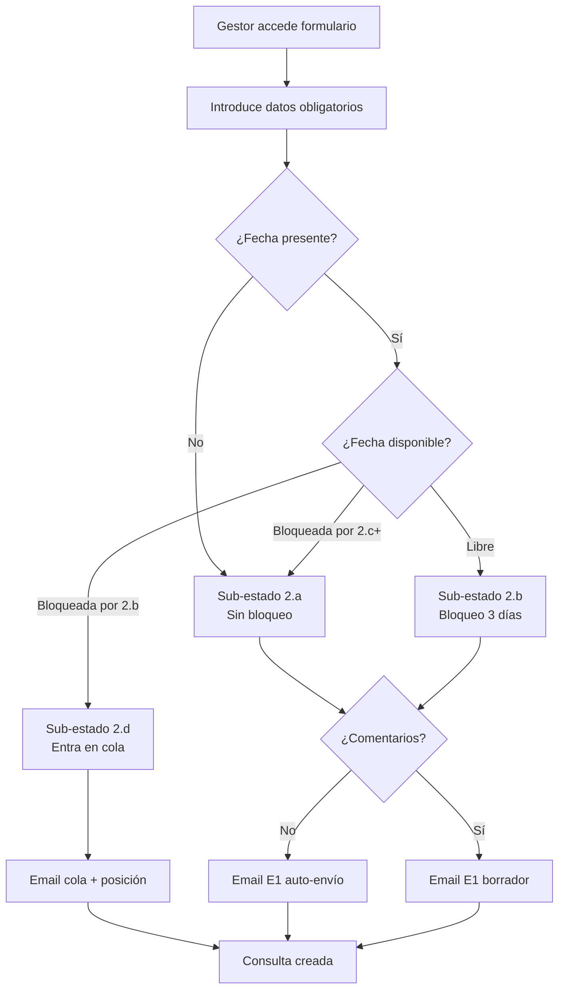

---

#### UC-04: Transicionar Consulta a Estado con Fecha (2.a → 2.b)

| Campo | Descripción |
|-------|-------------|
| **ID** | UC-04 |
| **Nombre** | Transicionar Consulta a Estado con Fecha |
| **Actor Principal** | Gestor |
| **Actores Secundarios** | Sistema |
| **Descripción** | El Gestor añade una fecha concreta a una consulta **ya existente** en sub-estado `2.a` (exploratoria), sin crear un lead nuevo. La consulta pasa a bloquear esa fecha si está libre (`2.b`), entra en cola si la fecha la tiene bloqueada otra consulta en `2.b` (`2.d`), o permanece en `2.a` si la fecha no está disponible ni admite cola. Implementado en **US-005** (change `2026-06-29-us-005-transicion-exploratoria-a-con-fecha`). A diferencia de UC-03 (alta de un lead nuevo), aquí el agregado RESERVA ya existe y lo que cambia es su sub-estado. |
| **Precondiciones** | - Consulta en sub-estado `2.a` (guarda de origen; cualquier otro sub-estado produce 422 sin efectos)<br>- `fecha_evento` **> hoy** (estrictamente futura, regla unificada `esFechaEstrictamenteFutura`; el servidor rechaza hoy y pasado con 400 sin efectos)<br>- Gestor autenticado con rol gestor sobre el tenant |
| **Postcondiciones** | - **Fecha libre:** consulta pasa a `2.b`; `fecha_evento` y `ttl_expiracion = now() + ttl_consulta_dias` escritos; fila insertada en `FECHA_BLOQUEADA` (`tipo_bloqueo='blando'`); `AUDIT_LOG` con `accion='transicion'`; email de confirmación (extensión de E1) enviado post-commit<br>- **Fecha bloqueada por `2.b` + gestor acepta cola:** consulta pasa a `2.d`; `posicion_cola = MAX+1`; `consulta_bloqueante_id` apunta a la bloqueante; no se crea `FECHA_BLOQUEADA`<br>- **Fecha bloqueada por `2.b` + gestor rechaza:** consulta permanece en `2.a` sin cambios (409 `colaDisponible:true`)<br>- **Fecha bloqueada por `2.c/2.v/pre_reserva/confirmada+`:** consulta permanece en `2.a` sin cambios (409 `colaDisponible:false`) |
| **Prioridad** | Alta |
| **Frecuencia** | Alta |
| **US** | US-005 |
| **Endpoint** | `POST /reservas/{id}/fecha` — body `{ fechaEvento: "YYYY-MM-DD", aceptarCola?: boolean }` |
| **Entidades afectadas** | RESERVA (UPDATE), FECHA_BLOQUEADA (INSERT en `2.b`), COMUNICACION (UPSERT E1), AUDIT_LOG — sin migración de columnas |

**Flujo Básico (fecha libre → 2.b):**
1. El gestor abre la ficha de consulta `2.a` en la pantalla `/reservas/:id` (`FichaConsultaPage`)
2. El gestor hace clic en "Añadir fecha" e introduce la fecha (selector con `min = mañana`)
3. El sistema valida la guarda de origen: la RESERVA está en `2.a`
4. El sistema valida la fecha: estrictamente futura (`esFechaEstrictamenteFutura`)
5. El sistema consulta el estado de la fecha en `FECHA_BLOQUEADA` para el tenant
6. La fecha está libre: la máquina de estados resuelve `2.b` + `bloquear` vía `determinarAltaConFecha`
7. En una única transacción all-or-nothing: actualiza la RESERVA (`sub_estado='2b'`, `fecha_evento`, `ttl_expiracion`); inserta en `FECHA_BLOQUEADA` con `tipo_bloqueo='blando'` vía `bloquearEnTx`; registra `AUDIT_LOG` con `accion='transicion'`, `datos_anteriores.sub_estado='2a'`, `datos_nuevos.sub_estado='2b'`
8. Post-commit (no bloqueante): UPSERT de `COMUNICACION E1` (extensión de confirmación de bloqueo provisional) vía `ConfirmacionBloqueoEmailAdapter` + motor de email US-045; un fallo de envío no revierte la transición
9. El sistema responde `200` con `subEstado='2b'`, `fechaEvento`, `ttlExpiracion`

**Flujos Alternativos:**
- **FA-01** (fecha bloqueada por `2.b` — flujo interactivo de cola):
  - Primera llamada sin `aceptarCola`: el sistema devuelve **409** con `colaDisponible: true` y `motivo`; la RESERVA permanece en `2.a`. El gestor acepta o rechaza la cola
  - Segunda llamada con `aceptarCola: true`: la RESERVA pasa a `2.d`; `posicion_cola = MAX(posicion_cola de esa fecha)+1` (serializado por `SELECT … FOR UPDATE` sobre la fila bloqueante); `consulta_bloqueante_id` y `fecha_evento` escritos; sin nueva `FECHA_BLOQUEADA`. Responde `200` con `subEstado='2d'`, `posicionCola`, `consultaBloqueanteId`
  - Si el gestor rechaza: la RESERVA permanece en `2.a`; no se reenvía
- **FA-02** (fecha bloqueada por `2.c`/`2.v`/`pre_reserva`/`reserva_confirmada` o posteriores):
  - **409** con `colaDisponible: false`; no se ofrece cola; RESERVA permanece en `2.a` sin cambios
- **FA-03** (guarda de origen — RESERVA no en `2.a`):
  - **422** con mensaje de validación; la RESERVA no se modifica ni se crea `FECHA_BLOQUEADA`
- **FA-04** (fecha no válida por bypass de la UI):
  - `fecha_evento` = hoy o en el pasado: **400** sin efectos sobre la RESERVA ni `FECHA_BLOQUEADA`
- **FA-05** (concurrencia D4 — carrera sobre fecha libre):
  - Dos transiciones simultáneas hacia la misma fecha libre: una gana (`2.b` + `FECHA_BLOQUEADA`); la otra recibe `P2002 UNIQUE(tenant_id, fecha)` → re-deriva a `bloqueada-por-2b` → **409** `colaDisponible:true` (o entra en `2.d` si llevaba `aceptarCola:true`). Garantía determinista del motor PostgreSQL

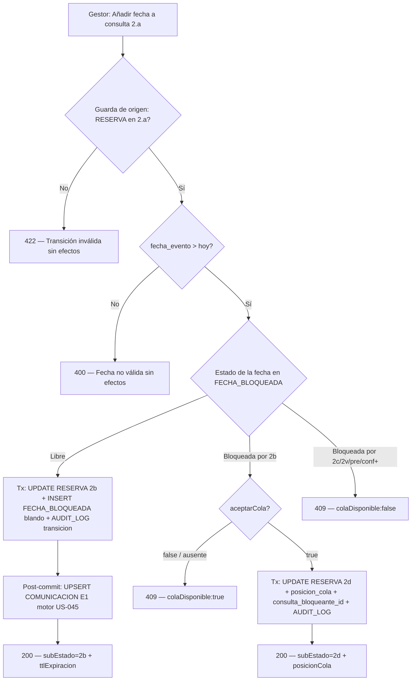

---

#### UC-05: Extender Plazo de Bloqueo

| Campo | Descripción |
|-------|-------------|
| **ID** | UC-05 |
| **Nombre** | Extender Plazo de Bloqueo |
| **Actor Principal** | Gestor |
| **Actores Secundarios** | Sistema |
| **Descripción** | El gestor extiende manualmente el TTL del bloqueo blando activo de una RESERVA antes de que expire, indicando N días enteros (≥ 1). El sistema prorroga `RESERVA.ttl_expiracion` y `FECHA_BLOQUEADA.ttl_expiracion` al mismo nuevo valor en una única transacción, sin cambiar estado, sub_estado, tipo_bloqueo ni fecha. Los recordatorios automáticos (A3/A4/A5) se reprograman implícitamente porque el barrido periódico los reevalúa contra el nuevo `ttl_expiracion`. |
| **Precondiciones** | - RESERVA con `sub_estado ∈ {2b, 2c, 2v}` O `estado = 'pre_reserva'`<br>- Fila activa en `FECHA_BLOQUEADA` con `tipo_bloqueo = 'blando'`<br>- `ttl_expiracion > ahora` (bloqueo aún vigente)<br>- Gestor autenticado con rol gestor sobre el tenant |
| **Postcondiciones** | - `RESERVA.ttl_expiracion = ttl_expiracion_actual + N días` (base = valor actual, no `now()`)<br>- `FECHA_BLOQUEADA.ttl_expiracion` actualizada al mismo nuevo valor en la misma transacción<br>- `estado`, `sub_estado`, `tipo_bloqueo` y `fecha` permanecen sin cambios<br>- `AUDIT_LOG` con `accion = 'actualizar'`, `entidad = 'RESERVA'`, `datos_anteriores.ttl_expiracion` y `datos_nuevos.ttl_expiracion`<br>- Recordatorios A3/A4/A5 reprogramados implícitamente vía barrido periódico (US-012) |
| **Prioridad** | Media |
| **Frecuencia** | Media |
| **US** | US-006 |
| **Endpoint** | `POST /reservas/{id}/extender-bloqueo` — body `{ "dias": <integer ≥ 1> }` |
| **Entidades afectadas** | RESERVA (UPDATE `ttl_expiracion`), FECHA_BLOQUEADA (UPDATE `ttl_expiracion`), AUDIT_LOG — sin migración (columnas y enums ya existentes desde US-000/US-040/US-004) |

**Flujo Básico:**
1. El gestor abre la ficha de consulta/pre-reserva con bloqueo blando activo (`2b`/`2c`/`2v`/`pre_reserva`) y TTL vigente
2. El gestor selecciona "Extender bloqueo" (acción visible y habilitada solo en esos estados con TTL vigente)
3. El sistema muestra la fecha de expiración actual (`ttl_expiracion`)
4. El gestor introduce N días de extensión (entero ≥ 1) y confirma
5. El sistema valida la guarda de precondición declarativa (`esEstadoConBloqueoBlandoExtensible`) y la presencia de la fila blanda vigente (`ttl_expiracion > ahora`)
6. El sistema valida que `dias` es entero ≥ 1
7. El sistema calcula `nuevoTtl = ttl_expiracion_actual + N días` (base = TTL actual, no `now()`)
8. En una única transacción con `SELECT … FOR UPDATE` sobre la fila bloqueante: UPDATE `RESERVA.ttl_expiracion = nuevoTtl` + UPDATE `FECHA_BLOQUEADA.ttl_expiracion = nuevoTtl` + INSERT `AUDIT_LOG accion='actualizar'`
9. El sistema devuelve la RESERVA con el nuevo `ttlExpiracion`; la UI muestra la nueva fecha de expiración

**Flujos Alternativos:**
- **FA-01** (TTL ya expirado): `RESERVA.ttl_expiracion < ahora` → el sistema responde `409` indicando que el bloqueo ha expirado; la RESERVA y su `FECHA_BLOQUEADA` no se modifican. La extensión no puede resucitar un bloqueo ya expirado-y-procesado por el barrido.
- **FA-02** (sin fila bloqueante activa): la RESERVA no tiene fila activa en `FECHA_BLOQUEADA` → el sistema responde `409`; sin mutación.
- **FA-03** (bloqueo firme — `reserva_confirmada`): `tipo_bloqueo = 'firme'` (sin TTL) → el sistema responde `409` indicando que el bloqueo firme no tiene TTL extensible; sin mutación.
- **FA-04** (estado sin bloqueo activo extensible — guarda de precondición): la RESERVA está en `2a` o en un estado terminal (`2x`, `2y`, `2z`, `reserva_cancelada`, `reserva_completada`) → el sistema responde `422`; sin mutación. La UI no muestra la acción para estos estados.
- **FA-05** (valor de extensión inválido): `dias` es 0, negativo o no entero → el sistema responde `422` ("El número de días de extensión debe ser un entero positivo (≥ 1)"); sin mutación.
- **FA-06** (RESERVA inexistente / cross-tenant): `404`.
- **FA-07** (sin sesión / rol insuficiente): `401`/`403`.
- **FA-08** (concurrencia con el barrido de expiración US-012): la extensión y el barrido se serializan por el `SELECT … FOR UPDATE` sobre la fila bloqueante; el estado final es determinista (extensión aplicada y bloqueo vigente, o bloqueo expirado y extensión rechazada), sin estados intermedios.

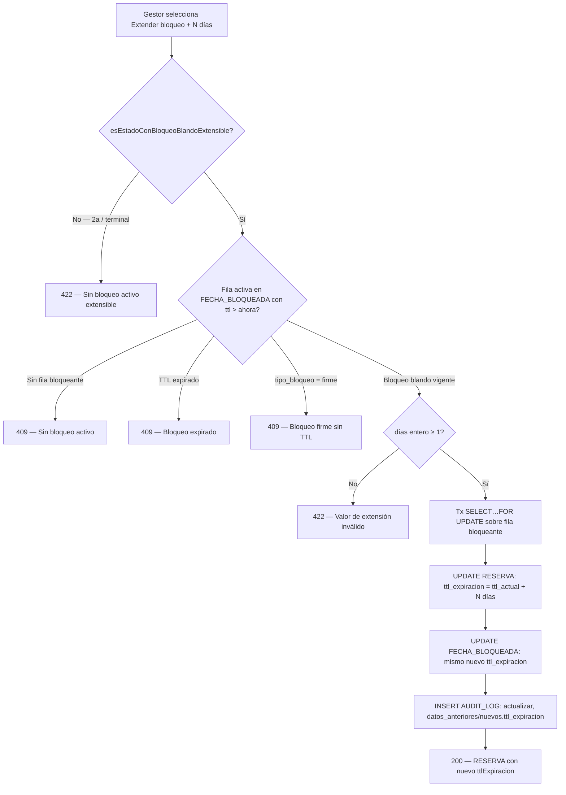

---

#### UC-06: Transicionar a Pendiente de Invitados (2.b → 2.c)

| Campo | Descripción |
|-------|-------------|
| **ID** | UC-06 |
| **Nombre** | Transicionar a Pendiente de Invitados |
| **Actor Principal** | Gestor |
| **Actores Secundarios** | Sistema |
| **Descripción** | El Gestor marca una consulta con fecha bloqueada (`2.b`) como "pendiente de número de invitados" cuando el cliente tiene intención firme sobre la fecha pero aún no confirma el aforo. El sistema extiende el bloqueo, vacía atómicamente la cola de espera y registra la transición. |
| **Precondiciones** | - Consulta en `sub_estado = '2b'` (única origen legal del happy path; D-1 de US-007)<br>- Fila activa en `FECHA_BLOQUEADA` para `(tenant_id, fecha_evento)` (`tipo_bloqueo = 'blando'`)<br>- `ttl_expiracion > ahora` (bloqueo vigente)<br>- Gestor autenticado con rol gestor sobre el tenant |
| **Postcondiciones** | - Consulta pasa a `sub_estado = '2c'`<br>- `ttl_expiracion = ttl_expiracion_actual + TENANT_SETTINGS.ttl_consulta_dias` (+3 días por defecto, derivado del setting, nunca hardcodeado)<br>- Fila en `FECHA_BLOQUEADA` actualizada al mismo nuevo `ttl_expiracion`<br>- Todas las RESERVA con `consulta_bloqueante_id = id de esta RESERVA` y `sub_estado = '2d'` pasan a `sub_estado = '2y'` (vaciado de cola, mecánica A16); `posicion_cola = NULL` y `consulta_bloqueante_id = NULL`<br>- Las cuatro operaciones ocurren en una **única transacción** all-or-nothing (serializada por `SELECT … FOR UPDATE` sobre la fila bloqueante de `FECHA_BLOQUEADA`)<br>- `AUDIT_LOG` con `accion = 'transicion'` para la RESERVA principal y para cada RESERVA descartada de la cola<br>- **Email de solicitud de nº de invitados (UC-06 paso 7): fuera de alcance en MVP** (gap de spec D-7: §9.3 no asigna E-code a este email; pendiente de decisión del product owner — catalogar nuevo E-code o gestión manual desde el log de comunicaciones) |
| **Prioridad** | Alta |
| **Frecuencia** | Media |
| **US** | US-007 |
| **Endpoint** | `POST /reservas/{id}/pendiente-invitados` — body vacío o `{}` |
| **Entidades afectadas** | RESERVA (UPDATE estado + TTL), FECHA_BLOQUEADA (UPDATE TTL), AUDIT_LOG — sin migración de columnas (sub-estados `2c`/`2y` y campos de cola/TTL existen desde US-000/US-040/US-004) |

**Flujo Básico:**
1. El gestor abre la ficha de consulta `2.b` en la pantalla de la reserva
2. El gestor selecciona "Marcar como pendiente de invitados" (acción visible y habilitada solo cuando hay bloqueo activo en `2.b`) y confirma
3. El sistema valida la guarda de origen: la RESERVA está en `sub_estado = '2b'`
4. El sistema valida la precondición de bloqueo: existe fila activa en `FECHA_BLOQUEADA` con `ttl_expiracion > ahora`
5. El sistema resuelve el plan de extensión vía `resolverPlanBloqueo({ fase: '2.c' })` → `ttl = ttl_expiracion_actual + ttl_consulta_dias`
6. En una única transacción all-or-nothing serializada por `SELECT … FOR UPDATE` sobre la fila bloqueante de `FECHA_BLOQUEADA`:
   - Actualiza la RESERVA: `sub_estado = '2c'`, nuevo `ttl_expiracion`
   - Actualiza la fila de `FECHA_BLOQUEADA` al mismo nuevo `ttl_expiracion`
   - Actualiza todas las RESERVA en `2d` con `consulta_bloqueante_id = id de esta RESERVA`: `sub_estado = '2y'`, `posicion_cola = NULL`, `consulta_bloqueante_id = NULL` (si la cola está vacía, el UPDATE afecta a 0 filas, sin error)
   - Registra `AUDIT_LOG` con `accion = 'transicion'` para la RESERVA principal y para cada RESERVA descartada
7. El sistema responde `200` con `subEstado = '2c'`, `ttlExpiracion` (nuevo) y `consultasDescartadas` (recuento de RESERVA de cola pasadas a `2.y`)

**Flujos Alternativos:**
- **FA-01** (sin fecha bloqueada): la RESERVA no tiene fila activa en `FECHA_BLOQUEADA` → el sistema responde `409` indicando que la transición a `2.c` requiere fecha bloqueada activa; la RESERVA no se modifica. La UI puede deshabilitar la acción preventivamente; la validación es también defensiva en servidor.
- **FA-02** (TTL expirado): la RESERVA está en `2.b` pero `ttl_expiracion < ahora` → el sistema responde `409` indicando que el bloqueo ha expirado; la RESERVA no se modifica.
- **FA-03** (guarda de origen — RESERVA no en `2.b`): la RESERVA está en `2.a`, `2.c`, `2.v`, un estado terminal (`2.x`, `2.y`, `2.z`) o `reserva_cancelada`/`reserva_completada` → el sistema responde `422`; la RESERVA no se modifica, ni su `FECHA_BLOQUEADA`, ni ninguna consulta de cola. Los terminales son inmutables.
- **FA-04** (concurrencia): dos peticiones simultáneas de transición a `2.c` sobre la misma RESERVA → exactamente una aplica el cambio; la otra observa que la RESERVA ya no está en `2.b` y recibe la guarda de origen (`422`). Sin doble extensión de TTL ni doble vaciado de cola.

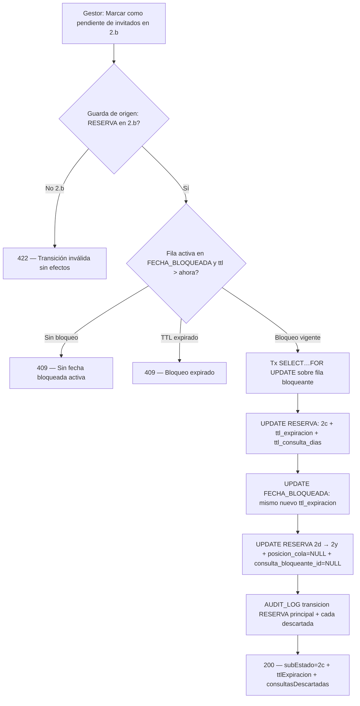

> **Gap de spec D-7 (abierto, pendiente de decisión del product owner):** UC-06 paso 7 describe el envío de un email al cliente solicitando el número de invitados, pero `§9.3` no le asigna código `E` (E1–E8). La regla del proyecto prohíbe referenciar emails fuera del catálogo E1–E8. Este email **no se implementa en MVP**; queda registrado como gap de spec hasta que el PO decida: (a) catalogarlo como nuevo E-code, o (b) gestionarlo manualmente desde el log de comunicaciones. Los emails automáticos de vaciado de cola a los clientes en `2.d` (A16) también son solo diseñados en MVP: la mecánica del vaciado sí se implementa; los emails de cola no. Fuente: `design.md §D-7`; `US-007 §Notas de alcance`.

---

#### UC-07: Programar Visita al Espacio (→ 2.v)

| Campo | Descripción |
|-------|-------------|
| **ID** | UC-07 |
| **Nombre** | Programar Visita al Espacio |
| **Actor Principal** | Gestor |
| **Actores Secundarios** | Sistema, Cliente |
| **Descripción** | El Gestor programa una visita presencial al espacio para un cliente interesado y transiciona la consulta al sub-estado `2.v`. La transición bloquea la fecha del evento hasta el día posterior a la visita y envía automáticamente el email E6 de confirmación al cliente. Implementado en **US-008** (change `2026-06-30-us-008-programar-visita-espacio`). |
| **Precondiciones** | - Consulta en `sub_estado ∈ {'2a','2b','2c'}` (guarda de origen; `2d` y terminales producen error sin efectos)<br>- Para `2a`: `fecha_evento` debe estar definida (NOT NULL)<br>- `fecha_visita ∈ [hoy + 1 día, hoy + TENANT_SETTINGS.max_dias_programar_visita]` (ventana por defecto de 7 días)<br>- Gestor autenticado con rol gestor sobre el tenant |
| **Postcondiciones** | - Consulta pasa a `sub_estado = '2v'`<br>- `visita_programada_fecha = fecha_visita`, `visita_programada_hora = hora_visita`, `visita_realizada = false`<br>- `FECHA_BLOQUEADA`: si origen `2b`/`2c` (ya tenía fila activa) → UPDATE del `ttl_expiracion` a `visita + 1 día (23:59:59)`; si origen `2a` (sin bloqueo) → INSERT nueva fila `tipo_bloqueo='blando'`, `ttl_expiracion = visita + 1 día (23:59:59)`. `tipo_bloqueo` permanece/es `'blando'`<br>- `AUDIT_LOG` con `accion='transicion'`, `entidad='RESERVA'`, `datos_anteriores.sub_estado` (origen), `datos_nuevos.sub_estado='2v'`, `datos_nuevos.visita_programada_fecha`<br>- Las cuatro operaciones son **all-or-nothing** en una única transacción<br>- Post-commit: email E6 (confirmación de visita con fecha y hora) enviado al cliente; registrado en `COMUNICACION` con `codigo_email='E6'`, `estado='enviado'`, `reserva_id`, `cliente_id` |
| **Prioridad** | Alta |
| **Frecuencia** | Media |
| **US** | US-008 |
| **Endpoint** | `POST /reservas/{id}/visita` — body `{ "fecha": "YYYY-MM-DD", "hora": "HH:mm" }` |
| **Entidades afectadas** | RESERVA (UPDATE sub_estado + campos visita), FECHA_BLOQUEADA (INSERT o UPDATE ttl_expiracion), COMUNICACION (INSERT E6), AUDIT_LOG — sin migración de columnas (campos de visita + sub-estado `2v` + setting ya existentes desde US-000) |

**Flujo Básico (desde 2.b):**
1. El gestor abre la ficha de consulta `2.b` en la pantalla de la reserva
2. El gestor selecciona "Programar visita" (acción habilitada para `2a`/`2b`/`2c` con `fecha_evento` definida; deshabilitada/oculta en `2d`, terminales y `2a` sin `fecha_evento`)
3. El gestor introduce `fecha_visita` (selector limitado a `[mañana, hoy + max_dias_programar_visita]`) y hora, y confirma
4. El sistema valida la guarda de origen: `sub_estado ∈ {'2a','2b','2c'}`
5. El sistema valida la ventana de fecha: `fecha_visita ∈ [hoy + 1, hoy + TENANT_SETTINGS.max_dias_programar_visita]` (setting nunca hardcodeado)
6. El sistema resuelve el plan de bloqueo vía `resolverPlanBloqueo({ fase: '2.v', visitaFecha })` → `{ ttl = visita +1 día (23:59:59), accion: 'insert' | 'update' }` según si hay fila activa en `FECHA_BLOQUEADA`
7. En una única transacción all-or-nothing serializada por `SELECT … FOR UPDATE` sobre la fila bloqueante de `FECHA_BLOQUEADA`:
   - Actualiza la RESERVA: `sub_estado = '2v'`, `visita_programada_fecha`, `visita_programada_hora`, `visita_realizada = false`
   - UPDATE (o INSERT si origen `2a`) de `FECHA_BLOQUEADA`: `ttl_expiracion = visita + 1 día (23:59:59)`; `tipo_bloqueo = 'blando'`
   - Registra `AUDIT_LOG` con `accion = 'transicion'`, `datos_anteriores.sub_estado = '2b'`, `datos_nuevos.sub_estado = '2v'`, `datos_nuevos.visita_programada_fecha`
8. Post-commit (no bloqueante): dispara E6 vía el motor de email de US-045; registra en `COMUNICACION` con `codigo_email = 'E6'`, `estado = 'enviado'`; un fallo del proveedor no revierte la transición (queda trazado en `COMUNICACION`)
9. El sistema responde `200` con `subEstado = '2v'`, `visitaProgramadaFecha`, `visitaProgramadaHora`, `visitaRealizada = false`, `ttlExpiracion` (nuevo)

**Flujos Alternativos:**
- **FA-01** (consulta en cola — `2d`): el sistema responde **409** con mensaje "No es posible programar una visita para una consulta en cola. La consulta debe ser promovida primero (UC-12)"; la RESERVA no se modifica. La acción está deshabilitada en UI para `2d`.
- **FA-02** (origen `2a` sin `fecha_evento`): el sistema informa de que debe introducirse primero la fecha del evento; la acción queda bloqueada hasta que `fecha_evento` esté definida. Responde **422** sin efectos.
- **FA-03** (fecha de visita ≤ hoy): el sistema responde **422** "La fecha de visita debe ser un día futuro"; la RESERVA no se modifica.
- **FA-04** (fecha de visita > hoy + `max_dias_programar_visita`): el sistema responde **422** "La visita debe programarse dentro de los próximos {N} días"; la RESERVA no se modifica.
- **FA-05** (estado terminal — `2x`/`2y`/`2z`/`reserva_cancelada`/`reserva_completada`): el sistema responde **422**; los terminales son inmutables; la RESERVA no se modifica.
- **FA-06** (concurrencia — barrido A4 vs transición a `2v`): la serialización por `SELECT … FOR UPDATE` sobre la fila bloqueante garantiza que la primera transacción en commitear gana y la otra opera sobre un estado ya cambiado respetando las guardas; nunca estado inconsistente.

```mermaid
flowchart TD
    A[Gestor: Programar visita en 2.a/2.b/2.c] --> B{Guarda de origen: sub_estado ∈ 2a|2b|2c?}
    B -->|2d| C[409 — Promover primero UC-12]
    B -->|Terminal| D[422 — Estado inmutable]
    B -->|2a sin fecha_evento| E[422 — Introducir fecha_evento primero]
    B -->|Válido| F{fecha_visita ∈ hoy+1..hoy+N?}
    F -->|≤ hoy| G[422 — Fecha futura obligatoria]
    F -->|> hoy+N| H[422 — Fuera de ventana]
    F -->|Válida| I[Tx SELECT…FOR UPDATE sobre fila bloqueante]
    I --> J[UPDATE RESERVA: 2v + campos visita + visita_realizada=false]
    J --> K{Origen tenía FECHA_BLOQUEADA?}
    K -->|2b ó 2c| L[UPDATE FECHA_BLOQUEADA: ttl = visita +1 día]
    K -->|2a sin bloqueo| M[INSERT FECHA_BLOQUEADA: blando, ttl = visita +1 día]
    L --> N[AUDIT_LOG transicion: 2v + visita_programada_fecha]
    M --> N
    N --> O[200 — subEstado=2v + visitaProgramadaFecha/Hora + ttlExpiracion]
    O --> P[Post-commit: E6 motor US-045 → COMUNICACION E6 enviado]
```

---

#### UC-08: Registrar Resultado de Visita

| Campo | Descripción |
|-------|-------------|
| **ID** | UC-08 |
| **Nombre** | Registrar Resultado de Visita |
| **Actor Principal** | Gestor |
| **Actores Secundarios** | Sistema |
| **Descripción** | El gestor registra el resultado de una visita programada: interés confirmado, reserva inmediata o descarte |
| **Precondiciones** | - Consulta en sub-estado 2.v<br>- Fecha de visita alcanzada o superada |
| **Postcondiciones** | - `visita_realizada` = true<br>- Transición al estado correspondiente según resultado |
| **Prioridad** | Alta |
| **Frecuencia** | Media |

**Flujo Básico (cliente confirma interés):**
1. El gestor abre la ficha de consulta en 2.v
2. El gestor selecciona "Registrar resultado de visita"
3. El gestor indica "Cliente interesado"
4. El sistema marca `visita_realizada = true`
5. El sistema cambia sub-estado a 2.b
6. El sistema aplica TTL fresco de 3 días
7. El sistema envía email E7 confirmando bloqueo post-visita
8. El sistema registra en audit log

**Flujos Alternativos:**
- **FA-01**: Cliente quiere reservar inmediatamente con info completa → Transición directa a pre_reserva
- **FA-02**: Cliente descarta → Transición a 2.z + liberación de fecha
- **FA-03**: Visita no realizada (no apareció) → Gestor puede reprogramar o expirar

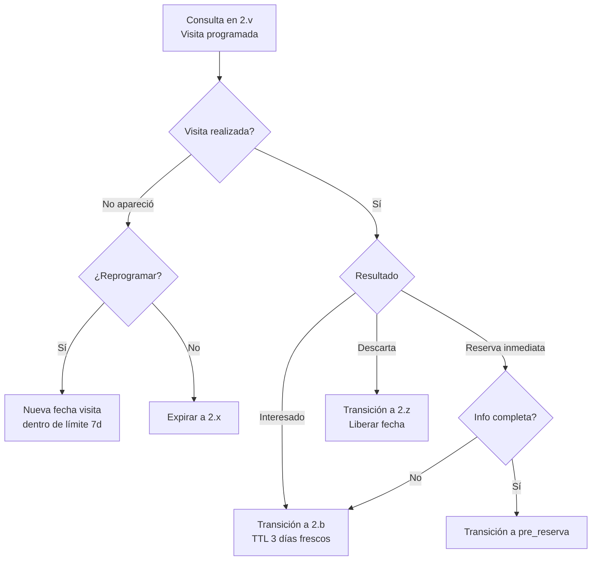

---

#### UC-09: Expirar Consulta Automáticamente

| Campo | Descripción |
|-------|-------------|
| **ID** | UC-09 |
| **Nombre** | Expirar Consulta Automáticamente |
| **Actor Principal** | Sistema |
| **Actores Secundarios** | Gestor |
| **Descripción** | El sistema expira automáticamente una consulta o pre-reserva cuando su TTL de bloqueo blando se agota sin avance. Implementado en **US-012** mediante job asíncrono de barrido periódico (`POST /cron/barrido-expiracion`), con scheduler registrado dinámicamente vía `SchedulerRegistry`; expresión por defecto `'0 * * * *'` (cada hora), configurable por `CRON_BARRIDO_EXPIRACION`. |
| **Precondiciones** | - RESERVA con `ttl_expiracion < now()` **Y** (`sub_estado ∈ {2b, 2c, 2v}` **O** `estado = 'pre_reserva'`)<br>- El bloqueo es blando (`tipo_bloqueo = 'blando'`); los bloqueos firmes no tienen TTL y no son candidatos<br>- El job de barrido se dispara con frecuencia configurable por `CRON_BARRIDO_EXPIRACION` (default cada hora, `'0 * * * *'`); si `CRON_TOKEN` está ausente, el disparo automático se desactiva (el endpoint sigue disponible para invocación manual/externa) |
| **Postcondiciones** | - RESERVA transiciona al estado terminal por TTL: `2b/2c/2v → 2x`; `pre_reserva → reserva_cancelada` (mapa declarativo `MAPA_EXPIRACION_TTL` / `resolverExpiracionTtl`)<br>- Fila de `FECHA_BLOQUEADA` eliminada vía `liberarFecha()` (US-041, causa `TTL`), idempotente (0 filas = éxito silencioso)<br>- Si la RESERVA tenía cola activa (`2b`/`2v`): seam `PromocionColaPort` disparado exactamente una vez; el adaptador real `PromocionColaPrismaAdapter` (US-018) ejecuta la promoción FIFO completa: `2d → 2b`, re-bloqueo atómico, reordenación y alerta interna al gestor<br>- `AUDIT_LOG` con `accion = 'transicion'`, `entidad = 'RESERVA'`<br>- El fallo de una candidata no aborta el lote (fallo aislado por RESERVA)<br>- Respuesta `BarridoExpiracionResponse`: `candidatas`, `expiradas`, `promocionesDisparadas`, `fallos` |
| **Prioridad** | Crítica |
| **Frecuencia** | Media (barrido automático cada hora por defecto; configurable con `CRON_BARRIDO_EXPIRACION`) |
| **US** | US-012 |
| **Endpoint** | `POST /cron/barrido-expiracion` — auth `X-Cron-Token` (no JWT); sin body |

**Flujo Básico:**
1. El scheduler registrado dinámicamente vía `SchedulerRegistry` (expresión `CRON_BARRIDO_EXPIRACION`, default `'0 * * * *'`, cada hora) invoca `POST /cron/barrido-expiracion`; el `CronTokenGuard` valida la cabecera `X-Cron-Token` contra `CRON_TOKEN` del entorno. Si `CRON_TOKEN` está ausente, el disparo automático no se activa; el endpoint puede invocarse manualmente
2. El barrido selecciona todas las RESERVA con `ttl_expiracion < now()` AND (`sub_estado ∈ {2b,2c,2v}` OR `estado = 'pre_reserva'`), comparando instantes (`timestamptz`), **cross-tenant** (proceso de Sistema, único punto legítimo de lectura global)
3. Por cada candidata, en su propia transacción serializada (`SELECT … FOR UPDATE` sobre la fila `FECHA_BLOQUEADA` + `UNIQUE(tenant_id, fecha)`), bajo el contexto RLS del tenant de la RESERVA (`SET LOCAL app.tenant_id`):
   - Resuelve el estado terminal via `resolverExpiracionTtl` (mapa declarativo): `2b/2c/2v → 2x`; `pre_reserva → reserva_cancelada`
   - Llama a `liberarFecha()` (US-041): DELETE idempotente de `FECHA_BLOQUEADA`, causa `TTL`
   - Registra `AUDIT_LOG` con `accion = 'transicion'`
   - Si la RESERVA tenía cola activa: dispara el seam `PromocionColaPort` exactamente una vez
4. Si la candidata ya fue procesada (estado terminal), se omite sin error (idempotencia)
5. Si el procesamiento de una candidata falla, el rollback es aislado a esa RESERVA; el resto del lote continúa
6. El barrido responde `200` con `BarridoExpiracionResponse`

**Flujos Alternativos:**
- **FA-01** (sin `X-Cron-Token` válido): el sistema devuelve `401` sin ejecutar ningún barrido
- **FA-02** (candidata ya expirada/terminal bajo lock): la guarda de origen la excluye; 0 mutaciones, éxito silencioso (idempotencia)
- **FA-03** (concurrencia con US-006 extensión de bloqueo): la serialización por `SELECT … FOR UPDATE` garantiza que extensión y barrido no se solapan; uno observa el estado del otro y actúa en consecuencia (extensión con TTL ya vigente / barrido rechazado por TTL recién extendido)

```mermaid
flowchart TD
    A[Scheduler: cron dinámico, default cada hora → POST /cron/barrido-expiracion] --> B{X-Cron-Token válido?}
    B -->|No| C[401 — Sin autorización]
    B -->|Sí| D[Seleccionar candidatas: ttl_expiracion < now AND sub_estado ∈ 2b|2c|2v OR estado=pre_reserva — cross-tenant]
    D --> E{¿Candidatas?}
    E -->|Ninguna| F[200 — BarridoExpiracionResponse 0 candidatas]
    E -->|N candidatas| G[Por cada candidata: Tx propia SELECT…FOR UPDATE + SET LOCAL tenant_id]
    G --> H[resolverExpiracionTtl: 2b/2c/2v → 2x; pre_reserva → reserva_cancelada]
    H --> I[liberarFecha causa=TTL — DELETE idempotente FECHA_BLOQUEADA]
    I --> J[AUDIT_LOG transicion]
    J --> K{Cola activa en 2b/2v?}
    K -->|Sí| L[Dispara PromocionColaPort — adaptador real US-018: FIFO + re-bloqueo + reordenación]
    K -->|No| M[Siguiente candidata]
    L --> M
    G --> N[Fallo aislado → rollback solo esa Tx, resto continúa]
    M --> O[200 — BarridoExpiracionResponse candidatas/expiradas/promocionesDisparadas/fallos]
```

---

#### UC-10: Marcar Consulta como Descartada por Cliente

| Campo | Descripción |
|-------|-------------|
| **ID** | UC-10 |
| **Nombre** | Marcar Consulta como Descartada por Cliente |
| **Actor Principal** | Gestor |
| **Actores Secundarios** | Sistema |
| **Descripción** | El gestor registra que el cliente ha indicado explícitamente que no desea continuar |
| **Precondiciones** | - Consulta en cualquier sub-estado no terminal |
| **Postcondiciones** | - Consulta pasa a sub-estado 2.z<br>- Fecha liberada (si había bloqueo)<br>- Cola reordenada (si estaba en cola) |
| **Prioridad** | Media |
| **Frecuencia** | Media |

**Flujo Básico:**
1. El gestor abre la ficha de consulta
2. El gestor selecciona "Marcar como descartada"
3. El gestor opcionalmente indica motivo
4. El sistema cambia sub-estado a 2.z
5. Si había bloqueo: el sistema libera la fecha
6. Si estaba en cola: el sistema reordena la cola
7. El sistema registra en audit log

---

### ÁREA: GESTIÓN DE COLA DE ESPERA

---

#### UC-11: Visualizar Cola de Espera de una Fecha

| Campo | Descripción |
|-------|-------------|
| **ID** | UC-11 |
| **Nombre** | Visualizar Cola de Espera de una Fecha |
| **Actor Principal** | Gestor |
| **Actores Secundarios** | Sistema |
| **Descripción** | El gestor visualiza, en una vista de **solo lectura**, la consulta bloqueante de una fecha y la cola FIFO de consultas en espera (`2.d`) asociadas. La vista no muta estado ni registra AUDIT_LOG. El acceso se produce desde el indicador `🔁 N en cola` del calendario (US-039), que navega con el `reservaId` de la bloqueante. |
| **Precondiciones** | - Gestor autenticado con rol gestor sobre el tenant<br>- `{id}` es el `reservaId` de la consulta bloqueante (puede estar en `2b`, `2c` o `2v`)<br>- El indicador `🔁 N en cola` ya está visible en el calendario cuando existen ≥ 1 RESERVA en `2d` apuntando a la bloqueante (UC-29, US-039) |
| **Postcondiciones** | - Información de cola proyectada sin mutación de estado<br>- Sin registro en AUDIT_LOG (lectura pura) |
| **Prioridad** | Alta |
| **Frecuencia** | Alta |
| **US** | US-017 |
| **Endpoint** | `GET /reservas/{id}/cola` — `{id}` es el `reservaId` de la consulta bloqueante |
| **Entidades leídas** | RESERVA (`posicion_cola`, `consulta_bloqueante_id`, `sub_estado`, `ttl_expiracion`, `fecha_creacion`, `visita_programada_fecha`), FECHA_BLOQUEADA, CLIENTE — sin migración nueva |

**Flujo Básico:**
1. El gestor hace clic sobre el indicador `🔁 N en cola` en una celda del calendario
2. El frontend navega a `/reservas/:id/cola` usando el `reservaId` de la bloqueante que `GET /calendario` ya provee en la respuesta de US-039
3. El sistema ejecuta `GET /reservas/{id}/cola` (UC-11) y devuelve un read-model `ColaEsperaResponse` con dos secciones:
   - **Bloqueante**: `{ idReserva, codigo, clienteNombre, subEstado (2b|2c|2v), ttlExpiracion (date-time|null), ttlRestante (legible|null), visitaProgramadaFecha (date|null, solo 2.v) }`
   - **Cola**: lista de `ColaItem[]` ordenada ASC por `posicionCola` (FIFO), cada elemento `{ idReserva, codigo, clienteNombre, posicionCola, fechaCreacion, tiempoEnCola }`
4. Los derivados temporales `ttlRestante` y `tiempoEnCola` se calculan en el backend sobre instantes `timestamptz` (`ttl_expiracion − now()` y `now() − fecha_creacion`), nunca sobre fechas formateadas, mitigando el off-by-one de zona horaria documentado
5. El gestor puede acceder a la ficha completa de la bloqueante o de cualquier consulta de la cola mediante el `idReserva` de cada elemento (`GET /reservas/{id}`, US-005)

**Flujos Alternativos:**
- **FA-01** (bloqueante sin cola): existe `FECHA_BLOQUEADA` pero ninguna RESERVA en `2d` apunta a la bloqueante → la sección bloqueante se proyecta; la cola está vacía; la vista muestra "Sin consultas en espera para esta fecha"
- **FA-02** (bloqueante en `2.c`): se proyecta `subEstado = '2c'` con el TTL correcto; la cola se muestra con el mismo formato
- **FA-03** (bloqueante en `2.v`): se proyecta `subEstado = '2v'` con `visitaProgramadaFecha` y el TTL vigente; la cola igual
- **FA-04** (reserva no bloqueante de ninguna fecha activa): no hay `FECHA_BLOQUEADA` con `reserva_id = {id}` → el sistema responde 200 con `{ estaBloqueada: false, bloqueante: null, cola: [] }` para que la vista muestre "Fecha disponible"; 404 solo para reserva inexistente o de otro tenant (RLS)
- **FA-05** (cola de un único elemento): la sección cola contiene exactamente una entrada con `posicionCola = 1`

```mermaid
flowchart TD
    A[Gestor clic indicador 🔁 en calendario] --> B[Frontend navega a /reservas/:id/cola]
    B --> C[GET /reservas/{id}/cola — ObtenerColaEsperaUseCase]
    C --> D{¿reserva existe y es del tenant?}
    D -->|No| E[404 — No encontrada / RLS]
    D -->|Sí| F{¿tiene FECHA_BLOQUEADA activa?}
    F -->|No| G[200 — estaBloqueada:false, bloqueante:null, cola:[]]
    F -->|Sí| H[Lee bloqueante + CLIENTE + cola 2d ORDER BY posicion_cola ASC]
    H --> I[Calcula ttlRestante y tiempoEnCola sobre instantes timestamptz]
    I --> J[200 — ColaEsperaResponse: sección bloqueante + cola FIFO]
    J --> K[Gestor visualiza cola; puede navegar a ficha de cualquier RESERVA]
```

---

#### UC-12: Promover Consulta de la Cola

| Campo | Descripción |
|-------|-------------|
| **ID** | UC-12 |
| **Nombre** | Promover Consulta de la Cola |
| **Actor Principal** | Sistema (promoción automática) / Gestor (promoción manual) |
| **Actores Secundarios** | Gestor (notificado internamente en flujo automático; actor principal en flujo manual) |
| **Descripción** | Cubre dos flujos complementarios: **(A) Automático** — cuando se libera una `FECHA_BLOQUEADA` con cola activa, el sistema promueve automáticamente la primera consulta en cola (`2.d → 2.b`, posición 1, FIFO), re-crea el bloqueo, reordena el resto y alerta al gestor; implementado en **US-018**. **(B) Manual** — el Gestor selecciona deliberadamente una consulta arbitraria de la cola (`2.d`, cualquier posición), expira forzosamente la bloqueante activa (`2b/2c/2v → 2x`), promueve la elegida (`2d → 2b`), re-asigna el bloqueo y reordena la cola cerrando el hueco; implementado en **US-019**. Ambos flujos se coordinan mediante `SELECT … FOR UPDATE` sobre `FECHA_BLOQUEADA` (guarda "ya promovida"): quien adquiere el lock primero completa la operación; el otro aborta limpio (409). |
| **Precondiciones** | - Al menos una RESERVA en `sub_estado = '2d'` con `posicion_cola = 1` para `(tenant_id, fecha)` — se verifica dentro de la transacción bajo lock<br>- La `FECHA_BLOQUEADA` de esa fecha fue liberada por `liberarFecha()` (DELETE commiteado) antes del disparo del seam `PromocionColaPort` |
| **Postcondiciones** | **Flujo automático (US-018):** la consulta con `posicion_cola = 1` pasa a `sub_estado = '2b'`; `posicion_cola = NULL`; `consulta_bloqueante_id = NULL`; se re-crea la fila de `FECHA_BLOQUEADA` (blando, `now() + ttl_consulta_dias`) vía `bloquearFecha()`; el resto de la cola decrementa posición en 1 y re-apunta `consulta_bloqueante_id`; `AUDIT_LOG accion='transicion'` por cada RESERVA, `origen: 'promocion_automatica'`; alerta interna al gestor.<br>**Flujo manual (US-019):** la bloqueante activa (`2b`/`2c`/`2v`) pasa a `2x` (expiración forzosa, `ttl_expiracion → NULL`); la RESERVA elegida por el Gestor (cualquier `posicion_cola`) pasa a `2b`; la fila de `FECHA_BLOQUEADA` se re-asigna a la promovida (blando, `now() + ttl_consulta_dias`); la cola se reordena cerrando el hueco (`posicion_cola > P` decrementan 1; todas re-apuntan `consulta_bloqueante_id` a la promovida); `AUDIT_LOG accion='transicion'` por cada RESERVA modificada, `datos_nuevos.origen: 'promocion_manual'` para la promovida.<br>**Ambos flujos:** sin email al cliente en MVP (superficie de notificaciones diferida a US-044); idempotente (guarda "ya promovida" bajo lock aborta limpio si el estado ya cambió). |
| **Prioridad** | Crítica |
| **Frecuencia** | Media |
| **US** | US-018 (automático), US-019 (manual) |
| **Entidades afectadas** | RESERVA (UPDATE promovida + UPDATE bloqueante expirada en manual + UPDATE restantes), FECHA_BLOQUEADA (INSERT en automático; UPDATE re-asignación en manual), AUDIT_LOG — sin migración nueva (reutiliza `posicion_cola`, `consulta_bloqueante_id`, `ttl_expiracion`, `sub_estado` existentes desde US-000/US-004) |

**Flujo Básico (automático — A15):**
1. El barrido de expiración (UC-09 / US-012) o cualquier otra operación que invoque `liberarFecha()` hace DELETE de la `FECHA_BLOQUEADA` de `(tenant, fecha)` y commite; si detecta cola activa, dispara `PromocionColaPort.promoverPrimeroEnCola({ tenantId, fecha })` exactamente una vez (post-commit)
2. El adaptador real `PromocionColaPrismaAdapter` (US-018) recibe `{ tenantId, fecha }` y abre una transacción bajo `SET LOCAL app.tenant_id` (RLS)
3. Adquiere `SELECT … FOR UPDATE` sobre las RESERVA en `sub_estado = '2d'` de `(tenant, fecha)` — este es el **punto de serialización**; la fila de `FECHA_BLOQUEADA` ya no existe en este momento
4. Guarda "ya promovida": verifica que exista candidato con `posicion_cola = 1` en `2d`; si no (otra TX ya promovió), aborta limpio sin cambios (idempotencia)
5. Función pura de dominio (`resolverPromocionCola`) calcula el plan: mutaciones de la promovida + decrementos de posición + nuevo `consulta_bloqueante_id` del resto; valida contigüidad de posiciones
6. En la misma transacción:
   - Muta la promovida: `sub_estado = '2b'`, `posicion_cola = NULL`, `consulta_bloqueante_id = NULL`, `ttl_expiracion = now() + ttl_consulta_dias`
   - Re-crea `FECHA_BLOQUEADA` vía `bloquearFecha()` (blando, `now() + ttl_consulta_dias`)
   - Reordena el resto: decrementa `posicion_cola` (orden ascendente para respetar `reserva_cola_posicion_key`), apunta `consulta_bloqueante_id` a la promovida
7. Registra `AUDIT_LOG` con `accion = 'transicion'` por cada RESERVA modificada (`origen: promocion_automatica`)
8. Registra alerta interna para el gestor: "Consulta [código] promovida a bloqueo de la fecha [fecha]; contactar al cliente" (dentro de la misma transacción, sin acoplamiento al puerto de comunicaciones US-045)
9. El gestor visualiza la alerta en el dashboard (superficie US-044); contacta al cliente manualmente

**Flujos Alternativos — Flujo automático (US-018):**
- **FA-01** (guarda "ya promovida" — carrera RC-1 / RC-3): `posicion_cola = 1` en `2d` ya no existe bajo lock → abortar limpio sin cambios, sin error. Cubre doble disparo del cron (RC-1) y coordinación con la promoción manual del Gestor (RC-3, US-019)
- **FA-02** (cola vacía): no hay RESERVA en `2d` para `(tenant, fecha)` → la función retorna inmediatamente sin mutaciones (éxito silencioso; `liberarFecha()` ya procesó la liberación)
- **FA-03** (contigüidad rota en la cola): la función pura detecta hueco en posiciones → aborta con error de dominio; el lote de expiración registra el fallo de forma aislada (el resto del lote continúa)

**Flujo B: Promoción manual por el Gestor (US-019)**

El Gestor inicia la promoción desde la vista de cola de US-017 (`/reservas/:id/cola`). El endpoint es `POST /reservas/{id}/promover` con body `{ confirmado: true }`, donde `{id}` es la RESERVA en `2d` a promover (no la bloqueante). Rol requerido: Gestor. Códigos de respuesta: 200 (éxito), 403 (rol insuficiente), 404 (reserva no encontrada bajo RLS), 409 (carrera perdida: el automático se adelantó), 422 (consulta ya no en `2d`).

1. El Gestor visualiza la cola de la fecha en la vista de US-017
2. El Gestor selecciona una consulta de la cola (cualquier posición) y hace clic en "Promover a bloqueante"
3. El sistema muestra un **diálogo de confirmación** (acción destructiva e irreversible: expira la bloqueante actual)
4. El Gestor confirma la acción
5. El sistema valida la guarda de origen: la RESERVA elegida está en `sub_estado = '2d'`
6. El sistema valida que existe `FECHA_BLOQUEADA` activa para la `(tenant, fecha)` de la consulta elegida
7. En una **única transacción** serializada por `SELECT … FOR UPDATE` sobre la fila de `FECHA_BLOQUEADA`:
   - Adquiere el lock y re-evalúa la guarda "ya promovida" (si el estado ya cambió → aborta, 409)
   - Expira la bloqueante activa: `sub_estado → '2x'`, `ttl_expiracion → NULL`
   - Re-asigna la fila de `FECHA_BLOQUEADA`: `reserva_id → <promovida>`, `tipo_bloqueo = 'blando'`, `ttl_expiracion = now() + tenant_settings.ttl_consulta_dias`
   - Promueve la RESERVA elegida: `sub_estado → '2b'`, `posicion_cola → NULL`, `consulta_bloqueante_id → NULL`, `ttl_expiracion = now() + tenant_settings.ttl_consulta_dias`
   - Reordena la cola cerrando el hueco: RESERVA con `posicion_cola > P` decrementan 1; todas las restantes actualizan `consulta_bloqueante_id` a la promovida
   - Registra `AUDIT_LOG` (`accion='transicion'`, `origen: 'promocion_manual'`, `usuario_id` del Gestor) para cada RESERVA modificada
8. El sistema responde 200; el frontend invalida la query de cola (TanStack Query)

**Flujos Alternativos — Flujo manual (US-019):**
- **FA-01** (Gestor promueve la primera de la cola — `posicion_cola = 1`): el plan de reordenación es equivalente al decremento uniforme de US-018; el efecto es el mismo pero con expiración forzosa de la bloqueante previa
- **FA-02** (bloqueante con TTL ya vencido pero no barrida): el sistema la detecta con `sub_estado ∈ {2b,2c,2v}` y `ttl_expiracion < now()`, la expira a `2x` e igualmente ejecuta la promoción elegida
- **FA-03** (cola de un único elemento): R1 → `2x`; R2 → `2b`; `FECHA_BLOQUEADA.reserva_id → R2.id`; cola queda vacía
- **FA-04** (Gestor cancela el diálogo de confirmación): no se realiza ningún cambio; la bloqueante sigue activa; la cola permanece inalterada
- **FA-05** (consulta ya no en `2d` al confirmar): la guarda de origen detecta `sub_estado ≠ '2d'` → rechaza con 422 "La consulta seleccionada ya no está en cola"; sin mutaciones
- **FA-06** (carrera manual vs automático — RC-A): el automático toma primero el `FOR UPDATE` sobre `FECHA_BLOQUEADA` (vía `liberarFecha()`), completa su promoción FIFO; el Gestor, al obtener el lock, detecta que el estado ya cambió → aborta con 409 "La cola ya fue actualizada automáticamente, por favor recarga la vista"
- **FA-07** (dos Gestores simultáneos — RC-B): el primer Gestor en adquirir el lock completa la promoción; el segundo, al obtener el lock, detecta la bloqueante ya en `2x` o la consulta elegida ya no en posición válida → aborta con 409

> **Política de arbitraje (US-018 §D-6, respetada):** FIFO estricto + "gana quien toma el lock primero". El sistema NO cede prioridad al Gestor: si el automático gana, el Gestor recibe 409, recarga y decide de nuevo. La garantía reside exclusivamente en PostgreSQL (`UNIQUE(tenant_id, fecha)` + `SELECT … FOR UPDATE`), nunca en locks distribuidos.

> **Notificación al cliente (US-044):** el email "¡La fecha está disponible!" (UC-12 paso 8 original) está marcado como `Solo diseñado` en US-018 y US-019. En MVP se registra solo la traza en `AUDIT_LOG`. La superficie de notificaciones/dashboard es de **US-044**.

**Flujo A — Diagrama de secuencia (promoción automática, US-018):**

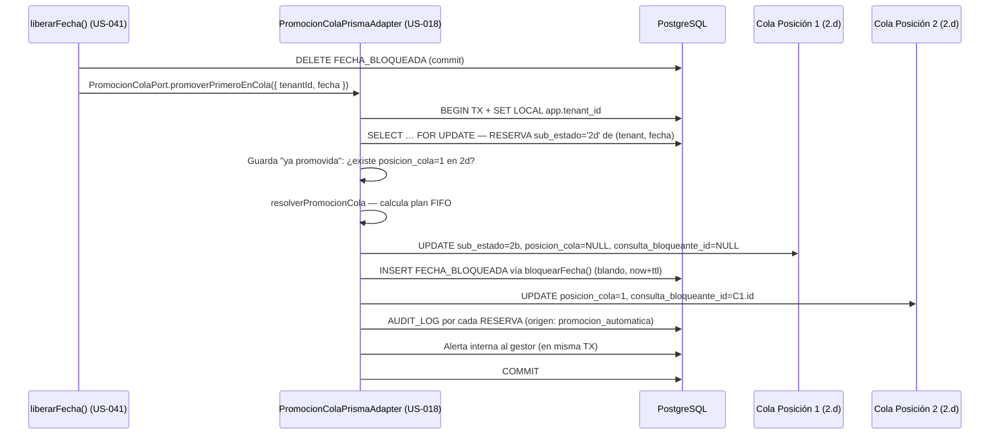

**Flujo B — Diagrama de secuencia (promoción manual, US-019):**

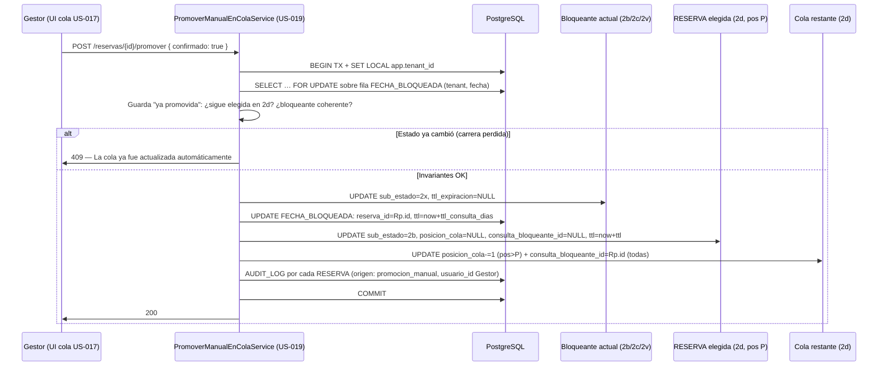

---

#### UC-13: Salir Voluntariamente de la Cola

| Campo | Descripción |
|-------|-------------|
| **ID** | UC-13 |
| **Nombre** | Salir Voluntariamente de la Cola |
| **Actor Principal** | Gestor |
| **Actores Secundarios** | Sistema |
| **Descripción** | Un cliente en cola decide no esperar más y sale voluntariamente |
| **Precondiciones** | - Consulta en sub-estado 2.d |
| **Postcondiciones** | - Consulta pasa a sub-estado 2.z<br>- Cola reordenada |
| **Prioridad** | Media |
| **Frecuencia** | Baja |

**Flujo Básico (gestor):**
1. El gestor abre la ficha de consulta en cola
2. El gestor selecciona "Forzar salida de cola"
3. El gestor opcionalmente indica motivo
4. El sistema cambia sub-estado de 2.d a 2.z
5. El sistema reordena la cola (los siguientes suben una posición)
6. El sistema muestra confirmación al cliente

---

### ÁREA: PRE-RESERVA Y PRESUPUESTOS

---

#### UC-14: Generar Presupuesto (Activar Pre-reserva)

| Campo | Descripción |
|-------|-------------|
| **ID** | UC-14 |
| **Nombre** | Generar Presupuesto (Activar Pre-reserva) |
| **Actor Principal** | Gestor |
| **Actores Secundarios** | Sistema |
| **Descripción** | El Gestor genera un presupuesto formal cuando el cliente ha confirmado todos los datos necesarios, activando la transición al estado `pre_reserva`. El flujo se divide en dos fases: **preview** (borrador editable, sin persistencia) y **confirmación** (transacción única que coordina PRESUPUESTO + RESERVA + FECHA_BLOQUEADA + cola + AUDIT_LOG). Implementado en **US-014** (change `us-014-generar-presupuesto-activar-prereserva`). |
| **Precondiciones** | - RESERVA en `estado = 'consulta'`, `sub_estado ∈ {'2a','2b','2c','2v'}` (guarda declarativa `ORIGENES_TRANSICION_ACTIVAR_PRERESERVA`; `2d`, terminales y `pre_reserva`/posteriores se rechazan sin efectos)<br>- **No existe** PRESUPUESTO en `estado = 'enviado'` o `'aceptado'` para esa RESERVA (si existe, remitir a UC-15)<br>- Datos de reserva completos: `fecha_evento` (futura), `duracion_horas ∈ {4,8,12}`, `num_adultos_ninos_mayores4 ≥ 1`, `tipo_evento ∈ {boda,corporativo,privado,otro}`<br>- Datos fiscales del CLIENTE no nulos ni vacíos: `dni_nif`, `direccion`, `codigo_postal`, `poblacion`, `provincia` (si faltan, error enumera campos faltantes vía `camposFaltantes` en el cuerpo del 422, propagado por `HttpExceptionFilter`)<br>- Gestor autenticado con rol gestor sobre el tenant |
| **Postcondiciones** | - PRESUPUESTO creado con `version = 1`, `tarifa_congelada = true`, `estado = 'enviado'`, `iva_porcentaje = 21`, desglose fiscal congelado<br>- RESERVA pasa a `estado = 'pre_reserva'`, `ttl_expiracion = now() + TENANT_SETTINGS.ttl_prereserva_dias` (7 días por defecto, nunca hardcodeado)<br>- FECHA_BLOQUEADA: si origen `2b`/`2c`/`2v` → UPDATE del `ttl_expiracion`; si origen `2a` → INSERT nueva fila; `tipo_bloqueo = 'blando'` en ambos casos<br>- Cola vaciada: todas las RESERVA con `consulta_bloqueante_id = id` y `sub_estado = '2d'` pasan a `'2y'`, `posicion_cola = NULL`, `consulta_bloqueante_id = NULL` (mecánica A16)<br>- `AUDIT_LOG accion='transicion'` para la RESERVA principal y para cada RESERVA descartada de la cola<br>- Post-commit: PDF generado (Puppeteer/react-pdf), `PRESUPUESTO.pdf_url` actualizado; E2 disparado vía motor US-045 (fallo del proveedor no revierte la pre-reserva; queda trazado en `COMUNICACION`) |
| **Prioridad** | Crítica |
| **Frecuencia** | Alta |
| **US** | US-014 |
| **Endpoints** | `POST /reservas/{id}/presupuesto/preview` (borrador sin persistencia) · `POST /reservas/{id}/presupuesto` (confirmación) |
| **Entidades afectadas** | PRESUPUESTO (INSERT), RESERVA (UPDATE estado + TTL), FECHA_BLOQUEADA (INSERT o UPDATE ttl_expiracion), COMUNICACION (INSERT E2), AUDIT_LOG — sin migración nueva (PRESUPUESTO ya existía en el modelo desde US-000; columnas `fecha_envio` y `fecha_actualizacion` ya presentes) |

**Flujo Básico — fase preview:**
1. El gestor abre la ficha de consulta en `sub_estado ∈ {2a,2b,2c,2v}` y hace clic en "Generar presupuesto"
2. El frontend llama a `POST /reservas/{id}/presupuesto/preview` con body opcional `{ extras?, descuento_eur?, precio_manual_eur? }`
3. El sistema valida la guarda de origen y los datos fiscales del cliente (sin efectos si algo falla)
4. El sistema delega el cálculo al motor de tarifa (UC-16 / US-016): recibe `{ temporada, tarifa_a_consultar, precio_tarifa_eur, extras_total_eur, total_eur, tarifa_id }`
5. El sistema devuelve el borrador con: base imponible, IVA 21%, extras, total, reparto 40%/60%/fianza, instrucciones de transferencia (IBAN, beneficiario, concepto del tenant). **Sin persistencia**: ninguna fila de PRESUPUESTO se crea, la RESERVA no se muta, `FECHA_BLOQUEADA` no se toca
6. Si `tarifa_a_consultar = true` (>50 invitados): el sistema muestra la tarifa como "A consultar" y habilita un campo de precio total manual; la confirmación no está disponible hasta que el Gestor introduzca el precio
7. El gestor revisa el borrador y puede ajustar extras y descuentos (nuevas llamadas a `preview`)

**Flujo Básico — fase confirmación:**
8. El gestor confirma el borrador (`POST /reservas/{id}/presupuesto` con body `{ extras, descuento_eur?, descuento_motivo?, precio_manual_eur? }`)
9. El sistema vuelve a validar la guarda de origen y los datos fiscales
10. El sistema llama al motor de tarifa (o usa `precio_manual_eur` si `tarifa_a_consultar = true`)
11. En una **única transacción all-or-nothing** serializada por `SELECT … FOR UPDATE` sobre la fila de `FECHA_BLOQUEADA`:
    - INSERT en PRESUPUESTO: `version = 1`, `tarifa_congelada = true`, `estado = 'enviado'`, `iva_porcentaje = 21`, `base_imponible`, `iva_importe`, `total`, `descuento_eur?`, `descuento_motivo?`, `fecha_envio = now()`
    - UPDATE RESERVA: `estado = 'pre_reserva'`, `sub_estado = NULL`, `ttl_expiracion = now() + ttl_prereserva_dias`
    - UPDATE (o INSERT si `2a`) de FECHA_BLOQUEADA: `ttl_expiracion = now() + ttl_prereserva_dias`, `tipo_bloqueo = 'blando'`
    - UPDATE masivo de RESERVA en `2d` con `consulta_bloqueante_id = id`: `sub_estado = '2y'`, `posicion_cola = NULL`, `consulta_bloqueante_id = NULL` (vaciado cola A16; si cola vacía, 0 filas afectadas sin error)
    - INSERT AUDIT_LOG `accion='transicion'` para la RESERVA principal y para cada RESERVA descartada
12. Post-commit (no bloqueante): generación del PDF (Puppeteer/react-pdf) + UPDATE de `PRESUPUESTO.pdf_url`; disparo de E2 vía motor US-045 con el PDF adjunto por referencia a `pdf_url`. Un fallo en la generación del PDF o en el envío del email no revierte la pre-reserva
13. El sistema responde `201` con: PRESUPUESTO (`id`, `version`, `total`, `pdf_url`, `estado`) + nuevo `estado`/`ttlExpiracion` de la RESERVA + `consultasDescartadas` (recuento)

**Flujos Alternativos:**
- **FA-01** (datos fiscales incompletos): el sistema responde `422` con `camposFaltantes: ['dni_nif', ...]` enumerando los campos fiscales que faltan; sin efectos sobre PRESUPUESTO, RESERVA ni FECHA_BLOQUEADA. El `HttpExceptionFilter` propaga `camposFaltantes` en el body del error.
- **FA-02** (`tarifa_a_consultar = true` — más de 50 invitados): el motor devuelve `tarifa_a_consultar = true` con importes a `null`; el sistema muestra "A consultar" y habilita precio manual. Al confirmar, `PRESUPUESTO.total` es el `precio_manual_eur` introducido por el Gestor; `tarifa_id` no se almacena (es `null`). Sin precio manual: `422` bloqueante.
- **FA-03** (gestor cancela en fase borrador): no hay efectos; la RESERVA permanece en su sub-estado anterior; `FECHA_BLOQUEADA` no se modifica; ningún email se envía.
- **FA-04** (guarda de origen — RESERVA en `2.d` o terminal): `422` sin efectos; la cola ni la bloqueante se modifican.
- **FA-05** (PRESUPUESTO ya enviado/aceptado): `409` indicando que debe usarse la edición (UC-15); sin crear nuevo PRESUPUESTO.
- **FA-06** (error de configuración del motor de tarifa — `TARIFA_NO_CONFIGURADA` / `TEMPORADA_NO_CONFIGURADA` / `EXTRA_NO_ENCONTRADO`): `422` con mensaje legible; sin crear PRESUPUESTO, sin mutar RESERVA.
- **FA-07** (carrera de concurrencia — dos confirmaciones sobre la misma RESERVA, o la fecha fue bloqueada por otro tenant): el `SELECT … FOR UPDATE` + `UNIQUE(tenant_id, fecha)` lo serializa; el perdedor recibe `409` `FECHA_YA_BLOQUEADA` sin estado intermedio.

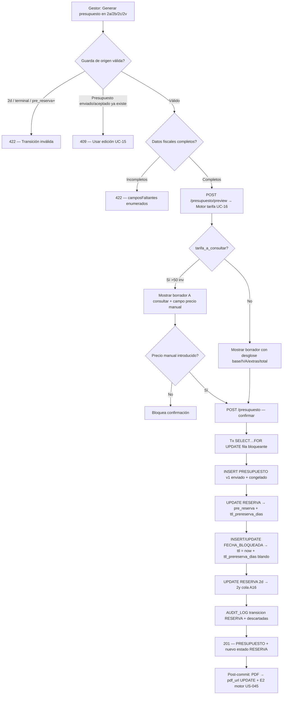

---

#### UC-15: Editar y Enviar Presupuesto

| Campo | Descripción |
|-------|-------------|
| **ID** | UC-15 |
| **Nombre** | Editar y Enviar Presupuesto |
| **Actor Principal** | Gestor |
| **Actores Secundarios** | Sistema |
| **Descripción** | El gestor edita un presupuesto existente antes de enviarlo o reenvía uno ya enviado |
| **Precondiciones** | - Reserva en estado pre_reserva<br>- Presupuesto generado |
| **Postcondiciones** | - Presupuesto actualizado<br>- Nueva versión enviada al cliente |
| **Prioridad** | Media |
| **Frecuencia** | Media |

**Flujo Básico:**
1. El gestor abre la ficha de pre_reserva
2. El gestor accede al presupuesto
3. El gestor modifica campos editables:
   - Cantidades
   - Extras
   - Descuentos especiales
4. El sistema recalcula totales
5. El sistema regenera el PDF
6. El gestor confirma el envío
7. El sistema envía el presupuesto actualizado
8. El sistema registra la versión en audit log

---

#### UC-16: Calcular Tarifa según Configuración

| Campo | Descripción |
|-------|-------------|
| **ID** | UC-16 |
| **Nombre** | Calcular Tarifa según Configuración |
| **Actor Principal** | Sistema |
| **Actores Secundarios** | - |
| **Descripción** | El sistema calcula automáticamente la tarifa aplicable según el tarifario configurado del tenant. Motor de lectura pura, stateless y determinista (US-016). Invocado por UC-14 y UC-15. Endpoint: `POST /api/tarifas/calcular` |
| **Precondiciones** | - `fecha_evento` estrictamente futura: no nula, no pasada y **no el mismo día** (comparación por día natural UTC)<br>- `duracion_horas` ∈ {4, 8, 12}<br>- `num_adultos_ninos_mayores4` ≥ 0 (niños ≤ 4 años no se pasan ni cuentan para el tramo)<br>- Tarifario del tenant configurado (`TARIFA` + `TEMPORADA_CALENDARIO`)<br>- Extras opcionales del catálogo del tenant (cada uno: `extra_id` no nulo y `cantidad` ≥ 1) |
| **Postcondiciones** | - Esquema canónico D-1 devuelto: `{ temporada, tarifa_a_consultar, precio_tarifa_eur, extras_total_eur, total_eur, tarifa_id }`. Los cuatro campos monetarios/id son `null` cuando `tarifa_a_consultar=true` |
| **Prioridad** | Crítica |
| **Frecuencia** | Muy alta |

**Flujo Básico:**
1. El sistema valida los inputs (ver precondiciones); rechaza con error 400 si alguno no cumple.
2. El sistema determina la temporada consultando `TEMPORADA_CALENDARIO` del tenant para el mes de `fecha_evento`:
   - Alta: meses 5, 6, 7, 8, 9 (mayo–septiembre)
   - Media: meses 3, 4, 10, 11 (marzo, abril, octubre, noviembre)
   - Baja: meses 12, 1, 2 (diciembre, enero, febrero)
3. Si `num_adultos_ninos_mayores4 > 50` → el sistema devuelve `tarifa_a_consultar: true` con `temporada` resuelta y los cuatro campos restantes a `null` (200 sin error; fin del flujo). Los niños ≤ 4 años no son input y no modifican este cálculo.
4. El sistema busca la fila `TARIFA` del tenant vigente en `fecha_evento` donde `temporada` coincide, `duracion_horas` coincide y `num_adultos_ninos_mayores4` está en el rango `invitados_min..invitados_max`. Los tramos del tarifario de Masia l'Encís son: **1-20, 21-25, 26-30, 31-40, 41-50**.
5. El sistema suma los extras del catálogo del tenant: por cada `{ extra_id, cantidad }`, calcula `precio_eur × cantidad`; la suma es `extras_total_eur`.
6. El sistema devuelve el esquema D-1: `precio_tarifa_eur` (IVA 21% incluido), `extras_total_eur`, `total_eur = precio_tarifa_eur + extras_total_eur`, `tarifa_id` y `tarifa_a_consultar: false`.

**Flujos Alternativos:**
- **FA-01**: `num_adultos_ninos_mayores4 > 50` → Respuesta 200 con `tarifa_a_consultar: true`, `temporada` presente, importes (`precio_tarifa_eur`, `extras_total_eur`, `total_eur`) y `tarifa_id` a `null`. No es un error; habilita precio manual en el flujo invocante (UC-14/FA-02).
- **FA-02**: No existe `TARIFA` vigente para la combinación válida (≤ 50 invitados) → Error 422 `TARIFA_NO_CONFIGURADA` con detalle `{ temporada, duracion_horas, num_invitados }`.
- **FA-03**: El mes de `fecha_evento` no tiene fila en `TEMPORADA_CALENDARIO` del tenant → Error 422 `TEMPORADA_NO_CONFIGURADA` con detalle `{ mes }`.
- **FA-04**: Un `extra_id` no existe, está inactivo (`activo=false`) o pertenece a otro tenant (RLS) → Error 404 `EXTRA_NO_ENCONTRADO` con detalle `{ extra_id, motivo }`.
- **FA-05**: Cualquier input fuera de rango (ver precondiciones) → Error 400 de validación.

---

### ÁREA: CONFIRMACIÓN DE RESERVA

---

#### UC-17: Confirmar Pago de Señal

| Campo | Descripción |
|-------|-------------|
| **ID** | UC-17 |
| **Nombre** | Confirmar Pago de Señal |
| **Actor Principal** | Gestor |
| **Actores Secundarios** | Sistema |
| **Descripción** | El gestor registra la recepción del justificante de pago de la señal (40%), confirmando la reserva |
| **Precondiciones** | - Reserva en estado pre_reserva<br>- Justificante de pago recibido |
| **Postcondiciones** | - Estado cambia a reserva_confirmada<br>- Fecha bloqueada definitivamente<br>- Factura de señal generada<br>- Sub-procesos paralelos activados<br>- Condiciones particulares generadas |
| **Prioridad** | Crítica |
| **Frecuencia** | Alta |

**Flujo Básico:**
1. El gestor abre la ficha de pre_reserva
2. El gestor selecciona "Confirmar pago de señal"
3. El gestor sube el justificante de pago (imagen/PDF)
4. El sistema registra el justificante
5. El sistema cambia estado a reserva_confirmada
6. El sistema aplica bloqueo definitivo (sin TTL)
7. El sistema genera factura de señal (40%) como borrador
8. El gestor revisa y aprueba la factura
9. El sistema genera documento de condiciones particulares
10. El sistema activa los tres sub-procesos paralelos:
    - pre_evento_status = pendiente
    - liquidacion_status = pendiente
    - fianza_status = pendiente
11. El sistema genera checklist pre-evento
12. El sistema crea ficha operativa del evento (vacía)
13. El sistema envía email E3 con:
    - Factura de señal adjunta
    - Condiciones particulares adjuntas
    - Próximos hitos
14. El sistema registra en audit log

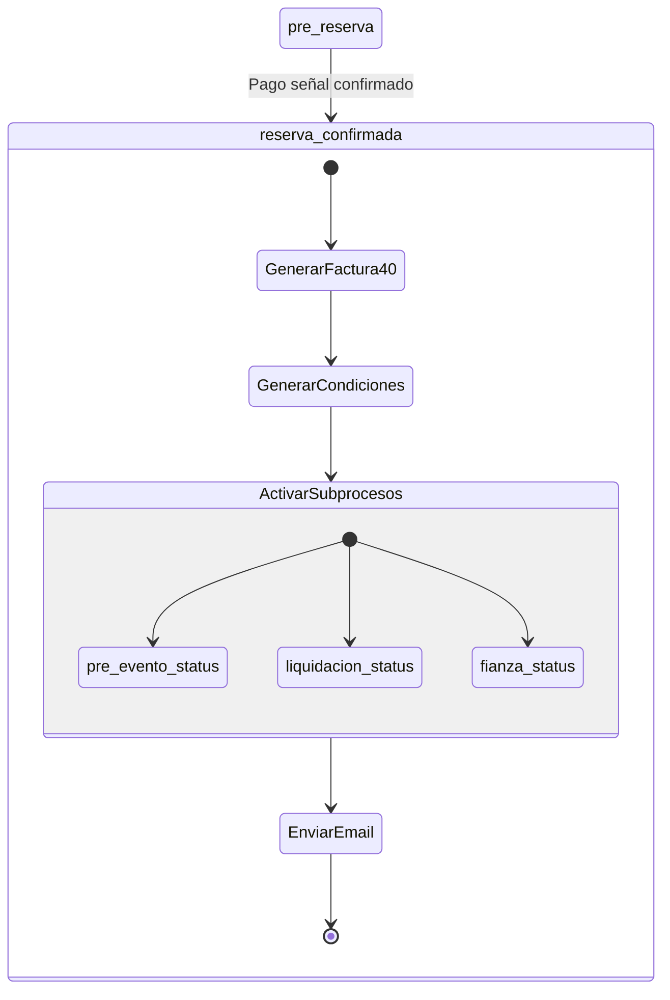

---

#### UC-18: Generar Factura de Señal

| Campo | Descripción |
|-------|-------------|
| **ID** | UC-18 |
| **Nombre** | Generar Factura de Señal |
| **Actor Principal** | Sistema |
| **Actores Secundarios** | Gestor |
| **Descripción** | El sistema genera automáticamente la factura correspondiente al 40% de señal |
| **Precondiciones** | - Pago de señal confirmado<br>- Datos fiscales del cliente completos |
| **Postcondiciones** | - Factura de señal generada<br>- Factura disponible para revisión |
| **Prioridad** | Crítica |
| **Frecuencia** | Alta |

**Flujo Básico:**
1. El sistema calcula el 40% del presupuesto aceptado
2. El sistema desglosa base imponible e IVA 21%
3. El sistema genera el PDF de factura con:
   - Datos del tenant (emisor)
   - Datos fiscales del cliente (receptor)
   - Concepto: "Señal reserva evento [fecha]"
   - Desglose: base imponible + IVA
4. El sistema presenta la factura como borrador
5. El gestor revisa y aprueba
6. La factura queda lista para envío

---

#### UC-19: Gestionar Condiciones Particulares

| Campo | Descripción |
|-------|-------------|
| **ID** | UC-19 |
| **Nombre** | Gestionar Condiciones Particulares |
| **Actor Principal** | Gestor |
| **Actores Secundarios** | Sistema, Cliente |
| **Descripción** | El gestor gestiona el ciclo de vida del documento de condiciones particulares: generación, envío, seguimiento y registro de firma |
| **Precondiciones** | - Reserva en estado reserva_confirmada |
| **Postcondiciones** | - Estado de condiciones particulares actualizado |
| **Prioridad** | Alta |
| **Frecuencia** | Alta |

**Flujo Básico (generación y envío):**
1. Al confirmar la señal, el sistema genera el documento de condiciones particulares
2. El documento se adjunta en el email E3
3. El sistema registra `condiciones_particulares_enviadas_fecha`

**Flujo Básico (registro de firma):**
1. El cliente devuelve el documento firmado (email o físico)
2. El gestor abre la ficha de reserva
3. El gestor selecciona "Registrar condiciones firmadas"
4. El gestor sube el documento firmado
5. El sistema actualiza:
   - `condiciones_particulares_firmadas = true`
   - `condiciones_particulares_firmadas_fecha`
   - `condiciones_particulares_firmadas_url`
6. El sistema registra en audit log

**Flujos Alternativos:**
- **FA-01**: Día del evento sin firma → Sistema alerta al gestor (puede firmarse presencialmente)

---

### ÁREA: SUB-PROCESOS PARALELOS

---

#### UC-20: Gestionar Sub-proceso Pre-evento

| Campo | Descripción |
|-------|-------------|
| **ID** | UC-20 |
| **Nombre** | Gestionar Sub-proceso Pre-evento |
| **Actor Principal** | Gestor |
| **Actores Secundarios** | Sistema, Cliente |
| **Descripción** | El gestor cumplimenta progresivamente la ficha operativa del evento durante el periodo previo al evento |
| **Precondiciones** | - Reserva en estado reserva_confirmada<br>- pre_evento_status = pendiente o en_curso |
| **Postcondiciones** | - Ficha operativa actualizada<br>- pre_evento_status puede cambiar a cerrado |
| **Prioridad** | Alta |
| **Frecuencia** | Alta |

**Flujo Básico:**
1. El gestor abre la ficha operativa del evento
2. El gestor cumplimenta campos progresivamente:
   - Nº invitados final
   - Menús seleccionados
   - Timing detallado
   - Contactos del evento
   - Notas operativas
3. El sistema guarda los cambios
4. El sistema actualiza pre_evento_status a en_curso
5. Cuando la ficha está completa, el gestor marca "Ficha cerrada"
6. El sistema actualiza pre_evento_status a cerrado

**Flujos Alternativos:**
- **FA-01**: T-1d sin cerrar → Sistema cierra automáticamente con datos disponibles

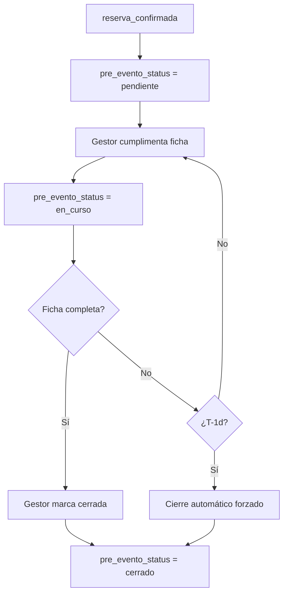

---

#### UC-21: Gestionar Sub-proceso Liquidación

| Campo | Descripción |
|-------|-------------|
| **ID** | UC-21 |
| **Nombre** | Gestionar Sub-proceso Liquidación |
| **Actor Principal** | Gestor |
| **Actores Secundarios** | Sistema |
| **Descripción** | El gestor gestiona el cobro del 60% restante (liquidación) antes del evento |
| **Precondiciones** | - Reserva en estado reserva_confirmada<br>- liquidacion_status = pendiente o facturada |
| **Postcondiciones** | - liquidacion_status actualizado<br>- Factura de liquidación generada/enviada/cobrada |
| **Prioridad** | Crítica |
| **Frecuencia** | Alta |

**Flujo Básico:**
1. El sistema genera factura de liquidación en borrador (60% + extras)
2. El sistema alerta al gestor
3. El gestor revisa y ajusta si es necesario
4. El gestor aprueba y envía la factura
5. El sistema actualiza liquidacion_status = facturada
6. El sistema envía email E4 al cliente
7. El cliente realiza el pago
8. El gestor recibe justificante
9. El gestor sube justificante al sistema
10. El sistema actualiza liquidacion_status = cobrada
11. El sistema registra en audit log

**Flujos Alternativos:**
- **FA-01**: T-1d sin cobro → Política "Negociable" activada, alerta crítica al gestor

---

#### UC-22: Gestionar Sub-proceso Fianza

| Campo | Descripción |
|-------|-------------|
| **ID** | UC-22 |
| **Nombre** | Gestionar Sub-proceso Fianza |
| **Actor Principal** | Gestor |
| **Actores Secundarios** | Sistema |
| **Descripción** | El gestor gestiona el cobro de la fianza (depósito reembolsable) antes o el día del evento |
| **Precondiciones** | - Reserva en estado reserva_confirmada<br>- fianza_status = pendiente o recibo_enviado |
| **Postcondiciones** | - fianza_status actualizado<br>- fianza_eur y fianza_cobrada_fecha registrados |
| **Prioridad** | Alta |
| **Frecuencia** | Alta |

**Flujo Básico:**
1. El sistema genera recibo de fianza independiente
2. El sistema alerta al gestor
3. El gestor envía el recibo al cliente (puede ser con liquidación o separado)
4. El sistema actualiza fianza_status = recibo_enviado
5. El cliente realiza el pago (antes o el día del evento)
6. El gestor recibe justificante
7. El gestor sube justificante al sistema
8. El sistema registra:
   - `fianza_eur`
   - `fianza_cobrada_fecha`
9. El sistema actualiza fianza_status = cobrada
10. El sistema registra en audit log

**Flujos Alternativos:**
- **FA-01**: T-0 sin cobro → Política "Negociable" activada, decisión manual del gestor

---

### ÁREA: EJECUCIÓN DEL EVENTO

---

#### UC-23: Iniciar Evento

| Campo | Descripción |
|-------|-------------|
| **ID** | UC-23 |
| **Nombre** | Iniciar Evento |
| **Actor Principal** | Sistema / Gestor |
| **Actores Secundarios** | Equipo |
| **Descripción** | El sistema transiciona la reserva al estado evento_en_curso cuando se cumplen las precondiciones |
| **Precondiciones** | - Reserva en estado reserva_confirmada<br>- pre_evento_status = cerrado<br>- liquidacion_status = cobrada<br>- fianza_status = cobrada<br>- Es el día del evento |
| **Postcondiciones** | - Estado cambia a evento_en_curso<br>- Vista móvil activada<br>- Checklist de documentación visible |
| **Prioridad** | Alta |
| **Frecuencia** | Media |

**Flujo Básico:**
1. El sistema detecta que es el día del evento (00:00)
2. El sistema verifica las precondiciones
3. Todas las precondiciones se cumplen
4. El sistema cambia estado a evento_en_curso
5. El sistema envía briefing operativo al equipo
6. El sistema activa vista móvil "evento en curso"
7. El sistema muestra checklist de documentación pendiente

**Flujos Alternativos:**
- **FA-01**: Precondiciones no cumplidas → Alerta crítica, gestor puede forzar inicio

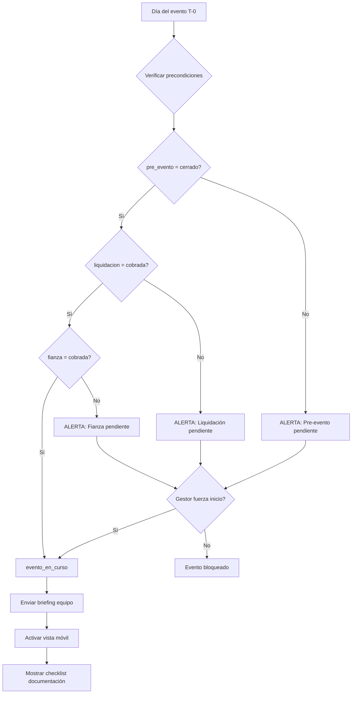

---

#### UC-24: Capturar Documentación del Evento

| Campo | Descripción |
|-------|-------------|
| **ID** | UC-24 |
| **Nombre** | Capturar Documentación del Evento |
| **Actor Principal** | Gestor / Equipo |
| **Actores Secundarios** | Sistema |
| **Descripción** | El personal captura la documentación obligatoria durante el evento: foto DNI y cláusula de responsabilidad firmada |
| **Precondiciones** | - Reserva en estado evento_en_curso |
| **Postcondiciones** | - Documentación registrada<br>- URLs almacenadas<br>- Checklist actualizado |
| **Prioridad** | Alta |
| **Frecuencia** | Media |

**Flujo Básico:**
1. El gestor/equipo accede a la vista móvil del evento
2. El gestor/equipo ve el checklist de documentación:
   - [ ] Foto DNI cliente (anverso)
   - [ ] Foto DNI cliente (reverso)
   - [ ] Cláusula de responsabilidad firmada
3. Para cada documento, el gestor/equipo:
   a. Hace clic en el ítem
   b. Captura/sube la imagen/documento
   c. El sistema registra la URL
   d. El checklist marca el ítem como completado
4. El sistema registra en audit log

**Flujos Alternativos:**
- **FA-01**: Documentación incompleta al finalizar → No bloquea, pero queda marcado

---

#### UC-25: Finalizar Evento

| Campo | Descripción |
|-------|-------------|
| **ID** | UC-25 |
| **Nombre** | Finalizar Evento |
| **Actor Principal** | Gestor |
| **Actores Secundarios** | Sistema |
| **Descripción** | El gestor marca el evento como finalizado, iniciando el proceso de post-evento |
| **Precondiciones** | - Reserva en estado evento_en_curso |
| **Postcondiciones** | - Estado cambia a post_evento<br>- Solicitud de IBAN enviada (si hay fianza)<br>- NPS programada |
| **Prioridad** | Alta |
| **Frecuencia** | Media |

**Flujo Básico:**
1. El gestor accede a la ficha de reserva
2. El gestor selecciona "Marcar evento como finalizado"
3. El sistema verifica documentación del evento
4. Si falta documentación: el sistema muestra alerta (no bloquea)
5. El sistema cambia estado a post_evento
6. Si hay fianza cobrada (`fianza_eur` > 0):
   a. El sistema envía email E5 solicitando IBAN
7. El sistema programa envío de NPS a T+3d
8. El sistema registra en audit log

---

### ÁREA: POST-EVENTO

---

#### UC-26: Solicitar IBAN para Devolución de Fianza

| Campo | Descripción |
|-------|-------------|
| **ID** | UC-26 |
| **Nombre** | Solicitar IBAN para Devolución de Fianza |
| **Actor Principal** | Sistema |
| **Actores Secundarios** | Cliente |
| **Descripción** | El sistema solicita automáticamente al cliente su IBAN para proceder con la devolución de la fianza |
| **Precondiciones** | - Reserva en estado post_evento<br>- fianza_eur > 0 |
| **Postcondiciones** | - Email E5 enviado al cliente<br>- Recordatorios programados |
| **Prioridad** | Alta |
| **Frecuencia** | Media |

**Flujo Básico:**
1. Al entrar en post_evento, el sistema detecta fianza cobrada
2. El sistema envía email E5: "El evento ha finalizado. Para devolverte la fianza, indícanos tu IBAN."
3. El sistema programa recordatorio a T+3d si no hay respuesta
4. El sistema programa segundo recordatorio a T+7d si sigue sin respuesta

**Flujos Alternativos:**
- **FA-01**: Cliente proporciona IBAN → UC-27

---

#### UC-27: Procesar Devolución de Fianza

| Campo | Descripción |
|-------|-------------|
| **ID** | UC-27 |
| **Nombre** | Procesar Devolución de Fianza |
| **Actor Principal** | Gestor |
| **Actores Secundarios** | Sistema |
| **Descripción** | El gestor procesa la devolución de la fianza al cliente tras recibir el IBAN |
| **Precondiciones** | - Reserva en estado post_evento<br>- `iban_devolucion` registrado |
| **Postcondiciones** | - `fianza_devuelta_fecha` registrada<br>- `fianza_devuelta_eur` registrado<br>- Justificante de transferencia almacenado |
| **Prioridad** | Alta |
| **Frecuencia** | Media |

**Flujo Básico (devolución completa):**
1. El cliente proporciona IBAN (email, formulario)
2. El sistema registra `iban_devolucion`
3. El sistema alerta al gestor
4. El gestor realiza la transferencia externamente
5. El gestor accede a la ficha de reserva
6. El gestor selecciona "Registrar devolución de fianza"
7. El gestor introduce:
   - Importe devuelto = fianza_eur
   - Justificante de transferencia
8. El sistema registra:
   - `fianza_devuelta_fecha`
   - `fianza_devuelta_eur`
9. El sistema registra en audit log

**Flujos Alternativos:**
- **FA-01**: Devolución parcial por desperfectos → Gestor indica importe menor + motivo
- **FA-02**: IBAN erróneo → Gestor marca como inválido, sistema solicita nuevo IBAN

---

#### UC-28: Archivar Reserva

| Campo | Descripción |
|-------|-------------|
| **ID** | UC-28 |
| **Nombre** | Archivar Reserva |
| **Actor Principal** | Sistema / Gestor |
| **Actores Secundarios** | - |
| **Descripción** | La reserva pasa al histórico consultable, quedando en estado terminal |
| **Precondiciones** | - Reserva en estado post_evento<br>- No hay acciones pendientes (fianza resuelta) |
| **Postcondiciones** | - Estado cambia a reserva_completada<br>- Reserva indexada para búsqueda<br>- Reserva accesible en histórico |
| **Prioridad** | Media |
| **Frecuencia** | Media |

**Flujo Básico (automático T+7d):**
1. El sistema detecta que han pasado 7 días desde post_evento
2. El sistema verifica que no hay acciones pendientes
3. El sistema cambia estado a reserva_completada
4. El sistema indexa la reserva para búsqueda full-text
5. El sistema registra en audit log

**Flujo Alternativo (manual):**
1. El gestor abre la ficha de reserva en post_evento
2. El gestor selecciona "Archivar reserva"
3. El sistema verifica que no hay acciones pendientes
4. Continúa desde paso 3 del flujo automático

---

### ÁREA: CALENDARIO Y DISPONIBILIDAD

---

#### UC-29: Consultar Calendario

| Campo | Descripción |
|-------|-------------|
| **ID** | UC-29 |
| **Nombre** | Consultar Calendario (Visualizar el Calendario de Disponibilidad) |
| **Actor Principal** | Gestor |
| **Actores Secundarios** | Sistema |
| **Descripción** | El gestor visualiza el calendario mensual con el estado de disponibilidad de cada fecha mediante un código de colores canónico, incluyendo indicador de cola cuando hay leads en espera. **Vista de lectura pura**: no muta estado. El calendario es la página de inicio del sistema tras el login (sidebar → primera opción). |
| **Precondiciones** | - El gestor está autenticado |
| **Postcondiciones** | - Calendario mostrado con código de colores canónico (SlotifyGeneralSpecs §11.3); sin mutación de `RESERVA` ni `FECHA_BLOQUEADA` |
| **Prioridad** | Crítica |
| **Frecuencia** | Muy alta |
| **US** | US-039 |
| **Endpoint** | `GET /calendario` — query `desde` (date), `hasta` (date), `vista` (`mes`\|`semana`\|`dia`\|`lista`); respuesta 200 `CalendarioResponse` (`rango` + `fechas[]` agregadas por fecha ocupada del tenant); 401 sin sesión; 422 rango inválido |
| **Entidades afectadas** | RESERVA (lectura), FECHA_BLOQUEADA (lectura), TENANT (aislamiento RLS) — sin migración (no hay cambios de esquema) |

**Código de colores canónico (SlotifyGeneralSpecs §11.3):**

| Estado / sub_estado de la reserva bloqueante | Color |
|----------------------------------------------|-------|
| Consulta activa: `2a`, `2b`, `2c`, `2v` | Gris |
| `pre_reserva` | Ámbar |
| `reserva_confirmada`, `evento_en_curso`, `post_evento` | Verde |
| `reserva_completada` | Azul |
| `reserva_cancelada` | Rojo |
| Fecha libre (sin bloqueo activo) | Sin color (celda neutra — ausente en la respuesta) |

Sub-estados terminales (`2x`/`2y`/`2z`) no aparecen: su bloqueo ya fue liberado. `evento_en_curso` y `post_evento` heredan el verde de `reserva_confirmada`; la diferenciación de detalle solo se ve en la ficha de reserva.

**Flujo Básico:**
1. El gestor accede a la sección Calendario (o inicia sesión → redirección automática al Calendario como página de inicio)
2. El frontend calcula el rango del período activo según la vista seleccionada y llama a `GET /calendario?desde=...&hasta=...&vista=mes`
3. El sistema agrega, por cada fecha con `FECHA_BLOQUEADA` activa del tenant, el color derivado del par `(estado, sub_estado)` de la reserva bloqueante y el conteo de cola (`enCola`)
4. El sistema filtra obligatoriamente por `tenant_id` del JWT + RLS; ningún dato de otro tenant es alcanzable
5. El sistema responde con `CalendarioResponse`: `rango` + `fechas[]` (solo fechas ocupadas; las fechas libres no aparecen en la respuesta)
6. El frontend renderiza el calendario (react-big-calendar) con el código de colores: cada fecha con bloqueo activo muestra su celda coloreada; si `enCola ≥ 1`, superpone el indicador `🔁 N en cola` sobre la celda
7. El gestor puede cambiar la vista (mes/semana/día/lista) y navegar entre períodos; el código de colores es idéntico en todas las vistas (el rango recalculado origina una nueva llamada a `GET /calendario`)
8. El gestor puede hacer clic en una fecha con bloqueo activo → el frontend muestra un popover con los campos ya presentes en la respuesta (cliente, sub_estado, TTL restante, enlace a la ficha completa) sin segunda llamada a la API
9. El gestor puede hacer clic en el indicador `🔁` de una fecha → el frontend navega a la vista de cola de esa fecha (UC-11 / US-017), fuera del alcance de esta US

**Flujos Alternativos:**
- **FA-01 (mes sin reservas / fechas libres):** el sistema responde 200 con `fechas: []`; el calendario sigue siendo navegable e interactivo sin errores.
- **FA-02 (mes pasado — histórico):** el sistema devuelve `reserva_completada` (azul) y `reserva_cancelada` (rojo) si tienen fila en `RESERVA`; las consultas terminales (`2x`/`2y`/`2z`) no aparecen (bloqueo ya liberado).
- **FA-03 (sin sesión):** el sistema responde 401; el frontend redirige al login.
- **FA-04 (rango inválido):** `desde > hasta` o fechas malformadas → el sistema responde 422.
- **FA-05 (aislamiento multi-tenant):** la query filtra siempre por `tenant_id` del JWT; con un JWT de otro tenant no aparecen datos del primero.

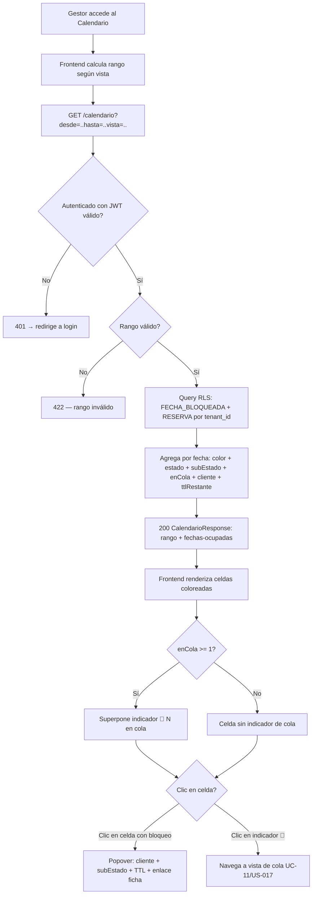

---

#### UC-30: Bloquear Fecha

| Campo | Descripción |
|-------|-------------|
| **ID** | UC-30 |
| **Nombre** | Bloquear Fecha |
| **Actor Principal** | Sistema |
| **Actores Secundarios** | - |
| **Descripción** | El sistema bloquea atómicamente una fecha cuando una consulta/reserva lo requiere |
| **Precondiciones** | - Fecha no tiene bloqueo activo |
| **Postcondiciones** | - Fecha bloqueada<br>- TTL configurado (si aplica)<br>- Bloqueo registrado |
| **Prioridad** | Crítica |
| **Frecuencia** | Alta |

**Flujo Básico:**
1. El sistema recibe solicitud de bloqueo (fecha, tipo, TTL)
2. El sistema inicia transacción atómica (`SELECT ... FOR UPDATE`)
3. El sistema verifica que la fecha está libre
4. El sistema aplica el bloqueo:
   - Bloqueo blando (3/7 días) con TTL → consulta/pre_reserva
   - Bloqueo firme (sin TTL) → reserva_confirmada
5. El sistema programa expiración si hay TTL
6. El sistema confirma la transacción
7. El sistema registra el bloqueo

**Flujos Alternativos:**
- **FA-01**: Fecha ya bloqueada → Rechazar, ofrecer cola si 2.b

---

#### UC-31: Liberar Fecha

| Campo | Descripción |
|-------|-------------|
| **ID** | UC-31 |
| **Nombre** | Liberar Fecha |
| **Actor Principal** | Sistema |
| **Actores Secundarios** | - |
| **Descripción** | El sistema elimina atómicamente el bloqueo de una fecha cuando expira el TTL, el cliente descarta la consulta, o se cancela una reserva confirmada. Complemento de UC-30. Implementado por `liberarFecha()` (US-041). |
| **Precondiciones** | - Existe fila en `FECHA_BLOQUEADA` para `(tenant_id, fecha)` o la operación es idempotente (0 filas es éxito)<br>- Si `tipo_bloqueo = 'firme'`: la `RESERVA` referenciada debe estar en `reserva_cancelada` |
| **Postcondiciones** | - La fila `(tenant_id, fecha)` ya no existe en `FECHA_BLOQUEADA`<br>- Si había cola activa (`sub_estado = '2d'`), se ha invocado `PromocionColaPort` exactamente una vez: el adaptador real `PromocionColaPrismaAdapter` (US-018) ejecuta la mecánica A15 completa (`2d → 2b`, re-bloqueo, reordenación FIFO, alerta interna al gestor)<br>- Acción registrada en `AUDIT_LOG` con causa |
| **Prioridad** | Crítica |
| **Frecuencia** | Alta |
| **Sin endpoint HTTP propio (D-7 / US-041)** | El actor es el Sistema; la liberación es efecto de transiciones de estado y del cron de barrido, no una acción de usuario. No se añade ningún endpoint a `api-spec.yml`. |

**Causas de liberación:**
- **TTL agotado** — bloqueo blando (`tipo_bloqueo = 'blando'`) con `ttl_expiracion < now()`; lanzado por el cron de barrido (US de jobs / US-012).
- **Descarte por cliente o gestor** — la consulta/pre-reserva pasa a estado terminal (`2.z`, `2.x`); lanzado por US-013, US-011.
- **Cancelación de reserva confirmada** — la reserva pasa a `reserva_cancelada`; lanzado por el flujo de cancelación.

**Flujo Básico:**
1. El sistema invoca `liberarFecha({ tenantId, fecha, causa })`.
2. Si `tipo_bloqueo = 'firme'`: el sistema verifica en dominio que la `RESERVA` esté en `reserva_cancelada`; si no, rechaza con `LIBERACION_FIRME_SIN_CANCELACION`, audita el intento y termina.
3. El sistema inicia transacción Prisma con RLS (`SET LOCAL app.tenant_id` vía `set_config`).
4. El sistema ejecuta `DELETE FROM fecha_bloqueada WHERE tenant_id = T AND fecha = D` vía `$executeRaw` y obtiene el número de filas afectadas.
5. El sistema confirma la transacción.
6. Si `rows = 1` (liberación efectiva): el sistema registra en `AUDIT_LOG` (`accion = 'eliminar'`, `entidad = 'FECHA_BLOQUEADA'`, causa en `datos_nuevos`); si existe cola activa (`RESERVA` con `sub_estado = '2d'` y `consulta_bloqueante_id` → reserva liberada), invoca `PromocionColaPort`.
7. Si `rows = 0` (idempotente — fecha ya libre o nunca bloqueada): el sistema registra tentativa en `AUDIT_LOG` y termina sin error ni promoción.

**Flujos Alternativos:**
- **FA-01: Intento de liberar bloqueo firme con reserva activa** → rechazado en paso 2; bloqueo firme intacto; intento auditado.
- **FA-02: Fecha sin bloqueo activo (idempotencia)** → `rows = 0`; éxito silencioso; tentativa registrada en `AUDIT_LOG`; no se dispara promoción. Los retries del cron no generan errores.
- **FA-03: Liberación en lote** → N fechas expiradas procesadas, cada una en su propia transacción independiente; el fallo de una no bloquea ni revierte las demás; cada liberación exitosa dispara su `PromocionColaPort` si corresponde.

**Exactamente-una-vez ante liberaciones concurrentes:**
Si dos workers liberan la misma `(tenant_id, fecha)` simultáneamente, el motor garantiza que exactamente uno obtiene `rows = 1` (y dispara la promoción) y el otro obtiene `rows = 0` (éxito silencioso sin promoción). No hay doble promoción.

**Deuda cerrada (US-018):** la promoción efectiva de cola (reordenación FIFO + re-bloqueo atómico + alerta interna al gestor) está implementada por `PromocionColaPrismaAdapter` (US-018). El stub no-op fue sustituido; la cola ya no permanece en `2.d` indefinidamente tras una liberación con cola activa.

---

### ÁREA: HISTÓRICO

---

#### UC-32: Buscar en Histórico

| Campo | Descripción |
|-------|-------------|
| **ID** | UC-32 |
| **Nombre** | Buscar en Histórico |
| **Actor Principal** | Gestor |
| **Actores Secundarios** | Sistema |
| **Descripción** | El gestor busca y filtra reservas pasadas en el histórico consultable |
| **Precondiciones** | - El gestor está autenticado |
| **Postcondiciones** | - Resultados mostrados según criterios |
| **Prioridad** | Alta |
| **Frecuencia** | Alta |

**Flujo Básico:**
1. El gestor accede a la sección Histórico
2. El sistema muestra la tabla maestra de reservas completadas
3. El gestor puede aplicar filtros:
   - Rango de fechas
   - Tipo de evento
   - Estado final
   - Importe
4. El gestor puede usar búsqueda full-text:
   - Por nombre del cliente
   - Por número de reserva
   - Por email
   - Por observaciones
5. El sistema muestra resultados paginados
6. El gestor puede acceder al detalle de cualquier reserva (modo lectura)

---

#### UC-33: Exportar Reservas

| Campo | Descripción |
|-------|-------------|
| **ID** | UC-33 |
| **Nombre** | Exportar Reservas |
| **Actor Principal** | Gestor |
| **Actores Secundarios** | Sistema |
| **Descripción** | El gestor exporta datos de reservas a formato CSV |
| **Precondiciones** | - El gestor está autenticado<br>- Hay reservas que exportar |
| **Postcondiciones** | - Archivo CSV generado y descargado |
| **Prioridad** | Media |
| **Frecuencia** | Baja |

**Flujo Básico:**
1. El gestor accede al histórico o pipeline
2. El gestor aplica filtros deseados
3. El gestor selecciona "Exportar CSV"
4. El sistema genera el archivo con:
   - Todos los atributos de la reserva
   - Filtros aplicados
5. El sistema inicia la descarga

---

### ÁREA: DASHBOARD

---

#### UC-34: Visualizar Dashboard Operativo

| Campo | Descripción |
|-------|-------------|
| **ID** | UC-34 |
| **Nombre** | Visualizar Dashboard Operativo |
| **Actor Principal** | Gestor |
| **Actores Secundarios** | Sistema |
| **Descripción** | El gestor visualiza el dashboard operativo con la información clave del estado actual del negocio |
| **Precondiciones** | - El gestor está autenticado |
| **Postcondiciones** | - Dashboard mostrado con datos actualizados |
| **Prioridad** | Alta |
| **Frecuencia** | Muy alta |

**Flujo Básico:**
1. El gestor accede al sistema (o navega al dashboard)
2. El sistema muestra los widgets:
   - **Hoy y mañana**: eventos del día y siguiente
   - **Pipeline**: consultas por sub-estado, pre-reservas, confirmadas
   - **Sub-procesos críticos**: reservas con pre-evento/liquidación/fianza atrasada
   - **Pendientes**: pagos vencidos, TTLs próximos a expirar
   - **Consultas en cola**: leads en espera agrupados por fecha
   - **Visitas programadas**: próximas visitas ordenadas por fecha
   - **Próximos 30 días**: calendario resumen
3. El gestor puede interactuar con cada widget para ver detalles
4. El gestor puede navegar directamente a las fichas de reserva

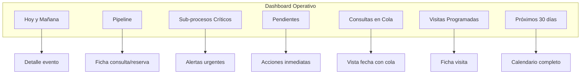

---

### ÁREA: COMUNICACIONES

---

#### UC-35: Enviar Email Automático

| Campo | Descripción |
|-------|-------------|
| **ID** | UC-35 |
| **Nombre** | Enviar Email Automático |
| **Actor Principal** | Sistema |
| **Actores Secundarios** | Cliente |
| **Descripción** | El sistema envía automáticamente un email cuando se cumple un trigger específico |
| **Precondiciones** | - Trigger activado<br>- Datos del cliente disponibles<br>- Plantilla configurada |
| **Postcondiciones** | - Email enviado<br>- Registro en log de comunicaciones |
| **Prioridad** | Crítica |
| **Frecuencia** | Muy alta |

**Emails implementados en MVP:**
| ID | Trigger | Contenido |
|----|---------|-----------|
| E1 | Lead entrante | Respuesta inicial + tarifa estimada |
| E2 | Activar pre-reserva | Presupuesto PDF + instrucciones señal |
| E3 | Confirmar pago señal | Factura 40% + condiciones particulares |
| E4 | Inicio sub-proceso liquidación | Factura liquidación + recibo fianza |
| E5 | Evento finalizado | Agradecimiento + solicitud IBAN |
| E6 | Programar visita | Confirmación visita |
| E7 | Visita realizada + interés | Confirmación bloqueo post-visita |
| E8 | Cliente proporciona IBAN | Confirmación recepción + próximos pasos |

**Flujo Básico:**
1. El sistema detecta el trigger
2. El sistema selecciona la plantilla correspondiente
3. El sistema reemplaza variables con datos de la reserva
4. El sistema genera adjuntos si aplica (PDF)
5. El sistema envía el email
6. El sistema registra en log de comunicaciones de la reserva
7. El sistema registra en audit log

---

#### UC-36: Revisar y Enviar Email Borrador

| Campo | Descripción |
|-------|-------------|
| **ID** | UC-36 |
| **Nombre** | Revisar y Enviar Email Borrador |
| **Actor Principal** | Gestor |
| **Actores Secundarios** | Sistema |
| **Descripción** | El gestor revisa, edita y confirma el envío de un email generado como borrador |
| **Precondiciones** | - Email en estado borrador<br>- Generado automáticamente con comentarios o manualmente |
| **Postcondiciones** | - Email enviado<br>- Registro en log |
| **Prioridad** | Alta |
| **Frecuencia** | Alta |

**Flujo Básico:**
1. El sistema genera email como borrador (ej: lead con comentarios)
2. El sistema notifica al gestor
3. El gestor accede a la ficha de la reserva
4. El gestor abre el borrador de email
5. El gestor revisa el contenido
6. El gestor puede editar texto
7. El gestor confirma el envío
8. El sistema envía el email
9. El sistema registra en logs

---

## 4. Diagrama de Interconexión de Casos de Uso

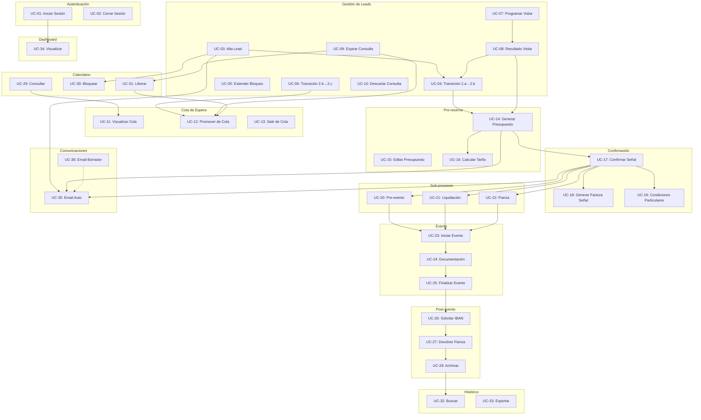

---

## 5. Tabla Comparativa de Casos de Uso

| ID | Caso de Uso | Actor Principal | Impacto Negocio | Prioridad | Complejidad |
|----|-------------|-----------------|-----------------|-----------|-------------|
| UC-01 | Iniciar Sesión | Gestor | Alto | Crítica | Baja |
| UC-02 | Cerrar Sesión | Gestor | Bajo | Alta | Baja |
| UC-03 | Alta Lead | Gestor | Crítico | Crítica | Alta |
| UC-04 | Transición 2.a→2.b | Gestor | Alto | Alta | Media |
| UC-05 | Extender Bloqueo | Gestor | Medio | Media | Baja |
| UC-06 | Transición 2.b→2.c | Gestor | Alto | Alta | Media |
| UC-07 | Programar Visita | Gestor | Alto | Alta | Media |
| UC-08 | Resultado Visita | Gestor | Alto | Alta | Media |
| UC-09 | Expirar Consulta | Sistema | Alto | Crítica | Media |
| UC-10 | Descartar Consulta | Gestor | Medio | Media | Baja |
| UC-11 | Visualizar Cola | Gestor | Medio | Alta | Baja |
| UC-12 | Promover de Cola (automático US-018 / manual US-019) | Sistema/Gestor | Crítico | Crítica | Alta |
| UC-13 | Salir de Cola | Cliente/Gestor | Bajo | Media | Baja |
| UC-14 | Generar Presupuesto | Gestor | Crítico | Crítica | Alta |
| UC-15 | Editar Presupuesto | Gestor | Medio | Media | Media |
| UC-16 | Calcular Tarifa | Sistema | Crítico | Crítica | Media |
| UC-17 | Confirmar Señal | Gestor | Crítico | Crítica | Alta |
| UC-18 | Generar Factura Señal | Sistema | Alto | Crítica | Media |
| UC-19 | Condiciones Particulares | Gestor | Alto | Alta | Media |
| UC-20 | Gestión Pre-evento | Gestor | Alto | Alta | Media |
| UC-21 | Gestión Liquidación | Gestor | Crítico | Crítica | Alta |
| UC-22 | Gestión Fianza | Gestor | Alto | Alta | Media |
| UC-23 | Iniciar Evento | Sistema/Gestor | Alto | Alta | Media |
| UC-24 | Capturar Documentación | Gestor/Equipo | Medio | Alta | Baja |
| UC-25 | Finalizar Evento | Gestor | Alto | Alta | Baja |
| UC-26 | Solicitar IBAN | Sistema | Medio | Alta | Baja |
| UC-27 | Devolver Fianza | Gestor | Medio | Alta | Media |
| UC-28 | Archivar Reserva | Sistema/Gestor | Bajo | Media | Baja |
| UC-29 | Consultar Calendario | Gestor | Alto | Crítica | Media |
| UC-30 | Bloquear Fecha | Sistema | Crítico | Crítica | Alta |
| UC-31 | Liberar Fecha | Sistema | Crítico | Crítica | Alta |
| UC-32 | Buscar Histórico | Gestor | Medio | Alta | Media |
| UC-33 | Exportar Reservas | Gestor | Bajo | Media | Baja |
| UC-34 | Dashboard Operativo | Gestor | Alto | Alta | Media |
| UC-35 | Email Automático | Sistema | Alto | Crítica | Media |
| UC-36 | Email Borrador | Gestor | Medio | Alta | Baja |

---

## 6. Diagrama de Estados Completo del Sistema

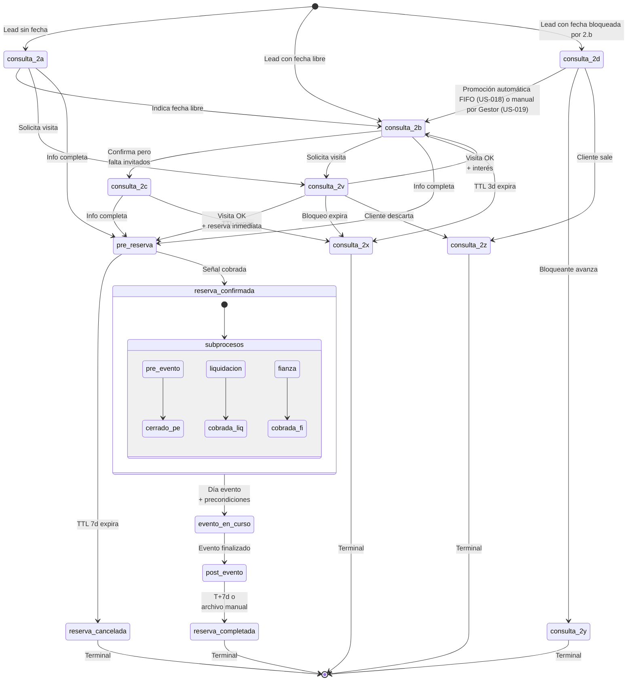

---

## 7. Verificación de Cobertura del MVP

### 7.1 Matriz de Trazabilidad

| Funcionalidad MVP | Casos de Uso que la cubren | Estado |
|-------------------|---------------------------|--------|
| Auth básica + multi-tenant | UC-01, UC-02 | ✅ Cubierto |
| Pipeline completo (2.a-2.z) | UC-03 a UC-13 | ✅ Cubierto |
| Sub-procesos paralelos | UC-20, UC-21, UC-22 | ✅ Cubierto |
| Cola de espera | UC-11, UC-12, UC-13 | ✅ Cubierto |
| Sub-estado 2.v (visita) | UC-07, UC-08 | ✅ Cubierto |
| Calendario visual + bloqueo atómico | UC-29, UC-30, UC-31 | ✅ Cubierto |
| Ficha de reserva | UC-03, UC-17 | ✅ Cubierto |
| Ficha operativa evento | UC-20 | ✅ Cubierto |
| Histórico consultable | UC-32, UC-33 | ✅ Cubierto |
| Motor de tarifas | UC-16 | ✅ Cubierto |
| Generación presupuestos PDF | UC-14, UC-15 | ✅ Cubierto |
| Generación facturas | UC-18, UC-21 | ✅ Cubierto |
| Gestión fianza | UC-22, UC-26, UC-27 | ✅ Cubierto |
| Datos fiscales cliente | UC-03, UC-14 | ✅ Cubierto |
| Condiciones particulares | UC-19 | ✅ Cubierto |
| Documentación día evento | UC-24 | ✅ Cubierto |
| Emails automáticos (E1-E8) | UC-35, UC-36 | ✅ Cubierto |
| Dashboard operativo | UC-34 | ✅ Cubierto |
| Audit log | Transversal en todos los UC | ✅ Cubierto |

### 7.2 Funcionalidades Excluidas del MVP (Solo diseñadas)

| Funcionalidad | Motivo de exclusión |
|---------------|---------------------|
| Detección automática leads recurrentes | Complejidad, no crítico para MVP |
| Importación CSV histórico | No necesario para Masia l'Encís |
| Factura complementaria post-evento | Bajo uso, diferido a V1 |
| Emails de cola | Gestión manual en MVP |
| Recordatorios extendidos | Diferido a V1 |
| Dashboard financiero + KPIs | Diferido a V1 |
| Política cancelación configurable | Hardcoded "Negociable" en MVP |
| Parser emails entrantes | Requiere LLM, diferido |
| Integración Stripe | Pagos manuales en MVP |
| WhatsApp Business API | Diferido a V2 |

---

## 8. Conclusiones

Este análisis ha identificado **36 casos de uso** que cubren completamente la funcionalidad del MVP de Slotify. Los casos se organizan en 12 áreas funcionales que abarcan desde la autenticación hasta el archivo en histórico.

**Puntos clave:**

1. **Flujo principal robusto**: Los casos de uso cubren el ciclo completo lead → archivo con todos los sub-estados y transiciones definidos en la especificación.

2. **Gestión de cola implementada**: La mecánica de cola de espera (UC-11, UC-12, UC-13) está completamente definida. UC-12 cubre los dos flujos: promoción automática FIFO por el Sistema (US-018) y promoción manual por el Gestor de cualquier posición de la cola (US-019), con coordinación anti-doble-promoción via `SELECT … FOR UPDATE` sobre `FECHA_BLOQUEADA`.

3. **Sub-procesos paralelos**: La gestión simultánea de pre-evento, liquidación y fianza (UC-20, UC-21, UC-22) está claramente especificada con sus interacciones.

4. **Bloqueo atómico de fecha**: Los casos UC-30 y UC-31 garantizan la prevención de dobles reservas, el dolor crítico D4.

5. **Comunicaciones automatizadas**: Los 8 emails del flujo principal (E1-E8) están cubiertos por UC-35 y UC-36.

6. **Trazabilidad completa**: Cada caso de uso traza a requisitos específicos de la especificación funcional y a dolores operativos identificados.

---

*Documento generado el 22/05/2026 como parte del análisis de requisitos del TFM de Slotify. Versión 1.4 (03/07/2026): refleja US-019 — Promoción Manual de Consulta en Cola (UC-12 flujo B): actualiza la ficha de UC-12 con el actor dual (Sistema/Gestor), postcondiciones y entidades afectadas para el flujo manual; añade el flujo B completo (pasos 1–8 + FA-01..FA-07) con endpoint `POST /reservas/{id}/promover`, mecánica de expiración forzosa de la bloqueante (`2b/2c/2v → 2x`), re-asignación atómica de `FECHA_BLOQUEADA`, reordenación por cierre de hueco, AUDIT_LOG con `origen: 'promocion_manual'` y política de arbitraje (FIFO estricto, 409 al Gestor si el automático gana); añade diagrama de secuencia Mermaid del flujo B; actualiza la nota sobre US-019 (ya implementada, no futura); precisa la transición `consulta_2d → consulta_2b` en el diagrama §6 para distinguir automática (US-018) y manual (US-019); actualiza §5, §7, §8 con la referencia al flujo manual. Sin migración de esquema (US-019 no añade entidades ni columnas; reutiliza `RESERVA`, `FECHA_BLOQUEADA`, `AUDIT_LOG` y sus campos existentes). Versión 1.3 (30/06/2026): refleja US-039 — visualizar el Calendario de Disponibilidad (UC-29): reemplaza la ficha original de UC-29 con la especificación completa implementada: vista de lectura pura (sin mutación); endpoint `GET /calendario` (query `desde`/`hasta`/`vista`; respuesta `CalendarioResponse` con `rango` + `fechas[]` agregadas por fecha ocupada, incluyendo `color`/`estado`/`subEstado`/`reservaId`/`cliente`/`ttlRestante`/`enCola`; 401 sin sesión; 422 rango inválido); código de colores canónico (SlotifyGeneralSpecs §11.3) como tabla de datos declarativa; indicador `🔁 N en cola` sobre la celda bloqueante; popover de detalle al clic sin segunda llamada; aislamiento multi-tenant + RLS; calendar en react-big-calendar como página de inicio del App Shell; US, endpoint y entidades afectadas (`RESERVA`/`FECHA_BLOQUEADA` — lectura); flujos alternativos FA-01..FA-05 y diagrama Mermaid. Sin migración de esquema (no hay cambios en `RESERVA` ni `FECHA_BLOQUEADA`). Versión 1.2 (30/06/2026): refleja US-008 — programar visita al espacio (UC-07): reemplaza la ficha original de UC-07 con la especificación completa implementada: guarda de origen multi-estado `{2a,2b,2c}→2v`; precondición `fecha_evento` NOT NULL para `2a`; ventana `fecha_visita ∈ [hoy+1, hoy+max_dias_programar_visita]` (setting del tenant); INSERT-o-UPDATE de `FECHA_BLOQUEADA` (`ttl=visita+1 día`) según origen; atomicidad RESERVA+FECHA_BLOQUEADA+AUDIT_LOG en una única transacción; E6 post-commit vía motor US-045; US, endpoint `POST /reservas/{id}/visita`, entidades afectadas, flujos alternativos FA-01..FA-06 y diagrama Mermaid. A19/A20 (recordatorios al gestor) fuera de alcance de esta US (slice de jobs separado). Sin migración de columnas (campos de visita + sub-estado `2v` + `max_dias_programar_visita` ya existentes desde US-000). Versión 1.1 (28/06/2026): refleja US-004 — alta de consulta con fecha (UC-03): actualiza §3 UC-03 — flujo básico paso 3 (`fecha_evento > hoy`, estrictamente futura) y FA-01 (rechaza hoy y pasado con 400 en servidor; divergencia intencional Gate 1 decisión A; trazabilidad a `design.md §D-1`). Corrección transversal: UC-04 precondiciones alineadas con la regla real de `bloquearFecha()` / `validarFechaFutura` (`> hoy`; inconsistencia preexistente respecto a la ficha original).*
