# Análisis de Casos de Uso — Slotify MVP

> **Documento**: Especificación de Casos de Uso  
> **Proyecto**: Slotify — Plataforma SaaS de Gestión Integral para Espacios Boutique de Eventos Privados   
> **Fuente**: SlotifyGeneralSpecs.md

---

## 1. Resumen Ejecutivo

### 1.1 Sistema Analizado

**Slotify** es una plataforma SaaS diseñada para propietarios y gestores de espacios boutique de eventos privados (masías, fincas, villas). El sistema unifica el ciclo completo de gestión de eventos: desde la captación del lead hasta el archivo en el histórico, pasando por presupuestos, facturación y ejecución operativa.

La arquitectura del sistema se fundamenta en la **reserva como entidad central**, diferenciándose de CRMs tradicionales que giran en torno al cliente. El modelo multi-tenant permite aislar datos entre diferentes espacios, aunque el MVP opera con un único tenant (Masia l'Encís).

El flujo principal sigue una **máquina de estados jerárquica** con sub-estados específicos para consultas (2.a-2.z), incluyendo gestión de cola de espera para fechas bloqueadas y sub-procesos paralelos (pre-evento, liquidación, fianza) tras la confirmación de la reserva.

### 1.2 Actores Identificados

| Actor | Descripción | Nivel de interacción |
|-------|-------------|---------------------|
| **Gestor** | Usuario principal del sistema. Gestiona todo el ciclo de vida de las reservas, desde la captación de leads hasta el archivo final. Tiene acceso completo a todas las funcionalidades del MVP. | Alto |
| **Sistema** | Actor automático que ejecuta transiciones de estado, envía emails, gestiona TTLs, promueve consultas de cola y mantiene la consistencia de datos. | Alto |
| **Cliente** | Actor externo que interactúa indirectamente con el sistema a través de emails, formularios web y comunicaciones con el gestor. En MVP no tiene acceso directo al sistema. | Medio (indirecto) |
| **Equipo** | Personal operativo que ejecuta el evento. Accede a briefings y documentación. En MVP tiene interacción limitada. | Bajo |

### 1.3 Criterios de Selección de Casos de Uso

Los casos de uso se han seleccionado aplicando los siguientes criterios:

1. **Cobertura funcional MVP**: Solo se incluyen funcionalidades marcadas como "✅ Implementado" en la matriz de alcance
2. **Valor al usuario**: Priorizando casos que resuelven los dolores operativos identificados (D1-D13)
3. **Viabilidad técnica**: Casos implementables dentro del stack tecnológico definido
4. **Trazabilidad**: Cada caso traza a requisitos específicos de la especificación funcional
5. **Completitud del flujo**: Cubriendo el ciclo completo lead → archivo

### 1.4 Estructura de la Interfaz de Usuario

La aplicación sigue un layout consistente con los siguientes elementos:

#### Sidebar (Menú lateral fijo)

Menú de navegación principal ubicado en el lateral izquierdo, siempre visible:

| Opción | Descripción |
|--------|-------------|
| **Calendario** | Vista principal del calendario de disponibilidad y reservas. Es la página de inicio tras el login. |
| **Reservas** | Listado y gestión de todas las reservas (pipeline, histórico). |
| **Dashboard** | Panel operativo con widgets de resumen y alertas. |

#### Header (Cabecera fija)

Barra superior persistente con elementos de acceso rápido:

| Elemento | Descripción |
|----------|-------------|
| **Indicador reservas hoy** | Muestra el número de reservas/eventos programados para el día actual. |
| **Icono notificaciones** | Acceso a alertas y notificaciones pendientes (TTLs próximos, pagos vencidos, etc.). |
| **Botón nueva reserva** | Acceso directo al formulario de alta de nueva consulta/reserva (UC-03). |

---

## 2. Catálogo de Casos de Uso

### 2.1 Índice por Área Funcional

| Área | Casos de Uso | Cantidad |
|------|--------------|----------|
| Autenticación | UC-01, UC-02 | 2 |
| Gestión de Leads y Consultas | UC-03 a UC-10 | 8 |
| Gestión de Cola de Espera | UC-11 a UC-13 | 3 |
| Pre-reserva y Presupuestos | UC-14 a UC-16 | 3 |
| Confirmación de Reserva | UC-17 a UC-19 | 3 |
| Sub-procesos Paralelos | UC-20 a UC-22 | 3 |
| Ejecución del Evento | UC-23 a UC-25 | 3 |
| Post-evento | UC-26 a UC-28 | 3 |
| Calendario y Disponibilidad | UC-29 a UC-31 | 3 |
| Histórico | UC-32, UC-33 | 2 |
| Dashboard | UC-34 | 1 |
| Comunicaciones | UC-35, UC-36 | 2 |
| **Total** | | **36** |

---

## 3. Casos de Uso Documentados

### ÁREA: AUTENTICACIÓN Y ACCESO

---

#### UC-01: Iniciar Sesión

| Campo | Descripción |
|-------|-------------|
| **ID** | UC-01 |
| **Nombre** | Iniciar Sesión |
| **Actor Principal** | Gestor |
| **Actores Secundarios** | Sistema |
| **Descripción** | El gestor accede al sistema mediante credenciales válidas para gestionar las reservas del tenant |
| **Precondiciones** | - El gestor tiene una cuenta activa en el sistema - El tenant está configurado y activo |
| **Postcondiciones** | - El gestor tiene acceso a las funcionalidades según su rol - Se registra el evento `login` en `AUDIT_LOG` (únicamente en login exitoso; los intentos fallidos no se auditan) - El access token JWT (~15 min) queda en memoria de la SPA; el refresh token (~7 días) queda en cookie `httpOnly + Secure + SameSite` |
| **Prioridad** | Alta |
| **Frecuencia** | Diaria |

**Flujo Básico:**
1. El gestor accede a la URL del sistema
2. El sistema muestra el formulario de login
3. El gestor introduce email y contraseña (el frontend valida por campo antes de llamar a la API: bloquea si email o contraseña están vacíos o el email tiene formato inválido)
4. El sistema valida las credenciales contra el hash argon2 del usuario dentro del tenant
5. El sistema emite un access token JWT de vida corta (~15 min) con `{sub, tenantId, rol, email}` en el payload firmado, y establece el refresh token en cookie `httpOnly + Secure + SameSite`
6. El sistema registra el evento `login` en `AUDIT_LOG`
7. La SPA puebla la sesión en memoria y redirige al calendario

**Flujos Alternativos:**
- **FA-01** (anti-enumeration): Credenciales inválidas (email inexistente o contraseña incorrecta) → El sistema devuelve **401 genérico uniforme** con el mismo mensaje en ambos casos, sin revelar qué campo es incorrecto (OWASP A01). No se emite token ni se registra en `AUDIT_LOG`. El gestor puede reintentar.
- **FA-02**: Cuenta deshabilitada (`activo=false`) → El sistema devuelve el **mismo 401 genérico** que FA-01 (anti-enumeration: la respuesta no distingue esta causa de FA-01). No se emite token ni se registra en `AUDIT_LOG`. La reactivación de la cuenta se hace por script/seed, no por UI.
- **FA-03** (**DIFERIDO**): Sesión activa en otro dispositivo → Las sesiones en múltiples dispositivos coexisten en silencio. El flujo interactivo (continuar / cerrar la sesión anterior) requiere refresh stateful y está diferido (ver DT-AUTH-02 en [architecture.md §2.9](./architecture.md)).
- **FA-04**: Demasiados intentos de login → El sistema devuelve **429** (throttler self-contained: ventana de 5 intentos por 60 s, clave IP+email). La respuesta 429 es genérica e independiente de si el email existe.

---

#### UC-02: Cerrar Sesión

| Campo | Descripción |
|-------|-------------|
| **ID** | UC-02 |
| **Nombre** | Cerrar Sesión |
| **Actor Principal** | Gestor |
| **Actores Secundarios** | Sistema |
| **Descripción** | El gestor cierra su sesión activa de forma segura desde el botón "Cerrar sesión" ubicado en el pie del sidebar (escritorio) o en el drawer de navegación móvil (`<lg`) |
| **Precondiciones** | - El gestor tiene una sesión activa (o ninguna, en el caso del doble logout — ver FA-01) |
| **Postcondiciones** | - La cookie del refresh token queda limpiada en el dispositivo actual; el access token se elimina de la memoria de la SPA y caduca en ~15 min por su vida corta natural - Se registra el evento `logout` en `AUDIT_LOG` con `entidad = 'Usuario'`, `entidad_id = usuario_id`, `usuario_id` y `tenant_id` del refresh token — **solo cuando el token identifica a un usuario válido** (si el token es ausente/expirado/inválido, no se audita) - El gestor es redirigido a `/login` **Nota:** con la estrategia de refresh stateless (DT-AUTH-01 en [architecture.md §2.9](./architecture.md)), el logout es best-effort: limpia la cookie del dispositivo actual pero no invalida criptográficamente el refresh token en el servidor. US-002 ratificó este enfoque (auditoría + idempotencia) y dejó la invalidación stateful real (modelo `SesionRefresh` / denylist) como deuda post-MVP. |
| **Prioridad** | Alta |
| **Frecuencia** | Diaria |

**Flujo Básico:**
1. El gestor selecciona la opción "Cerrar sesión" en el pie del sidebar o en el drawer de navegación
2. El frontend llama a `POST /auth/logout` mediante el SDK generado
3. El sistema identifica al usuario desde el refresh token de la cookie `httpOnly`
4. El sistema registra el evento `logout` en `AUDIT_LOG` (`entidad = 'Usuario'`, `entidad_id = usuario_id`)
5. El sistema limpia la cookie del refresh token y responde 200/204
6. El frontend elimina el access token y la sesión de la memoria de la SPA
7. El frontend redirige al formulario de login en `/login`

**Flujos Alternativos:**
- **FA-01** (sesión ya inválida — doble logout): refresh token expirado, invalidado o ausente → el sistema responde 200/204 idempotentemente, **no registra `AUDIT_LOG`** (no hay usuario identificable) y limpia cualquier cookie presente. Nunca devuelve 401.
- **FA-02** (error de red): la llamada a `POST /auth/logout` falla sin respuesta del servidor → el frontend **limpia igualmente** el access token y la sesión de memoria, redirige a `/login` y muestra un aviso persistente de "modo degradado" (el refresh token en cookie caducará por TTL ~7 días; el usuario queda sin acceso efectivo en el cliente).

---

### ÁREA: GESTIÓN DE LEADS Y CONSULTAS

---

#### UC-03: Dar de Alta un Nuevo Lead

| Campo | Descripción |
|-------|-------------|
| **ID** | UC-03 |
| **Nombre** | Dar de Alta un Nuevo Lead |
| **Actor Principal** | Gestor |
| **Actores Secundarios** | Sistema |
| **Descripción** | El gestor introduce manualmente los datos de un potencial cliente (lead) proveniente de cualquier canal (formulario web, email, WhatsApp, Instagram, teléfono) |
| **Precondiciones** | - El gestor está autenticado - Datos mínimos del lead disponibles (nombre, email, teléfono) |
| **Postcondiciones** | - Se crea una consulta en el sub-estado correspondiente (2.a, 2.b o 2.d) - Si aplica, la fecha queda bloqueada - Se envía email de respuesta inicial (E1) |
| **Prioridad** | Crítica |
| **Frecuencia** | Muy alta (múltiples veces al día) |

**Flujo Básico:**
1. El gestor accede al formulario "Nueva consulta"
2. El gestor introduce los campos obligatorios:
   - Nombre y apellidos
   - Email
   - Teléfono
   - Canal de entrada
3. Opcionalmente, el gestor introduce:
   - Fecha del evento (≥ hoy)
   - Nº aproximado de invitados
   - Horas de evento (4/8/12)
   - Comentarios/notas adicionales
4. El gestor confirma el alta
5. El sistema valida los datos
6. El sistema ejecuta chequeo de disponibilidad de fecha (si fecha presente)
7. El sistema determina el sub-estado inicial:
   - Sin fecha → 2.a (consulta_exploratoria)
   - Con fecha libre → 2.b (consulta_con_fecha) + bloqueo 3 días
   - Con fecha bloqueada por 2.b → 2.d (consulta_en_cola)
   - Con fecha bloqueada por 2.c+ → 2.a
8. El sistema calcula tarifa estimada (si datos suficientes)
9. El sistema genera email E1:
   - Sin comentarios + campos suficientes → auto-envío
   - Con comentarios → borrador para revisión
10. El sistema registra la acción en audit log

**Flujos Alternativos:**
- **FA-01**: Fecha pasada introducida → Sistema bloquea en UI (selector no permite fechas < hoy)
- **FA-02**: Email ya existe con reserva activa → Sistema alerta al gestor (detección recurrente - solo diseñado, no implementado en MVP)
- **FA-03**: Datos incompletos → Sistema muestra errores de validación

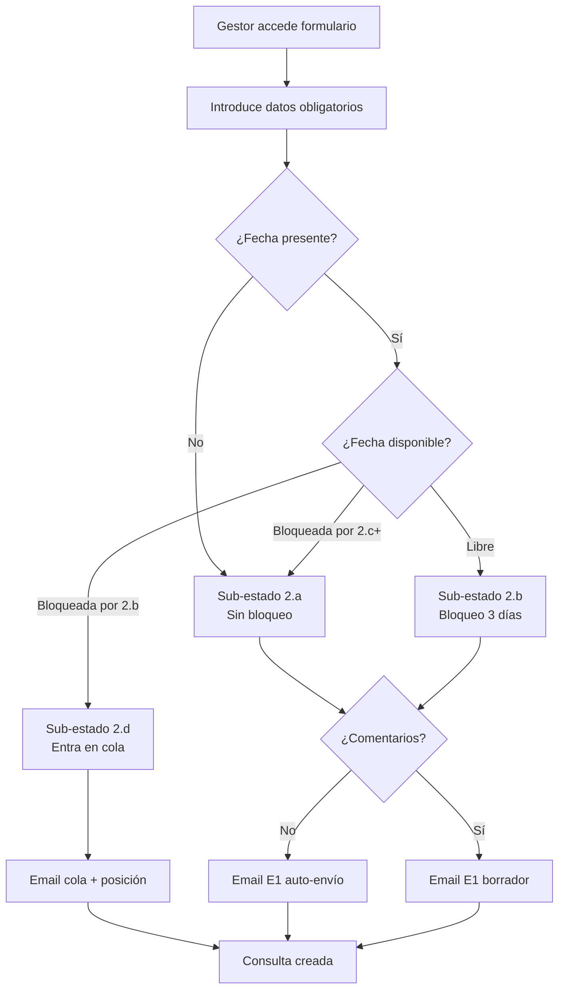

---

#### UC-04: Transicionar Consulta a Estado con Fecha (2.a → 2.b)

| Campo | Descripción |
|-------|-------------|
| **ID** | UC-04 |
| **Nombre** | Transicionar Consulta a Estado con Fecha |
| **Actor Principal** | Gestor |
| **Actores Secundarios** | Sistema |
| **Descripción** | Cuando un cliente en estado exploratorio indica una fecha concreta disponible, la consulta pasa a bloquear esa fecha |
| **Precondiciones** | - Consulta en sub-estado 2.a - Fecha solicitada ≥ hoy - Fecha disponible (no bloqueada por otra consulta/reserva) |
| **Postcondiciones** | - Consulta pasa a sub-estado 2.b - Fecha bloqueada por 3 días - TTL de expiración programado - Email enviado al cliente |
| **Prioridad** | Alta |
| **Frecuencia** | Alta |

**Flujo Básico:**
1. El gestor abre la ficha de consulta en estado 2.a
2. El gestor introduce/actualiza la fecha del evento
3. El sistema verifica disponibilidad de la fecha
4. El sistema confirma que la fecha está libre
5. El sistema cambia el sub-estado a 2.b
6. El sistema aplica bloqueo blando de 3 días
7. El sistema programa TTL de expiración
8. El sistema envía email confirmando bloqueo provisional
9. El sistema registra la transición en audit log

**Flujos Alternativos:**
- **FA-01**: Fecha bloqueada por 2.b → El sistema ofrece entrar en cola (2.d)
- **FA-02**: Fecha bloqueada por 2.c+ → El sistema informa y sugiere alternativas

---

#### UC-05: Extender Plazo de Bloqueo

| Campo | Descripción |
|-------|-------------|
| **ID** | UC-05 |
| **Nombre** | Extender Plazo de Bloqueo |
| **Actor Principal** | Gestor |
| **Actores Secundarios** | Sistema |
| **Descripción** | El gestor extiende manualmente el TTL de bloqueo de una fecha antes de que expire |
| **Precondiciones** | - Consulta con bloqueo activo (2.b, 2.c, 2.v, pre_reserva) - TTL aún no expirado |
| **Postcondiciones** | - TTL extendido en días especificados - Recordatorios reprogramados - Acción registrada en audit log |
| **Prioridad** | Media |
| **Frecuencia** | Media |

**Flujo Básico:**
1. El gestor abre la ficha de consulta/reserva
2. El gestor selecciona "Extender bloqueo"
3. El sistema muestra la fecha actual de expiración
4. El gestor indica los días adicionales
5. El sistema calcula la nueva fecha de expiración
6. El sistema actualiza el TTL
7. El sistema reprograma los recordatorios automáticos
8. El sistema registra la extensión en audit log

---

#### UC-06: Transicionar a Pendiente de Invitados (2.b → 2.c)

| Campo | Descripción |
|-------|-------------|
| **ID** | UC-06 |
| **Nombre** | Transicionar a Pendiente de Invitados |
| **Actor Principal** | Gestor |
| **Actores Secundarios** | Sistema |
| **Descripción** | Cuando el cliente confirma fecha pero aún no tiene el número final de invitados, se extiende el bloqueo |
| **Precondiciones** | - Consulta en sub-estado 2.a o 2.b - Cliente ha confirmado interés en la fecha |
| **Postcondiciones** | - Consulta pasa a sub-estado 2.c - Bloqueo extendido +3 días - Si había cola, se vacía (consultas pasan a 2.y) - Email enviado solicitando información faltante |
| **Prioridad** | Alta |
| **Frecuencia** | Media |

**Flujo Básico:**
1. El gestor abre la ficha de consulta
2. El gestor selecciona "Marcar como pendiente de invitados"
3. El sistema cambia el sub-estado a 2.c
4. El sistema extiende el bloqueo por 3 días adicionales
5. El sistema verifica si hay consultas en cola para esta fecha
6. Si hay cola: el sistema vacía la cola (todas pasan a 2.y)
7. El sistema envía email al cliente solicitando nº de invitados
8. Si hubo vaciado de cola: el sistema notifica a cada cliente en cola
9. El sistema registra la transición en audit log

**Flujos Alternativos:**
- **FA-01**: La consulta no tenía fecha bloqueada → Error, no se permite la transición

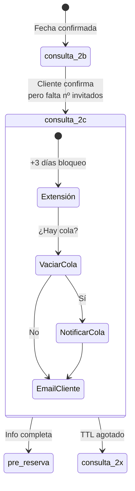

---

#### UC-07: Programar Visita al Espacio (→ 2.v)

| Campo | Descripción |
|-------|-------------|
| **ID** | UC-07 |
| **Nombre** | Programar Visita al Espacio |
| **Actor Principal** | Gestor |
| **Actores Secundarios** | Sistema, Cliente |
| **Descripción** | El gestor programa una visita al espacio cuando el cliente lo solicita antes de decidir |
| **Precondiciones** | - Consulta en sub-estado 2.a, 2.b o 2.c - Cliente ha solicitado visita - Fecha de visita ≤ 7 días desde solicitud |
| **Postcondiciones** | - Consulta pasa a sub-estado 2.v - Fecha del evento bloqueada hasta día posterior a la visita - Visita registrada con fecha/hora - Recordatorio programado para el gestor |
| **Prioridad** | Alta |
| **Frecuencia** | Media |

**Flujo Básico:**
1. El gestor abre la ficha de consulta
2. El gestor selecciona "Programar visita"
3. El sistema muestra formulario de programación
4. El gestor introduce fecha y hora de la visita
5. El sistema valida la fecha de visita
6. El sistema cambia el sub-estado a 2.v
7. El sistema registra `visita_programada_fecha`
8. El sistema bloquea la fecha del evento hasta día posterior a la visita
9. El sistema programa recordatorio para el día de la visita
10. El sistema envía email E6 al cliente confirmando visita
11. El sistema registra la transición en audit log

**Flujos Alternativos:**
- **FA-01**: Consulta en cola (2.d) → NO permitido, debe ser promovida primero

---

#### UC-08: Registrar Resultado de Visita

| Campo | Descripción |
|-------|-------------|
| **ID** | UC-08 |
| **Nombre** | Registrar Resultado de Visita |
| **Actor Principal** | Gestor |
| **Actores Secundarios** | Sistema |
| **Descripción** | El gestor registra el resultado de una visita programada: interés confirmado, reserva inmediata o descarte |
| **Precondiciones** | - Consulta en sub-estado 2.v - Fecha de visita alcanzada o superada |
| **Postcondiciones** | - `visita_realizada` = true - Transición al estado correspondiente según resultado |
| **Prioridad** | Alta |
| **Frecuencia** | Media |

**Flujo Básico (cliente confirma interés):**
1. El gestor abre la ficha de consulta en 2.v
2. El gestor selecciona "Registrar resultado de visita"
3. El gestor indica "Cliente interesado"
4. El sistema marca `visita_realizada = true`
5. El sistema cambia sub-estado a 2.b
6. El sistema aplica TTL fresco de 3 días
7. El sistema envía email E7 confirmando bloqueo post-visita
8. El sistema registra en audit log

**Flujos Alternativos:**
- **FA-01**: Cliente quiere reservar inmediatamente con info completa → Transición directa a pre_reserva
- **FA-02**: Cliente descarta → Transición a 2.z + liberación de fecha
- **FA-03**: Visita no realizada (no apareció) → Gestor puede reprogramar o expirar

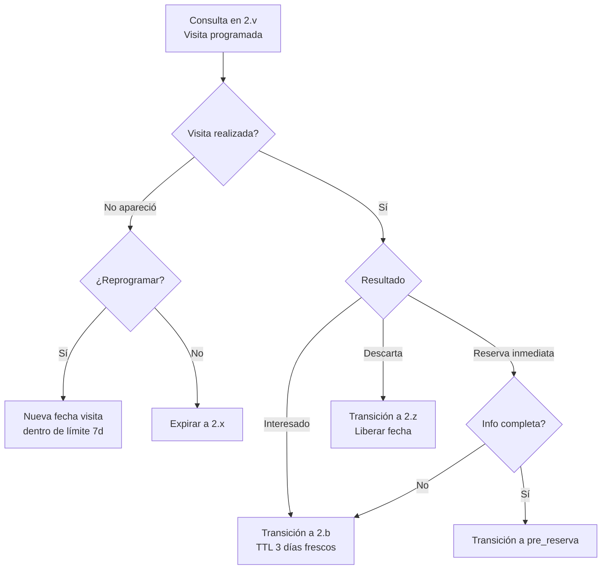

---

#### UC-09: Expirar Consulta Automáticamente

| Campo | Descripción |
|-------|-------------|
| **ID** | UC-09 |
| **Nombre** | Expirar Consulta Automáticamente |
| **Actor Principal** | Sistema |
| **Actores Secundarios** | Gestor |
| **Descripción** | El sistema expira automáticamente una consulta cuando su TTL de bloqueo se agota sin avance |
| **Precondiciones** | - Consulta con TTL activo (2.b, 2.c, 2.v, pre_reserva) - TTL ha expirado - No ha habido transición de estado |
| **Postcondiciones** | - Consulta pasa a estado terminal (2.x o reserva_cancelada) - Fecha liberada - Si había cola, primer elemento promovido - Notificaciones enviadas |
| **Prioridad** | Crítica |
| **Frecuencia** | Alta |

**Flujo Básico:**
1. El sistema detecta que el TTL ha expirado
2. El sistema cambia el sub-estado a 2.x (o reserva_cancelada si era pre_reserva)
3. El sistema libera el bloqueo de la fecha
4. El sistema verifica si hay consultas en cola para esta fecha
5. Si hay cola: el sistema ejecuta UC-12 (promoción automática)
6. El sistema envía email al cliente notificando expiración
7. El sistema notifica al gestor
8. El sistema registra la expiración en audit log

---

#### UC-10: Marcar Consulta como Descartada por Cliente

| Campo | Descripción |
|-------|-------------|
| **ID** | UC-10 |
| **Nombre** | Marcar Consulta como Descartada por Cliente |
| **Actor Principal** | Gestor |
| **Actores Secundarios** | Sistema |
| **Descripción** | El gestor registra que el cliente ha indicado explícitamente que no desea continuar |
| **Precondiciones** | - Consulta en cualquier sub-estado no terminal |
| **Postcondiciones** | - Consulta pasa a sub-estado 2.z - Fecha liberada (si había bloqueo) - Cola reordenada (si estaba en cola) |
| **Prioridad** | Media |
| **Frecuencia** | Media |

**Flujo Básico:**
1. El gestor abre la ficha de consulta
2. El gestor selecciona "Marcar como descartada"
3. El gestor opcionalmente indica motivo
4. El sistema cambia sub-estado a 2.z
5. Si había bloqueo: el sistema libera la fecha
6. Si estaba en cola: el sistema reordena la cola
7. El sistema registra en audit log

---

### ÁREA: GESTIÓN DE COLA DE ESPERA

---

#### UC-11: Visualizar Cola de Espera de una Fecha

| Campo | Descripción |
|-------|-------------|
| **ID** | UC-11 |
| **Nombre** | Visualizar Cola de Espera de una Fecha |
| **Actor Principal** | Gestor |
| **Actores Secundarios** | Sistema |
| **Descripción** | El gestor visualiza las consultas en cola para una fecha específica, incluyendo la consulta bloqueante |
| **Precondiciones** | - Fecha tiene consulta bloqueante (en 2.b) con cola asociada |
| **Postcondiciones** | - Información de cola mostrada |
| **Prioridad** | Alta |
| **Frecuencia** | Alta |

**Flujo Básico:**
1. El gestor hace clic en una fecha con indicador de cola (🔁) en el calendario
2. El sistema muestra vista de fecha con cola:
   - Consulta bloqueante (sub-estado, cliente, TTL restante)
   - Lista ordenada de consultas en cola (posición, cliente, tiempo en cola)
3. El gestor puede acceder a la ficha de cualquier consulta

---

#### UC-12: Promover Consulta de la Cola

| Campo | Descripción |
|-------|-------------|
| **ID** | UC-12 |
| **Nombre** | Promover Consulta de la Cola |
| **Actor Principal** | Sistema / Gestor |
| **Actores Secundarios** | - |
| **Descripción** | Una consulta en cola es promovida a sub-estado 2.b, obteniendo el bloqueo de la fecha |
| **Precondiciones** | - Consulta en sub-estado 2.d - Fecha ha sido liberada (bloqueante expiró, canceló, o gestor promueve manualmente) |
| **Postcondiciones** | - Consulta promovida pasa a 2.b con TTL de 3 días - Resto de la cola reordenada - Email enviado al cliente promovido |
| **Prioridad** | Crítica |
| **Frecuencia** | Media |

**Flujo Básico (automático):**
1. El sistema detecta que la consulta bloqueante ha expirado (2.b → 2.x)
2. El sistema identifica la primera consulta en cola (posicion_cola = 1)
3. El sistema cambia su sub-estado de 2.d a 2.b
4. El sistema limpia `posicion_cola` y `consulta_bloqueante_id`
5. El sistema aplica bloqueo de 3 días
6. El sistema reordena el resto de la cola (posiciones bajan)
7. El sistema actualiza `consulta_bloqueante_id` del resto para apuntar al nuevo bloqueante
8. El sistema envía email al cliente promovido: "¡La fecha está disponible!"
9. El sistema registra la promoción en audit log

**Flujo Alternativo (manual por gestor):**
1. El gestor accede a la vista de cola de una fecha
2. El gestor selecciona una consulta específica (cualquier posición)
3. El gestor selecciona "Promover a bloqueante"
4. El sistema solicita confirmación
5. El sistema expira la consulta bloqueante actual (si aún estaba activa)
6. Continúa desde paso 3 del flujo básico

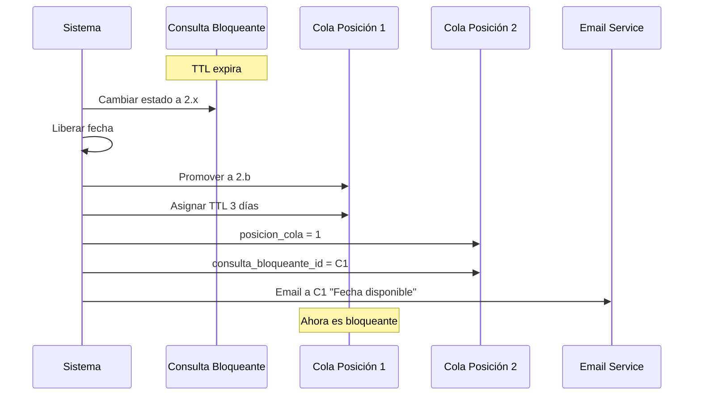

---

#### UC-13: Salir Voluntariamente de la Cola

| Campo | Descripción |
|-------|-------------|
| **ID** | UC-13 |
| **Nombre** | Salir Voluntariamente de la Cola |
| **Actor Principal** | Gestor |
| **Actores Secundarios** | Sistema |
| **Descripción** | Un cliente en cola decide no esperar más y sale voluntariamente |
| **Precondiciones** | - Consulta en sub-estado 2.d |
| **Postcondiciones** | - Consulta pasa a sub-estado 2.z - Cola reordenada |
| **Prioridad** | Media |
| **Frecuencia** | Baja |

**Flujo Básico (gestor):**
1. El gestor abre la ficha de consulta en cola
2. El gestor selecciona "Forzar salida de cola"
3. El gestor opcionalmente indica motivo
4. El sistema cambia sub-estado de 2.d a 2.z
5. El sistema reordena la cola (los siguientes suben una posición)
6. El sistema muestra confirmación al cliente

---

### ÁREA: PRE-RESERVA Y PRESUPUESTOS

---

#### UC-14: Generar Presupuesto (Activar Pre-reserva)

| Campo | Descripción |
|-------|-------------|
| **ID** | UC-14 |
| **Nombre** | Generar Presupuesto (Activar Pre-reserva) |
| **Actor Principal** | Gestor |
| **Actores Secundarios** | Sistema |
| **Descripción** | El gestor genera un presupuesto formal cuando el cliente ha confirmado todos los datos necesarios, activando el estado de pre-reserva |
| **Precondiciones** | - Consulta en sub-estado 2.a, 2.b, 2.c o 2.v - Datos completos: fecha, nº invitados, tipo evento, datos fiscales (DNI, dirección, CP, población, provincia) |
| **Postcondiciones** | - Estado cambia a pre_reserva - Fecha bloqueada 7 días - Presupuesto PDF generado - Si había cola, se vacía |
| **Prioridad** | Crítica |
| **Frecuencia** | Alta |

**Flujo Básico:**
1. El gestor abre la ficha de consulta
2. El gestor verifica que los datos estén completos:
   - Fecha del evento
   - Nº de invitados (adultos + niños >4 años)
   - Tipo de evento
   - Datos fiscales del cliente
3. El gestor hace clic en "Generar presupuesto"
4. El sistema ejecuta el motor de tarifas (UC-16)
5. El sistema genera el presupuesto PDF con:
   - Desglose de alquiler según tarifa
   - Extras seleccionados
   - Total con IVA incluido
   - Desglose de pagos: 40% señal + 60% liquidación + fianza
   - Instrucciones de transferencia (beneficiario, concepto, IBAN)
6. El sistema presenta el presupuesto como borrador editable
7. El gestor revisa y puede ajustar cantidades/extras/descuentos
8. El gestor confirma el presupuesto
9. El sistema cambia estado a pre_reserva
10. El sistema aplica bloqueo de 7 días
11. El sistema verifica si hay cola y la vacía (consultas a 2.y)
12. El sistema envía email E2 con presupuesto adjunto
13. El sistema registra en audit log

**Flujos Alternativos:**
- **FA-01**: Datos fiscales incompletos → Sistema muestra error y solicita completar
- **FA-02**: >50 invitados → Sistema marca "tarifa a consultar" y permite precio manual
- **FA-03**: Gestor cancela → No hay cambio de estado

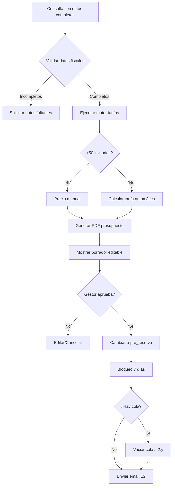

---

#### UC-15: Editar y Enviar Presupuesto

| Campo | Descripción |
|-------|-------------|
| **ID** | UC-15 |
| **Nombre** | Editar y Enviar Presupuesto |
| **Actor Principal** | Gestor |
| **Actores Secundarios** | Sistema |
| **Descripción** | El gestor edita un presupuesto existente antes de enviarlo o reenvía uno ya enviado |
| **Precondiciones** | - Reserva en estado pre_reserva - Presupuesto generado |
| **Postcondiciones** | - Presupuesto actualizado - Nueva versión enviada al cliente |
| **Prioridad** | Media |
| **Frecuencia** | Media |

**Flujo Básico:**
1. El gestor abre la ficha de pre_reserva
2. El gestor accede al presupuesto
3. El gestor modifica campos editables:
   - Cantidades
   - Extras
   - Descuentos especiales
4. El sistema recalcula totales
5. El sistema regenera el PDF
6. El gestor confirma el envío
7. El sistema envía el presupuesto actualizado
8. El sistema registra la versión en audit log

---

#### UC-16: Calcular Tarifa según Configuración

| Campo | Descripción |
|-------|-------------|
| **ID** | UC-16 |
| **Nombre** | Calcular Tarifa según Configuración |
| **Actor Principal** | Sistema |
| **Actores Secundarios** | - |
| **Descripción** | El sistema calcula automáticamente la tarifa aplicable según el tarifario configurado del tenant. Motor de lectura pura, stateless y determinista (US-016). Invocado por UC-14 y UC-15. Endpoint: `POST /api/tarifas/calcular` |
| **Precondiciones** | - `fecha_evento` estrictamente futura: no nula, no pasada y **no el mismo día** (comparación por día natural UTC) - `duracion_horas` ∈ {4, 8, 12} - `num_adultos_ninos_mayores4` ≥ 0 (niños ≤ 4 años no se pasan ni cuentan para el tramo) - Tarifario del tenant configurado (`TARIFA` + `TEMPORADA_CALENDARIO`) - Extras opcionales del catálogo del tenant (cada uno: `extra_id` no nulo y `cantidad` ≥ 1) |
| **Postcondiciones** | - Esquema canónico D-1 devuelto: `{ temporada, tarifa_a_consultar, precio_tarifa_eur, extras_total_eur, total_eur, tarifa_id }`. Los cuatro campos monetarios/id son `null` cuando `tarifa_a_consultar=true` |
| **Prioridad** | Crítica |
| **Frecuencia** | Muy alta |

**Flujo Básico:**
1. El sistema valida los inputs (ver precondiciones); rechaza con error 400 si alguno no cumple.
2. El sistema determina la temporada consultando `TEMPORADA_CALENDARIO` del tenant para el mes de `fecha_evento`:
   - Alta: meses 5, 6, 7, 8, 9 (mayo–septiembre)
   - Media: meses 3, 4, 10, 11 (marzo, abril, octubre, noviembre)
   - Baja: meses 12, 1, 2 (diciembre, enero, febrero)
3. Si `num_adultos_ninos_mayores4 > 50` → el sistema devuelve `tarifa_a_consultar: true` con `temporada` resuelta y los cuatro campos restantes a `null` (200 sin error; fin del flujo). Los niños ≤ 4 años no son input y no modifican este cálculo.
4. El sistema busca la fila `TARIFA` del tenant vigente en `fecha_evento` donde `temporada` coincide, `duracion_horas` coincide y `num_adultos_ninos_mayores4` está en el rango `invitados_min..invitados_max`. Los tramos del tarifario de Masia l'Encís son: **1-20, 21-25, 26-30, 31-40, 41-50**.
5. El sistema suma los extras del catálogo del tenant: por cada `{ extra_id, cantidad }`, calcula `precio_eur × cantidad`; la suma es `extras_total_eur`.
6. El sistema devuelve el esquema D-1: `precio_tarifa_eur` (IVA 21% incluido), `extras_total_eur`, `total_eur = precio_tarifa_eur + extras_total_eur`, `tarifa_id` y `tarifa_a_consultar: false`.

**Flujos Alternativos:**
- **FA-01**: `num_adultos_ninos_mayores4 > 50` → Respuesta 200 con `tarifa_a_consultar: true`, `temporada` presente, importes (`precio_tarifa_eur`, `extras_total_eur`, `total_eur`) y `tarifa_id` a `null`. No es un error; habilita precio manual en el flujo invocante (UC-14/FA-02).
- **FA-02**: No existe `TARIFA` vigente para la combinación válida (≤ 50 invitados) → Error 422 `TARIFA_NO_CONFIGURADA` con detalle `{ temporada, duracion_horas, num_invitados }`.
- **FA-03**: El mes de `fecha_evento` no tiene fila en `TEMPORADA_CALENDARIO` del tenant → Error 422 `TEMPORADA_NO_CONFIGURADA` con detalle `{ mes }`.
- **FA-04**: Un `extra_id` no existe, está inactivo (`activo=false`) o pertenece a otro tenant (RLS) → Error 404 `EXTRA_NO_ENCONTRADO` con detalle `{ extra_id, motivo }`.
- **FA-05**: Cualquier input fuera de rango (ver precondiciones) → Error 400 de validación.

---

### ÁREA: CONFIRMACIÓN DE RESERVA

---

#### UC-17: Confirmar Pago de Señal

| Campo | Descripción |
|-------|-------------|
| **ID** | UC-17 |
| **Nombre** | Confirmar Pago de Señal |
| **Actor Principal** | Gestor |
| **Actores Secundarios** | Sistema |
| **Descripción** | El gestor registra la recepción del justificante de pago de la señal (40%), confirmando la reserva |
| **Precondiciones** | - Reserva en estado pre_reserva - Justificante de pago recibido |
| **Postcondiciones** | - Estado cambia a reserva_confirmada - Fecha bloqueada definitivamente - Factura de señal generada - Sub-procesos paralelos activados - Condiciones particulares generadas |
| **Prioridad** | Crítica |
| **Frecuencia** | Alta |

**Flujo Básico:**
1. El gestor abre la ficha de pre_reserva
2. El gestor selecciona "Confirmar pago de señal"
3. El gestor sube el justificante de pago (imagen/PDF)
4. El sistema registra el justificante
5. El sistema cambia estado a reserva_confirmada
6. El sistema aplica bloqueo definitivo (sin TTL)
7. El sistema genera factura de señal (40%) como borrador
8. El gestor revisa y aprueba la factura
9. El sistema genera documento de condiciones particulares
10. El sistema activa los tres sub-procesos paralelos:
    - pre_evento_status = pendiente
    - liquidacion_status = pendiente
    - fianza_status = pendiente
11. El sistema genera checklist pre-evento
12. El sistema crea ficha operativa del evento (vacía)
13. El sistema envía email E3 con:
    - Factura de señal adjunta
    - Condiciones particulares adjuntas
    - Próximos hitos
14. El sistema registra en audit log

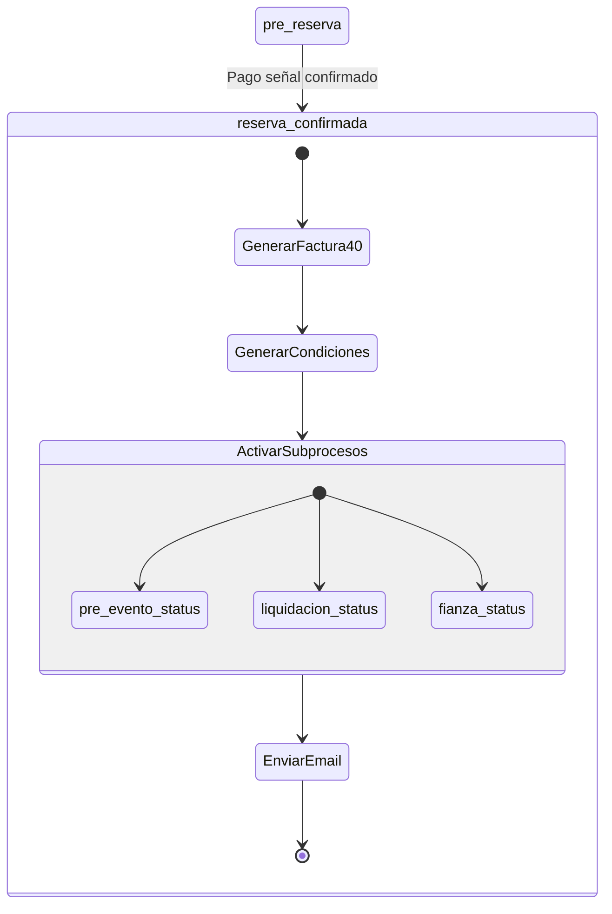

---

#### UC-18: Generar Factura de Señal

| Campo | Descripción |
|-------|-------------|
| **ID** | UC-18 |
| **Nombre** | Generar Factura de Señal |
| **Actor Principal** | Sistema |
| **Actores Secundarios** | Gestor |
| **Descripción** | El sistema genera automáticamente la factura correspondiente al 40% de señal |
| **Precondiciones** | - Pago de señal confirmado - Datos fiscales del cliente completos |
| **Postcondiciones** | - Factura de señal generada - Factura disponible para revisión |
| **Prioridad** | Crítica |
| **Frecuencia** | Alta |

**Flujo Básico:**
1. El sistema calcula el 40% del presupuesto aceptado
2. El sistema desglosa base imponible e IVA 21%
3. El sistema genera el PDF de factura con:
   - Datos del tenant (emisor)
   - Datos fiscales del cliente (receptor)
   - Concepto: "Señal reserva evento [fecha]"
   - Desglose: base imponible + IVA
4. El sistema presenta la factura como borrador
5. El gestor revisa y aprueba
6. La factura queda lista para envío

---

#### UC-19: Gestionar Condiciones Particulares

| Campo | Descripción |
|-------|-------------|
| **ID** | UC-19 |
| **Nombre** | Gestionar Condiciones Particulares |
| **Actor Principal** | Gestor |
| **Actores Secundarios** | Sistema, Cliente |
| **Descripción** | El gestor gestiona el ciclo de vida del documento de condiciones particulares: generación, envío, seguimiento y registro de firma |
| **Precondiciones** | - Reserva en estado reserva_confirmada |
| **Postcondiciones** | - Estado de condiciones particulares actualizado |
| **Prioridad** | Alta |
| **Frecuencia** | Alta |

**Flujo Básico (generación y envío):**
1. Al confirmar la señal, el sistema genera el documento de condiciones particulares
2. El documento se adjunta en el email E3
3. El sistema registra `condiciones_particulares_enviadas_fecha`

**Flujo Básico (registro de firma):**
1. El cliente devuelve el documento firmado (email o físico)
2. El gestor abre la ficha de reserva
3. El gestor selecciona "Registrar condiciones firmadas"
4. El gestor sube el documento firmado
5. El sistema actualiza:
   - `condiciones_particulares_firmadas = true`
   - `condiciones_particulares_firmadas_fecha`
   - `condiciones_particulares_firmadas_url`
6. El sistema registra en audit log

**Flujos Alternativos:**
- **FA-01**: Día del evento sin firma → Sistema alerta al gestor (puede firmarse presencialmente)

---

### ÁREA: SUB-PROCESOS PARALELOS

---

#### UC-20: Gestionar Sub-proceso Pre-evento

| Campo | Descripción |
|-------|-------------|
| **ID** | UC-20 |
| **Nombre** | Gestionar Sub-proceso Pre-evento |
| **Actor Principal** | Gestor |
| **Actores Secundarios** | Sistema, Cliente |
| **Descripción** | El gestor cumplimenta progresivamente la ficha operativa del evento durante el periodo previo al evento |
| **Precondiciones** | - Reserva en estado reserva_confirmada - pre_evento_status = pendiente o en_curso |
| **Postcondiciones** | - Ficha operativa actualizada - pre_evento_status puede cambiar a cerrado |
| **Prioridad** | Alta |
| **Frecuencia** | Alta |

**Flujo Básico:**
1. El gestor abre la ficha operativa del evento
2. El gestor cumplimenta campos progresivamente:
   - Nº invitados final
   - Menús seleccionados
   - Timing detallado
   - Contactos del evento
   - Notas operativas
3. El sistema guarda los cambios
4. El sistema actualiza pre_evento_status a en_curso
5. Cuando la ficha está completa, el gestor marca "Ficha cerrada"
6. El sistema actualiza pre_evento_status a cerrado

**Flujos Alternativos:**
- **FA-01**: T-1d sin cerrar → Sistema cierra automáticamente con datos disponibles

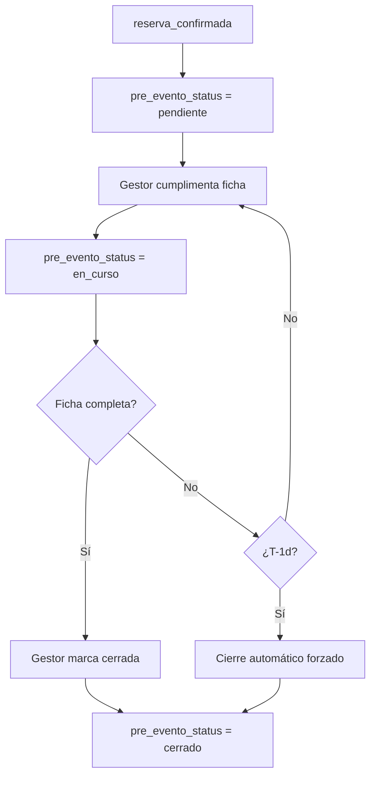

---

#### UC-21: Gestionar Sub-proceso Liquidación

| Campo | Descripción |
|-------|-------------|
| **ID** | UC-21 |
| **Nombre** | Gestionar Sub-proceso Liquidación |
| **Actor Principal** | Gestor |
| **Actores Secundarios** | Sistema |
| **Descripción** | El gestor gestiona el cobro del 60% restante (liquidación) antes del evento |
| **Precondiciones** | - Reserva en estado reserva_confirmada - liquidacion_status = pendiente o facturada |
| **Postcondiciones** | - liquidacion_status actualizado - Factura de liquidación generada/enviada/cobrada |
| **Prioridad** | Crítica |
| **Frecuencia** | Alta |

**Flujo Básico:**
1. El sistema genera factura de liquidación en borrador (60% + extras)
2. El sistema alerta al gestor
3. El gestor revisa y ajusta si es necesario
4. El gestor aprueba y envía la factura
5. El sistema actualiza liquidacion_status = facturada
6. El sistema envía email E4 al cliente
7. El cliente realiza el pago
8. El gestor recibe justificante
9. El gestor sube justificante al sistema
10. El sistema actualiza liquidacion_status = cobrada
11. El sistema registra en audit log

**Flujos Alternativos:**
- **FA-01**: T-1d sin cobro → Política "Negociable" activada, alerta crítica al gestor

---

#### UC-22: Gestionar Sub-proceso Fianza

| Campo | Descripción |
|-------|-------------|
| **ID** | UC-22 |
| **Nombre** | Gestionar Sub-proceso Fianza |
| **Actor Principal** | Gestor |
| **Actores Secundarios** | Sistema |
| **Descripción** | El gestor gestiona el cobro de la fianza (depósito reembolsable) antes o el día del evento |
| **Precondiciones** | - Reserva en estado reserva_confirmada - fianza_status = pendiente o recibo_enviado |
| **Postcondiciones** | - fianza_status actualizado - fianza_eur y fianza_cobrada_fecha registrados |
| **Prioridad** | Alta |
| **Frecuencia** | Alta |

**Flujo Básico:**
1. El sistema genera recibo de fianza independiente
2. El sistema alerta al gestor
3. El gestor envía el recibo al cliente (puede ser con liquidación o separado)
4. El sistema actualiza fianza_status = recibo_enviado
5. El cliente realiza el pago (antes o el día del evento)
6. El gestor recibe justificante
7. El gestor sube justificante al sistema
8. El sistema registra:
   - `fianza_eur`
   - `fianza_cobrada_fecha`
9. El sistema actualiza fianza_status = cobrada
10. El sistema registra en audit log

**Flujos Alternativos:**
- **FA-01**: T-0 sin cobro → Política "Negociable" activada, decisión manual del gestor

---

### ÁREA: EJECUCIÓN DEL EVENTO

---

#### UC-23: Iniciar Evento

| Campo | Descripción |
|-------|-------------|
| **ID** | UC-23 |
| **Nombre** | Iniciar Evento |
| **Actor Principal** | Sistema / Gestor |
| **Actores Secundarios** | Equipo |
| **Descripción** | El sistema transiciona la reserva al estado evento_en_curso cuando se cumplen las precondiciones |
| **Precondiciones** | - Reserva en estado reserva_confirmada - pre_evento_status = cerrado - liquidacion_status = cobrada - fianza_status = cobrada - Es el día del evento |
| **Postcondiciones** | - Estado cambia a evento_en_curso - Vista móvil activada - Checklist de documentación visible |
| **Prioridad** | Alta |
| **Frecuencia** | Media |

**Flujo Básico:**
1. El sistema detecta que es el día del evento (00:00)
2. El sistema verifica las precondiciones
3. Todas las precondiciones se cumplen
4. El sistema cambia estado a evento_en_curso
5. El sistema envía briefing operativo al equipo
6. El sistema activa vista móvil "evento en curso"
7. El sistema muestra checklist de documentación pendiente

**Flujos Alternativos:**
- **FA-01**: Precondiciones no cumplidas → Alerta crítica, gestor puede forzar inicio

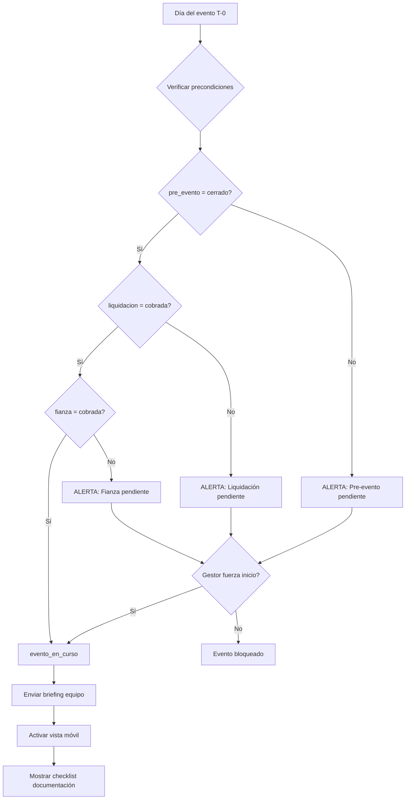

---

#### UC-24: Capturar Documentación del Evento

| Campo | Descripción |
|-------|-------------|
| **ID** | UC-24 |
| **Nombre** | Capturar Documentación del Evento |
| **Actor Principal** | Gestor / Equipo |
| **Actores Secundarios** | Sistema |
| **Descripción** | El personal captura la documentación obligatoria durante el evento: foto DNI y cláusula de responsabilidad firmada |
| **Precondiciones** | - Reserva en estado evento_en_curso |
| **Postcondiciones** | - Documentación registrada - URLs almacenadas - Checklist actualizado |
| **Prioridad** | Alta |
| **Frecuencia** | Media |

**Flujo Básico:**
1. El gestor/equipo accede a la vista móvil del evento
2. El gestor/equipo ve el checklist de documentación:
   - [ ] Foto DNI cliente (anverso)
   - [ ] Foto DNI cliente (reverso)
   - [ ] Cláusula de responsabilidad firmada
3. Para cada documento, el gestor/equipo:
   a. Hace clic en el ítem
   b. Captura/sube la imagen/documento
   c. El sistema registra la URL
   d. El checklist marca el ítem como completado
4. El sistema registra en audit log

**Flujos Alternativos:**
- **FA-01**: Documentación incompleta al finalizar → No bloquea, pero queda marcado

---

#### UC-25: Finalizar Evento

| Campo | Descripción |
|-------|-------------|
| **ID** | UC-25 |
| **Nombre** | Finalizar Evento |
| **Actor Principal** | Gestor |
| **Actores Secundarios** | Sistema |
| **Descripción** | El gestor marca el evento como finalizado, iniciando el proceso de post-evento |
| **Precondiciones** | - Reserva en estado evento_en_curso |
| **Postcondiciones** | - Estado cambia a post_evento - Solicitud de IBAN enviada (si hay fianza) - NPS programada |
| **Prioridad** | Alta |
| **Frecuencia** | Media |

**Flujo Básico:**
1. El gestor accede a la ficha de reserva
2. El gestor selecciona "Marcar evento como finalizado"
3. El sistema verifica documentación del evento
4. Si falta documentación: el sistema muestra alerta (no bloquea)
5. El sistema cambia estado a post_evento
6. Si hay fianza cobrada (`fianza_eur` > 0):
   a. El sistema envía email E5 solicitando IBAN
7. El sistema programa envío de NPS a T+3d
8. El sistema registra en audit log

---

### ÁREA: POST-EVENTO

---

#### UC-26: Solicitar IBAN para Devolución de Fianza

| Campo | Descripción |
|-------|-------------|
| **ID** | UC-26 |
| **Nombre** | Solicitar IBAN para Devolución de Fianza |
| **Actor Principal** | Sistema |
| **Actores Secundarios** | Cliente |
| **Descripción** | El sistema solicita automáticamente al cliente su IBAN para proceder con la devolución de la fianza |
| **Precondiciones** | - Reserva en estado post_evento - fianza_eur > 0 |
| **Postcondiciones** | - Email E5 enviado al cliente - Recordatorios programados |
| **Prioridad** | Alta |
| **Frecuencia** | Media |

**Flujo Básico:**
1. Al entrar en post_evento, el sistema detecta fianza cobrada
2. El sistema envía email E5: "El evento ha finalizado. Para devolverte la fianza, indícanos tu IBAN."
3. El sistema programa recordatorio a T+3d si no hay respuesta
4. El sistema programa segundo recordatorio a T+7d si sigue sin respuesta

**Flujos Alternativos:**
- **FA-01**: Cliente proporciona IBAN → UC-27

---

#### UC-27: Procesar Devolución de Fianza

| Campo | Descripción |
|-------|-------------|
| **ID** | UC-27 |
| **Nombre** | Procesar Devolución de Fianza |
| **Actor Principal** | Gestor |
| **Actores Secundarios** | Sistema |
| **Descripción** | El gestor procesa la devolución de la fianza al cliente tras recibir el IBAN |
| **Precondiciones** | - Reserva en estado post_evento - `iban_devolucion` registrado |
| **Postcondiciones** | - `fianza_devuelta_fecha` registrada - `fianza_devuelta_eur` registrado - Justificante de transferencia almacenado |
| **Prioridad** | Alta |
| **Frecuencia** | Media |

**Flujo Básico (devolución completa):**
1. El cliente proporciona IBAN (email, formulario)
2. El sistema registra `iban_devolucion`
3. El sistema alerta al gestor
4. El gestor realiza la transferencia externamente
5. El gestor accede a la ficha de reserva
6. El gestor selecciona "Registrar devolución de fianza"
7. El gestor introduce:
   - Importe devuelto = fianza_eur
   - Justificante de transferencia
8. El sistema registra:
   - `fianza_devuelta_fecha`
   - `fianza_devuelta_eur`
9. El sistema registra en audit log

**Flujos Alternativos:**
- **FA-01**: Devolución parcial por desperfectos → Gestor indica importe menor + motivo
- **FA-02**: IBAN erróneo → Gestor marca como inválido, sistema solicita nuevo IBAN

---

#### UC-28: Archivar Reserva

| Campo | Descripción |
|-------|-------------|
| **ID** | UC-28 |
| **Nombre** | Archivar Reserva |
| **Actor Principal** | Sistema / Gestor |
| **Actores Secundarios** | - |
| **Descripción** | La reserva pasa al histórico consultable, quedando en estado terminal |
| **Precondiciones** | - Reserva en estado post_evento - No hay acciones pendientes (fianza resuelta) |
| **Postcondiciones** | - Estado cambia a reserva_completada - Reserva indexada para búsqueda - Reserva accesible en histórico |
| **Prioridad** | Media |
| **Frecuencia** | Media |

**Flujo Básico (automático T+7d):**
1. El sistema detecta que han pasado 7 días desde post_evento
2. El sistema verifica que no hay acciones pendientes
3. El sistema cambia estado a reserva_completada
4. El sistema indexa la reserva para búsqueda full-text
5. El sistema registra en audit log

**Flujo Alternativo (manual):**
1. El gestor abre la ficha de reserva en post_evento
2. El gestor selecciona "Archivar reserva"
3. El sistema verifica que no hay acciones pendientes
4. Continúa desde paso 3 del flujo automático

---

### ÁREA: CALENDARIO Y DISPONIBILIDAD

---

#### UC-29: Consultar Calendario

| Campo | Descripción |
|-------|-------------|
| **ID** | UC-29 |
| **Nombre** | Consultar Calendario |
| **Actor Principal** | Gestor |
| **Actores Secundarios** | Sistema |
| **Descripción** | El gestor visualiza el calendario con los estados de disponibilidad de cada fecha |
| **Precondiciones** | - El gestor está autenticado |
| **Postcondiciones** | - Calendario mostrado con código de colores |
| **Prioridad** | Crítica |
| **Frecuencia** | Muy alta |

**Flujo Básico:**
1. El gestor accede a la sección Calendario
2. El sistema muestra vista mensual por defecto
3. El sistema colorea cada fecha según su estado:
   - Gris: consulta activa
   - Ámbar: pre-reserva
   - Verde: reserva confirmada
   - Azul: histórico
   - Rojo: cancelada
   - Indicador 🔁: tiene cola de espera
4. El gestor puede cambiar la vista (mes/semana/día/lista)
5. El gestor puede navegar entre periodos
6. El gestor puede hacer clic en una fecha para ver detalles

---

#### UC-30: Bloquear Fecha

| Campo | Descripción |
|-------|-------------|
| **ID** | UC-30 |
| **Nombre** | Bloquear Fecha |
| **Actor Principal** | Sistema |
| **Actores Secundarios** | - |
| **Descripción** | El sistema bloquea atómicamente una fecha cuando una consulta/reserva lo requiere |
| **Precondiciones** | - Fecha no tiene bloqueo activo |
| **Postcondiciones** | - Fecha bloqueada - TTL configurado (si aplica) - Bloqueo registrado |
| **Prioridad** | Crítica |
| **Frecuencia** | Alta |

**Flujo Básico:**
1. El sistema recibe solicitud de bloqueo (fecha, tipo, TTL)
2. El sistema inicia transacción atómica (`SELECT ... FOR UPDATE`)
3. El sistema verifica que la fecha está libre
4. El sistema aplica el bloqueo:
   - Bloqueo blando (3/7 días) con TTL → consulta/pre_reserva
   - Bloqueo firme (sin TTL) → reserva_confirmada
5. El sistema programa expiración si hay TTL
6. El sistema confirma la transacción
7. El sistema registra el bloqueo

**Flujos Alternativos:**
- **FA-01**: Fecha ya bloqueada → Rechazar, ofrecer cola si 2.b

---

#### UC-31: Liberar Fecha

| Campo | Descripción |
|-------|-------------|
| **ID** | UC-31 |
| **Nombre** | Liberar Fecha |
| **Actor Principal** | Sistema |
| **Actores Secundarios** | - |
| **Descripción** | El sistema elimina atómicamente el bloqueo de una fecha cuando expira el TTL, el cliente descarta la consulta, o se cancela una reserva confirmada. Complemento de UC-30. Implementado por `liberarFecha()` (US-041). |
| **Precondiciones** | - Existe fila en `FECHA_BLOQUEADA` para `(tenant_id, fecha)` o la operación es idempotente (0 filas es éxito) - Si `tipo_bloqueo = 'firme'`: la `RESERVA` referenciada debe estar en `reserva_cancelada` |
| **Postcondiciones** | - La fila `(tenant_id, fecha)` ya no existe en `FECHA_BLOQUEADA` - Si había cola activa (`sub_estado = '2d'`), se ha invocado `PromocionColaPort` (promoción efectiva diferida a US-018; la cola permanece en `2.d` hasta que US-018 complete) - Acción registrada en `AUDIT_LOG` con causa |
| **Prioridad** | Crítica |
| **Frecuencia** | Alta |
| **Sin endpoint HTTP propio (D-7 / US-041)** | El actor es el Sistema; la liberación es efecto de transiciones de estado y del cron de barrido, no una acción de usuario. No se añade ningún endpoint a `api-spec.yml`. |

**Causas de liberación:**
- **TTL agotado** — bloqueo blando (`tipo_bloqueo = 'blando'`) con `ttl_expiracion < now()`; lanzado por el cron de barrido (US de jobs / US-012).
- **Descarte por cliente o gestor** — la consulta/pre-reserva pasa a estado terminal (`2.z`, `2.x`); lanzado por US-013, US-011.
- **Cancelación de reserva confirmada** — la reserva pasa a `reserva_cancelada`; lanzado por el flujo de cancelación.

**Flujo Básico:**
1. El sistema invoca `liberarFecha({ tenantId, fecha, causa })`.
2. Si `tipo_bloqueo = 'firme'`: el sistema verifica en dominio que la `RESERVA` esté en `reserva_cancelada`; si no, rechaza con `LIBERACION_FIRME_SIN_CANCELACION`, audita el intento y termina.
3. El sistema inicia transacción Prisma con RLS (`SET LOCAL app.tenant_id` vía `set_config`).
4. El sistema ejecuta `DELETE FROM fecha_bloqueada WHERE tenant_id = T AND fecha = D` vía `$executeRaw` y obtiene el número de filas afectadas.
5. El sistema confirma la transacción.
6. Si `rows = 1` (liberación efectiva): el sistema registra en `AUDIT_LOG` (`accion = 'eliminar'`, `entidad = 'FECHA_BLOQUEADA'`, causa en `datos_nuevos`); si existe cola activa (`RESERVA` con `sub_estado = '2d'` y `consulta_bloqueante_id` → reserva liberada), invoca `PromocionColaPort`.
7. Si `rows = 0` (idempotente — fecha ya libre o nunca bloqueada): el sistema registra tentativa en `AUDIT_LOG` y termina sin error ni promoción.

**Flujos Alternativos:**
- **FA-01: Intento de liberar bloqueo firme con reserva activa** → rechazado en paso 2; bloqueo firme intacto; intento auditado.
- **FA-02: Fecha sin bloqueo activo (idempotencia)** → `rows = 0`; éxito silencioso; tentativa registrada en `AUDIT_LOG`; no se dispara promoción. Los retries del cron no generan errores.
- **FA-03: Liberación en lote** → N fechas expiradas procesadas, cada una en su propia transacción independiente; el fallo de una no bloquea ni revierte las demás; cada liberación exitosa dispara su `PromocionColaPort` si corresponde.

**Exactamente-una-vez ante liberaciones concurrentes:**
Si dos workers liberan la misma `(tenant_id, fecha)` simultáneamente, el motor garantiza que exactamente uno obtiene `rows = 1` (y dispara la promoción) y el otro obtiene `rows = 0` (éxito silencioso sin promoción). No hay doble promoción.

**Deuda documentada (US-018):** la promoción efectiva de cola (reordenación FIFO + email al lead promovido) está diferida a US-018. Hasta entonces, `PromocionColaPort` se resuelve con un adaptador stub no-op auditado. La cola permanece en `2.d`; no hay estado "fecha libre + cola huérfana" observable como definitivo.

---

### ÁREA: HISTÓRICO

---

#### UC-32: Buscar en Histórico

| Campo | Descripción |
|-------|-------------|
| **ID** | UC-32 |
| **Nombre** | Buscar en Histórico |
| **Actor Principal** | Gestor |
| **Actores Secundarios** | Sistema |
| **Descripción** | El gestor busca y filtra reservas pasadas en el histórico consultable |
| **Precondiciones** | - El gestor está autenticado |
| **Postcondiciones** | - Resultados mostrados según criterios |
| **Prioridad** | Alta |
| **Frecuencia** | Alta |

**Flujo Básico:**
1. El gestor accede a la sección Histórico
2. El sistema muestra la tabla maestra de reservas completadas
3. El gestor puede aplicar filtros:
   - Rango de fechas
   - Tipo de evento
   - Estado final
   - Importe
4. El gestor puede usar búsqueda full-text:
   - Por nombre del cliente
   - Por número de reserva
   - Por email
   - Por observaciones
5. El sistema muestra resultados paginados
6. El gestor puede acceder al detalle de cualquier reserva (modo lectura)

---

#### UC-33: Exportar Reservas

| Campo | Descripción |
|-------|-------------|
| **ID** | UC-33 |
| **Nombre** | Exportar Reservas |
| **Actor Principal** | Gestor |
| **Actores Secundarios** | Sistema |
| **Descripción** | El gestor exporta datos de reservas a formato CSV |
| **Precondiciones** | - El gestor está autenticado - Hay reservas que exportar |
| **Postcondiciones** | - Archivo CSV generado y descargado |
| **Prioridad** | Media |
| **Frecuencia** | Baja |

**Flujo Básico:**
1. El gestor accede al histórico o pipeline
2. El gestor aplica filtros deseados
3. El gestor selecciona "Exportar CSV"
4. El sistema genera el archivo con:
   - Todos los atributos de la reserva
   - Filtros aplicados
5. El sistema inicia la descarga

---

### ÁREA: DASHBOARD

---

#### UC-34: Visualizar Dashboard Operativo

| Campo | Descripción |
|-------|-------------|
| **ID** | UC-34 |
| **Nombre** | Visualizar Dashboard Operativo |
| **Actor Principal** | Gestor |
| **Actores Secundarios** | Sistema |
| **Descripción** | El gestor visualiza el dashboard operativo con la información clave del estado actual del negocio |
| **Precondiciones** | - El gestor está autenticado |
| **Postcondiciones** | - Dashboard mostrado con datos actualizados |
| **Prioridad** | Alta |
| **Frecuencia** | Muy alta |

**Flujo Básico:**
1. El gestor accede al sistema (o navega al dashboard)
2. El sistema muestra los widgets:
   - **Hoy y mañana**: eventos del día y siguiente
   - **Pipeline**: consultas por sub-estado, pre-reservas, confirmadas
   - **Sub-procesos críticos**: reservas con pre-evento/liquidación/fianza atrasada
   - **Pendientes**: pagos vencidos, TTLs próximos a expirar
   - **Consultas en cola**: leads en espera agrupados por fecha
   - **Visitas programadas**: próximas visitas ordenadas por fecha
   - **Próximos 30 días**: calendario resumen
3. El gestor puede interactuar con cada widget para ver detalles
4. El gestor puede navegar directamente a las fichas de reserva

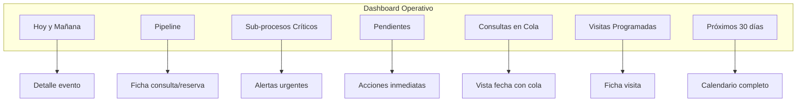

---

### ÁREA: COMUNICACIONES

---

#### UC-35: Enviar Email Automático

| Campo | Descripción |
|-------|-------------|
| **ID** | UC-35 |
| **Nombre** | Enviar Email Automático |
| **Actor Principal** | Sistema |
| **Actores Secundarios** | Cliente |
| **Descripción** | El sistema envía automáticamente un email cuando se cumple un trigger específico |
| **Precondiciones** | - Trigger activado - Datos del cliente disponibles - Plantilla configurada |
| **Postcondiciones** | - Email enviado - Registro en log de comunicaciones |
| **Prioridad** | Crítica |
| **Frecuencia** | Muy alta |

**Emails implementados en MVP:**
| ID | Trigger | Contenido |
|----|---------|-----------|
| E1 | Lead entrante | Respuesta inicial + tarifa estimada |
| E2 | Activar pre-reserva | Presupuesto PDF + instrucciones señal |
| E3 | Confirmar pago señal | Factura 40% + condiciones particulares |
| E4 | Inicio sub-proceso liquidación | Factura liquidación + recibo fianza |
| E5 | Evento finalizado | Agradecimiento + solicitud IBAN |
| E6 | Programar visita | Confirmación visita |
| E7 | Visita realizada + interés | Confirmación bloqueo post-visita |
| E8 | Cliente proporciona IBAN | Confirmación recepción + próximos pasos |

**Flujo Básico:**
1. El sistema detecta el trigger
2. El sistema selecciona la plantilla correspondiente
3. El sistema reemplaza variables con datos de la reserva
4. El sistema genera adjuntos si aplica (PDF)
5. El sistema envía el email
6. El sistema registra en log de comunicaciones de la reserva
7. El sistema registra en audit log

---

#### UC-36: Revisar y Enviar Email Borrador

| Campo | Descripción |
|-------|-------------|
| **ID** | UC-36 |
| **Nombre** | Revisar y Enviar Email Borrador |
| **Actor Principal** | Gestor |
| **Actores Secundarios** | Sistema |
| **Descripción** | El gestor revisa, edita y confirma el envío de un email generado como borrador |
| **Precondiciones** | - Email en estado borrador - Generado automáticamente con comentarios o manualmente |
| **Postcondiciones** | - Email enviado - Registro en log |
| **Prioridad** | Alta |
| **Frecuencia** | Alta |

**Flujo Básico:**
1. El sistema genera email como borrador (ej: lead con comentarios)
2. El sistema notifica al gestor
3. El gestor accede a la ficha de la reserva
4. El gestor abre el borrador de email
5. El gestor revisa el contenido
6. El gestor puede editar texto
7. El gestor confirma el envío
8. El sistema envía el email
9. El sistema registra en logs

---

## 4. Diagrama de Interconexión de Casos de Uso

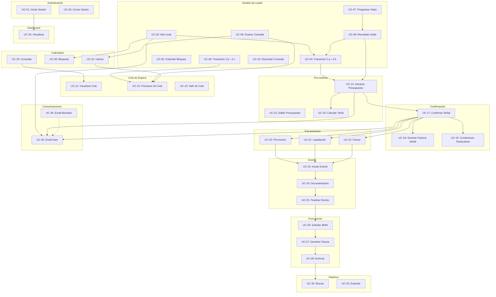

---

## 5. Tabla Comparativa de Casos de Uso

| ID | Caso de Uso | Actor Principal | Impacto Negocio | Prioridad | Complejidad |
|----|-------------|-----------------|-----------------|-----------|-------------|
| UC-01 | Iniciar Sesión | Gestor | Alto | Crítica | Baja |
| UC-02 | Cerrar Sesión | Gestor | Bajo | Alta | Baja |
| UC-03 | Alta Lead | Gestor | Crítico | Crítica | Alta |
| UC-04 | Transición 2.a→2.b | Gestor | Alto | Alta | Media |
| UC-05 | Extender Bloqueo | Gestor | Medio | Media | Baja |
| UC-06 | Transición 2.b→2.c | Gestor | Alto | Alta | Media |
| UC-07 | Programar Visita | Gestor | Alto | Alta | Media |
| UC-08 | Resultado Visita | Gestor | Alto | Alta | Media |
| UC-09 | Expirar Consulta | Sistema | Alto | Crítica | Media |
| UC-10 | Descartar Consulta | Gestor | Medio | Media | Baja |
| UC-11 | Visualizar Cola | Gestor | Medio | Alta | Baja |
| UC-12 | Promover de Cola | Sistema/Gestor | Crítico | Crítica | Alta |
| UC-13 | Salir de Cola | Cliente/Gestor | Bajo | Media | Baja |
| UC-14 | Generar Presupuesto | Gestor | Crítico | Crítica | Alta |
| UC-15 | Editar Presupuesto | Gestor | Medio | Media | Media |
| UC-16 | Calcular Tarifa | Sistema | Crítico | Crítica | Media |
| UC-17 | Confirmar Señal | Gestor | Crítico | Crítica | Alta |
| UC-18 | Generar Factura Señal | Sistema | Alto | Crítica | Media |
| UC-19 | Condiciones Particulares | Gestor | Alto | Alta | Media |
| UC-20 | Gestión Pre-evento | Gestor | Alto | Alta | Media |
| UC-21 | Gestión Liquidación | Gestor | Crítico | Crítica | Alta |
| UC-22 | Gestión Fianza | Gestor | Alto | Alta | Media |
| UC-23 | Iniciar Evento | Sistema/Gestor | Alto | Alta | Media |
| UC-24 | Capturar Documentación | Gestor/Equipo | Medio | Alta | Baja |
| UC-25 | Finalizar Evento | Gestor | Alto | Alta | Baja |
| UC-26 | Solicitar IBAN | Sistema | Medio | Alta | Baja |
| UC-27 | Devolver Fianza | Gestor | Medio | Alta | Media |
| UC-28 | Archivar Reserva | Sistema/Gestor | Bajo | Media | Baja |
| UC-29 | Consultar Calendario | Gestor | Alto | Crítica | Media |
| UC-30 | Bloquear Fecha | Sistema | Crítico | Crítica | Alta |
| UC-31 | Liberar Fecha | Sistema | Crítico | Crítica | Alta |
| UC-32 | Buscar Histórico | Gestor | Medio | Alta | Media |
| UC-33 | Exportar Reservas | Gestor | Bajo | Media | Baja |
| UC-34 | Dashboard Operativo | Gestor | Alto | Alta | Media |
| UC-35 | Email Automático | Sistema | Alto | Crítica | Media |
| UC-36 | Email Borrador | Gestor | Medio | Alta | Baja |

---

## 6. Diagrama de Estados Completo del Sistema

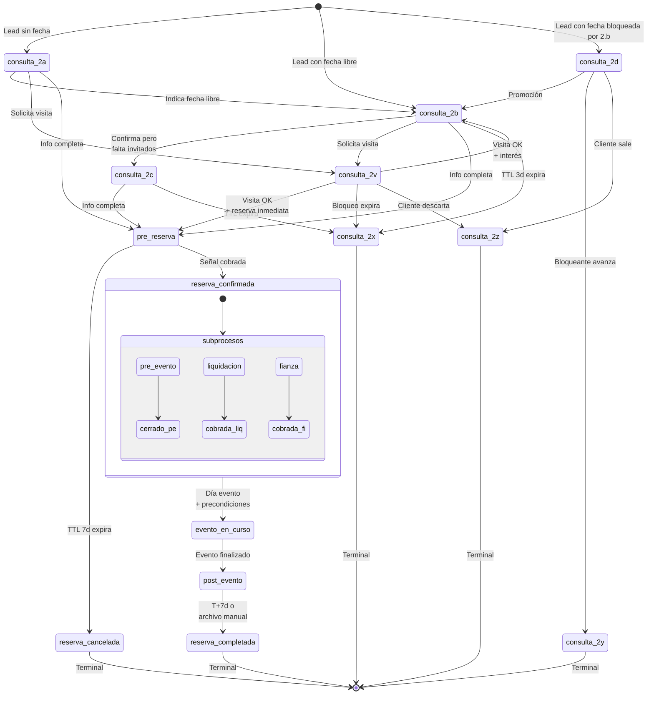

---

## 7. Verificación de Cobertura del MVP

### 7.1 Matriz de Trazabilidad

| Funcionalidad MVP | Casos de Uso que la cubren | Estado |
|-------------------|---------------------------|--------|
| Auth básica + multi-tenant | UC-01, UC-02 | ✅ Cubierto |
| Pipeline completo (2.a-2.z) | UC-03 a UC-13 | ✅ Cubierto |
| Sub-procesos paralelos | UC-20, UC-21, UC-22 | ✅ Cubierto |
| Cola de espera | UC-11, UC-12, UC-13 | ✅ Cubierto |
| Sub-estado 2.v (visita) | UC-07, UC-08 | ✅ Cubierto |
| Calendario visual + bloqueo atómico | UC-29, UC-30, UC-31 | ✅ Cubierto |
| Ficha de reserva | UC-03, UC-17 | ✅ Cubierto |
| Ficha operativa evento | UC-20 | ✅ Cubierto |
| Histórico consultable | UC-32, UC-33 | ✅ Cubierto |
| Motor de tarifas | UC-16 | ✅ Cubierto |
| Generación presupuestos PDF | UC-14, UC-15 | ✅ Cubierto |
| Generación facturas | UC-18, UC-21 | ✅ Cubierto |
| Gestión fianza | UC-22, UC-26, UC-27 | ✅ Cubierto |
| Datos fiscales cliente | UC-03, UC-14 | ✅ Cubierto |
| Condiciones particulares | UC-19 | ✅ Cubierto |
| Documentación día evento | UC-24 | ✅ Cubierto |
| Emails automáticos (E1-E8) | UC-35, UC-36 | ✅ Cubierto |
| Dashboard operativo | UC-34 | ✅ Cubierto |
| Audit log | Transversal en todos los UC | ✅ Cubierto |

### 7.2 Funcionalidades Excluidas del MVP (Solo diseñadas)

| Funcionalidad | Motivo de exclusión |
|---------------|---------------------|
| Detección automática leads recurrentes | Complejidad, no crítico para MVP |
| Importación CSV histórico | No necesario para Masia l'Encís |
| Factura complementaria post-evento | Bajo uso, diferido a V1 |
| Emails de cola | Gestión manual en MVP |
| Recordatorios extendidos | Diferido a V1 |
| Dashboard financiero + KPIs | Diferido a V1 |
| Política cancelación configurable | Hardcoded "Negociable" en MVP |
| Parser emails entrantes | Requiere LLM, diferido |
| Integración Stripe | Pagos manuales en MVP |
| WhatsApp Business API | Diferido a V2 |

---

## 8. Conclusiones

Este análisis ha identificado **36 casos de uso** que cubren completamente la funcionalidad del MVP de Slotify. Los casos se organizan en 12 áreas funcionales que abarcan desde la autenticación hasta el archivo en histórico.

**Puntos clave:**

1. **Flujo principal robusto**: Los casos de uso cubren el ciclo completo lead → archivo con todos los sub-estados y transiciones definidos en la especificación.

2. **Gestión de cola implementada**: La mecánica de cola de espera (UC-11, UC-12, UC-13) está completamente definida con promoción automática y reordenación.

3. **Sub-procesos paralelos**: La gestión simultánea de pre-evento, liquidación y fianza (UC-20, UC-21, UC-22) está claramente especificada con sus interacciones.

4. **Bloqueo atómico de fecha**: Los casos UC-30 y UC-31 garantizan la prevención de dobles reservas, el dolor crítico D4.

5. **Comunicaciones automatizadas**: Los 8 emails del flujo principal (E1-E8) están cubiertos por UC-35 y UC-36.

6. **Trazabilidad completa**: Cada caso de uso traza a requisitos específicos de la especificación funcional y a dolores operativos identificados.

---

*Documento generado el 22/05/2026 como parte del análisis de requisitos del TFM de Slotify.*
