# Casos de Uso del MVP — Slotify

> **Documento:** Análisis de Casos de Uso  
> **Versión:** 1.0  
> **Fecha:** 22/05/2026  
> **Fuente:** SlotifyGeneralSpecs.md  
> **Alcance:** Funcionalidades marcadas como "✅ Implementado en MVP TFM"

---

## 1. Resumen Ejecutivo

### 1.1 Sistema Analizado

**Slotify** es una plataforma SaaS de gestión integral para espacios boutique de eventos privados (masías, fincas, villas). El sistema unifica el ciclo completo de un evento desde el primer contacto del cliente hasta el archivo final, eliminando la fragmentación operativa actual (Gmail + Sheets + Drive + WhatsApp) y automatizando el 80% de las comunicaciones y presupuestos.

La **entidad central del modelo de datos es la Reserva**, no el cliente. Todo el sistema orbita alrededor del ciclo de vida de cada reserva: consulta → pre-reserva → confirmada → ejecución → archivo. El MVP implementa un pipeline completo con **tres sub-procesos paralelos** (pre-evento, liquidación, fianza) y funcionalidades avanzadas como **cola de espera automática** para fechas bloqueadas y **gestión de visitas programadas**.

### 1.2 Actores Identificados

| Actor | Descripción | Tipo |
|-------|-------------|------|
| **Gestor** | Propietario o administrador del espacio. Usuario principal del sistema. Gestiona todo el ciclo de reservas, comunica con clientes, supervisa operaciones. | Principal |
| **Cliente** | Persona que contacta para solicitar información o realizar una reserva. Interactúa principalmente vía email (responde a comunicaciones del sistema). | Secundario |
| **Sistema** | Componente automatizado que ejecuta reglas de negocio: bloqueos temporales, expiración de TTLs, promoción de colas, generación de documentos. | Soporte |
| **Equipo Operativo** | Personal que ejecuta el evento el día señalado. Accede a briefings y registra documentación (DNI, cláusulas firmadas). | Secundario |

### 1.3 Criterios de Selección de Casos de Uso

Los casos de uso documentados cumplen los siguientes criterios:

1. **Incluidos en alcance MVP:** Solo funcionalidades marcadas como "✅ Implementado"
2. **Valor directo al usuario:** Resuelven dolores operativos identificados (D1-D13)
3. **Flujos completos:** Cada caso representa una unidad de trabajo con inicio y fin definidos
4. **Atomicidad:** Un caso = un objetivo de negocio específico
5. **Trazabilidad:** Conectados directamente con la especificación funcional

---

## 2. Casos de Uso Documentados

### CU-01: Registrar Nueva Consulta

| Campo | Valor |
|-------|-------|
| **ID** | CU-01 |
| **Nombre** | Registrar Nueva Consulta |
| **Actor Principal** | Gestor |
| **Actores Secundarios** | Sistema, Cliente |
| **Descripción** | El gestor registra en el sistema una nueva consulta recibida desde cualquier canal (formulario web, email, Instagram, WhatsApp, llamada telefónica). |
| **Precondiciones** | El gestor tiene acceso al sistema y ha recibido información de un lead por algún canal. |
| **Postcondiciones** | La consulta queda registrada con sub-estado inicial (2.a, 2.b o 2.d) y el cliente recibe email de respuesta inicial (E1). |
| **Prioridad** | Alta |
| **Dolores resueltos** | D2 (no se sabe en qué punto está cada consulta), D9 (sin automatizaciones) |

**Flujo Básico:**
1. El gestor accede al formulario normalizado de alta de lead
2. El gestor introduce los datos obligatorios (nombre, email, teléfono, canal)
3. El gestor introduce datos opcionales si están disponibles (fecha, nº invitados, horas, comentarios)
4. El sistema determina el sub-estado inicial según disponibilidad de fecha
5. El sistema genera y envía email E1 (automático o borrador según campos)
6. El sistema registra la consulta en el pipeline

**Flujo Alternativo 3a — Fecha solicitada está bloqueada por consulta 2.b:**
- 3a.1. El sistema detecta que la fecha está ocupada por otra consulta en estado 2.b
- 3a.2. El sistema crea la consulta en sub-estado 2.d (en cola)
- 3a.3. El sistema asigna posición en cola y referencia a consulta bloqueante
- 3a.4. El sistema envía email informativo al cliente con opción "Salir de la cola"
- 3a.5. Continúa en paso 6

**Flujo Alternativo 3b — Hay comentarios en el formulario:**
- 3b.1. El sistema detecta el campo comentarios rellenado
- 3b.2. El sistema genera el email E1 como borrador
- 3b.3. El gestor revisa, edita si necesario, y confirma envío
- 3b.4. Continúa en paso 6

---

### CU-02: Gestionar Bloqueo Temporal de Fecha

| Campo | Valor |
|-------|-------|
| **ID** | CU-02 |
| **Nombre** | Gestionar Bloqueo Temporal de Fecha |
| **Actor Principal** | Sistema |
| **Actores Secundarios** | Gestor, Cliente |
| **Descripción** | El sistema gestiona el bloqueo temporal de fechas durante el proceso de consulta, aplicando TTLs configurables y liberando automáticamente cuando expiran. |
| **Precondiciones** | Existe una consulta activa que requiere bloqueo de fecha (sub-estados 2.b, 2.c o 2.v). |
| **Postcondiciones** | La fecha queda bloqueada/liberada según las reglas de TTL del estado correspondiente. |
| **Prioridad** | Crítica |
| **Dolores resueltos** | D4 (riesgo de doble reserva) |

**Flujo Básico:**
1. El sistema detecta una consulta con fecha concreta disponible
2. El sistema bloquea la fecha con TTL de 3 días (estado 2.b)
3. El sistema programa recordatorio para día +2
4. Si el cliente responde antes del TTL, el flujo continúa al siguiente estado
5. Si el TTL expira, el sistema libera la fecha automáticamente
6. El sistema marca la consulta como expirada (2.x)

**Flujo Alternativo 4a — Cliente confirma fecha pero falta información:**
- 4a.1. El gestor mueve la consulta a estado 2.c (pendiente invitados)
- 4a.2. El sistema extiende el bloqueo +3 días adicionales
- 4a.3. Si había cola asociada, el sistema la vacía y notifica
- 4a.4. Continúa en paso 4

**Flujo Alternativo 6a — Override manual del gestor:**
- 6a.1. El gestor puede extender el TTL antes de que expire
- 6a.2. El sistema reprograma recordatorios y fecha de expiración
- 6a.3. Continúa el bloqueo con nuevos parámetros

---

### CU-03: Gestionar Cola de Espera

| Campo | Valor |
|-------|-------|
| **ID** | CU-03 |
| **Nombre** | Gestionar Cola de Espera |
| **Actor Principal** | Sistema |
| **Actores Secundarios** | Gestor, Cliente |
| **Descripción** | El sistema gestiona automáticamente la cola de leads que solicitan una fecha actualmente bloqueada por otra consulta, incluyendo promoción, reordenación y notificaciones. |
| **Precondiciones** | Existe una fecha bloqueada por consulta en estado 2.b con uno o más leads en cola (estado 2.d). |
| **Postcondiciones** | Los leads en cola son promocionados, descartados o permanecen en espera según evolución de la consulta bloqueante. |
| **Prioridad** | Alta |
| **Dolores resueltos** | D13 (leads perdidos cuando fecha ocupada) |

**Flujo Básico:**
1. La consulta bloqueante (2.b) expira sin respuesta del cliente
2. El sistema libera la fecha y marca consulta bloqueante como expirada (2.x)
3. El sistema promociona al primer lead en cola a estado 2.b
4. El sistema asigna nuevo bloqueo de 3 días al lead promocionado
5. El sistema reordena la cola (posiciones suben, referencias actualizadas)
6. El sistema envía email al lead promocionado: "¡La fecha está disponible!"

**Flujo Alternativo 1a — Consulta bloqueante avanza a 2.c o pre_reserva:**
- 1a.1. El sistema detecta avance de la consulta bloqueante
- 1a.2. El sistema vacía toda la cola asociada
- 1a.3. Todas las consultas en cola pasan a estado 2.y (descartada por cola)
- 1a.4. El sistema envía emails informando: "La fecha ya no está disponible"

**Flujo Alternativo — Cliente sale voluntariamente de la cola:**
- El cliente pulsa "Salir de la cola" en email recibido
- La consulta pasa a estado 2.z (descartada por cliente)
- El sistema reordena posiciones de la cola restante

---

### CU-04: Programar y Gestionar Visita al Espacio

| Campo | Valor |
|-------|-------|
| **ID** | CU-04 |
| **Nombre** | Programar y Gestionar Visita al Espacio |
| **Actor Principal** | Gestor |
| **Actores Secundarios** | Sistema, Cliente |
| **Descripción** | El gestor programa una visita al espacio para un cliente que lo solicita, con bloqueo de fecha hasta el día posterior a la visita y máximo 7 días desde la solicitud. |
| **Precondiciones** | Existe una consulta activa (2.a o 2.b) y el cliente ha solicitado visitar el espacio antes de decidir. |
| **Postcondiciones** | La visita queda programada (estado 2.v), se realiza, y la consulta evoluciona a 2.b, 2.z o 2.x según resultado. |
| **Prioridad** | Media |
| **Dolores resueltos** | D2 (visibilidad del pipeline), D9 (automatización de recordatorios) |

**Flujo Básico:**
1. El cliente solicita visitar el espacio antes de confirmar
2. El gestor acepta y programa fecha/hora de visita (máx. 7 días desde solicitud)
3. El sistema cambia el estado a 2.v (visita programada)
4. El sistema bloquea la fecha solicitada hasta día posterior a la visita
5. El sistema envía email E6 al cliente confirmando la visita
6. El día de la visita, el sistema envía recordatorio al gestor

**Flujo Alternativo 6a — Visita realizada con interés:**
- 6a.1. El gestor marca la visita como realizada
- 6a.2. El gestor registra que el cliente confirma interés
- 6a.3. La consulta pasa a estado 2.b con TTL fresco de 3 días
- 6a.4. El sistema envía email E7 al cliente

**Flujo Alternativo 6b — Visita realizada, cliente quiere reservar:**
- 6b.1. El gestor marca la visita como realizada
- 6b.2. Si hay toda la información (fecha, invitados, tipo evento), puede saltar a pre_reserva
- 6b.3. Continúa flujo CU-05

**Flujo Alternativo 6c — Visita realizada, cliente descarta:**
- 6c.1. El gestor marca la visita como realizada y registra descarte
- 6c.2. La consulta pasa a estado 2.z
- 6c.3. El sistema libera la fecha

---

### CU-05: Generar y Enviar Presupuesto

| Campo | Valor |
|-------|-------|
| **ID** | CU-05 |
| **Nombre** | Generar y Enviar Presupuesto |
| **Actor Principal** | Gestor |
| **Actores Secundarios** | Sistema, Cliente |
| **Descripción** | El gestor activa la generación de presupuesto cuando el cliente ha confirmado todos los datos necesarios, transicionando la consulta a pre-reserva. |
| **Precondiciones** | Existe una consulta activa con fecha, nº invitados, tipo de evento y datos fiscales completos. |
| **Postcondiciones** | Se genera presupuesto PDF, la consulta pasa a pre-reserva con bloqueo 7 días, y el cliente recibe email con presupuesto adjunto. |
| **Prioridad** | Alta |
| **Dolores resueltos** | D8 (presupuestos manuales 30-60 min) |

**Flujo Básico:**
1. El gestor verifica que todos los datos están completos (fecha, invitados, datos fiscales)
2. El gestor pulsa "Generar presupuesto" en la ficha de la consulta
3. El sistema aplica el motor de tarifas (temporada × horas × tramo invitados + extras)
4. El sistema genera presupuesto PDF con desglose (total + 40% + 60% + fianza)
5. El gestor revisa el presupuesto borrador y aprueba
6. El sistema envía email E2 con presupuesto PDF e instrucciones de pago

**Flujo Alternativo 3a — Invitados > 50:**
- 3a.1. El sistema detecta que el número de invitados excede el tarifario
- 3a.2. El sistema marca la tarifa como "a consultar"
- 3a.3. El gestor introduce manualmente el precio
- 3a.4. Continúa en paso 4

**Flujo Alternativo — Cola asociada:**
- Si la consulta tenía cola asociada, el sistema la vacía
- Todos los leads en cola pasan a 2.y con notificación

---

### CU-06: Confirmar Reserva (Cobro de Señal)

| Campo | Valor |
|-------|-------|
| **ID** | CU-06 |
| **Nombre** | Confirmar Reserva (Cobro de Señal) |
| **Actor Principal** | Gestor |
| **Actores Secundarios** | Sistema, Cliente |
| **Descripción** | El gestor registra la recepción del justificante de pago de la señal (40%), confirmando la reserva y activando los sub-procesos paralelos. |
| **Precondiciones** | Existe una pre-reserva activa y el cliente ha realizado el pago de la señal. |
| **Postcondiciones** | La reserva queda confirmada, se genera factura de señal + condiciones particulares, y se activan los 3 sub-procesos paralelos. |
| **Prioridad** | Crítica |
| **Dolores resueltos** | D3 (confusión pre-reserva vs confirmada), D6 (facturación dispersa) |

**Flujo Básico:**
1. El gestor recibe justificante de pago de la señal (40%)
2. El gestor sube el justificante al sistema
3. El sistema genera factura de señal (40%) en borrador
4. El sistema genera documento de condiciones particulares
5. El gestor revisa y aprueba factura y condiciones
6. El sistema envía email E3 con factura + condiciones particulares adjuntas

**Postcondiciones adicionales:**
- El estado cambia a `reserva_confirmada`
- Se activan simultáneamente los 3 sub-procesos:
  - `pre_evento_status` = pendiente
  - `liquidacion_status` = pendiente
  - `fianza_status` = pendiente
- La fecha queda bloqueada en firme (sin TTL)
- Se crea la ficha operativa del evento

---

### CU-07: Gestionar Liquidación Pre-Evento

| Campo | Valor |
|-------|-------|
| **ID** | CU-07 |
| **Nombre** | Gestionar Liquidación Pre-Evento |
| **Actor Principal** | Gestor |
| **Actores Secundarios** | Sistema, Cliente |
| **Descripción** | El gestor gestiona el cobro de la liquidación (60% restante + extras) con deadline T-1d antes del evento. |
| **Precondiciones** | Existe una reserva confirmada con sub-proceso `liquidacion_status` activo. |
| **Postcondiciones** | La liquidación queda cobrada, se genera y envía factura de liquidación, y el sub-proceso pasa a estado `cobrada`. |
| **Prioridad** | Alta |
| **Dolores resueltos** | D6 (facturación dispersa), D11 (sin recordatorios estructurados) |

**Flujo Básico:**
1. El sistema genera factura de liquidación en borrador (60% + extras)
2. El gestor revisa y aprueba la factura
3. El gestor envía la factura al cliente
4. El cliente realiza la transferencia del importe
5. El gestor recibe justificante y lo sube al sistema
6. El sistema marca `liquidacion_status` = cobrada y envía confirmación

**Flujo Alternativo — Deadline T-1d incumplido:**
- El sistema activa política "Negociable" (default MVP)
- El sistema bloquea el paso a `evento_en_curso`
- El sistema genera alerta crítica al gestor
- El gestor decide manualmente cómo proceder

---

### CU-08: Gestionar Fianza

| Campo | Valor |
|-------|-------|
| **ID** | CU-08 |
| **Nombre** | Gestionar Fianza |
| **Actor Principal** | Gestor |
| **Actores Secundarios** | Sistema, Cliente |
| **Descripción** | El gestor gestiona el ciclo completo de la fianza: cobro antes/durante el evento, recibo independiente, solicitud de IBAN post-evento y devolución. |
| **Precondiciones** | Existe una reserva confirmada con fianza configurada. |
| **Postcondiciones** | La fianza queda cobrada, posteriormente devuelta (total o parcial), con registro completo de movimientos. |
| **Prioridad** | Alta |
| **Dolores resueltos** | D6 (facturación dispersa), D9 (sin automatizaciones) |

**Flujo Básico:**
1. El sistema genera recibo de fianza (independiente de factura de liquidación)
2. El gestor envía recibo de fianza al cliente
3. El cliente transfiere el importe de la fianza
4. El gestor sube justificante y marca `fianza_status` = cobrada
5. Tras el evento, el sistema solicita automáticamente el IBAN al cliente (email E5)
6. El gestor procesa la devolución cuando recibe el IBAN

**Flujo Alternativo — Fianza parcialmente devuelta:**
- El gestor registra `fianza_devuelta_eur` < `fianza_eur`
- El gestor añade nota con motivo (desperfectos)
- El sistema genera documento justificativo del descuento

---

### CU-09: Gestionar Documentación Legal

| Campo | Valor |
|-------|-------|
| **ID** | CU-09 |
| **Nombre** | Gestionar Documentación Legal |
| **Actor Principal** | Gestor |
| **Actores Secundarios** | Sistema, Cliente, Equipo Operativo |
| **Descripción** | El gestor gestiona la documentación legal requerida: condiciones particulares (pre-evento) y documentación del día del evento (foto DNI + cláusula de responsabilidad). |
| **Precondiciones** | Existe una reserva confirmada. |
| **Postcondiciones** | Toda la documentación legal queda registrada y archivada en la reserva. |
| **Prioridad** | Media |
| **Dolores resueltos** | D10 (sin fichas organizadas), D9 (sin automatizaciones) |

**Flujo Básico — Condiciones Particulares:**
1. El sistema genera y envía condiciones particulares junto con factura de señal (E3)
2. El sistema programa recordatorio a T+7d si no se han recibido firmadas
3. El cliente firma y reenvía las condiciones
4. El gestor sube el documento firmado al sistema
5. El sistema registra `condiciones_particulares_firmadas` = true

**Flujo Básico — Documentación Día del Evento:**
1. El día del evento, el equipo operativo accede al checklist de documentación
2. El equipo captura foto DNI del cliente (anverso)
3. El equipo captura foto DNI del cliente (reverso)
4. El cliente firma la cláusula de responsabilidad
5. El equipo sube la cláusula firmada
6. El sistema actualiza el checklist y registra URLs

---

### CU-10: Ejecutar Evento

| Campo | Valor |
|-------|-------|
| **ID** | CU-10 |
| **Nombre** | Ejecutar Evento |
| **Actor Principal** | Equipo Operativo |
| **Actores Secundarios** | Gestor, Sistema |
| **Descripción** | El equipo ejecuta el evento el día señalado, accediendo al briefing operativo y registrando la documentación obligatoria. |
| **Precondiciones** | Los 3 sub-procesos paralelos están cerrados: `pre_evento_status` = cerrado, `liquidacion_status` = cobrada, `fianza_status` = cobrada. |
| **Postcondiciones** | El evento se ejecuta correctamente y el estado pasa a `evento_en_curso`. |
| **Prioridad** | Alta |
| **Dolores resueltos** | D10 (sin fichas organizadas) |

**Flujo Básico:**
1. El sistema verifica que los 3 sub-procesos están cerrados
2. El sistema cambia el estado a `evento_en_curso`
3. El sistema envía briefing operativo en PDF al equipo
4. El equipo accede a la vista móvil "evento en curso"
5. El equipo registra la documentación obligatoria (CU-09)
6. El gestor marca el evento como finalizado

**Flujo Alternativo — Precondición no cumplida:**
- El sistema muestra alerta indicando qué sub-proceso falta
- El gestor puede forzar la transición con confirmación explícita
- La acción queda registrada en audit log

---

### CU-11: Cerrar Expediente Post-Evento

| Campo | Valor |
|-------|-------|
| **ID** | CU-11 |
| **Nombre** | Cerrar Expediente Post-Evento |
| **Actor Principal** | Sistema |
| **Actores Secundarios** | Gestor, Cliente |
| **Descripción** | El sistema gestiona el cierre del expediente tras el evento, incluyendo solicitud de IBAN para devolución de fianza, envío de NPS y archivo en histórico. |
| **Precondiciones** | El evento ha sido marcado como finalizado (`post_evento`). |
| **Postcondiciones** | La reserva queda archivada en el histórico consultable (`reserva_completada`). |
| **Prioridad** | Media |
| **Dolores resueltos** | D5 (sin histórico centralizado), D9 (sin automatizaciones) |

**Flujo Básico:**
1. El gestor marca el evento como finalizado
2. El estado cambia a `post_evento`
3. Si hay fianza cobrada, el sistema envía email E5 solicitando IBAN
4. El sistema programa envío de encuesta NPS a T+3d
5. El gestor procesa devolución de fianza cuando recibe IBAN
6. A T+7d (o cierre manual), el sistema archiva como `reserva_completada`

**Flujo Alternativo — Documentación incompleta:**
- El sistema detecta que falta documentación del día del evento
- El sistema genera alerta al gestor (no bloquea el cierre)
- La reserva queda marcada con "documentación incompleta"

---

### CU-12: Consultar Histórico de Reservas

| Campo | Valor |
|-------|-------|
| **ID** | CU-12 |
| **Nombre** | Consultar Histórico de Reservas |
| **Actor Principal** | Gestor |
| **Actores Secundarios** | Sistema |
| **Descripción** | El gestor consulta el histórico de reservas completadas con búsqueda full-text, filtros avanzados y acceso a fichas completas en modo lectura. |
| **Precondiciones** | El gestor tiene acceso al sistema. Existen reservas archivadas en histórico. |
| **Postcondiciones** | El gestor obtiene la información solicitada del histórico. |
| **Prioridad** | Media |
| **Dolores resueltos** | D5 (sin histórico centralizado y consultable) |

**Flujo Básico:**
1. El gestor accede a la sección "Histórico" desde el menú principal
2. El gestor aplica filtros (rango de fecha, tipo de evento, estado, importe)
3. El sistema muestra tabla maestra con resultados filtrados
4. El gestor puede buscar por texto libre (nombre, código, email)
5. El gestor selecciona una reserva para ver el detalle completo
6. El gestor puede exportar los resultados a CSV

---

### CU-13: Supervisar Pipeline Operativo (Dashboard)

| Campo | Valor |
|-------|-------|
| **ID** | CU-13 |
| **Nombre** | Supervisar Pipeline Operativo (Dashboard) |
| **Actor Principal** | Gestor |
| **Actores Secundarios** | Sistema |
| **Descripción** | El gestor supervisa el estado operativo general a través del dashboard, visualizando eventos próximos, pipeline de consultas, pendientes críticos y visitas programadas. |
| **Precondiciones** | El gestor tiene acceso al sistema. |
| **Postcondiciones** | El gestor tiene visibilidad completa del estado operativo actual. |
| **Prioridad** | Alta |
| **Dolores resueltos** | D7 (sin dashboards), D2 (no se sabe en qué punto está cada consulta) |

**Flujo Básico:**
1. El gestor accede al dashboard (pantalla por defecto)
2. El sistema muestra widgets: Hoy y mañana, Pipeline, Sub-procesos críticos
3. El sistema muestra widgets: Pendientes, Consultas en cola, Visitas programadas
4. El sistema muestra calendario de próximos 30 días con código de color
5. El gestor puede hacer clic en cualquier elemento para navegar al detalle
6. El gestor puede filtrar o expandir cada widget según necesidad

---

## 3. Diagramas de Flujo (Mermaid)

### 3.1 Diagrama CU-01: Registrar Nueva Consulta

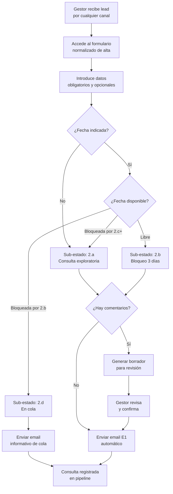

### 3.2 Diagrama CU-02: Gestionar Bloqueo Temporal de Fecha

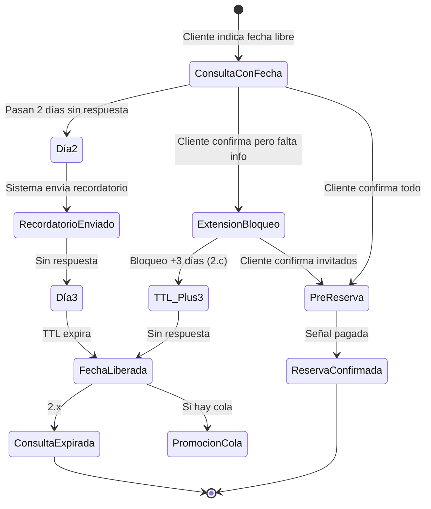

### 3.3 Diagrama CU-03: Gestionar Cola de Espera

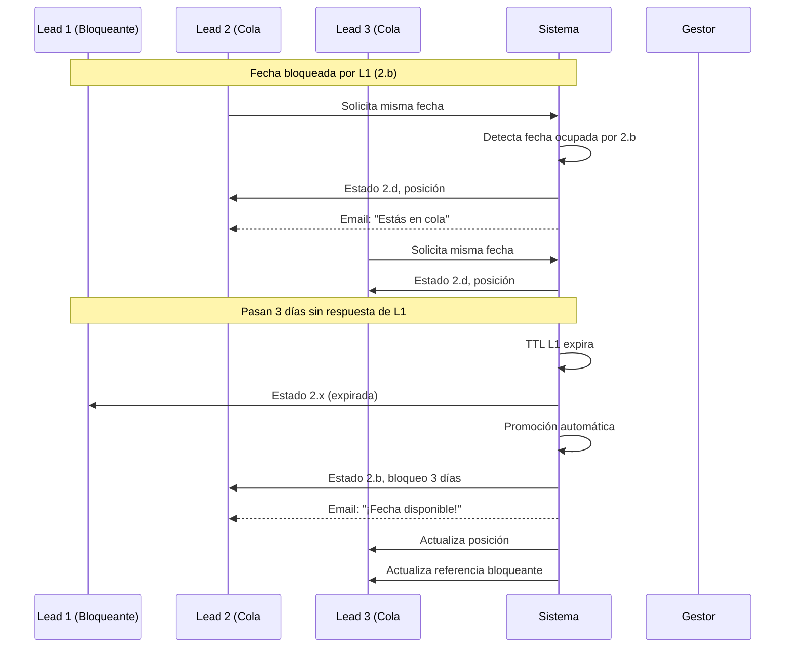

### 3.4 Diagrama CU-04: Programar y Gestionar Visita

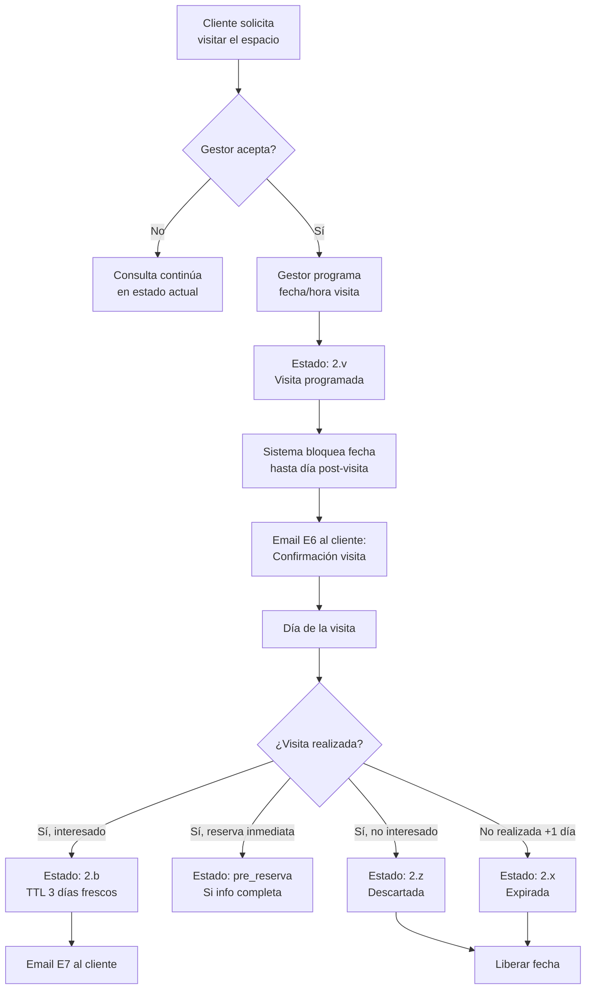

### 3.5 Diagrama CU-05: Generar y Enviar Presupuesto

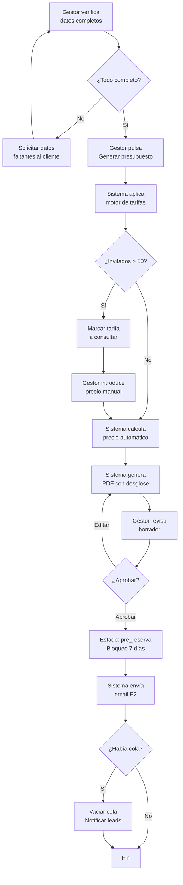

### 3.6 Diagrama CU-06: Confirmar Reserva (Cobro de Señal)

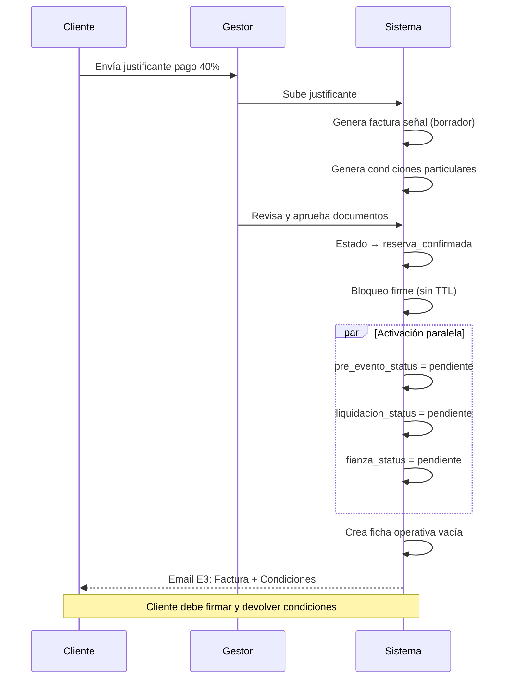

### 3.7 Diagrama CU-07: Gestionar Liquidación Pre-Evento

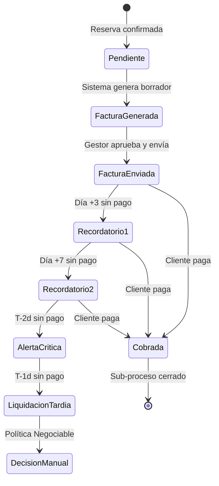

### 3.8 Diagrama CU-08: Gestionar Fianza

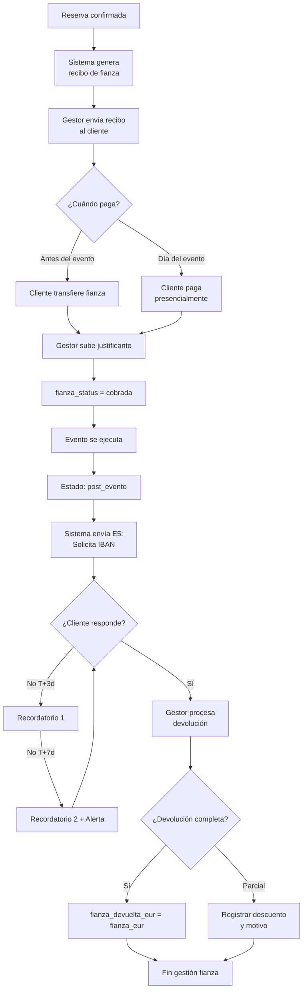

### 3.9 Diagrama CU-10: Ejecutar Evento

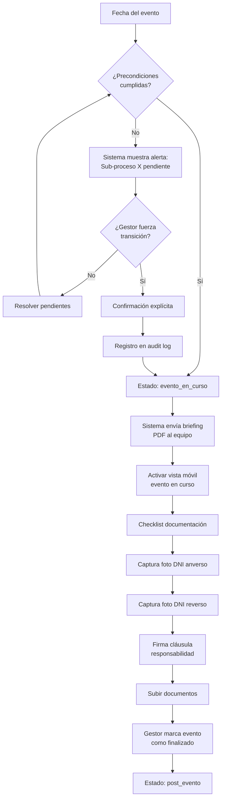

### 3.10 Diagrama CU-13: Pipeline Completo del MVP

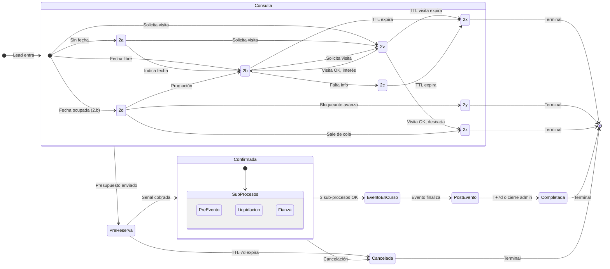

---

## 4. Tabla Comparativa de Casos de Uso

| ID | Nombre | Actor Principal | Impacto en Negocio | Prioridad | Dolores Resueltos |
|----|--------|-----------------|-------------------|-----------|-------------------|
| CU-01 | Registrar Nueva Consulta | Gestor | **Alto** — Punto de entrada de todo el negocio | Alta | D2, D9 |
| CU-02 | Gestionar Bloqueo Temporal de Fecha | Sistema | **Crítico** — Previene doble reserva | Crítica | D4 |
| CU-03 | Gestionar Cola de Espera | Sistema | **Alto** — Maximiza conversión en fechas saturadas | Alta | D13 |
| CU-04 | Programar y Gestionar Visita | Gestor | **Medio** — Mejora experiencia cliente indeciso | Media | D2, D9 |
| CU-05 | Generar y Enviar Presupuesto | Gestor | **Alto** — Reduce de 45min a 30seg | Alta | D8 |
| CU-06 | Confirmar Reserva (Cobro de Señal) | Gestor | **Crítico** — Convierte lead en ingreso | Crítica | D3, D6 |
| CU-07 | Gestionar Liquidación Pre-Evento | Gestor | **Alto** — Asegura cash flow | Alta | D6, D11 |
| CU-08 | Gestionar Fianza | Gestor | **Alto** — Protección contra desperfectos | Alta | D6, D9 |
| CU-09 | Gestionar Documentación Legal | Gestor | **Medio** — Cumplimiento y protección legal | Media | D9, D10 |
| CU-10 | Ejecutar Evento | Equipo Operativo | **Alto** — Core del negocio | Alta | D10 |
| CU-11 | Cerrar Expediente Post-Evento | Sistema | **Medio** — Cierre administrativo ordenado | Media | D5, D9 |
| CU-12 | Consultar Histórico de Reservas | Gestor | **Medio** — Memoria operativa del negocio | Media | D5 |
| CU-13 | Supervisar Pipeline Operativo | Gestor | **Alto** — Visibilidad y control | Alta | D2, D7 |

### Leyenda de Dolores:
- **D2:** No se sabe en qué punto está cada consulta
- **D3:** Sin estados claros de reserva
- **D4:** Riesgo de doble reserva (crítico)
- **D5:** Sin histórico centralizado y consultable
- **D6:** Facturación dispersa
- **D7:** Sin dashboards
- **D8:** Presupuestos manuales (30-60 min)
- **D9:** Sin automatizaciones
- **D10:** Sin fichas organizadas
- **D11:** Sin recordatorios estructurados
- **D13:** Leads perdidos en fechas ocupadas

---

## 5. Diagrama de Interconexión de Casos de Uso

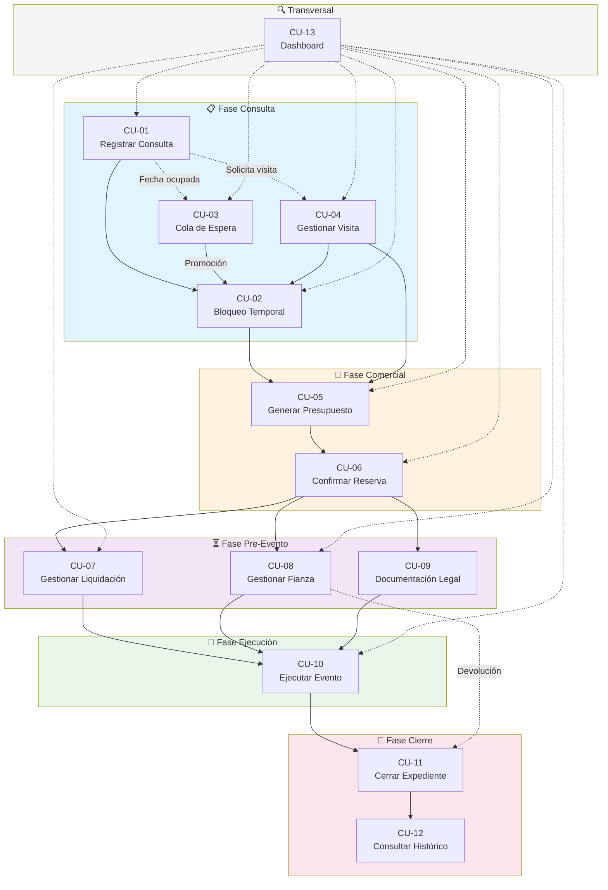

### Relaciones Clave:

| Origen | Destino | Tipo de Relación |
|--------|---------|------------------|
| CU-01 | CU-02 | Secuencial — Alta de consulta activa bloqueo |
| CU-01 | CU-03 | Condicional — Si fecha ocupada, entra en cola |
| CU-01 | CU-04 | Condicional — Si cliente solicita visita |
| CU-03 | CU-02 | Promoción — Lead sale de cola y obtiene bloqueo |
| CU-04 | CU-02/CU-05 | Resultado — Visita deriva en bloqueo o presupuesto |
| CU-02 | CU-05 | Secuencial — Bloqueo confirmado permite presupuesto |
| CU-05 | CU-06 | Secuencial — Presupuesto aceptado permite confirmación |
| CU-06 | CU-07/08/09 | Activación paralela — Confirmar activa 3 sub-procesos |
| CU-07/08/09 | CU-10 | Precondición — Los 3 deben cerrarse para ejecutar |
| CU-10 | CU-11 | Secuencial — Evento finalizado permite cierre |
| CU-08 | CU-11 | Dependencia — Fianza debe devolverse para cerrar |
| CU-11 | CU-12 | Resultado — Expediente cerrado va al histórico |
| CU-13 | Todos | Transversal — Dashboard supervisa todo el pipeline |

---

## 6. Verificación de Cobertura del MVP

### 6.1 Funcionalidades MVP vs Casos de Uso

| Funcionalidad MVP | Caso(s) de Uso que la Cubren |
|-------------------|------------------------------|
| Auth básica + multi-tenant base | Implícito en todos (acceso al sistema) |
| Pipeline completo de reservas (todos los estados) | CU-01 a CU-11 |
| Sub-procesos pre-evento + liquidación + fianza paralelos | CU-07, CU-08, CU-09 |
| Cola de espera (2.d, 2.y, 2.z + promoción + reordenación) | CU-03 |
| Sub-estado 2.v (visita programada) | CU-04 |
| Calendario visual con bloqueo atómico | CU-02 |
| Ficha de reserva: datos cliente + datos evento | CU-01, CU-05, CU-06 |
| Ficha operativa del evento (versión simple) | CU-10 |
| Histórico consultable con búsqueda y filtros | CU-12 |
| Motor de tarifas (3 temporadas × 3 horas × 5 tramos) | CU-05 |
| Generación automática de presupuestos PDF | CU-05 |
| Generación automática de facturas (señal, liquidación) | CU-06, CU-07 |
| Factura de señal (40%) adjunta en email | CU-06 |
| Factura de liquidación (60% + extras) | CU-07 |
| Gestión de fianza: cobro, recibo, IBAN, devolución | CU-08 |
| Datos fiscales del cliente | CU-01, CU-05 |
| Presupuesto con desglose | CU-05 |
| Instrucciones de transferencia en emails | CU-05, CU-06 |
| Condiciones particulares: generación, envío, firma | CU-06, CU-09 |
| Documentación día evento: foto DNI + cláusula | CU-09, CU-10 |
| Emails automáticos del flujo principal (8 emails) | CU-01 a CU-11 |
| Dashboard operativo (versión simple) | CU-13 |
| Audit log mínimo | Implícito en acciones críticas |

### 6.2 Confirmación de Cobertura Completa

✅ **Todas las funcionalidades marcadas como "Implementado en MVP TFM" están cubiertas por al menos un caso de uso.**

Las funcionalidades marcadas como "📐 Solo diseñado" (detección de recurrentes, emails de cola, recordatorios extendidos, dashboard financiero, Stripe, WhatsApp, etc.) quedan fuera del alcance de este documento de casos de uso, tal como indica el alcance del MVP.

---

## 7. Notas de Implementación

### 7.1 Consideraciones Técnicas Derivadas

1. **Transacciones atómicas:** Los CU-02 y CU-03 requieren `SELECT ... FOR UPDATE` para evitar race conditions en bloqueos de fecha y promociones de cola.

2. **Eventos de dominio:** Cada transición de estado debe emitir eventos (`ReservationCreated`, `QueuePromoted`, `DepositCollected`, etc.) para desacoplar automatizaciones.

3. **Generación de PDFs:** CU-05, CU-06, CU-07 y CU-08 requieren motor de generación PDF con plantillas versionadas por tenant.

4. **Emails transaccionales:** Los 8 emails del MVP (E1-E8) deben ser configurables pero con comportamiento automático definido.

5. **Audit log:** Todas las acciones críticas (confirmaciones, overrides manuales, cambios de estado) deben registrarse con usuario, timestamp y contexto.

### 7.2 Puntos de Extensión Identificados

- **CU-01:** Preparado para añadir detección de recurrentes (V1 post-TFM)
- **CU-03:** Preparado para añadir emails específicos de cola (V1 post-TFM)
- **CU-07/08:** Preparado para integración Stripe (V2)
- **CU-13:** Preparado para dashboard financiero + KPIs avanzados (V1 post-TFM)
