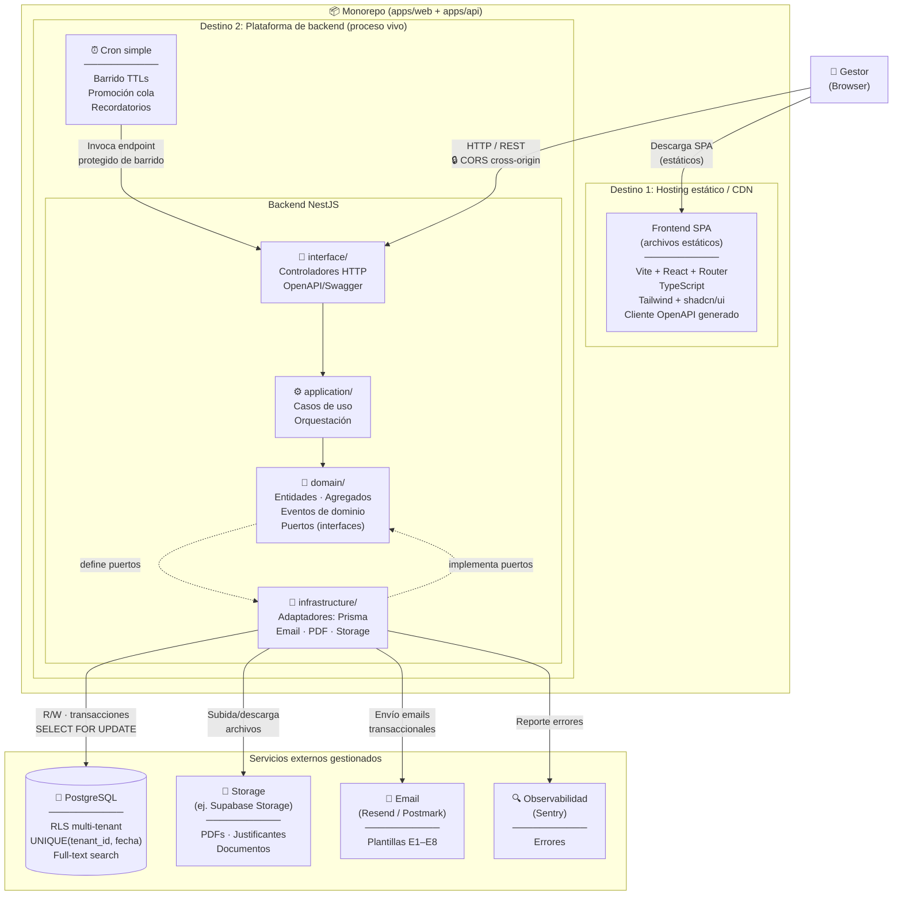

<## Índice

0. [Ficha del proyecto](#0-ficha-del-proyecto)
1. [Descripción general del producto](#1-descripción-general-del-producto)
2. [Arquitectura del sistema](#2-arquitectura-del-sistema)
3. [Modelo de datos](#3-modelo-de-datos)
4. [Especificación de la API](#4-especificación-de-la-api)
5. [Historias de usuario](#5-historias-de-usuario)
6. [Tickets de trabajo](#6-tickets-de-trabajo)
7. [Pull requests](#7-pull-requests)

---

## 0. Ficha del proyecto

### **0.1. Tu nombre completo:**
Roger Vilà Mateo

### **0.2. Nombre del proyecto:**
Slotify

### **0.3. Descripción breve del proyecto:**
Plataforma de gestión para espacios de eventos. SaaS de gestión integral para espacios de eventos privados de pequeño formato (masías, fincas, jardines, salones familiares) que centraliza la gestión completa del negocio en un único backoffice.

### **0.4. URL del proyecto:**

> Puede ser pública o privada, en cuyo caso deberás compartir los accesos de manera segura. Puedes enviarlos a [alvaro@lidr.co](mailto:alvaro@lidr.co) usando algún servicio como [onetimesecret](https://onetimesecret.com/).

### 0.5. URL o archivo comprimido del repositorio

> Puedes tenerlo alojado en público o en privado, en cuyo caso deberás compartir los accesos de manera segura. Puedes enviarlos a [alvaro@lidr.co](mailto:alvaro@lidr.co) usando algún servicio como [onetimesecret](https://onetimesecret.com/). También puedes compartir por correo un archivo zip con el contenido

---

## 1. Descripción general del producto

> Describe en detalle los siguientes aspectos del producto:

### **1.1. Objetivo:**

> Propósito del producto. Qué valor aporta, qué soluciona, y para quién.

### **1.2. Características y funcionalidades principales:**

> Enumera y describe las características y funcionalidades específicas que tiene el producto para satisfacer las necesidades identificadas.

### **1.3. Diseño y experiencia de usuario:**

> Proporciona imágenes y/o videotutorial mostrando la experiencia del usuario desde que aterriza en la aplicación, pasando por todas las funcionalidades principales.

### **1.4. Instrucciones de instalación:**
> Documenta de manera precisa las instrucciones para instalar y poner en marcha el proyecto en local (librerías, backend, frontend, servidor, base de datos, migraciones y semillas de datos, etc.)

---

## 2. Arquitectura del Sistema

### **2.1. Diagrama de arquitectura:**
## Diagrama de Arquitectura de Implementación del MVP

## Arquitectura de Implementación del MVP

### 1. Patrón Arquitectónico

La arquitectura del MVP de Slotify sigue el patrón de monolito modular con arquitectura hexagonal (puertos y adaptadores) y Domain-Driven Design (DDD) en el backend. El código fuente vive en un único monorepo con dos aplicaciones (`apps/web` y `apps/api`) que se despliegan a destinos distintos según su naturaleza: la SPA como archivos estáticos en un CDN, y el backend como proceso vivo en una plataforma de hosting.

El backend NestJS se organiza en cuatro capas con una regla de dependencia estricta hacia adentro. La capa `domain` contiene las entidades, objetos de valor, eventos de dominio y los puertos (interfaces que definen los contratos de servicios externos); esta capa no depende de ningún framework ni infraestructura. La capa `application` orquesta los casos
de uso invocando el dominio. La capa `infrastructure` implementa los adaptadores que satisfacen los puertos: Prisma para persistencia, clientes de email, generación de PDF y almacenamiento de ficheros. La capa `interface` expone los controladores HTTP y genera la documentación OpenAPI. Esta separación hace que el dominio sea testeable de forma aislada,
sin necesidad de bases de datos ni servicios externos.

Sobre esta estructura se aplican patrones secundarios documentados. La reserva es el agregado raíz: toda la lógica de transición de estado, bloqueo de fecha y cola se modela alrededor de esta entidad, diferenciándose de CRMs que giran en torno al cliente. La máquina de estados se modela como configuración, no como código disperso: las transiciones permitidas y sus guardas viven en una estructura de datos consultada por una única función de transición, lo que facilita su traducción a especificaciones SDD y tests. Los eventos de dominio (`ReservaConfirmada`, `FechaBloqueada`, `ColaPromovida`) sirven de base para las automatizaciones del sistema.

### 2. Justificación de la Elección

Esta arquitectura responde a las restricciones concretas de un TFM con plazo ajustado, un único tenant piloto (Masia l'Encís), desarrollo asistido por IA y un riesgo crítico identificado: la doble reserva de una misma fecha.

La decisión de mantener un monolito modular frente a microservicios se fundamenta en la necesidad de preservar transacciones ACID nativas. El bloqueo de fecha —el núcleo crítico del sistema— se garantiza mediante una restricción `UNIQUE(tenant_id, fecha)` en la entidad `FECHA_BLOQUEADA`, manipulada dentro de transacciones con `SELECT ... FOR UPDATE`.
Dos transacciones concurrentes que intenten bloquear la misma fecha producen una inserción exitosa y una violación de unicidad determinista, sin ventana de carrera. Esta garantía la ofrece el motor de base de datos; descomponer el sistema en microservicios obligaría a coordinación distribuida (sagas, eventos, compensaciones) para un problema que PostgreSQL
ya resuelve de forma nativa. El coste real de los microservicios no es el dinero de infraestructura, sino el tiempo de operación que el desarrollo asistido por IA no reduce: la IA acelera el código de aplicación, no la configuración de VPCs, subredes, health checks ni IAM.

Se eligió Vite + React (SPA pura) frente a Next.js porque el producto es una herramienta interna tras login, sin necesidad de SEO ni renderizado del lado del servidor. El backend ya es NestJS, de modo que añadir Next.js duplicaría la lógica de servidor sin aportar valor. La separación estricta entre SPA y API establece una frontera clara: el frontend consume un contrato OpenAPI generado, recuperando type-safety sin acoplamiento de código.

Se descartó Redis para el bloqueo de fecha. Los locks distribuidos solo son necesarios cuando varios procesos sin transacción común compiten por un recurso. El MVP tiene una única base de datos transaccional; introducir Redis añadiría un punto de fallo (incoherencia si el lock se concede pero la transacción falla) para resolver un problema inexistente en esta fase.

La arquitectura objetivo de producción sobre AWS (ECS Fargate, ALB, RDS Multi-AZ, ElastiCache, Lambda, Cognito, WAF) está documentada como visión de destino, pero no se implementa. Cada uno de esos componentes se justifica por necesidades de escala, alta disponibilidad o protección perimetral que un piloto de un tenant no presenta. Implementarlos consumiría tiempo de operación de infraestructura que debería dedicarse al código de aplicación, donde la IA sí aporta aceleración.

### 3. Beneficios Principales

La arquitectura elegida aporta beneficios concretos alineados con los objetivos del TFM:

**Atomicidad transaccional nativa.** El bloqueo de fecha queda encapsulado en dos funciones del dominio (`bloquearFecha()` y `liberarFecha()`) que operan dentro de una transacción PostgreSQL. No hay coordinación distribuida, ni sagas, ni compensaciones. El riesgo crítico de doble reserva se mitiga a nivel de motor de base de datos con una restricción de unicidad, lo que hace el test de concurrencia determinista.

**Simplicidad operativa.** Un único proceso de backend y una única base de datos eliminan la orquestación de contenedores, las comunicaciones inter-servicio y la configuración de infraestructura compleja. El cron de barrido de TTLs es un job interno que invoca un endpoint protegido; si se retrasa o cae, al volver a ejecutarse barre lo pendiente porque
es idempotente.

**Type-safety end-to-end.** TypeScript en frontend y backend, cliente API generado desde OpenAPI de NestJS, y Prisma como ORM. La IA no puede generar código que viole el contrato sin que el compilador lo detecte, lo que reduce errores en el desarrollo asistido.

**Testabilidad para TDD.** La regla de dependencia hexagonal (el dominio no importa de infraestructura) permite escribir tests del núcleo crítico sin bases de datos ni servicios externos. Las especificaciones SDD se traducen casi 1:1 a la tabla de transiciones de la máquina de estados y a sus tests.

**Coherencia con el temario del máster.** La arquitectura exhibe de forma explícita los patrones del programa formativo: capas, DDD, hexagonal, OpenAPI, multi-tenancy con RLS. NestJS estructura el código de manera que la arquitectura es visible en la organización de carpetas.

**Coste bajo de hosting.** El MVP puede desplegarse con coste cero (Render free + Neon/Supabase gratis) o con ~5 €/mes en Railway para un proceso always-on. La SPA se sirve desde cualquier CDN gratuito (Netlify, Cloudflare Pages).

### 4. Sacrificios y Déficits

Toda decisión de arquitectura implica renuncias. Esta sección documenta los sacrificios asumidos, su impacto en la fase MVP y cómo se resolverían en la arquitectura objetivo de producción.

**No escala horizontalmente como microservicios.** Un único proceso de backend no puede replicarse de forma independiente por funcionalidad ni escalar solo los módulos con mayor carga. En la fase MVP esto es aceptable: un solo tenant con un gestor no genera carga que justifique escalado selectivo. En producción, el backend se desplegaría en ECS Fargate con
escalado horizontal homogéneo; la separación de preocupaciones de la arquitectura hexagonal facilitaría una eventual extracción a servicios si la carga lo exigiera.

**Acoplamiento de despliegue del backend.** Cualquier cambio en cualquier módulo del backend requiere redesplegar el proceso completo. Para un TFM con iteraciones rápidas y un único desarrollador, esto no es un problema; al contrario, simplifica el flujo de CI/CD. En producción, si el volumen de cambios o el tamaño del equipo lo justificara, se evaluaría la extracción de módulos a servicios independientes.

**CORS por la separación de dominios.** La SPA se sirve desde un dominio (CDN) distinto al del backend (plataforma de hosting), lo que obliga a configurar CORS en NestJS (`enableCors` con origen permitido). Es una complejidad adicional frente a servir todo desde el mismo origen. El sacrificio es asumible: CORS está bien soportado y la configuración es trivial. En producción tras CloudFront, ambos orígenes se unifican bajo el mismo dominio.

**Ausencia de alta disponibilidad.** Una única instancia de backend y una única base de datos no gestionada con SLA de HA significan que una caída del proceso o del nodo afecta la disponibilidad. Para un piloto de defensa de TFM, la ventana de mantenimiento es aceptable. En producción, RDS Multi-AZ con réplica de lectura y múltiples instancias Fargate tras ALB proporcionarían HA con SLA.

**Coste de mantener dos frameworks.** El stack incluye React en frontend y NestJS en ackend, cada uno con sus dependencias, configuraciones y curvas de aprendizaje. Un framework full-stack (Next.js, Remix) unificaría el runtime. El sacrificio es consciente: la frontera limpia entre SPA y API, el contrato OpenAPI y el valor formativo de NestJS justifican el coste adicional. Además, la generación del cliente API desde OpenAPI minimiza la duplicación de tipos.

**Cron dependiente del estado del proceso.** En plataformas que duermen el backend tras inactividad (Render free), el barrido de TTLs depende de un disparador externo. En Railway (recomendado), el proceso está always-on y el cron es interno. El sacrificio es operativo, no de corrección: si el cron se retrasa, al ejecutarse barre lo pendiente de forma
idempotente. En producción, Lambda + EventBridge Scheduler ejecutarían los jobs de forma serverless, escalando a cero coste entre invocaciones.

### **2.2. Descripción de componentes principales:**

### 2.2.1 Frontend SPA

**Responsabilidad**
Proporciona la interfaz gráfica de la aplicación. Gestiona la presentación de todas las vistas (calendario, pipeline de reservas, dashboard, formularios de gestión), el enrutado del lado del cliente y las llamadas a la API del backend. No ejecuta lógica de negocio: transforma datos recibidos de la API en representaciones visuales e invoca los endpoints correspondientes ante las acciones del gestor. Es el único canal de interacción del usuario con el sistema.

**Tecnología**
- *Vite*: empaquetador y servidor de desarrollo; produce los artefactos estáticos (HTML, CSS, JS) que se publican en el CDN.
- *React + React Router*: librería de composición de UI y enrutador del lado del cliente; gestiona la navegación entre vistas sin recarga de página.
- *TypeScript*: tipado estático alineado con el contrato OpenAPI del backend; los errores de contrato son detectables en compilación.
- *Tailwind + shadcn/ui*: sistema de estilos *utility-first* y componentes de UI accesibles y reutilizables.
- *Cliente HTTP generado desde OpenAPI*: autogenerado a partir del contrato OpenAPI publicado por el backend; garantiza que cualquier cambio de firma de endpoint sea detectado como error de compilación en el frontend.
- *react-big-calendar o FullCalendar*: componente de calendario para las vistas mensual
  y semanal con representación de bloqueos de fecha.

**Relaciones**
- Se descarga del hosting estático/CDN en el primer acceso del navegador; a partir de ahí es un proceso cliente sin dependencia del CDN para el funcionamiento.
- Llama al backend NestJS por HTTP/REST con peticiones cross-origin; el backend gestiona el CORS mediante `enableCors` con origen permitido configurado.

**Alcance MVP**
Implementado: vistas de calendario, pipeline de reservas y los formularios del flujo principal. No implementado/post-TFM: administración de usuarios, gestión de tenants, portal de cliente.

### 2.2.2 Backend NestJS

**Responsabilidad**
Proceso vivo que centraliza toda la lógica de dominio y de aplicación del sistema. Expone la API REST consumida por la SPA y el endpoint de barrido invocado por el cron. Aplica arquitectura hexagonal organizada por módulos de dominio; cada módulo se estructura en cuatro capas verticales.

**Tecnología**
NestJS + TypeScript. El framework provee inyección de dependencias, sistema de módulos, pipes de validación y decoradores para la generación automática del contrato OpenAPI/Swagger consumido por el generador de cliente del frontend.

**Organización interna**

El código se organiza por módulos de dominio (p. ej. `reservas/`, `tarifas/`, `facturacion/`, `comunicaciones/`). Cada módulo contiene las cuatro capas siguientes:

*Capa de interfaz (`interface/`)*
Recibe las peticiones HTTP entrantes, aplica pipes de validación sobre los DTOs de entrada, invoca los casos de uso de la capa de aplicación y serializa las respuestas. Contiene los controladores NestJS y la documentación OpenAPI/Swagger. Es la única capa expuesta a la red.

*Capa de aplicación (`application/`)*
Orquesta los casos de uso del sistema: crear consulta, avanzar la máquina de estados de la reserva, generar presupuesto, registrar pago, tramitar liquidación, etc. Coordina entidades de dominio y puertos de infraestructura sin depender de ningún framework ni adaptador concreto.

*Capa de dominio (`domain/`)*
Modelo de dominio puro. Contiene las entidades (`Reserva`, `FechaBloqueada`, `Cliente`, `Tarifa`, etc.), la máquina de estados de la reserva definida como estructura de datos declarativa, los eventos de dominio (`ReservaConfirmada`, `FechaBloqueada`, `ColaPromovida`, etc.) y los puertos —interfaces TypeScript— que declaran los contratos de infraestructura. Esta capa no importa nada de `infrastructure`, ORM ni servicios externos. Aloja las funciones transaccionales `bloquearFecha()` y `liberarFecha()`, que son el punto único de mutación del bloqueo atómico de fecha.

*Capa de infraestructura (`infrastructure/`)*
Implementa los puertos definidos por el dominio mediante adaptadores concretos: repositorios Prisma, adaptador de email, adaptador de storage, adaptador de generación de PDF. Es la única capa que depende de librerías externas y clientes de terceros.

**Relaciones**
- Recibe peticiones HTTP del frontend (CORS habilitado) y del cron (endpoint de barrido protegido).
- Lee y escribe en PostgreSQL a través de Prisma (capa de infraestructura).
- Invoca el proveedor de email para el envío de las comunicaciones E1–E8.
- Sube y recupera archivos del storage de documentos.
- Reporta excepciones al servicio de observabilidad (Sentry).

**Alcance MVP**
Las cuatro capas implementadas para todos los módulos del flujo principal. Los módulos de administración de plataforma (gestión de tenants, facturación SaaS) quedan fuera del MVP.

### 2.2.3 ORM Prisma

**Responsabilidad**
Capa de acceso a datos del backend. Define el esquema de base de datos como fuente de verdad, gestiona las migraciones versionadas y provee la interfaz de consulta *type-safe* utilizada por los repositorios de la capa de infraestructura. Para las operaciones de bloqueo atómico (`bloquearFecha()` y `liberarFecha()`), expone `$queryRaw` que permite ejecutar `SELECT … FOR UPDATE` dentro de transacciones explícitas, operación que no puede expresarse con la API de alto nivel del ORM.

**Tecnología**
Prisma ORM + TypeScript. El esquema Prisma es la fuente de verdad del modelo de base de datos y se versiona junto con el código del monorepo; las migraciones se aplican en cada despliegue.

**Relaciones**
- Utilizado exclusivamente por la capa de infraestructura del backend NestJS.
- Conecta con la instancia de PostgreSQL gestionada.

**Alcance MVP**
Implementado completo, incluyendo las migraciones iniciales del esquema y la configuración de `$queryRaw` para el bloqueo atómico.

### 2.2.4 Base de datos PostgreSQL

**Responsabilidad**
Almacén de datos transaccional del sistema. Persiste todas las entidades del dominio (reservas, clientes, facturas, documentos, comunicaciones, audit log, etc.) con aislamiento estricto por tenant. Garantiza la no-doble-reserva mediante la restricción compuesta `UNIQUE(tenant_id, fecha)` sobre la tabla `FECHA_BLOQUEADA`. Soporta búsqueda de texto completo sobre el histórico de reservas.

**Tecnología**
PostgreSQL gestionada. Características utilizadas:

- *Row-Level Security (RLS)*: políticas de aislamiento por `tenant_id` que impiden el   acceso cruzado entre tenants a nivel de motor, sin depender de filtros en la lógica   de aplicación.
- *Restricción `UNIQUE(tenant_id, fecha)`*: garantía de unicidad compuesta en `FECHA_BLOQUEADA`; dos transacciones concurrentes sobre la misma fecha producen una inserción exitosa y una violación de unicidad determinista, sin ventana de carrera.
- *Transacciones ACID + `SELECT … FOR UPDATE`*: serializan las escrituras concurrentes en las funciones `bloquearFecha()` y `liberarFecha()`.
- *Full-text search*: búsqueda sobre el histórico de reservas (nombre, código,   observaciones).
- *Índices compuestos*: `(tenant_id, fecha_evento, estado)` para el calendario; `(tenant_id, consulta_bloqueante_id, posicion_cola)` para la gestión de cola; `(tenant_id, email)` en `CLIENTE`.

**Relaciones**
Instancia única; todos los accesos pasan por Prisma desde el backend NestJS. Ningún otro componente accede directamente a la base de datos.

**Alcance MVP**
Instancia única gestionada (sin réplica de lectura ni alta disponibilidad). Esquema completo según `er-diagram.md`. RLS, restricción UNIQUE e índices recomendados implementados desde el inicio del proyecto.

### 2.2.5 Módulo de autenticación (JWT + NestJS + Passport)

**Responsabilidad**
Gestiona el ciclo completo de autenticación: login con credenciales, emisión de tokens, validación de cada petición entrante y renovación de sesión. Incluye en el payload firmado del access token el `tenant_id` y el `rol` del usuario, datos que el backend consume en cada petición para aplicar el aislamiento multi-tenant (RLS) y la autorización por rol.

**Tecnología**
- *NestJS + Passport*: estrategia `local` para el login con usuario/contraseña; estrategia `jwt` para la validación del access token en cada petición protegida.
- *`@nestjs/jwt`*: firma y verificación de tokens JWT.
- *bcrypt o argon2*: hash de contraseñas almacenadas en la tabla `USUARIO`.
- *Access token (JWT)*: vida corta (~15 min); reside en memoria de la SPA, nunca en `localStorage` ni `sessionStorage`; se transporta en la cabecera `Authorization: Bearer`.
- *Refresh token*: vida larga (~7 días); reside en cookie `httpOnly + Secure + SameSite`, inaccesible desde JavaScript; se usa exclusivamente para solicitar un nuevo access token en el endpoint `/auth/refresh`.

**Relaciones**
- Integrado en el backend NestJS como módulo transversal.
- Los guards de NestJS validan el access token antes de que cualquier controlador de negocio procese la petición.
- Lee la tabla `USUARIO` en PostgreSQL vía Prisma para verificar credenciales y construir el payload del token.

**Alcance MVP**
Implementado: access token + refresh token, estrategia `local` y `jwt`. Un único gestor por tenant, aprovisionado por seed/script al crear el tenant; sin UI de gestión de usuarios ni flujo de invitaciones. Los valores del enum `rol` (`gestor`, `admin`, `operario`) están presentes en el modelo de datos, pero en el MVP todos los usuarios tienen `rol = gestor`. La administración de usuarios por un admin de tenant queda post-TFM.

### 2.2.6 Cron de barrido

**Responsabilidad**
Proceso periódico que materializa las expiraciones de TTL y las promociones de cola de espera. A intervalos regulares invoca un endpoint protegido del backend, que ejecuta la función de barrido: examina las filas de `FECHA_BLOQUEADA` con `ttl_expiracion` vencido, libera los bloqueos expirados, actualiza los sub-estados de las reservas afectadas (p. ej. `2.b` → `2.x`) y promueve al siguiente candidato en cola. La operación es idempotente: si el cron se retrasa o falla, al ejecutarse de nuevo barre todo lo pendiente sin inconsistencias. El mismo mecanismo puede desencadenar el envío de recordatorios automáticos.

**Tecnología**
Scheduler periódico (herramienta de scheduling del hosting o scheduler nativo del runtime) que realiza una llamada HTTP al endpoint de barrido. NO ESPECIFICADO la herramienta de scheduling concreta; depende del entorno de hosting elegido.

**Relaciones**
- Llama por HTTP al endpoint de barrido protegido del backend NestJS.
- El backend, al procesar el barrido, escribe en PostgreSQL (liberación de bloqueos, actualización de estados de `RESERVA` y `FECHA_BLOQUEADA`) y puede invocar el proveedor de email para recordatorios automáticos.

**Alcance MVP**
Implementado. En entornos always-on (p. ej. Railway), el scheduler es nativo al proceso. En entornos con arranque en frío (p. ej. Render free tier), requiere un disparador externo que mantenga el proceso activo entre ejecuciones.

### 2.2.7 Generación de PDF

**Responsabilidad**
Genera server-side los documentos PDF de presupuestos y facturas (señal, liquidación, fianza y complementaria). Los PDFs se producen a partir de plantillas editables, se almacenan en el storage de documentos y su URL se persiste en los campos `pdf_url` de las entidades `PRESUPUESTO` y `FACTURA`.

**Tecnología**
Plantillas HTML + Puppeteer o react-pdf. La generación se ejecuta en el proceso del backend NestJS, encapsulada como adaptador en la capa de infraestructura que implementa el puerto de generación de documentos del dominio. NO ESPECIFICADO la librería definitiva entre Puppeteer y react-pdf; la documentación fuente lista ambas como opciones.

**Relaciones**
- Invocado desde la capa de infraestructura del backend NestJS al crear o regenerar un presupuesto o factura.
- El PDF resultante se sube al storage de documentos.
- La URL devuelta por el storage se persiste en PostgreSQL (campos `pdf_url` de `PRESUPUESTO` y `FACTURA`).

**Alcance MVP**
Implementado para todos los tipos de documento facturables definidos en `er-diagram.md`: presupuestos (todas las versiones) y facturas de señal, liquidación, fianza y complementaria.

### 2.2.8 Proveedor de email

**Responsabilidad**
Entrega los emails transaccionales del flujo principal del sistema. El backend delega el envío en este proveedor externo, que gestiona la entrega, el seguimiento y la reputación del dominio remitente (SPF/DKIM/DMARC configurados desde el inicio). Cada envío queda registrado en la tabla `COMUNICACION` de PostgreSQL.

**Tecnología**
Proveedor de email transaccional: Resend o Postmark. NO ESPECIFICADO cuál definitivamente. Se integra como adaptador en la capa de infraestructura del backend NestJS.

**Relaciones**
- Invocado desde la capa de infraestructura del backend NestJS.
- El backend registra cada envío (asunto, destinatario, código de template E1–E8 o manual, estado) en la tabla `COMUNICACION` vía Prisma.

**Alcance MVP**
Implementados los 8 templates del flujo principal (E1–E8) y el email manual. SPF/DKIM/DMARC configurados en el dominio remitente desde el primer despliegue.

### 2.2.9 Storage de documentos

**Responsabilidad**
Almacena y sirve los archivos binarios del sistema: PDFs de presupuestos y facturas, justificantes de pago, documentos de identidad (DNI anverso y reverso), cláusulas de responsabilidad y condiciones particulares firmadas. Cada archivo se referencia desde la tabla `DOCUMENTO` de PostgreSQL mediante su URL; los PDFs de presupuestos y facturas también se referencian desde los campos `pdf_url` de sus respectivas entidades.

**Tecnología**
Storage proporcionado por el hosting (p. ej. Supabase Storage). Se integra como adaptador en la capa de infraestructura del backend NestJS. El proveedor concreto depende del hosting elegido para el despliegue.

**Relaciones**
- El backend NestJS sube archivos al storage (al generar PDFs o al procesar documentos adjuntos) y recupera URLs de descarga.
- Las URLs resultantes se persisten en los campos `url` de la tabla `DOCUMENTO` y `pdf_url` de `PRESUPUESTO` y `FACTURA` en PostgreSQL.

**Alcance MVP**
Implementado para los tipos de documento definidos en `er-diagram.md` §3.15: `dni_anverso`, `dni_reverso`, `clausula_responsabilidad`, `condiciones_particulares`, `justificante_pago`, `presupuesto`, `factura`.

### 2.2.10 Observabilidad (errores)

**Responsabilidad**
Captura, agrega y notifica los errores en tiempo de ejecución del backend. Proporciona contexto de diagnóstico (stack trace, entorno, petición) para facilitar la resolución de incidencias durante el piloto.

**Tecnología**
Sentry. Se integra en el proceso del backend NestJS como middleware de captura de excepciones no controladas y de errores reportados explícitamente desde el código de aplicación.

**Relaciones**
- El backend NestJS reporta excepciones al servicio de Sentry.
- No tiene relación directa con la base de datos ni con ningún otro componente del sistema.

**Alcance MVP**
Implementado para el backend NestJS. Observabilidad del frontend (errores en la SPA): NO ESPECIFICADO en la documentación fuente. Analytics de producto, métricas de negocio y trazado distribuido quedan post-TFM.

**Suposiciones realizadas**

1. *Organización interna del backend*: `er-diagram.md` nombra las entidades del dominio; `architecture.md` §2.6 muestra la estructura de carpetas por capas. Las responsabilidades de cada capa se han derivado directamente de esa estructura y de la
   regla de dependencia hexagonal documentada, sin añadir responsabilidades no explicitadas.
2. *Módulos de dominio M1–M12*: `architecture.md` menciona esta numeración pero no los detalla en el contenido accesible. Los ejemplos de módulos usados (`reservas/`, `tarifas/`, `facturacion/`, `comunicaciones/`) se extraen del diagrama de la §2.6.
3. *Endpoint de barrido protegido*: la documentación indica que el cron "invoca un endpoint protegido"; el mecanismo de protección concreto (p. ej. token secreto en cabecera) NO ESPECIFICADO en los documentos fuente.
4. *Observabilidad del frontend*: la documentación fuente solo menciona Sentry en el contexto del backend. Se ha reflejado esa restricción indicando como NO ESPECIFICADO la cobertura del frontend.
5. *Elección final de librería PDF y proveedor de email*: ambos se documentan como opciones en `architecture.md`; se han transcrito las dos opciones sin decantarse por
   ninguna.

   ------------------

### **2.3. Descripción de alto nivel del proyecto y estructura de ficheros**

> Representa la estructura del proyecto y explica brevemente el propósito de las carpetas principales, así como si obedece a algún patrón o arquitectura específica.

### **2.4. Infraestructura y despliegue**

> Detalla la infraestructura del proyecto, incluyendo un diagrama en el formato que creas conveniente, y explica el proceso de despliegue que se sigue

### **2.5. Seguridad**

> Enumera y describe las prácticas de seguridad principales que se han implementado en el proyecto, añadiendo ejemplos si procede

### **2.6. Tests**

> Describe brevemente algunos de los tests realizados

---

## 3. Modelo de Datos

### **3.1. Diagrama del modelo de datos:**

> Recomendamos usar mermaid para el modelo de datos, y utilizar todos los parámetros que permite la sintaxis para dar el máximo detalle, por ejemplo las claves primarias y foráneas.

### **3.2. Descripción de entidades principales:**

> Recuerda incluir el máximo detalle de cada entidad, como el nombre y tipo de cada atributo, descripción breve si procede, claves primarias y foráneas, relaciones y tipo de relación, restricciones (unique, not null…), etc.

---

## 4. Especificación de la API

> Si tu backend se comunica a través de API, describe los endpoints principales (máximo 3) en formato OpenAPI. Opcionalmente puedes añadir un ejemplo de petición y de respuesta para mayor claridad

---

## 5. Historias de Usuario

> Documenta 3 de las historias de usuario principales utilizadas durante el desarrollo, teniendo en cuenta las buenas prácticas de producto al respecto.

**Historia de Usuario 1**

**Historia de Usuario 2**

**Historia de Usuario 3**

---

## 6. Tickets de Trabajo

> Documenta 3 de los tickets de trabajo principales del desarrollo, uno de backend, uno de frontend, y uno de bases de datos. Da todo el detalle requerido para desarrollar la tarea de inicio a fin teniendo en cuenta las buenas prácticas al respecto. 

**Ticket 1**

**Ticket 2**

**Ticket 3**

---

## 7. Pull Requests

> Documenta 3 de las Pull Requests realizadas durante la ejecución del proyecto

**Pull Request 1**

**Pull Request 2**

**Pull Request 3**
