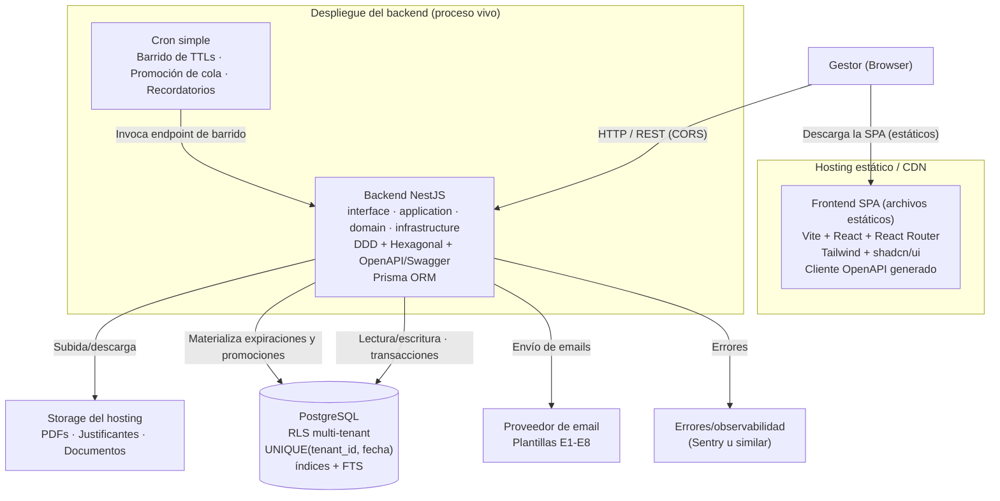
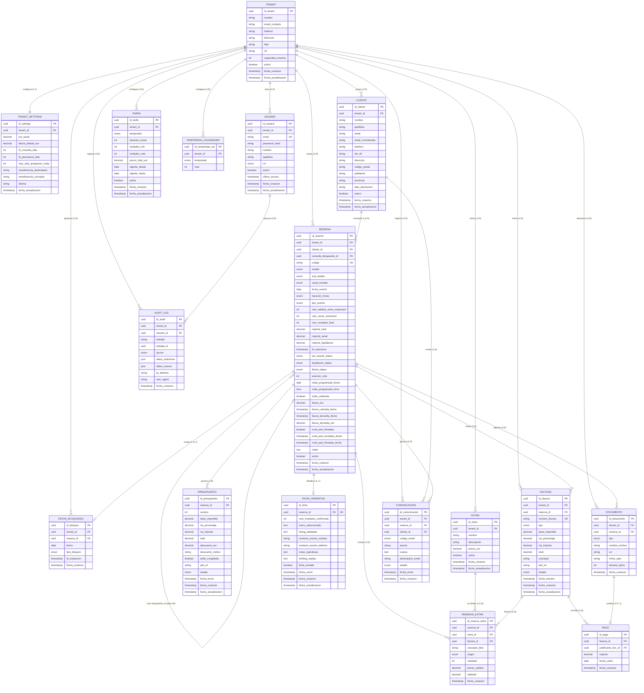

## Índice

0. [Ficha del proyecto](#0-ficha-del-proyecto)
1. [Descripción general del producto](#1-descripción-general-del-producto)
2. [Arquitectura del sistema](#2-arquitectura-del-sistema)
3. [Modelo de datos](#3-modelo-de-datos)
4. [Especificación de la API](#4-especificación-de-la-api)
5. [Historias de usuario](#5-historias-de-usuario)
6. [Tickets de trabajo](#6-tickets-de-trabajo)
7. [Pull requests](#7-pull-requests)

---

## 0. Ficha del proyecto

### **0.1. Tu nombre completo:**
Roger Vilà Mateo

### **0.2. Nombre del proyecto:**
Slotify

### **0.3. Descripción breve del proyecto:**
Slotify es una plataforma SaaS de gestión integral para espacios boutique de eventos privados (masías, fincas, etc.). Centraliza todo el ciclo de vida de una reserva — desde la consulta inicial hasta el cierre y archivo — eliminando la dispersión actual entre Gmail, Sheets y WhatsApp. El modelo gira en torno a la reserva como entidad central, con un pipeline de estados bien definido, bloqueo atómico de fechas, gestión de presupuestos, firmas, pagos y documentación del evento.

### **0.4. URL del proyecto:**

> Puede ser pública o privada, en cuyo caso deberás compartir los accesos de manera segura. Puedes enviarlos a [alvaro@lidr.co](mailto:alvaro@lidr.co) usando algún servicio como [onetimesecret](https://onetimesecret.com/).

### 0.5. URL o archivo comprimido del repositorio

> Puedes tenerlo alojado en público o en privado, en cuyo caso deberás compartir los accesos de manera segura. Puedes enviarlos a [alvaro@lidr.co](mailto:alvaro@lidr.co) usando algún servicio como [onetimesecret](https://onetimesecret.com/). También puedes compartir por correo un archivo zip con el contenido


---

## 1. Descripción general del producto

> Describe en detalle los siguientes aspectos del producto:

### **1.1. Objetivo:**

Slotify es una plataforma SaaS B2B de gestión operativa integral diseñada específicamente para propietarios y gestores de espacios boutique de eventos privados (masías, fincas, villas, salones familiares y similares).

El producto nace para resolver una problemática operativa concreta y recurrente en este segmento: la gestión de un negocio de eventos privados dispersa en múltiples herramientas no integradas — Gmail, Google Sheets, Drive y WhatsApp — que no ofrecen visibilidad del estado de cada reserva, no previenen el riesgo de doble reserva y obligan al equipo gestor a realizar manualmente tareas que pueden automatizarse.

El valor central que aporta Slotify es convertir un proceso caótico y propenso a errores en un flujo operativo estructurado, predecible y trazable, unificando en una sola plataforma todo el ciclo de vida de un evento, desde que un cliente contacta por primera vez hasta que la reserva queda archivada y la fianza devuelta.

A quién va dirigido: gestores operativos de espacios boutique de eventos privados que hoy no disponen de ninguna herramienta especializada en su tipología de negocio. No son un hotel (no encajan en un PMS) ni una empresa de ventas (no encajan en HubSpot o Pipedrive). Necesitan una herramienta que entienda la lógica específica de un evento privado: una fecha = un cliente, bloqueo temporal de disponibilidad, presupuesto condicionado por temporada y número de invitados, fianza reembolsable, documentación legal específica y briefing operativo del día del evento.

### **1.2. Características y funcionalidades principales:**

**El alcance del MVP del TFM se ha acotado deliberadamente para garantizar entrega funcional en plazo. Las funcionalidades se pueden encontrar clasificadas en la especificación funcional del proyecto**

#### Funcionalidades:

**Pipeline de reservas con máquina de estados (Slotify Flow)**
El núcleo del producto. Toda reserva transita por un pipeline de estados bien definido con transiciones controladas y guardas explícitas:

consulta → pre_reserva → reserva_confirmada → evento_en_curso → post_evento → reserva_completada

El estado de consulta tiene sub-estados específicos que reflejan la realidad del proceso comercial:

2a — Consulta exploratoria (sin fecha confirmada)
2b — Consulta con fecha (bloqueo temporal activo)
2c — Pendiente de confirmación de número de invitados
2d — En cola de espera (fecha bloqueada por otra consulta)
2v — Visita al espacio programada o realizada
2x / 2y / 2z — Estados terminales (descartada, expirada, sin respuesta)
Cada transición tiene condiciones de activación, guardas de negocio y acciones asociadas (notificaciones, bloqueos, tareas automáticas).

**Bloqueo atómico de fechas (Slotify Calendar)**
Mecanismo técnico crítico que elimina el riesgo de doble reserva. Utiliza una entidad FECHA_BLOQUEADA con restricción UNIQUE(tenant_id, fecha) en base de datos y transacciones con SELECT ... FOR UPDATE, garantizando que nunca dos reservas puedan reclamar la misma fecha simultáneamente.

El calendario ofrece vista visual mensual y semanal del estado de disponibilidad del espacio, reflejando en tiempo real qué fechas están libres, bloqueadas blandamente (en consulta) o confirmadas.

**Cola de espera automatizada para fechas bloqueadas**
Cuando una fecha ya tiene una consulta activa con bloqueo, los nuevos leads no se pierden: se incorporan automáticamente a una cola FIFO vinculada a esa fecha. Si la consulta bloqueante expira o se descarta, el sistema promueve automáticamente el siguiente lead de la cola, notificando al cliente y al gestor. El gestor también puede promocionar manualmente. Los clientes en cola pueden salir voluntariamente.

**Motor de cálculo de presupuestos y generación de PDF (Slotify Quote)**
Motor de tarifas configurable por tenant basado en una matriz de 3 temporadas × 3 tramos horarios × 5 tramos de invitados (45 combinaciones precalculadas), con soporte para extras opcionales (barbacoa, paellero, etc.).

El motor determina automáticamente la temporada según el mes del evento, identifica el tramo de tarifa correspondiente y calcula el total incluyendo extras. Genera un PDF de presupuesto con el desglose completo: importe total, señal (40%), liquidación (60%) y fianza reembolsable, con instrucciones de pago por transferencia bancaria. Los presupuestos generados quedan versionados e inmutables.

**Facturación y gestión de cobros (Slotify Pay)**
Gestión del ciclo de cobro completo asociado a cada reserva:

- Factura de señal (40%): generada al activar la pre-reserva.
- Factura de liquidación (60%): generada antes del evento.
- Factura de fianza: cobro antes o el mismo día del evento, recibo independiente, solicitud de IBAN post-evento y registro de devolución (total o parcial por desperfectos).
- Registro de pagos con justificantes, conciliación de cobros y generación de facturas complementarias si aplica.

**Ficha operativa del evento (Slotify Brief)**
Briefing estructurado y centralizado de cada evento: timing detallado del día, número final de invitados (adultos y niños, con diferenciación para el cálculo de tarifa), selección de menús, datos de contacto el día del evento, planos y observaciones. Cierre automático de la ficha con aviso T-1 día antes del evento.

**Comunicaciones automatizadas (Slotify Connect)**
Sistema de plantillas dinámicas de email y PDF vinculadas a las transiciones del pipeline. Automatiza el 80% de las comunicaciones recurrentes: confirmación de consulta, envío de presupuesto, recordatorio de pago, envío de condiciones particulares, confirmación de reserva, recordatorios pre-evento. Todas las comunicaciones quedan registradas en el log de la reserva.

**Tareas y recordatorios (Slotify Tasks)**
Sistema de tareas y alertas vinculadas a cada reserva y disparadas automáticamente por el estado del pipeline: recordatorio de seguimiento de consulta, alerta de TTL próximo a expirar, recordatorio de cobro pendiente, aviso de ficha operativa incompleta, etc. Previene que ningún plazo o acción quede sin atención.

**Dashboards operativos, financieros e históricos (Slotify Insights)**
Paneles de control con los KPIs clave del negocio:

- Operativo: reservas activas por estado, tasa de conversión por etapa del pipeline, ocupación mensual.
- Financiero: facturación generada vs. cobrada, cobros pendientes, fianzas en circulación.
- Histórico: reservas archivadas consultables con filtros por fecha, tipo de evento, temporada e importe. Exportación a CSV.

**Gestión de documentación legal (Slotify Brief)**
Control del ciclo de vida de dos documentos legales clave por reserva:

- Condiciones particulares: enviadas junto a la factura de señal, con seguimiento de estado (pendiente envío → enviado → firmado digital/físico).
- Cláusula de responsabilidad: firmada presencialmente el día del evento. El gestor sube el documento firmado al sistema.
Cada documento tiene trazabilidad completa: fecha de envío, fecha de firma y archivo original y firmado almacenados.

**Detección y vinculación de leads recurrentes**
Cuando un cliente vuelve a contactar tras una consulta anterior (expirada, descartada o cerrada), el sistema detecta la coincidencia por datos de contacto y vincula la nueva consulta a la anterior mediante una tabla de trazabilidad consulta_vinculo. El gestor dispone del historial completo del cliente sin necesidad de buscar en correos. Las consultas anteriores permanecen inmutables.

**Multi-tenancy e isolación de datos**
Arquitectura multi-tenant desde el origen: cada tenant corresponde a un espacio. Todos los datos de negocio llevan tenant_id con Row-Level Security activo en base de datos. Gestión de roles por tenant (admin, gestor, operario). El sistema está preparado para escalar a múltiples espacios independientes sin cambios en el modelo de datos.

### **1.3. Diseño y experiencia de usuario:**

> Proporciona imágenes y/o videotutorial mostrando la experiencia del usuario desde que aterriza en la aplicación, pasando por todas las funcionalidades principales.

### **1.4. Instrucciones de instalación:**
> Documenta de manera precisa las instrucciones para instalar y poner en marcha el proyecto en local (librerías, backend, frontend, servidor, base de datos, migraciones y semillas de datos, etc.)

---

## 2. Arquitectura del Sistema

### **2.1. Diagrama de arquitectura:**

### Patrón arquitectónico

Slotify MVP sigue un patrón de monolito modular con arquitectura hexagonal (puertos y adaptadores) en el backend, organizado como monorepo con dos aplicaciones desplegadas en destinos independientes según su naturaleza.


#### Justificación de la arquitectura

**Monolito modular** en lugar de microservicios:

El MVP contempla un único tenant piloto. Desplegar microservicios implicaría orquestar múltiples imágenes Docker, gestionar comunicación inter-servicio, y dedicar tiempo de operaciones de infraestructura que no genera ningún valor diferencial para esta fase del MVP. Un monolito modular bien organizado (separación por módulos de dominio, sin dependencias cruzadas no controladas) entrega el mismo aislamiento lógico con menor coste operativo, y migra a microservicios de forma incremental cuando la carga y el equipo lo justifiquen.

**Arquitectura hexagonal en el backend**:

Se elige porque el dominio del negocio —la máquina de estados de la reserva, el bloqueo atómico de fecha, la cola de espera— es el activo más crítico. Separarlo de los detalles de infraestructura (Prisma, email, PDF) permite testearlo de forma aislada en TDD sin depender de base de datos ni servicios externos. Además, los objetivos formativos del proyecto requieren exhibir explícitamente la separación entre dominio, aplicación, infraestructura e interfaz.

**SPA React como front-end estático**:

El producto es una herramienta operativa interna accedida tras login. No hay requisitos de SEO ni de server-side rendering. Servir la SPA como archivos estáticos desde un CDN (sin proceso vivo de frontend) elimina una capa de infraestructura, reduce costes de hosting y mantiene una frontera front/back limpia con OpenAPI como contrato explícito.

**PostgreSQL como garante del bloqueo atómico**:

El mecanismo central del producto —la protección contra doble reserva— se resuelve con la garantía nativa del motor: restricción `UNIQUE(tenant_id, fecha)` + transacciones con `SELECT ... FOR UPDATE`. Introducir Redis (locks distribuidos) únicamente sería necesario si hubiese múltiples procesos sin transacción común compitiendo por el recurso. Con una única base de datos transaccional, PostgreSQL ya garantiza que dos operaciones concurrentes sobre la misma fecha resultan en una inserción exitosa y una violación de unicidad determinista, sin ventana de carrera posible.

#### Beneficios de esta arquitectura

La arquitectura elegida aporta beneficios concretos alineados con los objetivos del TFM:

**Atomicidad transaccional nativa.** El bloqueo de fecha queda encapsulado en dos funciones del dominio (`bloquearFecha()` y `liberarFecha()`) que operan dentro de una transacción PostgreSQL. No hay coordinación distribuida, ni sagas, ni compensaciones. El riesgo crítico de doble reserva se mitiga a nivel de motor de base de datos con una restricción de unicidad, lo que hace el test de concurrencia determinista.

**Simplicidad operativa.** Un único proceso de backend y una única base de datos eliminan la orquestación de contenedores, las comunicaciones inter-servicio y la configuración de infraestructura compleja. El cron de barrido de TTLs es un job interno que invoca un endpoint protegido; si se retrasa o cae, al volver a ejecutarse barre lo pendiente porque
es idempotente.

**Type-safety end-to-end.** TypeScript en frontend y backend, cliente API generado desde OpenAPI de NestJS, y Prisma como ORM. La IA no puede generar código que viole el contrato sin que el compilador lo detecte, lo que reduce errores en el desarrollo asistido.

**Testabilidad para TDD.** La regla de dependencia hexagonal (el dominio no importa de infraestructura) permite escribir tests del núcleo crítico sin bases de datos ni servicios externos. Las especificaciones SDD se traducen casi 1:1 a la tabla de transiciones de la máquina de estados y a sus tests.

**Coherencia con el temario del máster.** La arquitectura exhibe de forma explícita los patrones del programa formativo: capas, DDD, hexagonal, OpenAPI, multi-tenancy con RLS. NestJS estructura el código de manera que la arquitectura es visible en la organización de carpetas.

**Coste bajo de hosting.** El MVP puede desplegarse con coste cero (Render free + Neon/Supabase gratis) o con ~5 €/mes en Railway para un proceso always-on. La SPA se sirve desde cualquier CDN gratuito (Netlify, Cloudflare Pages).

#### Sacrificios y déficits asumidos conscientemente

Toda decisión de arquitectura implica renuncias. Esta sección documenta los sacrificios asumidos, su impacto en la fase MVP y cómo se resolverían en la arquitectura objetivo de producción.

**No escala horizontalmente como microservicios.** Un único proceso de backend no puede replicarse de forma independiente por funcionalidad ni escalar solo los módulos con mayor carga. En la fase MVP esto es aceptable: un solo tenant con un gestor no genera carga que justifique escalado selectivo. En producción, el backend se desplegaría en ECS Fargate con
escalado horizontal homogéneo; la separación de preocupaciones de la arquitectura hexagonal facilitaría una eventual extracción a servicios si la carga lo exigiera.

**Acoplamiento de despliegue del backend.** Cualquier cambio en cualquier módulo del backend requiere redesplegar el proceso completo. Para un TFM con iteraciones rápidas y un único desarrollador, esto no es un problema; al contrario, simplifica el flujo de CI/CD. En producción, si el volumen de cambios o el tamaño del equipo lo justificara, se evaluaría la extracción de módulos a servicios independientes.

**CORS por la separación de dominios.** La SPA se sirve desde un dominio (CDN) distinto al del backend (plataforma de hosting), lo que obliga a configurar CORS en NestJS (`enableCors` con origen permitido). Es una complejidad adicional frente a servir todo desde el mismo origen. El sacrificio es asumible: CORS está bien soportado y la configuración es trivial. En producción tras CloudFront, ambos orígenes se unifican bajo el mismo dominio.

**Ausencia de alta disponibilidad.** Una única instancia de backend y una única base de datos no gestionada con SLA de HA significan que una caída del proceso o del nodo afecta la disponibilidad. Para un piloto de defensa de TFM, la ventana de mantenimiento es aceptable. En producción, RDS Multi-AZ con réplica de lectura y múltiples instancias Fargate tras ALB proporcionarían HA con SLA.

**Coste de mantener dos frameworks.** El stack incluye React en frontend y NestJS en ackend, cada uno con sus dependencias, configuraciones y curvas de aprendizaje. Un framework full-stack (Next.js, Remix) unificaría el runtime. El sacrificio es consciente: la frontera limpia entre SPA y API, el contrato OpenAPI y el valor formativo de NestJS justifican el coste adicional. Además, la generación del cliente API desde OpenAPI minimiza la duplicación de tipos.

**Cron dependiente del estado del proceso.** En plataformas que duermen el backend tras inactividad (Render free), el barrido de TTLs depende de un disparador externo. En Railway (recomendado), el proceso está always-on y el cron es interno. El sacrificio es operativo, no de corrección: si el cron se retrasa, al ejecutarse barre lo pendiente de forma
idempotente. En producción, Lambda + EventBridge Scheduler ejecutarían los jobs de forma serverless, escalando a cero coste entre invocaciones.

---

### 2.2. Descripción de componentes principales

### 2.2.1 Frontend SPA

**Responsabilidad**
Proporciona la interfaz gráfica de la aplicación. Gestiona la presentación de todas las vistas (calendario, pipeline de reservas, dashboard, formularios de gestión), el enrutado del lado del cliente y las llamadas a la API del backend. No ejecuta lógica de negocio: transforma datos recibidos de la API en representaciones visuales e invoca los endpoints correspondientes ante las acciones del gestor. Es el único canal de interacción del usuario con el sistema.

**Tecnología**
- *Vite*: empaquetador y servidor de desarrollo; produce los artefactos estáticos (HTML, CSS, JS) que se publican en el CDN.
- *React + React Router*: librería de composición de UI y enrutador del lado del cliente; gestiona la navegación entre vistas sin recarga de página.
- *TypeScript*: tipado estático alineado con el contrato OpenAPI del backend; los errores de contrato son detectables en compilación.
- *Tailwind + shadcn/ui*: sistema de estilos *utility-first* y componentes de UI accesibles y reutilizables.
- *Cliente HTTP generado desde OpenAPI*: autogenerado a partir del contrato OpenAPI publicado por el backend; garantiza que cualquier cambio de firma de endpoint sea detectado como error de compilación en el frontend.
- *react-big-calendar o FullCalendar*: componente de calendario para las vistas mensual
  y semanal con representación de bloqueos de fecha.

**Relaciones**
- Se descarga del hosting estático/CDN en el primer acceso del navegador; a partir de ahí es un proceso cliente sin dependencia del CDN para el funcionamiento.
- Llama al backend NestJS por HTTP/REST con peticiones cross-origin; el backend gestiona el CORS mediante `enableCors` con origen permitido configurado.

**Alcance MVP**
Implementado: vistas de calendario, pipeline de reservas y los formularios del flujo principal. No implementado/post-TFM: administración de usuarios, gestión de tenants, portal de cliente.

### 2.2.2 Backend NestJS

**Responsabilidad**
Proceso vivo que centraliza toda la lógica de dominio y de aplicación del sistema. Expone la API REST consumida por la SPA y el endpoint de barrido invocado por el cron. Aplica arquitectura hexagonal organizada por módulos de dominio; cada módulo se estructura en cuatro capas verticales.

**Tecnología**
NestJS + TypeScript. El framework provee inyección de dependencias, sistema de módulos, pipes de validación y decoradores para la generación automática del contrato OpenAPI/Swagger consumido por el generador de cliente del frontend.

**Organización interna**

El código se organiza por módulos de dominio (p. ej. `reservas/`, `tarifas/`, `facturacion/`, `comunicaciones/`). Cada módulo contiene las cuatro capas siguientes:

*Capa de interfaz (`interface/`)*
Recibe las peticiones HTTP entrantes, aplica pipes de validación sobre los DTOs de entrada, invoca los casos de uso de la capa de aplicación y serializa las respuestas. Contiene los controladores NestJS y la documentación OpenAPI/Swagger. Es la única capa expuesta a la red.

*Capa de aplicación (`application/`)*
Orquesta los casos de uso del sistema: crear consulta, avanzar la máquina de estados de la reserva, generar presupuesto, registrar pago, tramitar liquidación, etc. Coordina entidades de dominio y puertos de infraestructura sin depender de ningún framework ni adaptador concreto.

*Capa de dominio (`domain/`)*
Modelo de dominio puro. Contiene las entidades (`Reserva`, `FechaBloqueada`, `Cliente`, `Tarifa`, etc.), la máquina de estados de la reserva definida como estructura de datos declarativa, los eventos de dominio (`ReservaConfirmada`, `FechaBloqueada`, `ColaPromovida`, etc.) y los puertos —interfaces TypeScript— que declaran los contratos de infraestructura. Esta capa no importa nada de `infrastructure`, ORM ni servicios externos. Aloja las funciones transaccionales `bloquearFecha()` y `liberarFecha()`, que son el punto único de mutación del bloqueo atómico de fecha.

*Capa de infraestructura (`infrastructure/`)*
Implementa los puertos definidos por el dominio mediante adaptadores concretos: repositorios Prisma, adaptador de email, adaptador de storage, adaptador de generación de PDF. Es la única capa que depende de librerías externas y clientes de terceros.

**Relaciones**
- Recibe peticiones HTTP del frontend (CORS habilitado) y del cron (endpoint de barrido protegido).
- Lee y escribe en PostgreSQL a través de Prisma (capa de infraestructura).
- Invoca el proveedor de email para el envío de las comunicaciones E1–E8.
- Sube y recupera archivos del storage de documentos.
- Reporta excepciones al servicio de observabilidad (Sentry).

**Alcance MVP**
Las cuatro capas implementadas para todos los módulos del flujo principal. Los módulos de administración de plataforma (gestión de tenants, facturación SaaS) quedan fuera del MVP.

### 2.2.3 ORM Prisma

**Responsabilidad**
Capa de acceso a datos del backend. Define el esquema de base de datos como fuente de verdad, gestiona las migraciones versionadas y provee la interfaz de consulta *type-safe* utilizada por los repositorios de la capa de infraestructura. Para las operaciones de bloqueo atómico (`bloquearFecha()` y `liberarFecha()`), expone `$queryRaw` que permite ejecutar `SELECT … FOR UPDATE` dentro de transacciones explícitas, operación que no puede expresarse con la API de alto nivel del ORM.

**Tecnología**
Prisma ORM + TypeScript. El esquema Prisma es la fuente de verdad del modelo de base de datos y se versiona junto con el código del monorepo; las migraciones se aplican en cada despliegue.

**Relaciones**
- Utilizado exclusivamente por la capa de infraestructura del backend NestJS.
- Conecta con la instancia de PostgreSQL gestionada.

**Alcance MVP**
Implementado completo, incluyendo las migraciones iniciales del esquema y la configuración de `$queryRaw` para el bloqueo atómico.

### 2.2.4 Base de datos PostgreSQL

**Responsabilidad**
Almacén de datos transaccional del sistema. Persiste todas las entidades del dominio (reservas, clientes, facturas, documentos, comunicaciones, audit log, etc.) con aislamiento estricto por tenant. Garantiza la no-doble-reserva mediante la restricción compuesta `UNIQUE(tenant_id, fecha)` sobre la tabla `FECHA_BLOQUEADA`. Soporta búsqueda de texto completo sobre el histórico de reservas.

**Tecnología**
PostgreSQL gestionada. Características utilizadas:

- *Row-Level Security (RLS)*: políticas de aislamiento por `tenant_id` que impiden el   acceso cruzado entre tenants a nivel de motor, sin depender de filtros en la lógica   de aplicación.
- *Restricción `UNIQUE(tenant_id, fecha)`*: garantía de unicidad compuesta en `FECHA_BLOQUEADA`; dos transacciones concurrentes sobre la misma fecha producen una inserción exitosa y una violación de unicidad determinista, sin ventana de carrera.
- *Transacciones ACID + `SELECT … FOR UPDATE`*: serializan las escrituras concurrentes en las funciones `bloquearFecha()` y `liberarFecha()`.
- *Full-text search*: búsqueda sobre el histórico de reservas (nombre, código,   observaciones).
- *Índices compuestos*: `(tenant_id, fecha_evento, estado)` para el calendario; `(tenant_id, consulta_bloqueante_id, posicion_cola)` para la gestión de cola; `(tenant_id, email)` en `CLIENTE`.

**Relaciones**
Instancia única; todos los accesos pasan por Prisma desde el backend NestJS. Ningún otro componente accede directamente a la base de datos.

**Alcance MVP**
Instancia única gestionada (sin réplica de lectura ni alta disponibilidad). Esquema completo según `er-diagram.md`. RLS, restricción UNIQUE e índices recomendados implementados desde el inicio del proyecto.

### 2.2.5 Módulo de autenticación (JWT + NestJS + Passport)

**Responsabilidad**
Gestiona el ciclo completo de autenticación: login con credenciales, emisión de tokens, validación de cada petición entrante y renovación de sesión. Incluye en el payload firmado del access token el `tenant_id` y el `rol` del usuario, datos que el backend consume en cada petición para aplicar el aislamiento multi-tenant (RLS) y la autorización por rol.

**Tecnología**
- *NestJS + Passport*: estrategia `local` para el login con usuario/contraseña; estrategia `jwt` para la validación del access token en cada petición protegida.
- *`@nestjs/jwt`*: firma y verificación de tokens JWT.
- *bcrypt o argon2*: hash de contraseñas almacenadas en la tabla `USUARIO`.
- *Access token (JWT)*: vida corta (~15 min); reside en memoria de la SPA, nunca en `localStorage` ni `sessionStorage`; se transporta en la cabecera `Authorization: Bearer`.
- *Refresh token*: vida larga (~7 días); reside en cookie `httpOnly + Secure + SameSite`, inaccesible desde JavaScript; se usa exclusivamente para solicitar un nuevo access token en el endpoint `/auth/refresh`.

**Relaciones**
- Integrado en el backend NestJS como módulo transversal.
- Los guards de NestJS validan el access token antes de que cualquier controlador de negocio procese la petición.
- Lee la tabla `USUARIO` en PostgreSQL vía Prisma para verificar credenciales y construir el payload del token.

**Alcance MVP**
Implementado: access token + refresh token, estrategia `local` y `jwt`. Un único gestor por tenant, aprovisionado por seed/script al crear el tenant; sin UI de gestión de usuarios ni flujo de invitaciones. Los valores del enum `rol` (`gestor`, `admin`, `operario`) están presentes en el modelo de datos, pero en el MVP todos los usuarios tienen `rol = gestor`. La administración de usuarios por un admin de tenant queda post-TFM.

### 2.2.6 Cron de barrido

**Responsabilidad**
Proceso periódico que materializa las expiraciones de TTL y las promociones de cola de espera. A intervalos regulares invoca un endpoint protegido del backend, que ejecuta la función de barrido: examina las filas de `FECHA_BLOQUEADA` con `ttl_expiracion` vencido, libera los bloqueos expirados, actualiza los sub-estados de las reservas afectadas (p. ej. `2.b` → `2.x`) y promueve al siguiente candidato en cola. La operación es idempotente: si el cron se retrasa o falla, al ejecutarse de nuevo barre todo lo pendiente sin inconsistencias. El mismo mecanismo puede desencadenar el envío de recordatorios automáticos.

**Tecnología**
Scheduler periódico (herramienta de scheduling del hosting o scheduler nativo del runtime) que realiza una llamada HTTP al endpoint de barrido. NO ESPECIFICADO la herramienta de scheduling concreta; depende del entorno de hosting elegido.

**Relaciones**
- Llama por HTTP al endpoint de barrido protegido del backend NestJS.
- El backend, al procesar el barrido, escribe en PostgreSQL (liberación de bloqueos, actualización de estados de `RESERVA` y `FECHA_BLOQUEADA`) y puede invocar el proveedor de email para recordatorios automáticos.

**Alcance MVP**
Implementado. En entornos always-on (p. ej. Railway), el scheduler es nativo al proceso. En entornos con arranque en frío (p. ej. Render free tier), requiere un disparador externo que mantenga el proceso activo entre ejecuciones.

### 2.2.7 Generación de PDF

**Responsabilidad**
Genera server-side los documentos PDF de presupuestos y facturas (señal, liquidación, fianza y complementaria). Los PDFs se producen a partir de plantillas editables, se almacenan en el storage de documentos y su URL se persiste en los campos `pdf_url` de las entidades `PRESUPUESTO` y `FACTURA`.

**Tecnología**
Plantillas HTML + Puppeteer o react-pdf. La generación se ejecuta en el proceso del backend NestJS, encapsulada como adaptador en la capa de infraestructura que implementa el puerto de generación de documentos del dominio. NO ESPECIFICADO la librería definitiva entre Puppeteer y react-pdf; la documentación fuente lista ambas como opciones.

**Relaciones**
- Invocado desde la capa de infraestructura del backend NestJS al crear o regenerar un presupuesto o factura.
- El PDF resultante se sube al storage de documentos.
- La URL devuelta por el storage se persiste en PostgreSQL (campos `pdf_url` de `PRESUPUESTO` y `FACTURA`).

**Alcance MVP**
Implementado para todos los tipos de documento facturables definidos en `er-diagram.md`: presupuestos (todas las versiones) y facturas de señal, liquidación, fianza y complementaria.

### 2.2.8 Proveedor de email

**Responsabilidad**
Entrega los emails transaccionales del flujo principal del sistema. El backend delega el envío en este proveedor externo, que gestiona la entrega, el seguimiento y la reputación del dominio remitente (SPF/DKIM/DMARC configurados desde el inicio). Cada envío queda registrado en la tabla `COMUNICACION` de PostgreSQL.

**Tecnología**
Proveedor de email transaccional: Resend o Postmark. NO ESPECIFICADO cuál definitivamente. Se integra como adaptador en la capa de infraestructura del backend NestJS.

**Relaciones**
- Invocado desde la capa de infraestructura del backend NestJS.
- El backend registra cada envío (asunto, destinatario, código de template E1–E8 o manual, estado) en la tabla `COMUNICACION` vía Prisma.

**Alcance MVP**
Implementados los 8 templates del flujo principal (E1–E8) y el email manual. SPF/DKIM/DMARC configurados en el dominio remitente desde el primer despliegue.

### 2.2.9 Storage de documentos

**Responsabilidad**
Almacena y sirve los archivos binarios del sistema: PDFs de presupuestos y facturas, justificantes de pago, documentos de identidad (DNI anverso y reverso), cláusulas de responsabilidad y condiciones particulares firmadas. Cada archivo se referencia desde la tabla `DOCUMENTO` de PostgreSQL mediante su URL; los PDFs de presupuestos y facturas también se referencian desde los campos `pdf_url` de sus respectivas entidades.

**Tecnología**
Storage proporcionado por el hosting (p. ej. Supabase Storage). Se integra como adaptador en la capa de infraestructura del backend NestJS. El proveedor concreto depende del hosting elegido para el despliegue.

**Relaciones**
- El backend NestJS sube archivos al storage (al generar PDFs o al procesar documentos adjuntos) y recupera URLs de descarga.
- Las URLs resultantes se persisten en los campos `url` de la tabla `DOCUMENTO` y `pdf_url` de `PRESUPUESTO` y `FACTURA` en PostgreSQL.

**Alcance MVP**
Implementado para los tipos de documento definidos en `er-diagram.md` §3.15: `dni_anverso`, `dni_reverso`, `clausula_responsabilidad`, `condiciones_particulares`, `justificante_pago`, `presupuesto`, `factura`.

### 2.2.10 Observabilidad (errores)

**Responsabilidad**
Captura, agrega y notifica los errores en tiempo de ejecución del backend. Proporciona contexto de diagnóstico (stack trace, entorno, petición) para facilitar la resolución de incidencias durante el piloto.

**Tecnología**
Sentry. Se integra en el proceso del backend NestJS como middleware de captura de excepciones no controladas y de errores reportados explícitamente desde el código de aplicación.

**Relaciones**
- El backend NestJS reporta excepciones al servicio de Sentry.
- No tiene relación directa con la base de datos ni con ningún otro componente del sistema.

**Alcance MVP**
Implementado para el backend NestJS. Observabilidad del frontend (errores en la SPA): NO ESPECIFICADO en la documentación fuente. Analytics de producto, métricas de negocio y trazado distribuido quedan post-TFM.

---

### 2.3. Descripción de alto nivel del proyecto y estructura de ficheros

#### Estructura del monorepo

```
slotify/                          ← Raíz del monorepo
│
├── apps/
│   ├── web/                      ← Frontend SPA (Vite + React)
│   │   ├── src/
│   │   │   ├── pages/            Vistas por sección (reservas, calendario, presupuestos…)
│   │   │   ├── components/       Componentes reutilizables de UI
│   │   │   ├── hooks/            Custom hooks de React
│   │   │   ├── api/              Cliente HTTP generado desde OpenAPI del backend
│   │   │   └── router/           Configuración de React Router
│   │   └── vite.config.ts
│   │
│   └── api/                      ← Backend NestJS
│       └── src/
│           ├── reservas/         Módulo M1 — Agregado raíz, máquina de estados
│           │   ├── domain/       Entidades, VOs, eventos de dominio, PUERTOS
│           │   ├── application/  Casos de uso (orquestan el dominio)
│           │   ├── infrastructure/  Adaptadores: Prisma, email, PDF, storage
│           │   └── interface/    Controladores HTTP + decoradores OpenAPI
│           ├── calendario/       Módulo M2 — Disponibilidad y bloqueos
│           ├── presupuestos/     Módulo M4 — Tarifas + generación PDF
│           ├── facturacion/      Módulo M5 — Facturas, cobros, fianza
│           ├── comunicaciones/   Módulo M6 — Email y log de comunicaciones
│           ├── ficha-evento/     Módulo M7 — Briefing operativo
│           ├── dashboards/       Módulo M10 — KPIs y reporting
│           ├── config/           Módulo M11 — Configuración por tenant
│           ├── auth/             Autenticación JWT + guards
│           ├── cron/             Barrido periódico de TTLs y cola
│           └── prisma/           Schema, migraciones y seed
│
├── docs/                         Documentación técnica
├── user-stories/                 Historias de usuario del backlog
└── context/                      Especificación funcional y diagramas
```

#### Patrón de organización del backend

Cada módulo de dominio replica la misma estructura en cuatro capas, respetando la **regla de dependencia hexagonal**: el flujo de dependencias apunta siempre hacia adentro; `domain` nunca importa de `infrastructure` ni de frameworks.

```
<modulo>/
  domain/           Entidades y objetos de valor puros, eventos de dominio,
                    PUERTOS (interfaces que el dominio necesita del exterior).
                    Sin dependencias de frameworks ni de Prisma.

  application/      Casos de uso: orquestan el dominio invocando puertos.
                    Reciben DTOs de entrada, devuelven DTOs de salida.
                    Sin lógica de negocio propia.

  infrastructure/   ADAPTADORES que implementan los puertos del dominio:
                    repositorios Prisma, adaptador de email, generador PDF,
                    cliente de storage. Aquí vive la integración con servicios externos.

  interface/        Controladores NestJS: mapean HTTP → caso de uso → respuesta HTTP.
                    Decoradores OpenAPI/Swagger para generación del contrato.
```

Esta estructura obedece al patrón **Arquitectura Hexagonal (Ports & Adapters)**, combinado con los principios de **Domain-Driven Design (DDD)**: la reserva actúa como agregado raíz, y toda la lógica de negocio reside en el dominio, aislada y testeable independientemente de la infraestructura que la rodea. La organización por módulos de dominio (en lugar de capas técnicas globales `controllers/`, `services/`, `repositories/`) garantiza que los límites del negocio sean explícitos en el código y que el contexto que recibe la IA asistente esté acotado a un módulo sin necesitar todo el sistema.

### **2.4. Infraestructura y despliegue**

> Detalla la infraestructura del proyecto, incluyendo un diagrama en el formato que creas conveniente, y explica el proceso de despliegue que se sigue

### **2.5. Seguridad**

> Enumera y describe las prácticas de seguridad principales que se han implementado en el proyecto, añadiendo ejemplos si procede

### **2.6. Tests**

> Describe brevemente algunos de los tests realizados

---

## 3. Modelo de Datos

### **3.1. Diagrama del modelo de datos**



---

### **3.2. Descripción de entidades principales**

#### **TENANT**
Espacio boutique de eventos (masía, finca, villa, jardín). Es la entidad raíz del modelo multi-tenant: cada tenant representa exactamente un espacio físico. Todos los datos de negocio se aíslan por `tenant_id`.

| Atributo | Tipo SQL | Restricciones | Descripción |
|---|---|---|---|
| `id_tenant` | `UUID` | **PK** | Identificador único del tenant |
| `nombre` | `VARCHAR(100)` | NOT NULL | Nombre comercial del espacio (p. ej. "Masia l'Encís") |
| `email_contacto` | `VARCHAR(255)` | NOT NULL | Email principal de contacto del espacio |
| `telefono` | `VARCHAR(20)` | — | Teléfono de contacto |
| `direccion` | `VARCHAR(255)` | — | Dirección física del espacio |
| `iban` | `VARCHAR(34)` | — | IBAN para recibir transferencias de los clientes |
| `nif` | `VARCHAR(15)` | — | NIF/CIF para emitir facturas |
| `capacidad_maxima` | `INT` | — | Aforo máximo del espacio (referencia para validaciones) |
| `activo` | `BOOLEAN` | NOT NULL, DEFAULT TRUE | Permite suspender el tenant sin borrado físico |
| `fecha_creacion` | `TIMESTAMP` | NOT NULL | Registro de alta |
| `fecha_actualizacion` | `TIMESTAMP` | NOT NULL | Última modificación |

**Relaciones:** 1:1 con `TENANT_SETTINGS`; 1:N con todas las entidades de negocio.

---

#### **TENANT_SETTINGS**
Configuración operativa del tenant. Centraliza todos los parámetros ajustables: porcentajes de pago, TTLs de bloqueo, datos de transferencia bancaria e idioma. Diseñada con valores de defecto para el MVP (Masia l'Encís) pero extensible por tenant en versiones futuras.

| Atributo | Tipo SQL | Restricciones | Descripción |
|---|---|---|---|
| `id_settings` | `UUID` | **PK** | Identificador único |
| `tenant_id` | `UUID` | **FK → TENANT**, NOT NULL, UNIQUE | Relación 1:1 con el tenant |
| `pct_senal` | `DECIMAL(4,2)` | NOT NULL, DEFAULT 40.00 | Porcentaje de señal sobre el total (40% en MVP) |
| `fianza_default_eur` | `DECIMAL(10,2)` | NOT NULL | Importe por defecto de la fianza |
| `ttl_consulta_dias` | `INT` | NOT NULL, DEFAULT 3 | Días de bloqueo blando en sub-estado 2.b |
| `ttl_prereserva_dias` | `INT` | NOT NULL, DEFAULT 7 | Días de bloqueo en pre-reserva |
| `max_dias_programar_visita` | `INT` | NOT NULL, DEFAULT 7 | Máximo de días desde solicitud para programar visita |
| `transferencia_destinatario` | `VARCHAR(100)` | — | Beneficiario para instrucciones de pago (p. ej. "Canoliart, SL") |
| `transferencia_concepto` | `VARCHAR(100)` | — | Concepto de transferencia sugerido al cliente |
| `idioma` | `VARCHAR(5)` | NOT NULL, DEFAULT 'es' | Idioma para comunicaciones (BCP 47) |
| `fecha_actualizacion` | `TIMESTAMP` | NOT NULL | Última modificación |

---

#### **USUARIO**
Personas con acceso al sistema. Siempre pertenecen a un único tenant. El sistema soporta tres roles con distintos niveles de acceso.

| Atributo | Tipo SQL | Restricciones | Descripción |
|---|---|---|---|
| `id_usuario` | `UUID` | **PK** | Identificador único |
| `tenant_id` | `UUID` | **FK → TENANT**, NOT NULL | Tenant al que pertenece el usuario |
| `email` | `VARCHAR(255)` | NOT NULL, UNIQUE | Email de inicio de sesión. Único en toda la tabla |
| `password_hash` | `VARCHAR(255)` | NOT NULL | Hash bcrypt de la contraseña |
| `nombre` | `VARCHAR(100)` | NOT NULL | Nombre del usuario |
| `apellidos` | `VARCHAR(100)` | — | Apellidos del usuario |
| `rol` | `ENUM('gestor','admin','operario')` | NOT NULL | Nivel de acceso al sistema |
| `activo` | `BOOLEAN` | NOT NULL, DEFAULT TRUE | Soft delete / suspensión de cuenta |
| `ultimo_acceso` | `TIMESTAMP` | — | Timestamp del último login exitoso |
| `fecha_creacion` | `TIMESTAMP` | NOT NULL | Alta del usuario |
| `fecha_actualizacion` | `TIMESTAMP` | NOT NULL | Última modificación |

**Roles:**
- `admin`: acceso completo, gestión de configuración y usuarios.
- `gestor`: crea y gestiona reservas, presupuestos y facturas.
- `operario`: acceso de solo lectura a la ficha operativa del evento.

---

#### **CLIENTE**
Datos personales y fiscales del contacto de una reserva. No es un CRM independiente: el cliente es un atributo de la reserva. El cliente nunca es el punto de entrada de la navegación; siempre se accede a través de la reserva.

| Atributo | Tipo SQL | Restricciones | Descripción |
|---|---|---|---|
| `id_cliente` | `UUID` | **PK** | Identificador único |
| `tenant_id` | `UUID` | **FK → TENANT**, NOT NULL | Tenant propietario |
| `nombre` | `VARCHAR(100)` | NOT NULL | Nombre del cliente |
| `apellidos` | `VARCHAR(100)` | NOT NULL | Apellidos del cliente |
| `email` | `VARCHAR(255)` | NOT NULL | Email de contacto y comunicaciones |
| `email_normalizado` | `VARCHAR(255)` | NOT NULL | Email en minúsculas sin espacios. Clave de detección de recurrencia |
| `telefono` | `VARCHAR(20)` | NOT NULL | Teléfono principal |
| `dni_nif` | `VARCHAR(15)` | — | Obligatorio para generar facturas. Nullable hasta que se solicite |
| `direccion` | `VARCHAR(255)` | — | Dirección fiscal |
| `codigo_postal` | `VARCHAR(10)` | — | Código postal |
| `poblacion` | `VARCHAR(100)` | — | Ciudad/municipio |
| `provincia` | `VARCHAR(100)` | — | Provincia |
| `iban_devolucion` | `VARCHAR(34)` | — | IBAN proporcionado por el cliente para la devolución de fianza. Se solicita en post-evento |
| `activo` | `BOOLEAN` | NOT NULL, DEFAULT TRUE | Soft delete |
| `fecha_creacion` | `TIMESTAMP` | NOT NULL | Alta del cliente |
| `fecha_actualizacion` | `TIMESTAMP` | NOT NULL | Última modificación |

**Restricciones de negocio:**
- Un cliente no puede existir sin al menos una reserva asociada.
- La detección de clientes recurrentes se realiza por `email_normalizado`. Si hay coincidencia y la reserva previa está en estado terminal, el sistema vincula automáticamente; si hay una reserva activa, genera una alerta y bloquea la creación hasta que el gestor decida.
- El índice `(tenant_id, email_normalizado)` soporta la búsqueda de recurrencia en tiempo real.

---

#### **RESERVA** *(entidad central)*
Entidad única que recorre todo el ciclo de vida, desde el primer contacto del lead hasta el archivo definitivo. Toda la lógica de negocio (pipeline, bloqueo, cola, facturación, visita, sub-procesos paralelos y fianza) se modela como campos de esta entidad. La consulta no es una entidad separada: es una fase de la reserva.

| Atributo | Tipo SQL | Restricciones | Descripción |
|---|---|---|---|
| `id_reserva` | `UUID` | **PK** | Identificador único |
| `tenant_id` | `UUID` | **FK → TENANT**, NOT NULL | Tenant propietario |
| `cliente_id` | `UUID` | **FK → CLIENTE**, NOT NULL | Cliente asociado a la reserva |
| `consulta_bloqueante_id` | `UUID` | **FK → RESERVA** (auto-ref), nullable | Apunta a la reserva que ocupa la fecha deseada. Solo presente en sub-estado `2d` |
| `codigo` | `VARCHAR(20)` | NOT NULL, UNIQUE | Código único de negocio (p. ej. `SLO-2026-0001`) |
| `estado` | `ENUM` | NOT NULL | Estado principal de la máquina de estados (ver tabla inferior) |
| `sub_estado` | `ENUM` | nullable | Sub-estado activo cuando `estado = consulta` (ver tabla inferior) |
| `canal_entrada` | `ENUM('web','email','whatsapp','instagram','telefono')` | NOT NULL | Canal de origen del lead. Trazabilidad para KPIs |
| `fecha_evento` | `DATE` | nullable | Fecha del evento. Obligatoria en 2.b en adelante; `≥ hoy` validado en UI |
| `duracion_horas` | `ENUM(4,8,12)` | nullable | Duración elegida. Necesaria para calcular tarifa |
| `tipo_evento` | `ENUM('boda','corporativo','privado','otro')` | nullable | Tipo de celebración |
| `num_adultos_ninos_mayores4` | `INT` | nullable | Invitados que cuentan para el cálculo de tarifa |
| `num_ninos_menores4` | `INT` | nullable, DEFAULT 0 | Niños ≤ 4 años; informativo, no afecta a la tarifa |
| `num_invitados_final` | `INT` | nullable | Número confirmado definitivo (se recoge en la ficha operativa) |
| `importe_total` | `DECIMAL(10,2)` | nullable | Total del presupuesto aceptado (IVA incluido) |
| `importe_senal` | `DECIMAL(10,2)` | nullable | Importe de la señal (pct_senal % de importe_total) |
| `importe_liquidacion` | `DECIMAL(10,2)` | nullable | Resto a liquidar antes del evento |
| `ttl_expiracion` | `TIMESTAMP` | nullable | Fecha/hora de expiración del bloqueo blando vigente |
| `pre_evento_status` | `ENUM('pendiente','en_curso','cerrado')` | NOT NULL, DEFAULT 'pendiente' | Estado del sub-proceso de ficha operativa |
| `liquidacion_status` | `ENUM('pendiente','facturada','cobrada')` | NOT NULL, DEFAULT 'pendiente' | Estado del sub-proceso de cobro del 60% |
| `fianza_status` | `ENUM('pendiente','recibo_enviado','cobrada','devuelta','retenida_parcial')` | NOT NULL, DEFAULT 'pendiente' | Estado del sub-proceso de la fianza |
| `posicion_cola` | `INT` | nullable | Posición FIFO en la cola. Solo presente cuando `sub_estado = 2d` |
| `visita_programada_fecha` | `DATE` | nullable | Fecha acordada para la visita presencial al espacio |
| `visita_programada_hora` | `TIME` | nullable | Hora de la visita |
| `visita_realizada` | `BOOLEAN` | nullable | Indica si la visita se completó |
| `fianza_eur` | `DECIMAL(10,2)` | nullable | Importe de fianza cobrada |
| `fianza_cobrada_fecha` | `TIMESTAMP` | nullable | Fecha de recepción de la fianza |
| `fianza_devuelta_fecha` | `TIMESTAMP` | nullable | Fecha de devolución al cliente |
| `fianza_devuelta_eur` | `DECIMAL(10,2)` | nullable | Importe devuelto (puede ser parcial por desperfectos) |
| `cond_part_firmadas` | `BOOLEAN` | nullable | Indica si las condiciones particulares están firmadas |
| `cond_part_enviadas_fecha` | `TIMESTAMP` | nullable | Envío de las condiciones particulares al cliente |
| `cond_part_firmadas_fecha` | `TIMESTAMP` | nullable | Recepción del documento firmado |
| `notas` | `TEXT` | — | Notas internas del gestor |
| `activo` | `BOOLEAN` | NOT NULL, DEFAULT TRUE | Soft delete |
| `fecha_creacion` | `TIMESTAMP` | NOT NULL | Alta de la reserva/consulta |
| `fecha_actualizacion` | `TIMESTAMP` | NOT NULL | Última modificación |

**Máquina de estados:**

| `estado` | Descripción |
|---|---|
| `consulta` | Fase de consulta. El `sub_estado` indica el sub-estado activo |
| `pre_reserva` | Presupuesto enviado y aceptado. Bloqueo blando de 7 días |
| `reserva_confirmada` | Señal cobrada. Bloqueo firme. Sub-procesos paralelos activos |
| `evento_en_curso` | Día del evento. Precondición: `pre_evento = cerrado`, `liquidacion = cobrada`, `fianza = cobrada` |
| `post_evento` | Evento finalizado. Devolución de fianza y documentación pendiente |
| `reserva_completada` | Ciclo completo cerrado. Ingresa en el histórico |
| `reserva_cancelada` | Cancelada en cualquier punto |

**Sub-estados de consulta (`estado = consulta`):**

| `sub_estado` | Bloqueo de fecha | Descripción |
|---|---|---|
| `2a` | Sin bloqueo | Consulta exploratoria, sin fecha concreta |
| `2b` | Blando, TTL 3 días | Fecha disponible confirmada por el cliente |
| `2c` | Blando, TTL +3 días | Fecha confirmada, pendiente de número de invitados |
| `2d` | Sin bloqueo (en espera) | En cola; `consulta_bloqueante_id` apunta a la reserva que ocupa la fecha |
| `2v` | Blando hasta día post-visita | Visita al espacio programada |
| `2x` | Sin bloqueo | **Terminal.** Expirada por TTL |
| `2y` | Sin bloqueo | **Terminal.** Descartada porque la fecha fue tomada por la reserva bloqueante |
| `2z` | Sin bloqueo | **Terminal.** Descartada explícitamente por el cliente |

**Índices de rendimiento:**
- `UNIQUE(tenant_id, codigo)` → código único por tenant.
- `(tenant_id, fecha_evento, estado)` → consultas de calendario y disponibilidad.
- `(tenant_id, consulta_bloqueante_id, posicion_cola)` → reordenación de cola y promoción automática.

---

#### **FECHA_BLOQUEADA**
Registro de bloqueo de una fecha para un tenant. La restricción `UNIQUE(tenant_id, fecha)` traslada la garantía de no-doble-reserva al motor de base de datos: dos transacciones concurrentes sobre la misma fecha producen una inserción exitosa y una violación de unicidad determinista, sin ventana de carrera. Toda mutación pasa por una función transaccional que sincroniza esta tabla y `RESERVA` en la misma transacción.

| Atributo | Tipo SQL | Restricciones | Descripción |
|---|---|---|---|
| `id_bloqueo` | `UUID` | **PK** | Identificador único |
| `tenant_id` | `UUID` | **FK → TENANT**, NOT NULL | Tenant propietario |
| `reserva_id` | `UUID` | **FK → RESERVA**, NOT NULL | Reserva que mantiene el bloqueo |
| `fecha` | `DATE` | NOT NULL, **UNIQUE(tenant_id, fecha)** | Fecha bloqueada. La unicidad compuesta es la garantía de no-doble-reserva |
| `tipo_bloqueo` | `ENUM('blando','firme')` | NOT NULL | `blando`: tiene TTL y puede expirar. `firme`: reserva confirmada, sin TTL |
| `ttl_expiracion` | `TIMESTAMP` | nullable | Momento de expiración del bloqueo blando. NULL si `tipo_bloqueo = firme` |
| `fecha_creacion` | `TIMESTAMP` | NOT NULL | Momento de creación del bloqueo |

---

#### **TARIFA**
Precios precalculados por combinación de temporada, duración e invitados. El modelo completo tiene 45 entradas (3 temporadas × 3 duraciones × 5 tramos de invitados). Los presupuestos quedan congelados con la tarifa vigente en el momento de la generación; un cambio posterior no los recalcula.

| Atributo | Tipo SQL | Restricciones | Descripción |
|---|---|---|---|
| `id_tarifa` | `UUID` | **PK** | Identificador único |
| `tenant_id` | `UUID` | **FK → TENANT**, NOT NULL | Tenant propietario |
| `temporada` | `ENUM('alta','media','baja')` | NOT NULL | Temporada del evento |
| `duracion_horas` | `INT` | NOT NULL | 4, 8 o 12 horas |
| `invitados_min` | `INT` | NOT NULL | Límite inferior del tramo de invitados |
| `invitados_max` | `INT` | NOT NULL | Límite superior. >50 invitados requiere precio manual |
| `precio_total_eur` | `DECIMAL(10,2)` | NOT NULL | Precio con IVA 21% incluido |
| `vigente_desde` | `DATE` | NOT NULL | Inicio del período de vigencia |
| `vigente_hasta` | `DATE` | nullable | Fin del período de vigencia (NULL = vigente indefinidamente) |
| `activo` | `BOOLEAN` | NOT NULL, DEFAULT TRUE | Soft delete de la tarifa |
| `fecha_creacion` | `TIMESTAMP` | NOT NULL | Alta de la tarifa |
| `fecha_actualizacion` | `TIMESTAMP` | NOT NULL | Última modificación |

---

#### **TEMPORADA_CALENDARIO**
Mapeo de cada mes natural a su temporada. Permite al motor de cálculo de presupuestos determinar la temporada a partir de la `fecha_evento`. Configurable por tenant.

| Atributo | Tipo SQL | Restricciones | Descripción |
|---|---|---|---|
| `id_temporada_cal` | `UUID` | **PK** | Identificador único |
| `tenant_id` | `UUID` | **FK → TENANT**, NOT NULL | Tenant propietario |
| `temporada` | `ENUM('alta','media','baja')` | NOT NULL | Temporada asignada al mes |
| `mes` | `INT` | NOT NULL, CHECK (mes BETWEEN 1 AND 12) | Mes del año (1 = enero, 12 = diciembre) |

**Configuración por defecto (Masia l'Encís):** Alta: mayo–septiembre · Media: marzo, abril, octubre, noviembre · Baja: diciembre–febrero.

---

#### **EXTRA**
Catálogo de servicios adicionales del tenant (barbacoa, paellero…). Define el precio de referencia actual. Este precio **no** se usa para facturar: al añadir un extra a una reserva, el precio se congela en `RESERVA_EXTRA`.

| Atributo | Tipo SQL | Restricciones | Descripción |
|---|---|---|---|
| `id_extra` | `UUID` | **PK** | Identificador único |
| `tenant_id` | `UUID` | **FK → TENANT**, NOT NULL | Tenant propietario |
| `nombre` | `VARCHAR(100)` | NOT NULL | Nombre del extra (p. ej. "Barbacoa") |
| `descripcion` | `TEXT` | — | Descripción opcional |
| `precio_eur` | `DECIMAL(10,2)` | NOT NULL | Precio unitario de catálogo actual |
| `activo` | `BOOLEAN` | NOT NULL, DEFAULT TRUE | Si el extra está disponible para nuevas reservas |
| `fecha_creacion` | `TIMESTAMP` | NOT NULL | Alta del extra |
| `fecha_actualizacion` | `TIMESTAMP` | NOT NULL | Última modificación |

---

#### **RESERVA_EXTRA**
Línea facturable de un extra dentro de una reserva. Es la unidad que se cobra. El precio se congela al añadir la línea, independientemente de cuándo se emita la factura. Soporta extras fuera del catálogo (campo `concepto_libre`).

| Atributo | Tipo SQL | Restricciones | Descripción |
|---|---|---|---|
| `id_reserva_extra` | `UUID` | **PK** | Identificador único |
| `reserva_id` | `UUID` | **FK → RESERVA**, NOT NULL | Reserva a la que pertenece la línea |
| `extra_id` | `UUID` | **FK → EXTRA**, nullable | Extra del catálogo. NULL si es un extra fuera de catálogo |
| `factura_id` | `UUID` | **FK → FACTURA**, nullable | Factura donde se cobra. NULL hasta que se emita la factura correspondiente |
| `concepto_libre` | `VARCHAR(255)` | nullable | Descripción manual para extras fuera de catálogo (p. ej. "Catering negociado 80 pax") |
| `origen` | `ENUM('presupuesto','anadido_post_confirmacion')` | NOT NULL | Momento en que se añadió la línea a la reserva |
| `cantidad` | `INT` | NOT NULL, DEFAULT 1 | Unidades |
| `precio_unitario` | `DECIMAL(10,2)` | NOT NULL | Precio congelado en el momento de añadir la línea |
| `subtotal` | `DECIMAL(10,2)` | NOT NULL, GENERATED | `cantidad × precio_unitario` |
| `fecha_creacion` | `TIMESTAMP` | NOT NULL | Momento en que se añadió la línea |

**Flujo de facturación según `origen`:**
- `presupuesto` o `anadido_post_confirmacion` antes de T-1d → se incluye en la factura de **liquidación**.
- `anadido_post_confirmacion` después de emitida la liquidación o durante/post-evento → se recoge en una factura de tipo **complementaria**.

---

#### **PRESUPUESTO**
Versiones del presupuesto generado para una reserva. Cada versión congela los importes y los extras incluidos en ese momento. La activación de la pre-reserva (estado `pre_reserva`) requiere un presupuesto en estado `aceptado`.

| Atributo | Tipo SQL | Restricciones | Descripción |
|---|---|---|---|
| `id_presupuesto` | `UUID` | **PK** | Identificador único |
| `reserva_id` | `UUID` | **FK → RESERVA**, NOT NULL | Reserva a la que pertenece |
| `version` | `INT` | NOT NULL | Número de versión secuencial (1, 2, 3…) |
| `base_imponible` | `DECIMAL(10,2)` | NOT NULL | Base antes de IVA |
| `iva_porcentaje` | `DECIMAL(4,2)` | NOT NULL, DEFAULT 21.00 | Porcentaje de IVA aplicado |
| `iva_importe` | `DECIMAL(10,2)` | NOT NULL | Importe de IVA |
| `total` | `DECIMAL(10,2)` | NOT NULL | Total con IVA (= base + IVA) |
| `descuento_eur` | `DECIMAL(10,2)` | nullable, DEFAULT 0 | Descuento aplicado |
| `descuento_motivo` | `VARCHAR(255)` | nullable | Motivo del descuento |
| `tarifa_congelada` | `BOOLEAN` | NOT NULL, DEFAULT FALSE | Indica si la tarifa quedó congelada (true tras envío) |
| `pdf_url` | `VARCHAR(500)` | nullable | URL del PDF generado |
| `estado` | `ENUM('borrador','enviado','aceptado','rechazado')` | NOT NULL, DEFAULT 'borrador' | Estado del presupuesto |
| `fecha_envio` | `TIMESTAMP` | nullable | Momento de envío al cliente |
| `fecha_creacion` | `TIMESTAMP` | NOT NULL | Alta del presupuesto |
| `fecha_actualizacion` | `TIMESTAMP` | NOT NULL | Última modificación |

---

#### **FACTURA**
Facturas emitidas en el ciclo de la reserva. Cuatro tipos: señal (40%), liquidación (60% + extras), fianza (recibo independiente) y complementaria (extras tardíos o ajustes post-evento). El número de factura es único a nivel de tenant.

| Atributo | Tipo SQL | Restricciones | Descripción |
|---|---|---|---|
| `id_factura` | `UUID` | **PK** | Identificador único |
| `tenant_id` | `UUID` | **FK → TENANT**, NOT NULL | Tenant emisor |
| `reserva_id` | `UUID` | **FK → RESERVA**, NOT NULL | Reserva asociada |
| `numero_factura` | `VARCHAR(20)` | NOT NULL, **UNIQUE** | Número secuencial de negocio (p. ej. `F-2026-0001`) |
| `tipo` | `ENUM('senal','liquidacion','fianza','complementaria')` | NOT NULL | Tipo de factura |
| `base_imponible` | `DECIMAL(10,2)` | NOT NULL | Base antes de IVA |
| `iva_porcentaje` | `DECIMAL(4,2)` | NOT NULL, DEFAULT 21.00 | Porcentaje de IVA |
| `iva_importe` | `DECIMAL(10,2)` | NOT NULL | Importe de IVA |
| `total` | `DECIMAL(10,2)` | NOT NULL | Total con IVA |
| `concepto` | `VARCHAR(255)` | NOT NULL | Descripción del concepto facturado |
| `pdf_url` | `VARCHAR(500)` | nullable | URL del PDF de la factura |
| `estado` | `ENUM('borrador','enviada','cobrada')` | NOT NULL, DEFAULT 'borrador' | Estado de la factura |
| `fecha_emision` | `TIMESTAMP` | nullable | Fecha de emisión oficial |
| `fecha_creacion` | `TIMESTAMP` | NOT NULL | Alta del registro |
| `fecha_actualizacion` | `TIMESTAMP` | NOT NULL | Última modificación |

---

#### **PAGO**
Cobro conciliado contra una factura. Registra el importe, la fecha y el justificante (documento adjunto). Una factura puede tener varios pagos parciales.

| Atributo | Tipo SQL | Restricciones | Descripción |
|---|---|---|---|
| `id_pago` | `UUID` | **PK** | Identificador único |
| `factura_id` | `UUID` | **FK → FACTURA**, NOT NULL | Factura que se está conciliando |
| `justificante_doc_id` | `UUID` | **FK → DOCUMENTO**, nullable | Justificante de pago subido por el gestor |
| `importe` | `DECIMAL(10,2)` | NOT NULL | Importe cobrado |
| `fecha_cobro` | `DATE` | NOT NULL | Fecha del cobro |
| `fecha_creacion` | `TIMESTAMP` | NOT NULL | Alta del registro |

---

#### **FICHA_OPERATIVA**
Datos operativos completos del evento. Se cumplimenta de forma colaborativa y progresiva desde la confirmación de la reserva hasta T-1d. La transición a `evento_en_curso` requiere que `ficha_cerrada = true`. Relación estricta 1:1 con la reserva.

| Atributo | Tipo SQL | Restricciones | Descripción |
|---|---|---|---|
| `id_ficha` | `UUID` | **PK** | Identificador único |
| `reserva_id` | `UUID` | **FK → RESERVA**, NOT NULL, UNIQUE | Reserva asociada (1:1 estricto) |
| `num_invitados_confirmado` | `INT` | nullable | Número de invitados definitivo confirmado por el cliente |
| `menu_seleccionado` | `TEXT` | nullable | Menú y opciones de catering seleccionadas |
| `timing_detallado` | `TEXT` | nullable | Horarios y secuencia del evento |
| `contacto_evento_nombre` | `VARCHAR(100)` | nullable | Nombre del contacto el día del evento |
| `contacto_evento_telefono` | `VARCHAR(20)` | nullable | Teléfono del contacto el día del evento |
| `notas_operativas` | `TEXT` | nullable | Instrucciones específicas para el equipo |
| `briefing_equipo` | `TEXT` | nullable | Briefing completo para el personal del espacio |
| `ficha_cerrada` | `BOOLEAN` | NOT NULL, DEFAULT FALSE | Guarda para la transición a `evento_en_curso` |
| `fecha_cierre` | `TIMESTAMP` | nullable | Momento en que el gestor cerró la ficha |
| `fecha_creacion` | `TIMESTAMP` | NOT NULL | Alta del registro |
| `fecha_actualizacion` | `TIMESTAMP` | NOT NULL | Última modificación |

---

#### **DOCUMENTO**
Almacén polimórfico de ficheros adjuntos. Discriminador `tipo` para todos los documentos del ciclo: DNI del cliente, cláusulas firmadas, condiciones particulares, justificantes de pago y PDFs de presupuestos/facturas. El estado de firma de las condiciones particulares se gestiona como campos en `RESERVA`; el fichero firmado se almacena aquí con `tipo = condiciones_particulares`.

| Atributo | Tipo SQL | Restricciones | Descripción |
|---|---|---|---|
| `id_documento` | `UUID` | **PK** | Identificador único |
| `tenant_id` | `UUID` | **FK → TENANT**, NOT NULL | Tenant propietario |
| `reserva_id` | `UUID` | **FK → RESERVA**, nullable | Reserva asociada. NULL para documentos generales del tenant |
| `tipo` | `ENUM` | NOT NULL | Discriminador: `dni_anverso`, `dni_reverso`, `clausula_responsabilidad`, `condiciones_particulares`, `justificante_pago`, `presupuesto`, `factura`, `otro` |
| `nombre_archivo` | `VARCHAR(255)` | NOT NULL | Nombre original del fichero |
| `url` | `VARCHAR(500)` | NOT NULL | URL de almacenamiento |
| `mime_type` | `VARCHAR(50)` | NOT NULL | Tipo MIME (p. ej. `application/pdf`, `image/jpeg`) |
| `tamano_bytes` | `INT` | — | Tamaño del fichero en bytes |
| `fecha_creacion` | `TIMESTAMP` | NOT NULL | Momento de la subida |

---

#### **COMUNICACION**
Log inmutable de todos los emails enviados o en borrador durante el ciclo de la reserva. Cada email tiene un código normalizado (E1–E8) o se marca como `manual`. Permite auditar el historial de comunicaciones con el cliente.

| Atributo | Tipo SQL | Restricciones | Descripción |
|---|---|---|---|
| `id_comunicacion` | `UUID` | **PK** | Identificador único |
| `tenant_id` | `UUID` | **FK → TENANT**, NOT NULL | Tenant propietario |
| `reserva_id` | `UUID` | **FK → RESERVA**, nullable | Reserva relacionada |
| `cliente_id` | `UUID` | **FK → CLIENTE**, NOT NULL | Destinatario del email |
| `codigo_email` | `ENUM('E1','E2','E3','E4','E5','E6','E7','E8','manual')` | NOT NULL | Código del template de comunicación |
| `asunto` | `VARCHAR(255)` | NOT NULL | Asunto del email |
| `cuerpo` | `TEXT` | NOT NULL | Cuerpo del email (HTML o texto) |
| `destinatario_email` | `VARCHAR(255)` | NOT NULL | Dirección de correo del destinatario |
| `estado` | `ENUM('borrador','enviado','fallido')` | NOT NULL, DEFAULT 'borrador' | Estado del envío |
| `fecha_envio` | `TIMESTAMP` | nullable | Momento del envío efectivo |
| `fecha_creacion` | `TIMESTAMP` | NOT NULL | Alta del registro |

**Templates de email normalizados:**

| Código | Momento | Trigger |
|---|---|---|
| E1 | Respuesta inicial al lead | Alta de la consulta (automático o borrador si hay comentarios) |
| E2 | Confirmación de bloqueo de fecha | Transición a 2.b o promoción desde cola |
| E3 | Presupuesto | Generación y envío del presupuesto PDF |
| E4 | Confirmación de reserva + condiciones particulares | Cobro de la señal |
| E5 | Recordatorio de liquidación | Próximo vencimiento del 60% |
| E6 | Factura de liquidación | Cobro de la liquidación |
| E7 | Solicitud de IBAN para devolución de fianza | Transición a `post_evento` |
| E8 | NPS post-evento | T+3 días tras el evento |

---

#### **AUDIT_LOG**
Registro de auditoría de todas las acciones relevantes del sistema. Inmutable: no hay UPDATE ni DELETE sobre esta tabla. Almacena el estado anterior y posterior en JSON para trazabilidad completa.

| Atributo | Tipo SQL | Restricciones | Descripción |
|---|---|---|---|
| `id_audit` | `UUID` | **PK** | Identificador único |
| `tenant_id` | `UUID` | **FK → TENANT**, NOT NULL | Tenant donde ocurrió la acción |
| `usuario_id` | `UUID` | **FK → USUARIO**, nullable | Usuario que ejecutó la acción. NULL para acciones del sistema (cron jobs, automatizaciones) |
| `entidad` | `VARCHAR(50)` | NOT NULL | Nombre de la tabla/entidad afectada (p. ej. `RESERVA`) |
| `entidad_id` | `UUID` | NOT NULL | ID del registro afectado |
| `accion` | `ENUM('crear','actualizar','eliminar','transicion','login','logout')` | NOT NULL | Tipo de operación realizada |
| `datos_anteriores` | `JSONB` | nullable | Snapshot del registro antes de la modificación |
| `datos_nuevos` | `JSONB` | nullable | Snapshot del registro después de la modificación |
| `ip_address` | `VARCHAR(45)` | nullable | IP del cliente (IPv4/IPv6) |
| `user_agent` | `VARCHAR(255)` | nullable | User-agent del cliente |
| `fecha_creacion` | `TIMESTAMP` | NOT NULL | Momento exacto de la acción |

---

## 4. Especificación de la API

> Si tu backend se comunica a través de API, describe los endpoints principales (máximo 3) en formato OpenAPI. Opcionalmente puedes añadir un ejemplo de petición y de respuesta para mayor claridad

---

## 5. Historias de Usuario

> Documenta 3 de las historias de usuario principales utilizadas durante el desarrollo, teniendo en cuenta las buenas prácticas de producto al respecto.

**Historia de Usuario 1**

**Historia de Usuario 2**

**Historia de Usuario 3**

---

## 6. Tickets de Trabajo

> Documenta 3 de los tickets de trabajo principales del desarrollo, uno de backend, uno de frontend, y uno de bases de datos. Da todo el detalle requerido para desarrollar la tarea de inicio a fin teniendo en cuenta las buenas prácticas al respecto. 

**Ticket 1**

**Ticket 2**

**Ticket 3**

---

## 7. Pull Requests

> Documenta 3 de las Pull Requests realizadas durante la ejecución del proyecto

**Pull Request 1**

**Pull Request 2**

**Pull Request 3**

